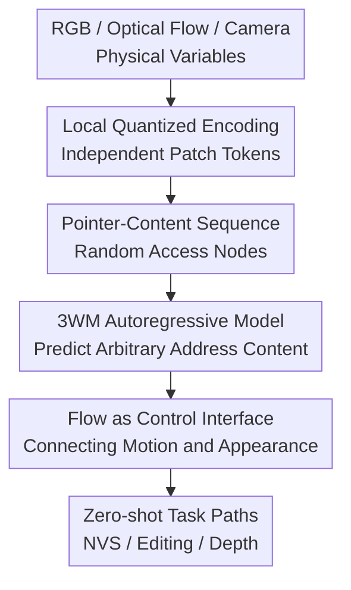

# Unified 3D Scene Understanding Through Physical World Modeling

**Conference**: ICLR2026  
**OpenReview**: [https://openreview.net/forum?id=NQq9JLMfNN](https://openreview.net/forum?id=NQq9JLMfNN)  
**Code**: TBD  
**Area**: 3D Vision  
**Keywords**: 3D scene understanding, physical world model, optical flow control, novel view synthesis, depth estimation

## TL;DR
3WM unifies RGB image patches, optical flow patches, and camera poses into a random-access probabilistic graphical model. Using GPT-style autoregressive prediction, it completes novel view synthesis (NVS), 3D object manipulation, and self-supervised depth estimation within a single prompt interface, outperforming specialized models on multiple real-world benchmarks.

## Background & Motivation
**Background**: 3D scene understanding is typically decoupled into several independent tasks: depth estimation recovers geometric layers from a single image, novel view synthesis renders unseen viewpoints from observations, and 3D object manipulation moves or rotates local objects under a fixed camera. All these tasks essentially answer the same physical question: how do visible surfaces, occlusion relationships, and pixel motions change when the observer or objects change?

**Limitations of Prior Work**: Mainstream methods often model each task separately. Depth models prioritize visible regions but struggle to infer occluded back surfaces; NVS models generate images but often sacrifice geometric consistency or camera control precision; object editing methods based on dragging or diffusion inversion enable local changes but frequently suffer from background drift, identity shifts, or artifacts in original positions on real images. Furthermore, these systems cannot naturally share training signals: occlusion knowledge learned during object motion cannot be directly transferred to depth estimation or camera motion reasoning.

**Key Challenge**: 3D understanding requires a physical scene model capable of conditional reasoning across multiple variables, rather than a set of task-specific models with fixed inputs and outputs. Existing paradigms hardcode task boundaries into network architectures and training objectives, allowing models to only answer predefined questions. When users want to combine operations—such as removing an obstacle before moving the camera forward—the system lacks a unified state representation and composable reasoning paths.

**Goal**: The authors aim to build a unified model where RGB, optical flow, and camera poses are nodes in the same probabilistic graph. Consequently, NVS can be viewed as "predicting next-frame RGB given RGB and motion fields," object manipulation as "predicting edited RGB given RGB and local flow constraints," and depth estimation as "predicting geometry-induced flow given RGB and camera translation, then back-projecting to depth via parallax."

**Key Insight**: The paper selects optical flow as the physical control interface. Flow is both local and editable, directly describing pixel displacement caused by camera or object motion. Compared to using only camera poses, flow bypasses scale ambiguity; compared to text or implicit controls, it precisely specifies which regions move, by how much, and whether the background remains static.

**Core Idea**: Construct the physical scene as a queryable probabilistic graphical model using "local quantized tokens + pointer addresses + random-access autoregressive sequences," transforming different 3D tasks into distinct conditional reasoning paths within a single model.

## Method

### Overall Architecture
The input to 3WM is not a fixed image or depth map, but a set of addressed local variables: RGB tokens for a certain spatio-temporal patch, optical flow tokens for another, and global camera pose tokens. The model learns a conditional distribution $\Psi(X, p)$: given a set of observed pointer-content pairs $X$ and an unfilled address $p$, it predicts the distribution of discrete content tokens for that address.

This design unifies multiple 3D tasks into the question of "which nodes to observe and which to predict." If the first-frame RGB and a dense flow field are observed to predict the second-frame RGB, it performs image generation for NVS or flow control. If RGB and sparse drag flow are observed to predict dense flow and then generate RGB, it performs object manipulation. If RGB and camera translation are observed to predict camera-induced flow and then back-project depth from flow magnitude, it performs self-supervised depth estimation.

### Key Designs
**1. Local Random-Access Sequences: Reformulating PGM as Trainable GPT-Style Prediction**

The core abstraction is treating scene variables as nodes in a probabilistic graphical model. Each node has a unique pointer $p$ representing its address in the spatio-temporal patch grid and modality; the node value $v$ comes from a discrete codebook $V$. The model learns $\Psi:(X,p)\mapsto \{Pr[(p,v)|X]:v\in V\}$, which is the content distribution of an unobserved node given any set of observed nodes $X$.

To make this PGM trainable with standard large-scale autoregression, the authors serialize samples into interleaved pointer and content tokens: $(p_0,v_0,p_1,v_1,\ldots)$. Pointer tokens can be externally specified, so the decoding order does not need to follow a raster scan (left-to-right), but can randomly access any patch. During training, random ordering is used to let the model adapt to completing any position given different observation subsets. In inference, users can treat "which node to predict next" as a control variable. This is critical because 3D tasks are inherently non-sequential: sometimes dense flow must be completed in parallel, sometimes local parts are filled before image generation, and sometimes reasoning must toggle between camera, flow, and RGB.

**2. Strictly Local HLQ: Ensuring Local Edits Only Affect Local Variables**

If a standard VQGAN or global latent is used to represent an image frame, a single token often mixes information from distant regions, making local replacement or resampling unpredictable. 3WM uses a Hierarchical Local Quantizer (HLQ), which employs a convolutional autoencoder with restricted receptive fields to encode each patch into a short sequence of tokens independently. The first code provide coarse appearance, and subsequent codes gradually add detail.

This design serves two purposes. First, it makes "nodes" in the model closer to true local physical variables: modifying the flow or RGB of a certain patch does not hiddenly contaminate the entire frame at the encoding level. Second, it reduces the complexity of random-access modeling because each patch's content can be conditionally predicted given its spatial context without needing to solve a global latent first. Ablation results support this: the 100M Local & Random model achieves PSNR 17.28 and LPIPS 0.236 on WildRGB-D NVS, significantly better than the Local & Raster model (PSNR 15.00, LPIPS 0.385), proving that "local tokens + random order" is a source of controllability and efficiency rather than just an implementation detail.

**3. Optical Flow as Causal Intermediate Variable: Connecting Motion Fields with Geometry and Appearance**

3WM adopts an approximate causal order $[RGB, C]\rightarrow Flow\rightarrow RGB$. Here, optical flow is not just auxiliary supervision but an observable, predictable, and rewritable intermediate variable. Given RGB and camera pose, the model predicts flow induced by camera motion; given RGB and dense flow, it generates the moved image; given RGB and sparse flow, it completes the dense motion field before generating edited results.

This intermediate representation is more controllable than "generating images directly from camera poses." There is scale and depth ambiguity between camera pose and pixel motion; pose conditions alone make it hard to specify exactly how each region moves. Flow directly defines movement constraints at the pixel level. The flow ablation is compelling: on WildRGB-D NVS, $3WM_{rgb}$ without flow nodes achieves only PSNR 14.49 and LPIPS 0.346, while the full 3WM reaches PSNR 18.02 and LPIPS 0.185. On NYU depth estimation, AbsRel drops from 0.173 to 0.078, and $\delta_1$ rises from 0.825 to 0.940.

**4. Tasks Defined by Reasoning Paths: One Model for Zero-Shot NVS, Editing, and Depth**

3WM does not train separate task heads for NVS, object editing, and depth estimation. It defines tasks as different conditional queries. For NVS, an external depth estimator back-projects the input to a point cloud, applies the target camera transform, projects back to images to get 2D flow, and finally uses $\Psi(RGB_0,F_{0\rightarrow1})\rightarrow RGB_1$ to generate the target view. For object manipulation, 3D transforms on target objects generate surface flow while setting background flow to 0, forcing the model to move only the target while keeping the environment stable.

The depth estimation path is more intriguing: the model does not directly output depth. Instead, given RGB and a downward in-plane camera translation, it predicts camera-induced flow. The flow magnitude is then treated as parallax to inversely derive depth, formally $D_{depth}\propto 1/F_{flow}$, where $F_{flow}=\Psi(RGB,C_{in\text{-}plane})$. This demonstrates that the model learns physical relationships (e.g., "camera motion produces larger parallax for closer objects") rather than just dataset labels.

### Mechanism
Assume the input is an indoor corridor image with a bicycle blocking the path. A traditional system might require an object editing model to remove the bike, then pass the result to an NVS model for forward-view rendering; inconsistent geometric assumptions between the two models could cause artifacts.

In 3WM, a rightward sparse flow prompt is applied to the bicycle while setting zero flow for the background. The model first completes the dense motion field for the bike via $\Psi(RGB_0,F_{sparse})\rightarrow F_{0\rightarrow1}$, then generates the "bike removed" image via $\Psi(RGB_0,F_{0\rightarrow1})\rightarrow RGB_1$. Subsequently, according to the desired forward camera movement, this image is used as a condition alongside camera-induced flow to generate the forward view. This process requires no model switching, and state variables remain RGB, flow, and camera nodes throughout, allowing occluded regions, background completion, and NVS geometry to be handled coherently within one world model.

### Loss & Training
The sequence model of 3WM is trained using standard next-token cross-entropy, with a batch size of 512 and sequence length of 4096. RGB and camera pose tokens are trained for 500K steps, with the learning rate warming up to $3\times10^{-4}$ over 2K steps. Subsequently, optical flow tokens are added for another 200K steps, with a linear decay to 0 over the final 100K steps.

HLQ is trained in two versions for RGB and flow. The RGB HLQ is trained on ImageNet and OpenImages for 200K iterations, using a combination of $\ell_1$ reconstruction loss, low-resolution loss, and DinoV2 perceptual loss, with an AdamW learning rate of $1\times10^{-4}$. The Flow HLQ uses the same video data as the sequence model, with flow extracted by DPFlow, warming up for 2K steps, followed by 300K iterations at a fixed rate, and 200K iterations of linear decay.

Training data consists of the large-scale internet video dataset BVD and several 3D vision datasets, including ScanNet++, CO3D, RealEstate10K, MVImgNet, DL3DV, and EgoExo4D. BVD comprises approximately 7000 hours; the authors used LLaMA 3 to generate search queries for videos with rich physical motion, filtering by flow intensity and CLIP keywords to reduce non-physical content like animations, game menus, or news broadcasts.

## Key Experimental Results

### Main Results
| Task / Dataset | Metric | 3WM | Strongest Baseline | Gain/Conclusion |
|--------|------|------|----------|------|
| NVS / WildRGB-D | PSNR ↑ / LPIPS ↓ | 18.02 / 0.185 | ZeroNVS 16.14 / SEVA 0.278 | Best reconstruction and perceptual distance |
| NVS / DL3DV | PSNR ↑ / LPIPS ↓ | 19.02 / 0.252 | ViewCrafter 16.59 / 0.253 | Significant PSNR lead on scene-level trajectories |
| 3D Editing / 3DEditBench | PSNR ↑ / LPIPS ↓ / EA ↑ | 22.73 / 0.133 / 0.797 | LightningDrag 19.52 / 0.184 / 0.722 | Better editing accuracy and identity preservation |
| Self-sup Depth / NYUD-v2 | AbsRel ↓ / $\delta_1$ ↑ | 0.078 / 0.940 | IndoorDepth 0.116 / 0.864 | Exceeds specialized self-supervised models without depth supervision |
| Self-sup Depth / BONN | AbsRel ↓ / $\delta_1$ ↑ | 0.084 / 0.942 | IndoorDepth 0.154 / 0.846 | Clearer advantage in dynamic indoor scenes |
| Self-sup Depth / TUM | AbsRel ↓ / $\delta_1$ ↑ | 0.137 / 0.869 | IndoorDepth 0.205 / 0.697 | More robust to human motion |

### Ablation Study
| Configuration | Key Metrics | Description |
|------|---------|------|
| Local & Random | WildRGB-D PSNR 17.28, SSIM 0.530, LPIPS 0.236 | Local tokens + random access order performs best |
| Local & Raster | WildRGB-D PSNR 15.00, SSIM 0.459, LPIPS 0.385 | Local tokens with raster order restricts random query capability |
| VQGAN & Random | WildRGB-D PSNR 17.16, SSIM 0.515, LPIPS 0.238 | Random order is effective, but global-style tokens have weaker control |
| VQGAN & Raster | WildRGB-D PSNR 15.71, SSIM 0.454, LPIPS 0.298 | Performance drops when both key designs are weakened |
| $3WM_{rgb}$ | NVS PSNR 14.49, LPIPS 0.346; NYU AbsRel 0.173 | Significant drop in control and depth reasoning without flow |
| 3WM | NVS PSNR 18.02, LPIPS 0.185; NYU AbsRel 0.078 | Flow as a causal intermediate variable provides major gains |
| Amodal completion / 3WM | AbsRel 0.0263, Log10 0.0120, $\delta_1$ 0.9740 | Reconstructing depth of occluded areas better than LightningDrag/DragAnything |

### Key Findings
- Optical flow as an intermediate variable is the most critical control handle. It not only improves NVS quality but also transforms depth estimation from an indirect "flow from generation" route into a geometric "camera-induced flow" route.
- Random-access sequences outperfrom raster order, indicating the model needs to learn conditional completion for arbitrary nodes rather than just sequential generation.
- In 3DEditBench, 3WM's EA of 0.797 is higher than LightningDrag's 0.722, showing it generates images that more accurately follow target 3D transformations rather than just producing "pretty pictures."
- On dynamic indoor data like BONN and TUM, traditional self-supervised depth models are limited by static scene assumptions. 3WM learns physical motion from open-world video flow, making it robust to dynamic scenes.
- Qualitative results show the model can compose paths: navigating after removing obstacles, revealing hidden areas along complex trajectories, and generating multiple possible depths for transparent objects.

## Highlights & Insights
- The highlight is not just "one model for three tasks," but shifting task boundaries from training objectives to reasoning paths. As long as variables share the same PGM, changing observed and predicted nodes creates new tasks.
- Optical flow is a brilliant control surface. It serves image generation more directly than depth, is closer to pixel motion than camera pose, and is more precise than text, making it ideal for connecting NVS, editing, and depth.
- The strict locality of HLQ seems like a technical detail but determines whether the model can reliably perform local physical interventions. For 3D editing, "overwritability" of local tokens is more important than the compression ratio of global latents.
- The depth estimation path provides an inspiring paradigm: not all tasks must be framed as direct label prediction; many perceptual results can be derived from internal physical intermediates.
- For future general vision world models, 3WM demonstrates a more unified path than "diffusion plus control modules": turning controllable variables into explicit tokens and sharing a single conditional distribution for both control and generation.

## Limitations & Future Work
- The model is not yet real-time. The inference cost of autoregressive generation and large models hinders interactive robotics or real-time AR applications.
- Large-displacement object manipulation occasionally produces motion blur, as it learns from real-world motion blur in training videos; while this shows high fidelity to data distributions, it might not always be ideal for precise editing.
- Object editing relies on segmentation quality. Incorrect masks may apply zero-flow background constraints to regions that should move, leading to geometric distortions.
- The model sometimes leaves "ghosting" artifacts at original object positions, suggesting that amodal reasoning for "filling the void after an object leaves" is not yet stable.
- The NVS pipeline still relies on external depth models or DUSt3R to construct motion-induced flow; end-to-end unification from camera pose to controllable rendering is not fully achieved.
- Future work could explore more efficient decoding, richer interaction data, explicit uncertainty modeling, and integrating this physical world model into navigation and planning evaluations.

## Related Work & Insights
- **vs ZeroNVS / ViewCrafter / SEVA**: These focus on NVS optimization, often relying on diffusion, point cloud rendering, or specific camera controls. 3WM treats NVS as one of many RGB-flow-RGB reasoning paths, allow for seamless combination with editing and depth.
- **vs DiffusionHandles / LightningDrag / DragAnything**: These act as image/video editing tools using drag points or depth conditions. 3WM uses local flow fields to represent 3D motion, better preserving background identity and geometric constraints.
- **vs SC-DepthV2 / IndoorDepth**: Self-supervised depth methods rely on static geometry consistency across frames; dynamic scenes disrupt their training signals. 3WM learns conditional relationships among RGB, flow, and motion from open-world videos, treating dynamic objects as explainable physical changes.
- **vs 3D LLM / Scene LLM**: Language-driven 3D models largely perform semantic QA on reconstructed point clouds (understanding "existing 3D"). 3WM focuses on inferring physical structures and future observations from 2D views (generative geometric reasoning).
- **Insight**: Incorporating more physical variables—such as contact, force, material, graspability, or semantic affordance—into the same pointer-token PGM could further unify visual generation, geometric reasoning, and robotic interaction.

## Rating
- Novelty: ⭐⭐⭐⭐⭐ Unifying 3D tasks via PGM + random-access autoregression is a complete concept distinct from the current control-diffusion trend.
- Experimental Thoroughness: ⭐⭐⭐⭐⭐ Covers NVS, 3D editing, depth estimation, and geometric reasoning, supported by the new 3DEditBench for evaluation.
- Writing Quality: ⭐⭐⭐⭐☆ Clear narrative and effective diagrams; however, some reasoning paths depend on external components, and the full system boundaries are best understood via the appendix.
- Value: ⭐⭐⭐⭐⭐ Highly valuable for 3D vision and general world models, particularly in inspiring composable, multimodal, and controllable physical scene modeling.

<!-- RELATED:START -->

## Related Papers

- [\[CVPR 2026\] P3Sim: Perceptual 3D Simulation with Physical World Modeling](../../CVPR2026/3d_vision/perceptual_3d_simulation_with_physical_world_modeling.md)
- [\[ICLR 2026\] FantasyWorld: Geometry-Consistent World Modeling via Unified Video and 3D Prediction](fantasyworld_geometry-consistent_world_modeling_via_unified_video_and_3d_predict.md)
- [\[ICLR 2026\] Omni-View: Unlocking How Generation Facilitates Understanding in Unified 3D Model based on Multiview images](omni-view_unlocking_how_generation_facilitates_understanding_in_unified_3d_model.md)
- [\[ICLR 2026\] UniUGG: Unified 3D Understanding and Generation via Geometric-Semantic Encoding](uniugg_unified_3d_understanding_and_generation_via_geometric-semantic_encoding.md)
- [\[CVPR 2026\] RnG: A Unified Transformer for Complete 3D Modeling from Partial Observations](../../CVPR2026/3d_vision/rng_a_unified_transformer_for_complete_3d_modeling_from_partial_observations.md)

<!-- RELATED:END -->
