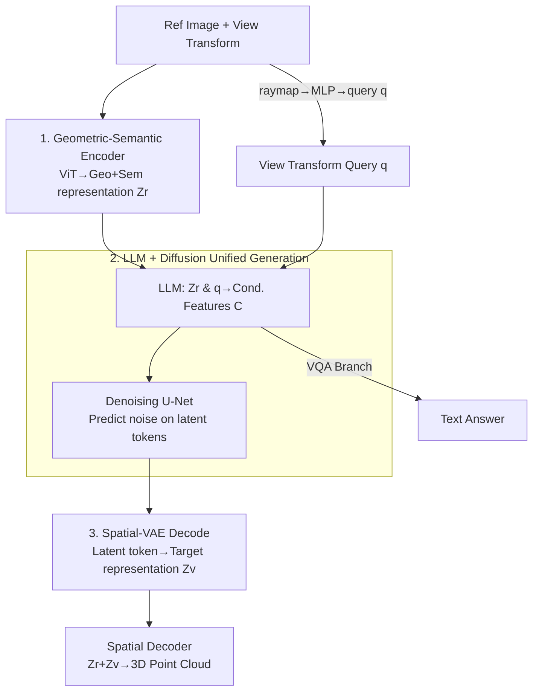

# UniUGG: Unified 3D Understanding and Generation via Geometric-Semantic Encoding

**Conference**: ICLR 2026  
**OpenReview**: [https://openreview.net/forum?id=XbMp83tvK7](https://openreview.net/forum?id=XbMp83tvK7)  
**Project Page**: [https://fudan-zvg.github.io/UniUGG](https://fudan-zvg.github.io/UniUGG)  
**Area**: 3D Vision / Multi-modal VLM / Diffusion Models  
**Keywords**: Unified Understanding and Generation, 3D Scene Generation, Geometric-Semantic Encoding, Spatial-VAE, Spatial VQA

## TL;DR
UniUGG is the first "Unified Understanding and Generation" framework for 3D modalities. It utilizes a jointly pre-trained geometric-semantic ViT to encode visual representations and enables an LLM, combined with a diffusion model, to "imagine" geometrically consistent 3D scenes from a reference image and target view transforms via conditional denoising on compressed latent tokens. It maintains superior spatial VQA capabilities, outperforming the second-best method by 17.9% on VSI-Bench.

## Background & Motivation
**Background**: 2D "Unified Understanding and Generation" is mature. Prevailing approaches involve coupling autoregressive LLMs with diffusion image decoders, where the LLM consumes text+images and outputs learnable queries to reach the diffusion latent space, or using VQ tokenizers to unify text and images into discrete tokens for autoregressive generation.

**Limitations of Prior Work**: This paradigm is difficult to transfer to 3D. Existing spatial understanding works either rely on brute-force fine-tuning of LLMs with massive spatial VQA data, which yields limited results, or depend on extra modalities (depth maps, point clouds, scene graphs), requiring specialized sensors or explicit scene modeling. 3D **generation** within a unified framework remains largely unexplored.

**Key Challenge**: The authors attribute this bottleneck to two fundamental issues. One is the **limitation of visual representation**: current LLM visual encoders are pre-trained on 2D semantic tasks (e.g., CLIP, DINOv2), lacking inherent 3D geometric modeling, which caps spatial understanding. The other is the **incompatibility between 3D generation and LLMs**: LLMs rely on tokenization for autoregression, which works for structured images but fails for irregular 3D data like point clouds. This "tokenization gap" hinders LLMs from generating 3D data autoregressively.

**Goal**: Solve both problems within a single LLM framework—achieving both "3D geometry-aware" visual representations and a feasible pathway for LLMs to generate 3D content.

**Key Insight**: Inspired by multi-view geometry approaches like DUSt3R/MASt3R, aligning multi-view pixels into a unified global coordinate system allows models to reconstruct 3D and predict spatial relations from pure 2D inputs. This suggests that 3D geometry can be learned from 2D inputs without extra sensors.

**Core Idea**: Use a "Geometric-Semantic jointly pre-trained encoder" to bridge the 3D representation gap, and employ "Spatial-VAE compression + diffusion denoising on latent tokens" to bypass the 3D tokenization difficulty. The LLM only needs to output conditional features, leaving the generation task to the diffusion model.

## Method

### Overall Architecture
UniUGG aims to take a reference image and a target view transform to output a geometrically consistent 3D scene (point cloud) while answering spatial VQA queries. The system centers on an LLM with three training stages: Stage 1 pre-trains the geometric-semantic visual encoder; Stage 2 pre-trains the Spatial-VAE (compressing representations into a compact latent space); Stage 3 freezes the ViT and VAE to train the LLM, projector, and diffusion model for unified understanding and generation.

During inference, the reference image generates geometric-semantic representation $Z_r$ via ViT. The view transform is encoded into a Plücker raymap and converted to a transform query $q$ via an MLP. The LLM processes $Z_r$ and $q$ to produce conditional features $C$. A denoising U-Net iteratively denoises a Gaussian-initialized latent token conditioned on $C$. The resulting latent token is decoded by the Spatial-VAE into target view representation $Z_v$. Finally, $Z_r$ and $Z_v$ are fed into the spatial decoder to recover the complete 3D scene. Understanding tasks follow the LLM's autoregressive VQA branch.

### Key Designs

**1. Geometric-Semantic Encoder Pre-training: Teaching 2D Encoders Geometry and Semantics**

This design directly addresses the "3D-unaware visual representation" pain point. It uses ViT-L/16 initialized from RADIOv2.5-L followed by a ViT-Base decoder initialized from MASt3R. Pre-training uses two objectives: for **Geometry**, it follows the MASt3R framework where paired images $I_i, I_j$ yield $Z_i, Z_j$, processed through projectors and cross-attention decoders to regress pointmaps, confidence maps, and matching descriptors using $L_{conf}$ and $L_{match}$. An RGB head is added to reconstruct color via $L_{rgb}=\lambda_{L1}\|\hat I-I\|_{L1}+\lambda_{LP}\text{LPIPS}(\hat I,I)$. For **Semantics**, it distills from RADIOv2.5 as a teacher, aligning randomly sampled token subsets $C$ using cosine distance and smooth-L1:

$$L_{KD}=\alpha\left(1-\frac{1}{n}\sum_{i\in C}\cos(z_i,\hat z_i)\right)+\beta\frac{1}{n}\sum_{i\in C}\|z_i-\hat z_i\|_{L1}.$$

Unlike simple multi-teacher distillation, the goal here is "geometric awareness" (end-to-end reconstruction) rather than just feature fusion, making the ViT superior in depth estimation and spatial VQA. The MASt3R decoder (spatial decoder) is reused in the generation stage.

**2. Unified Generation with LLM + Diffusion: Handling Non-tokenizable 3D Content**

This addresses the "3D-LLM incompatibility." Instead of forcing the LLM to output point clouds, it outputs conditional features. The relative transform between the reference and target views is represented as a Plücker raymap $P\in\mathbb{R}^{N_h\times N_w\times 6}$, then mapped to query $q$ by an MLP. The LLM processes $Z_i$ and $q$ to output condition $C$. The target representation $Z_j$ is encoded by the VAE into latent token $T^j$, with noise added to get $\tilde T^j_t$. The denoising U-Net predicts the noise given $C$:

$$L_{gen}=\mathbb{E}_{T^j,\epsilon\sim\mathcal N(0,1),t}\left\|\epsilon_\theta(\tilde T^j_t|C,t)-\epsilon\right\|^2.$$

Concurrently, the LLM is fine-tuned for spatial VQA using teacher forcing with cross-entropy $L_{vqa}=-\sum_t\log p_\theta(a_t|Z,q,a_{<t})$. Generation and understanding thus share the same LLM.

**3. Spatial-VAE Latent Compression: Stable Generation of High-Dimensional Representations**

Diffusion directly on high-dimensional visual representations is costly and unstable. Spatial-VAE acts as a "middle layer," compressing $Z_i,Z_j\in\mathbb{R}^{N_h\times N_w\times d}$ into 4D latent tokens $T^i,T^j\in\mathbb{R}^{L_h\times L_w\times 4}$. Optimization includes reconstruction loss $L_{mse}=\|\bar Z_i-Z_i\|^2$, KL regularization $L_{KL}$, and spatial loss $L_s$, yielding $L_{vae}=L_s+L_{mse}+\gamma L_{KL}$.

A crucial design is the end-to-end joint fine-tuning of the spatial decoder with the Spatial-VAE. Without this ("w/o Dec. finetune"), FID drops significantly (from 55 up to 150), indicating that the decoder must adapt to the compressed latent space.

### Loss & Training
Three stages: **Stage 1** uses ARKitScenes + ScanNet++ (geometry) and LAION-400M (semantics) to pre-train the encoder (8×A6000, ~25h). **Stage 2** trains Spatial-VAE on 2 million image pairs (8×A6000, ~12h). **Stage 3** freezes ViT and VAE encoders to train the LLM/projector/diffusion: first align projector with LCS-558K, then joint optimization on 2.4M spatial instructions + 2M co-visible pairs, and final fine-tuning on SPAR/EMOVA. LLM uses Qwen2.5-3B-Instruct, diffusion uses Stable-Diffusion-v1.5.

## Key Experimental Results

### Main Results
Spatial Understanding (VSI-Bench / BLINK / 3DSRBench / SPAR, vs. LMMs like GPT-4o and Janus-Pro):

| Method | VSI | BLINK | 3DSR | SPAR-Avg |
|------|-----|-------|------|----------|
| GPT-4o | 34.0 | **60.0** | 44.2 | 38.1 |
| InternVL2.5-8B | 32.5 | 54.8 | 50.9 | 36.3 |
| Qwen2.5-VL-7B | 30.3 | 56.4 | 48.4 | 33.1 |
| Janus-Pro-7B | - | 40.5 | **53.7** | 28.6 |
| **UniUGG-3B (Ours)** | **40.1** | 43.6 | 52.1 | **47.2** |

UniUGG-3B outperforms others on VSI-Bench by 17.9% and leads significantly on SPAR. It trails GPT-4o on purely semantic tasks (BLINK), consistent with its spatial specialization.

3D Generation Quality (2D projections compared via FID/KID/LPIPS):

| ID | Config | ARKit FID↓ | ARKit KID↓ | ScanNet++ FID↓ |
|----|------|-----------|-----------|----------------|
| (a) | w/ RADIO Encoder | 64.16 | .0518 | 73.69 |
| (b) | w/ MASt3R Encoder | 81.18 | .0691 | 86.79 |
| (e) | CUT3R | 138.54 | .1128 | 130.76 |
| (f) | LVSM | 269.45 | .3088 | 414.63 |
| **(g)** | **UniUGG (Ours)** | **55.01** | **.0425** | **55.64** |

### Ablation Study

| Config | ARKit FID↓ | Description |
|------|-----------|------|
| (g) Full UniUGG | 55.01 | Full model |
| (a) w/ RADIO (Sem-only) | 64.16 | Lacks geometry |
| (b) w/ MASt3R (Geo-only) | 81.18 | Lacks semantics |
| (c) w/o Dec. finetune | 149.97 | Quality collapse without joint tuning |
| (d) w/o Diffusion | 87.51 | LLM directly regresses target representation |

### Key Findings
- **Integration of geometry and semantics is mandatory**: Using only RADIO (semantic) or MASt3R (geometry) is significantly worse than the combined version (55 vs 64/81).
- **Spatial decoder joint-tuning is critical**: Removing it caused FID to jump from 55 to 150, the most severe drop in ablations.
- **Latent token + Diffusion is essential**: Direct regression of target representations by the LLM (w/o Diffusion) degraded FID to 87. Training on raw high-dimensional representations without Spatial-VAE failed entirely.
- **Spatial enhancement does not sacrifice general semantics**: UniUGG remains competitive on RealWorldQA and SEED-I, showing that geometric injection preserves semantic generalization.

## Highlights & Insights
- **"LLM outputs conditions, Diffusion generates" bypasses tokenization**: Decoupling the LLM from the actual generation of irregular 3D point clouds is the key to migrating the 2D unified paradigm to 3D.
- **Dual-purpose spatial decoder**: The decoder trained for multi-view geometry during pre-training is directly reused for 3D scene generation, reducing architectural complexity.
- **Plücker raymaps as geometric queries**: Converting camera poses into raymaps allows the LLM to naturally support "imaging from a specified perspective."
- **3B model beating GPT-4o in spatial tasks**: Proves that "3D geometric awareness in representations" is more decisive for spatial tasks than model scale.

## Limitations & Future Work
- Currently lacks **language-driven controllable generation** and free-form editing of generated content. It does not yet support **multi-round interactive** scene generation.
- Performance on pure 3D benchmarks (SQA3D/ScanQA) still lags behind dedicated 3D-heavy models since UniUGG learns geometry from 2D multi-view inputs rather than raw point clouds.
- Generation depends on the reference image + view transform format; robustness to extreme view changes needs further evaluation.

## Related Work & Insights
- **vs. 2D Unified Frameworks (e.g., Janus-Pro)**: While they unify U&G at the 2D image level, UniUGG is the first to push this to the 3D/spatial level. It leads in spatial VQA but is less specialized for 2D semantic tasks.
- **vs. Geometric Methods (e.g., DUSt3R/MASt3R)**: These excel at reconstruction but lack semantics and language guidance. UniUGG extends "reconstructing the observed" to "imagining the unobserved."
- **vs. Multi-teacher Distillation (e.g., RADIO)**: While similar in fusing modalities, UniUGG’s training objective is specifically tailored for 3D-aware unified modeling rather than just general representation fusion.

## Rating
- Novelty: ⭐⭐⭐⭐⭐ First unified 3D U&G framework; clever decoupling of LLM and Diffusion latent generation.
- Experimental Thoroughness: ⭐⭐⭐⭐ Extensive evaluation across representation, understanding, and generation, though pure 3D benchmarks show some gaps.
- Writing Quality: ⭐⭐⭐⭐ Clear mapping between bottlenecks and solutions; the three-stage training is well-explained.
- Value: ⭐⭐⭐⭐⭐ Provides a viable path for unified 3D modeling with excellent performance for its model size.

<!-- RELATED:START -->

## Related Papers

- [\[ICLR 2026\] Omni-View: Unlocking How Generation Facilitates Understanding in Unified 3D Model based on Multiview images](omni-view_unlocking_how_generation_facilitates_understanding_in_unified_3d_model.md)
- [\[ICLR 2026\] Positional Encoding Field](positional_encoding_field.md)
- [\[ICLR 2026\] One2Scene: Geometric Consistent Explorable 3D Scene Generation from a Single Image](one2scene_geometric_consistent_explorable_3d_scene_generation_from_a_single_imag.md)
- [\[CVPR 2026\] Uni3R: Unified 3D Reconstruction and Semantic Understanding via Generalizable Gaussian Splatting from Unposed Multi-View Images](../../CVPR2026/3d_vision/uni3r_unified_3d_reconstruction_and_semantic_understanding_via_generalizable_gau.md)
- [\[ECCV 2024\] nuCraft: Crafting High Resolution 3D Semantic Occupancy for Unified 3D Scene Understanding](../../ECCV2024/3d_vision/nucraft_crafting_high_resolution_3d_semantic_occupancy_for_unified_3d_scene_unde.md)

<!-- RELATED:END -->
