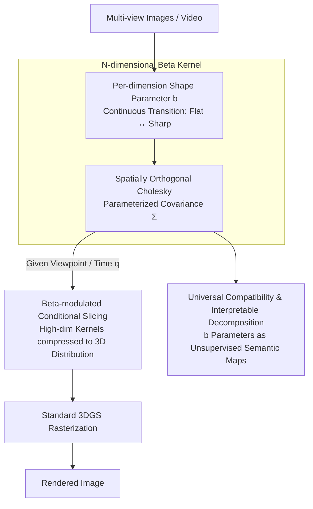

# Universal Beta Splatting

- **Conference**: ICLR 2026
- **arXiv**: [2510.03312](https://arxiv.org/abs/2510.03312)
- **Code**: [Project Page](https://rongliu-leo.github.io/universal-beta-splatting/)
- **Area**: 3D Vision / Neural Rendering
- **Keywords**: 3D Gaussian Splatting, Beta Kernel, N-Dimensional, View-Dependent, Dynamic Scene, Real-Time Rendering

## TL;DR

The authors propose Universal Beta Splatting (UBS), which generalizes 3D Gaussian Splatting into N-dimensional anisotropic Beta kernels. By providing per-dimension shape control, it unifies the modeling of spatial geometry, view-dependent appearance, and scene dynamics within a single representation, achieving interpretable scene decomposition and SOTA rendering quality.

## Background & Motivation

While 3D Gaussian Splatting (3DGS) enables real-time rendering through explicit primitives, the fixed bell-shaped profile of Gaussian kernels imposes fundamental limitations:

**Spatial Dimension**: Sharp boundaries require a large number of small primitives, leading to inefficiency.

**Angular Dimension**: View-dependent effects necessitate additional Spherical Harmonics (SH) encoding (48 parameters), resulting in a fragmented representation.

**Temporal Dimension**: Dynamic scenes require auxiliary deformation networks, increasing system complexity.

**Key Insight**: Different scene properties require distinct kernel behaviors—spatial geometry needs adaptive sharpness, angular appearance ranges from diffuse to specular, and temporal dynamics vary from static to rapid motion. Gaussian kernels enforce the same symmetric profile across all dimensions, whereas Beta kernels provide per-dimension shape control.

## Method

### Overall Architecture

UBS addresses the fundamental constraint of "fixed shapes" in 3DGS bell-shaped Gaussian kernels: where sharp boundaries require massive small primitives, view-dependent appearance needs external SH, and dynamic scenes require external deformation networks. Ours replaces this with an **N-dimensional anisotropic Beta kernel** with per-dimension adjustable shapes, allowing spatial geometry, view-dependent appearance, and scene dynamics to be represented by the same type of primitive. The pipeline operates as follows: each primitive carries position, covariance, and a set of Beta shape parameters $\mathbf{b}$ within a unified $N$-dimensional distribution. The covariance is parameterized using a spatially orthogonal Cholesky decomposition to maintain the geometric structure of 3DGS. During rendering, given a viewpoint/time $\mathbf{q}$, high-dimensional kernels are first projected back into 3D distributions via Beta-modulated conditional slicing, then processed through a standard 3DGS rasterization pipeline. Thus, it inherits real-time rendering while providing adaptive sharpness in every dimension; the learned $\mathbf{b}$ parameters also yield an unsupervised scene decomposition map.

### Key Designs

**1. N-dimensional Beta Kernel: Replacing Fixed Bell Profiles with Per-dimension Shape Parameters**

Gaussian kernels enforce the same symmetric profile across all dimensions. UBS defines primitive density as $\sigma(\mathbf{x}, \mathbf{q}) = \mathcal{B}(\mathbf{x}, \mathbf{q}; \boldsymbol{\mu}, \boldsymbol{\Sigma}, \mathbf{b}) \cdot o$, where $\mathbf{x} \in \mathbb{R}^3$ represents spatial coordinates, $\mathbf{q} \in \mathbb{R}^{N-3}$ encodes additional dimensions like viewpoint/time, and $\mathbf{b} \in \mathbb{R}^{N-2}$ controls the Beta shape of each dimension. Crucially, the Beta exponent for each dimension $\beta_i = 4\exp(b_i)$ is independently adjustable: negative $b_i$ yields a flat profile suitable for smooth surfaces or diffuse reflections, while positive $b_i$ yields sharp peaks fit for fine textures, fast motion, or specular highlights.

**2. Spatially Orthogonal Cholesky Parameterization: Maintaining 3DGS Geometry in N-dimensions**

Direct unconstrained decomposition of $N$-dimensional covariance would destroy the rotation-scaling semantics of spatial sub-blocks and lose compatibility with 3DGS weights. Ours parameterizes the Cholesky factor $\mathbf{L}$ as a block lower triangular matrix:

$$\mathbf{L} = \begin{pmatrix} \mathbf{R}_x \text{diag}(\mathbf{s}_x) & \mathbf{0} \\ \mathbf{L}_{qx} & \mathbf{L}_q \end{pmatrix}$$

The top-left $\mathbf{R}_x \in SO(3)$ (maintained via first-order Taylor approximation) and $\text{diag}(\mathbf{s}_x)$ reuse 3DGS rotation-scaling parameters, $\mathbf{L}_{qx}$ encodes cross-dimensional correlation between spatial and extra dimensions, and $\mathbf{L}_q$ describes the extra dimensions themselves.

**3. Beta-modulated Conditional Slicing: Projecting Kernels for 3D Rendering**

Given a viewpoint/time $\mathbf{q}$, the 3D distribution is obtained via conditional slicing:

$$\boldsymbol{\mu}_{x|q} = \boldsymbol{\mu}_x + \boldsymbol{\Sigma}_{xq} \boldsymbol{\Sigma}_q^{-1} \text{diag}(\tilde{\boldsymbol{\beta}}_q) (\mathbf{q} - \boldsymbol{\mu}_q)$$

$$\boldsymbol{\Sigma}_{x|q} = \boldsymbol{\Sigma}_x - \boldsymbol{\Sigma}_{xq} \boldsymbol{\Sigma}_q^{-1} \text{diag}(\tilde{\boldsymbol{\beta}}_q) \boldsymbol{\Sigma}_{qx}$$

The term $\text{diag}(\tilde{\boldsymbol{\beta}}_q)$ applies Beta shape parameters to non-spatial dimensions, allowing conditional mean and covariance to vary via Beta shapes rather than fixed linear transitions. Opacity is also modulated: $o(\mathbf{q}) = o \prod_{i=1}^C (1 - d_i)^{4\beta_{q_i}}$, ensuring smooth and bounded decay.

**4. Universal Compatibility & Interpretable Decomposition**

Since Beta kernels converge to Gaussians as a limit, setting the dimension $N$ and shape parameters $\mathbf{b}$ can replicate existing methods:

| $\mathbf{b}$ Setting | Equivalent Method |
|---------|---------|
| $N=3$, $b_x=0$ | ≈ 3DGS |
| $N=3$, $b_x \neq 0$ | ≈ DBS |
| $N=6$, $\mathbf{b}=\mathbf{0}$ | ≈ 6DGS |
| $N=7$, $\mathbf{b}=\mathbf{0}$ | ≈ 7DGS |

This unified parameterization leads to significant parameter reduction: **41%** fewer parameters in static scenes (removing 48-param SH) and **73%** fewer in dynamic scenes compared to 4DGS. Furthermore, negative spatial $b_x$ corresponds to smooth surfaces, and positive angular $b_d$ corresponds to specular reflections, enabling "free" unsupervised scene decomposition.

### Loss & Training

Training objectives include standard reconstruction terms and two regularization terms:

$$\mathcal{L} = (1-\lambda_{SSIM})\mathcal{L}_1 + \lambda_{SSIM}\mathcal{L}_{SSIM} + \lambda_o \sum_i |o_i| + \lambda_\Sigma \sum_i \|\mathbf{s}_i\|_1$$

The $\ell_1$ regularization on opacity ensures MCMC densification prunes redundant primitives, while the scale penalty encourages primitive relocation to regions of higher demand.

## Main Results

### Static Scenes

**NeRF Synthetic** (UBS-6D vs 3DGS vs 6DGS):

| Scene | 3DGS PSNR | 6DGS PSNR | UBS-6D PSNR |
|------|-----------|-----------|-------------|
| chair | 35.60 | 35.55 | **36.72** |
| ficus | 35.49 | 34.62 | **36.90** |
| materials | 30.50 | 30.63 | **32.90** |
| lego | 36.06 | 35.22 | **36.95** |

PSNR gains reach up to **+8.27 dB** (on 6DGS-PBR dataset).

### Dynamic Scenes

**D-NeRF and 7DGS-PBR** (UBS-7D vs 4DGS vs 7DGS):
- PSNR improvements up to **+2.78 dB**.
- Performance is notably superior in scenes with complex spatio-temporal-angular correlations (e.g., heart motion, sunlight changes, translucent deformations).

### Key Findings

1. **Initializing Beta parameters at zero** ensures convergence starting from the Gaussian limit.
2. First-order approximation of spatially orthogonal Cholesky is comparable in accuracy to exact rotations but faster.
3. MCMC optimization remains effective for Beta kernels.
4. Real-time rendering performance is comparable to 3DGS.

### Efficiency

- 30K iterations.
- Static: ~8-10 minutes on a single RTX 4090.
- Dynamic: Consistent with 4DGS/7DGS baselines on a single V100.

## Highlights & Insights

1. **Unified Framework**: A single Beta kernel primitive handles space/angle/time, replacing multiple specialized encodings.
2. **Backward Compatibility**: Degenerates to Gaussian when Beta=0, guaranteeing a performance lower bound.
3. **Unsupervised Decomposition**: Learned Beta parameters naturally separate geometry, appearance, and motion.
4. **Parameter Reduction**: 41-73% reduction in parameters while improving performance.
5. **Real-time Rendering**: Full CUDA acceleration support.

## Limitations & Future Work

1. Number of parameters in N-dimensional Cholesky grows with dimensionality.
2. Bounded support of Beta kernels might require more primitives in extreme far-field views.
3. Verification currently limited to 7 dimensions; higher-dimensional effects are unexplored.
4. Training requires batch size 4 for dynamic scenes (higher VRAM consumption).
5. First-order rotation approximation may lose precision under extreme rotation angles.

## Related Work & Insights

- **Kernel Design Alternatives**: GES, TNT-GS, Half-GS, Disc-GS modify 3D Gaussians; DBS introduces 3D Beta kernels.
- **High-dimensional Gaussians**: 6DGS (space+view), 7DGS (space+view+time) use conditional distributions.
- **Dynamic Scenes**: D-NeRF uses deformation fields; 4DGS extends time dimension directly.
- **Alternative Primitives**: 3D Convex Splatting, Triangle Splatting, etc.

## Rating

- **Novelty**: ⭐⭐⭐⭐⭐ — The N-dimensional Beta kernel framework is an elegant theoretical contribution.
- **Value**: ⭐⭐⭐⭐⭐ — Plug-and-play compatibility + real-time rendering.
- **Clarity**: ⭐⭐⭐⭐ — Mathematical derivations are clear, though notation is dense.
- **Writing Quality**: ⭐⭐⭐⭐⭐ — Establishes a general primitive framework for radiance field rendering.

<!-- RELATED:START -->

## Related Papers

- [\[CVPR 2025\] DUNE: Distilling a Universal Encoder from Heterogeneous 2D and 3D Teachers](../../CVPR2025/3d_vision/dune_distilling_a_universal_encoder_from_heterogeneous_2d_and_3d_teachers.md)
- [\[ICCV 2025\] SplatTalk: 3D VQA with Gaussian Splatting](../../ICCV2025/3d_vision/splattalk_3d_vqa_with_gaussian_splatting.md)
- [\[ICLR 2026\] UFO-4D: Unposed Feedforward 4D Reconstruction from Two Images](ufo-4d_unposed_feedforward_4d_reconstruction_from_two_images.md)
- [\[ICLR 2026\] Reducing Class-Wise Performance Disparity via Margin Regularization](reducing_class-wise_performance_disparity_via_margin_regularization.md)
- [\[ICLR 2026\] Topology-Preserved Auto-regressive Mesh Generation in the Manner of Weaving Silk](topology-preserved_auto-regressive_mesh_generation_in_the_manner_of_weaving_silk.md)

<!-- RELATED:END -->
