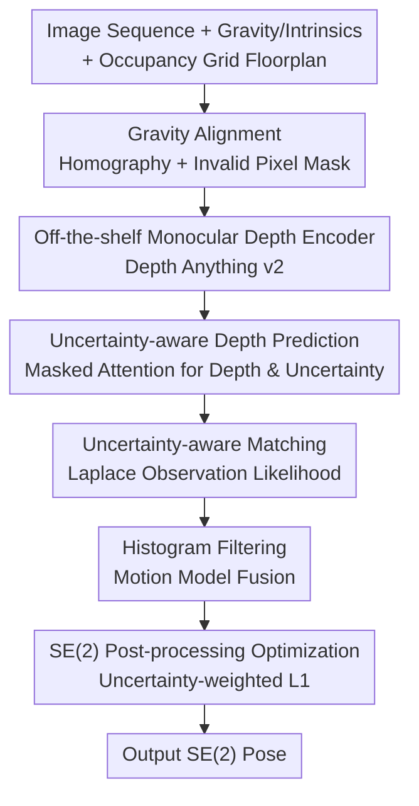

# UnLoc: Leveraging Depth Uncertainties for Floorplan Localization

**Conference**: ICLR 2026  
**OpenReview**: [https://openreview.net/forum?id=TNfjckDeh4](https://openreview.net/forum?id=TNfjckDeh4)  
**Code**: https://github.com/matthias-wueest/UnLoc  
**Area**: 3D Vision / Visual Localization  
**Keywords**: Floorplan Localization, Monocular Depth, Uncertainty Modeling, Histogram Filtering, Sequential Localization

## TL;DR
UnLoc explicitly models monocularly predicted "floorplan depth" as a Laplace distribution with uncertainty. By replacing scene-specific depth networks with an off-the-shelf pre-trained monocular depth model (Depth Anything v2), it achieves significant improvements over the SOTA (F3Loc) in sequential visual floorplan localization—improving recall by 42.2x on 15-frame short sequences of the real-world dataset LaMAR HGE.

## Background & Motivation
**Background**: Indoor camera localization is a fundamental problem for AR and robotics. Traditional solutions rely on pre-built 3D models or large-scale image databases, which incur high storage overhead, maintenance costs, and difficulty in scaling to new scenes. In contrast, **floorplans** are lightweight, easily accessible, and naturally robust to appearance changes (furniture movement, lighting variations), making them an ideal 2D representation for indoor localization. F3Loc is currently the strongest sequential floorplan localization method: it uses monocular depth estimation to calculate the "floorplan depth to the nearest occupied region" and integrates multi-frame observations over time using histogram filtering, significantly exceeding previous baselines.

**Limitations of Prior Work**: F3Loc has two major drawbacks for practical deployment. First is the **lack of uncertainty modeling**—it assumes that all depth predictions are equally accurate. However, in indoor scenes, glass walls, open doorways, and large textureless walls make depth estimation extremely unreliable. In sequential fusion, these erroneous depths are treated as trustworthy observations, directly polluting pose estimation. Second is that the **depth network is scene-bound**—F3Loc trains a specialized depth network for each dataset or environment. Re-collecting depth data for every new environment is unrealistic and contradicts the requirement for "fast deployment."

**Key Challenge**: Localization robustness depends on the quality of depth predictions. However, depth predictions are inevitably unreliable in challenging areas. Prior methods neither "know" where they are unreliable nor distinguish between them during fusion. Simultaneously, "scene-specific networks" lock the method into trained environments, resulting in poor generalization.

**Goal**: (1) Equip floorplan depth prediction with uncertainty to allow weighted sequential fusion based on credibility; (2) Eliminate scene-specific training by directly reusing large-scale pre-trained monocular depth models.

**Key Insight**: Instead of treating the floorplan depth corresponding to each image column as a deterministic value, **model it as a probability distribution**—specifically, a Laplace distribution centered at the predicted depth with a scale parameter representing predicted uncertainty. The heavy tails of the Laplace distribution are more robust to large errors, and it allows for closed-form likelihood calculation, perfectly fitting real-time histogram filtering.

**Core Idea**: Replace F3Loc's "equal-weight depth + scene-specific network" with a "Laplace depth distribution with uncertainty + off-the-shelf pre-trained monocular depth model." This downweights unreliable observations during fusion and makes the method plug-and-play.

## Method

### Overall Architecture
UnLoc aims to solve the following: given an RGB image sequence, inter-frame relative poses, gravity direction, camera intrinsics, and a **floorplan with only occupancy grids and no semantic annotations**, estimate the camera's SE(2) pose $s_t=[s_{x,t}, s_{y,t}, s_{\phi,t}]$ (position + orientation) in the 2D floorplan coordinate system.

At each time step $t$, the pipeline operates as follows: images are first gravity-aligned (producing a mask marking invalid pixels) and fed into a pre-trained monocular depth encoder to extract features. The features and mask pass through a masked attention module, outputting two 1D vectors: floorplan depth $\hat{d}_t$ and corresponding uncertainty $\hat{b}_t$. These vectors are interpreted as a set of equiangular rays and undergo **uncertainty-aware matching** against the occupancy map to obtain an observation likelihood volume for all candidate poses. Histogram filtering fuses this likelihood with the prior belief propagated via a motion model to obtain the posterior. Finally, a lightweight SE(2) post-processing optimization is performed on the last $k$ frames to eliminate accumulated drift.

The "Gravity Alignment" and feature extraction parts are standard scaffolding: gravity alignment uses roll $\psi$ and pitch $\theta$ to construct rotation $R_{cg}=R_y(\theta)\cdot R_x(\psi)$, and a homography $H=K\cdot R_{gc}\cdot K^{-1}$ to warp the image, producing a binary mask for invalid pixels. Actual contributions are concentrated in the following four designs.

### Key Designs

**1. Off-the-shelf Pre-trained Monocular Depth Encoder: Eliminating Scene-specific Training**
This design addresses the pain point of retraining specialized networks for every environment. Previous methods (including F3Loc) mostly used encoders pre-trained on ImageNet, which is unrelated to floorplan depth. The authors observe that monocular depth encoders pre-trained on large-scale depth data provide superior features for floorplan depth prediction. UnLoc treats the depth model as a **plug-and-play module**, selecting the Depth Anything v2 (indoor fine-tuned) encoder. Ablation studies confirm that monocular depth encoders (DepthPro, Depth Anything v2-L) outperform general encoders like DINOv2 at the same size, and performance scales positively with model size.

**2. Uncertainty-aware Depth Prediction: Modeling Depth as a Laplace Distribution**
This is the core contribution. UnLoc uses a masked attention mechanism to predict two 1D vectors from interpolated encoder features: depth $\hat{d}_t$ and uncertainty $\hat{b}_t$. The gravity alignment mask is applied to the attention to ensure the model focuses only on observable regions. The model is trained by minimizing the Negative Log-Likelihood (NLL) of the Laplace distribution:

$$L_d=\sum_{i=1}^{D}\left(\log(\hat{b}_i)+\frac{|\hat{d}_i-d_i(s)|}{\hat{b}_i}\right)$$

where $d_i(s)$ is the ground truth floorplan depth. This loss encourages accurate depth while allowing the model to output large uncertainty for difficult-to-predict columns. It models aleatoric uncertainty to capture inherent scene ambiguities like glass or doorways.

**3. Uncertainty-aware Matching + Histogram Filtering: Natural Downweighting of Unreliable Observations**
Observations are treated as samples from a distribution. The observation likelihood is defined as the product of Laplace distributions for each ray:

$$p(o_t\mid s_t)=\prod_{j=1}^{R}\frac{1}{2\tilde{b}_{t,j}}\exp\left(-\frac{|\tilde{d}_{t,j}-d_j(s_t)|}{\tilde{b}_{t,j}}\right)$$

where $\tilde{d}_{t,j}$ and $\tilde{b}_{t,j}$ are depth and uncertainty interpolated at ray angle $\alpha_j$. Laplace is chosen for two reasons: its heavy tails are more robust to large errors in indoor scenes, and its closed-form likelihood is efficient for real-time filtering. When uncertainty $\tilde{b}_{t,j}$ is high, the distribution flattens, naturally reducing the weight of that observation in pose estimation.

**4. SE(2) Post-processing Optimization: Eliminating Drift via Uncertainty Weighting**
To eliminate residual drift, UnLoc performs a lightweight optimization on the recent $k$ frames ($k=10$). It estimates a global SE(2) correction $\Delta s(\theta, p)$ to rigidly adjust the trajectory. The objective is the **uncertainty-weighted L1** difference between predicted and floorplan depths:

$$L_{post}(\theta,p)=\sum_{t=T-k+1}^{T}\sum_{j}\frac{1}{\tilde{b}_{t,j}}\cdot|\tilde{d}_{t,j}-d_j(\tilde{s}_t(\theta,p))|$$

The weight $1/\tilde{b}_{t,j}$ ensures that frames with high uncertainty contribute less, making the refinement robust to noisy predictions.

### Loss & Training
Training optimizes only the depth prediction branch using the Laplace NLL loss $L_d$. Ground truth comes from the floorplan depth at the ground truth pose. Histogram filtering and post-processing do not contain learnable parameters. The training set is Gibson(f) (24,779 4-frame sequences); real-world training is done on 12 sessions of LaMAR HGE.

## Key Experimental Results

### Main Results
Evaluation is performed on Gibson(t), LaMAR HGE (22,500 $m^2$, narrow FoV 48°), and its cropped version. Metrics are Success Rate (SR@1m) and RMSE.

SR@1m (%) on Gibson(t) for different sequence lengths:

| Method | T=100 | T=50 | T=35 | T=20 | T=15 |
|------|-------|------|------|------|------|
| GT Depth (Upper Bound) | 100.0 | 98.7 | 91.0 | 76.0 | 72.0 |
| F3Loc fusion | 94.6 | 94.6 | 69.4 | 46.0 | 41.8 |
| F3Loc mono | 89.2 | 70.5 | 55.9 | 34.0 | 28.4 |
| F3Loc mono + Depth Anything v2 | 94.6 | 89.7 | 76.6 | 60.5 | 56.3 |
| UnLoc w/o Post-processing | 97.3 | 92.3 | 88.3 | 70.5 | 65.3 |
| **Ours (UnLoc)** | **97.3** | **94.9** | **92.8** | **86.5** | **81.3** |

On 15-frame sequences, UnLoc improves SR by 52.9 points over F3Loc mono.

SR@1m (%) on LaMAR HGE (Real-world):

| Method | T=100 | T=50 | T=35 | T=20 | T=15 |
|------|-------|------|------|------|------|
| GT Depth (Upper Bound) | 100.0 | 91.7 | 85.7 | 73.1 | 56.5 |
| F3Loc mono | 36.4 | 16.7 | 5.7 | 1.6 | 1.2 |
| **Ours (UnLoc)** | **100.0** | **75.0** | **74.3** | **63.5** | **50.6** |

On 15-frame sequences, SR increases from 1.2% (F3Loc) to 50.6% (+42.2x Gain).

### Ablation Study
SR@1m (%) on LaMAR HGE for different encoders w/ and w/o uncertainty (no post-processing):

| Encoder | T=100 | T=50 | T=35 | T=20 | T=15 |
|--------|-------|------|------|------|------|
| DINOv2 (L) | 90.9 | 45.8 | 20.0 | 9.5 | 3.5 |
| DINOv2 (L) w/ Uncertainty | 100.0 | 54.2 | 31.4 | 15.9 | 5.9 |
| Depth Anything v2 (L) | 100.0 | 66.7 | 42.9 | 23.8 | 9.4 |
| Depth Anything v2 (L) w/ Uncertainty | 100.0 | 75.0 | 60.0 | 36.5 | 20.0 |

### Key Findings
- **Uncertainty modeling consistently improves all encoders**: Regardless of the encoder (DINOv2, DepthPro, Depth Anything v2), adding uncertainty results in universal SR gains. Specifically, a base model with uncertainty can match the performance of a large model.
- **Post-processing is crucial for short sequences**: On 15-frame Gibson sequences, post-processing provides a 16% SR boost, even exceeding the GT depth version.
- **Cross-scene generalization**: When tested on LaMAR CAB (trained on HGE), UnLoc maintains 50% SR on 100-frame sequences, whereas F3Loc fails completely (0% SR).

## Highlights & Insights
- **Deconstructing the "Equal Weight" Assumption**: UnLoc's most significant insight is identifying that F3Loc's assumption of equal depth reliability is the root cause of failure. Modeling depth as a Laplace distribution allows the filter to "ignore" glass walls or doorways.
- **Unified Uncertainty**: The same $\hat{b}_t$ serves the observation likelihood, the posterior update, and the post-processing weighted L1 loss.
- **Plug-and-play Depth**: Decoupling the depth network into a replaceable module allows the framework to automatically benefit from advancements in foundation depth models.
- **Small Model + Uncertainty ≈ Large Model**: Ablations show base+uncertainty roughly equals large, suggesting that modeling uncertainty is a more efficient path for compute-limited mobile devices than simply increasing model size.

## Limitations & Future Work
- **Limited to Aleatoric Uncertainty**: Epistemic uncertainty was omitted for real-time efficiency but would be valuable for out-of-distribution scenes.
- **External Dependency**: The method relies on gravity, intrinsics, and ego-motion. Errors in these inputs propagate to localization.
- **Computational Cost**: Large depth models increase per-frame latency (~0.18s for inference), which may be challenging for high-frame-rate real-time usage.
- **SE(2) Limitation**: Still assumes accurate 2D floorplans and only estimates SE(2) pose. Multistory or height ambiguities are not explored.

## Related Work & Insights
- **vs F3Loc**: Both use monocular depth + histogram filtering. UnLoc addresses F3Loc's "scene-specific" and "equal reliability" weaknesses through Laplace modeling and pre-trained encoders.
- **vs LASER / LaLaLoc(++)**: These methods use shared space matching (LASER uses PointNet on visible points). UnLoc follows a geometric route ("depth -> rays -> occupancy matching") favoring temporal fusion.
- **vs OrienterNet**: OrienterNet matches against 2D maps like OSM but focuses on outdoor scenes. UnLoc addresses indoor-specific ambiguities like glass.

## Rating
- Novelty: ⭐⭐⭐⭐ Elegant integration of depth uncertainty through the Laplace distribution across the entire pipeline.
- Experimental Thoroughness: ⭐⭐⭐⭐⭐ Comprehensive evaluation across synthetic, real, and cross-building scenes.
- Writing Quality: ⭐⭐⭐⭐ Clear motivation with a well-defined pipeline.
- Value: ⭐⭐⭐⭐ Significant practical value for mobile indoor localization by boosting short-sequence recall.

<!-- RELATED:START -->

## Related Papers

- [\[CVPR 2026\] Fusion of Depth and Semantics for Probabilistic Floorplan Localization](../../CVPR2026/3d_vision/fusion_of_depth_and_semantics_for_probabilistic_floorplan_localization.md)
- [\[ICLR 2026\] A Scene is Worth a Thousand Features: Feed-Forward Camera Localization from a Collection of Image Features](a_scene_is_worth_a_thousand_features_feed-forward_camera_localization_from_a_col.md)
- [\[ICLR 2026\] Large Depth Completion Model from Sparse Observations](large_depth_completion_model_from_sparse_observations.md)
- [\[ICLR 2026\] ORCaS: Unsupervised Depth Completion via Occluded Region Completion as Supervision](orcas_unsupervised_depth_completion_via_occluded_region_completion_as_supervisio.md)
- [\[CVPR 2026\] RoSAMDepth: Robust Self-supervised Depth Estimation Leveraging Segment Anything Model](../../CVPR2026/3d_vision/rosamdepth_robust_self-supervised_depth_estimation_leveraging_segment_anything_m.md)

<!-- RELATED:END -->
