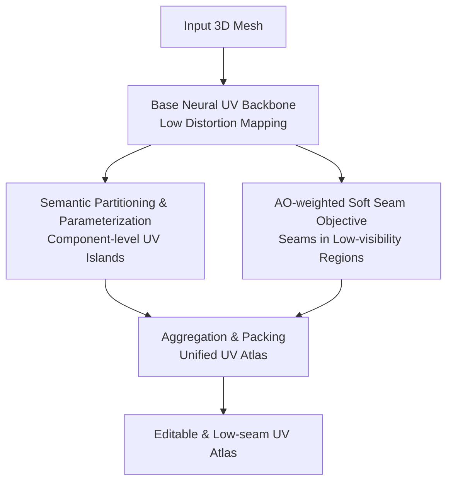

# Unsupervised Representation Learning for 3D Mesh Parameterization with Semantic and Visibility Objectives

**Conference**: ICLR2026  
**OpenReview**: [https://openreview.net/forum?id=9LYsvna4Sk](https://openreview.net/forum?id=9LYsvna4Sk)  
**Code**: https://github.com/AHHHZ975/Semantic-Visibility-UV-Param  
**Area**: 3D Vision  
**Keywords**: 3D Mesh Parameterization, UV Unwrapping, Semantic-aware, Visibility-aware, Unsupervised Representation Learning  

## TL;DR
This paper advances unsupervised neural UV parameterization from "geometry distortion only" to "serving real-world texturing workflows." By using semantic partitioning to align UV islands with 3D components and ambient occlusion (AO) to guide seams into inconspicuous areas, the method produces 3D mesh UV atlases better suited for editing, texture generation, and asset reuse.

## Background & Motivation
**Background**: 3D mesh parameterization, commonly known as UV mapping, is the process of flattening a 3D surface into 2D texture coordinates. Traditional methods and recent learning-based approaches primarily focus on optimizing geometric properties, such as angle preservation, area preservation, edge length maintenance, overlap avoidance, and minimizing the number of charts. These objectives are crucial for a functional UV atlas, as severe distortion in texture coordinates leads to artifacts in subsequent texturing, baking, and rendering.

**Limitations of Prior Work**: A critical issue is that real-world 3D content production does not prioritize geometric distortion in isolation. If a UV island spans a rabbit's body, ears, and legs, artists find it difficult to treat a "single semantic component" as a unified block during texture editing, even if local angle preservation is high. Conversely, if seams are placed on the front of a model or in high-exposure areas, visible artifacts appear even with perfect geometric metrics. Thus, existing automatic UV methods often treat parameterization as a pure geometry problem, ignoring its role in texture editing, transfer, and visual quality.

**Key Challenge**: There is a practical contradiction in UV parameterization: low distortion typically requires cutting the surface at geometrically complex areas, but human perception is sensitive to whether these cuts break semantic parts or appear in prominent locations. If an algorithm only optimizes conformality, equiareality, or bijectivity, it may choose seams that are geometrically convenient but semantically fragmented or visually jarring. If it only pursues semantic or visual preferences, basic geometric utility may be sacrificed.

**Goal**: The authors aim to extend UV parameterization learning into an unsupervised framework oriented toward downstream tasks. Specifically, the goals are: first, ensuring output UV charts align with meaningful 3D components for easier localized editing and texture transfer; second, ensuring seams fall in regions that are difficult to observe to reduce visible seam artifacts; and third, maintaining acceptable control over angle, area, and overlap without deviating from geometric foundations.

**Key Insight**: The paper observes that semantic consistency can be initiated through 3D surface partitioning, decomposing the entire mesh into several semantically coherent connected submeshes before learning separate UV islands. Visibility can be approximated using ambient occlusion (AO) as a proxy for exposure, where a soft mask objective guides seams away from high-AO visible regions during training. Since neither signal requires manual annotation, they are suitable for integration into an unsupervised neural UV backbone.

**Core Idea**: The approach uses "partitioning followed by part-wise parameterization" to solve the misalignment between UV islands and 3D components, and an "AO-weighted differentiable seam objective" to address seams in prominent areas, integrating both into an existing bidirectional cycle mapping UV backbone.

## Method
### Overall Architecture
The proposed method adds two perceptual objectives onto an existing neural UV parameterization backbone. The base backbone maps mesh vertices $V$ to 2D UV coordinates $Q$, maintaining low distortion and approximate bijectivity through unsupervised losses such as wrap, cycle, repel, and distortion. The core contributions are two high-level pipelines: the semantic-aware pipeline first segments the 3D mesh and then learns and packs UVs per component; the visibility-aware pipeline detects soft seams during training and penalizes them using AO values in "prominent locations."

The workflow does not force both objectives into a single black-box loss but maps them to two key decisions in the UV workflow: which surface regions should be organized into the same chart, and where the seams should be placed. Semantic objectives determine chart organization, visibility objectives determine cut locations, and basic geometric losses ensure the flattened results remain usable.

The base backbone follows recent neural surface parameterization concepts. it consists of four point-based MLPs—DeformNet, WrapNet, CutNet, and UnwrapNet—forming two cycles: $2D \rightarrow 3D \rightarrow 2D$ and $3D \rightarrow 2D \rightarrow 3D$. Intuitively, the model starts from a regular 2D grid, deforms and wraps it onto the 3D surface, then cuts and unwraps it back to 2D. The other path starts from real 3D vertices, cuts, unwraps, and wraps back to 3D. Overlap, distortion, or irreversibility in UV mapping are reflected in cycle reconstruction, normal consistency, repulsion, and distortion losses.

In the semantic-aware component, the input mesh is first partitioned into component-level segments using the Shape Diameter Function (ShDF). ShDF compresses the "local thickness" near each surface position into a scalar; components like a rabbit's ears, body, legs, or handles typically exhibit distinct thickness patterns. The paper fits ShDF values using a GMM and combines them with smoothing costs for adjacent faces and graph cut refinement to obtain connected semantic submeshes. Each submesh then independently runs the same UV backbone to generate individual UV islands, which are finally arranged into a unified UV atlas.

In the visibility-aware component, the paper pre-calculates ambient occlusion (AO) for each vertex. AO serves as a geometric proxy for "exposure from typical viewpoints": $AO=1$ indicates high exposure, while $AO=0$ indicates occlusion. During training, the model uses distance jumps in UV space relative to 3D neighborhoods to detect soft seam vertices and minimizes their AO-weighted mean. Consequently, if the model places seams in high-exposure areas, the loss increases, encouraging the movement of seams to concave, back-facing, or occluded regions.

### Key Designs
**1. Semantic Partitioning and Re-parameterization: Aligning UV Islands with Editable 3D Parts**

Traditional automatic UV unwrapping treats cutting as a geometric operation to reduce distortion, often resulting in UV charts that span multiple semantic components or fragment single components. This semantic-aware pipeline approaches the problem from a content creation perspective: if a user needs to edit textures for a rabbit's ears, body, and legs separately, the UV islands should be organized accordingly. To achieve this, the paper uses the Shape Diameter Function for unsupervised 3D partition. For a surface sample $p$, ShDF estimates local thickness by casting multiple rays in a cone around the inward normal, using normalization and log-like compression to stabilize the range.

After obtaining the ShDF scalar field, the method uses a 1D GMM to produce per-face soft category likelihoods, combined with geometric smoothing terms of adjacent faces into a graph-cut energy. This design is more robust than simple thresholding, as the GMM provides data-driven component candidates and the graph cut avoids frequent label jumps due to local noise. Subsequent connected-component relabeling ensures each final label corresponds to a connected submesh. This results in coherent, editable geometric partitions suitable for per-part UV parameterization.

**2. Part-level UV Learning and Deterministic Packing: Transforming Semantic Consistency into Atlas Structure**

With semantic submeshes defined, the paper avoids forcing an abstract "semantic loss" on the entire mesh, instead changing the unit of parameterization. It trains a base UV backbone for each component $M_k=(V_k,F_k)$ separately to obtain UV islands $Q_k$. The loss for each part remains geometric: $L^{(k)}_{part}=L^{(k)}_{wrap}+L^{(k)}_{cycle}+L^{(k)}_{repel}+L^{(k)}_{dist}$. The advantage is that small, connected components are easier to flatten than complex meshes, making local distortion easier to control and ensuring UV islands naturally correspond to understandable 3D components.

After normalizing all $Q_k$ into unit squares, a simple deterministic grid packing merges them into a single atlas. For $K$ components, let $G=\lceil\sqrt{K}\rceil$. The unit UV sheet is divided into a $G \times G$ grid, where each island is placed into a cell with uniform scaling $s=(1-2\cdot pad)/G$ and translation $t_{r,c}$. While not the most space-efficient, this packing ensures ease of reproduction and consistent texel density across parts, which is beneficial for texture baking.

**3. AO-weighted Soft Seam Objective: Pushing Cuts to Low-exposure Areas**

The visibility-aware component targets a common failure: UV seams in prominent areas. The paper uses ambient occlusion as a proxy for visibility. For a point $p$ and normal $n(p)$, AO is defined as the cosine-weighted average visibility over the hemisphere: $AO(p)=\frac{1}{\pi}\int_{\Omega^+(p)}V(p,\omega)(n(p)\cdot\omega)d\omega$. With $AO(p)=1$ as fully exposed and $AO(p)=0$ as fully occluded, seams should gravitate toward low-AO regions.

The challenge is that seams are not fixed labels but change during training. The paper uses a differentiable approximation to detect soft seams in UV space: for vertex $i$, its 3D neighbors $j$ are identified; if their distance in UV space is large despite being close in 3D, a cut is likely. The hard maximum distance $\eta_i=\max_j\|q_i-q_{i,j}\|_2$ is replaced by a log-sum-exp approximation, yielding soft seam membership $s_i=\sigma(\beta(\eta_i-\tau))$. The final AO seam loss is $L_{AO}=\frac{\sum_i s_i AO_i}{\sum_i s_i+\epsilon}$, punishing seams in high-exposure areas.

**4. Decoupling Geometric Backbone and Perceptual Objectives: Acknowledging Trade-offs**

The paper does not claim that semantic and visibility objectives improve all geometric metrics; rather, it treats them as adjustable high-level preferences. The total objective for visibility-aware training is $L_{vis}=L_{wrap}+L_{cycle}+L_{repel}+L_{dist}+\lambda_{vis}L_{AO}$. As $\lambda_{vis}$ increases, seams favor low-AO regions; as geometric terms gain weight, the result approaches traditional low-distortion UVs. This design exposes the trade-off between "geometric fidelity" and "production utility."

### Loss & Training
The training objective for the base UV backbone consists of four unsupervised geometric losses. $L_{wrap}$ uses Chamfer distance and normal consistency to keep WrapNet's 3D output close to the real mesh; $L_{cycle}$ constrains consistency between $\hat{Q}$ and $\hat{Q}_{cycle}$, as well as real $P$ and reconstructed $\tilde{P}$; $L_{repel}$ uses local UV repulsion to reduce overlaps; $L_{dist}$ controls angle and area distortion through differential and triangle distortion losses.

Semantic-aware training optimizes the same geometric losses for each semantic submesh independently. Visibility-aware training adds $\lambda_{vis}L_{AO}$ to the base loss, with a suggested weight of $0.004$. In terms of computational cost, the semantic pipeline is often faster overall than FlexPara's multi-chart training because smaller submeshes are easier to optimize. The visibility pipeline is significantly slower due to the overhead of per-iteration soft seam extraction and neighborhood distance calculations.

## Key Experimental Results

### Main Results
The method was evaluated qualitatively, quantitatively, and through user studies. Semantic-aware results were compared against xatlas, Blender SmartUV, Autodesk Maya automatic UV, and FlexPara multi-chart. Visibility-aware results were compared against FlexPara single-chart and OptCuts.

| Task | Metric | Ours (Best) | Comparison Method | Conclusion |
|------|------|--------------|--------------|------|
| Visibility-Aware UV | Mean seam AO ↓ | 0.6065 | OptCuts: 0.7855 / FlexPara: 0.8604 | Seams are concentrated in low-exposure areas |
| Visibility-Aware UV | Conformality ↑ | 0.9175 | OptCuts: 0.9341 / FlexPara: 0.9097 | Angle preservation is comparable/better than FlexPara |
| Visibility-Aware UV | Equiareality ↑ | 0.6093 | OptCuts: 0.8934 / FlexPara: 0.6759 | Significant cost in area preservation |
| Semantic-Aware UV | Hamming Distance ↓ | 0.3188 | FlexPara: 0.5980 / xatlas: 0.8896 | Significantly better semantic consistency |
| Semantic-Aware UV | Rand Index ↑ | 0.8151 | FlexPara: 0.6902 / Blender: 0.7173 | Stronger vertex grouping consistency |

The data confirms that the method excels in semantic and visibility-specific metrics. Mean seam AO dropped from FlexPara's 0.8604 to 0.6065. Hamming distance dropped from 0.5980 to 0.3188. However, equiareality (area preservation) for visibility-aware global atlases dropped to 0.6093, lower than OptCuts' 0.8934. User studies showed overwhelming preferences for the proposed method in both visibility (93.70% preference) and semantic (80.22% preference) tasks.

### Ablation Study
| Configuration | Key Metrics | Description |
|------|----------|------|
| Semantic-Aware (ShDF) | Conformality 0.9123 / Equiareality 0.6707 | Default ShDF partitioning, balanced geometric preservation |
| Semantic-Aware (SAMesh) | Conformality 0.8694 / Equiareality 0.6270 | Modern segmenter improves semantics but may lower UV metrics |
| Visibility-Aware | Conformality 0.9175 / Equiareality 0.6093 | Improved seam visibility at the cost of area preservation |
| w/o visibility loss | Higher seam AO distribution | Seams tend to stay in prominent areas without AO loss |

### Key Findings
- The semantic objective primarily benefits UV atlas interpretability, making island organization natural for painting and transfer.
- The visibility objective effectively shifts the seam distribution toward occluded regions, reducing artifacts in rendering.
- A genuine trade-off exists between geometric metrics and perceptual goals; the method prioritizes "texturing utility" over pure "math beauty."
- ShDF is an effective default partitioner, though it can be replaced by more modern 3D segmentation architectures.
- Computational overhead is the main engineering hurdle, especially neighborhood distance checks in visibility training.

## Highlights & Insights
- Re-aligning UV parameterization goals with content production workflows is the primary value of this paper.
- The semantic-aware design is simple yet effective: "partition then parameterize" provides clarity and modularity.
- The AO seam loss formula is intuitive, translating a subjective aesthetic judgment ("seams should be hidden") into a differentiable optimization objective.
- The paper honestly presents the geometry-preservation trade-off, making it more credible for practical systems.
- This philosophy can be transferred to other tasks: texture generation can use semantic consistency as a layout prior, and asset retargeting can leverage per-part atlases for correspondence.

## Limitations & Future Work
- Dependency on ShDF or external segmenters means partition quality directly dictates the atlas; ShDF may fail on meshes with complex topologies where thickness isn't a clear semantic indicator.
- The simple grid packing does not optimize for space utilization or complex island shapes.
- AO is a limited proxy for visibility; it doesn't account for dynamic camera paths or specific lighting environments.
- High training costs for visibility-aware models necessitate optimization via GPU acceleration or spatial hashing.

## Related Work & Insights
- Compared to traditional parameterization (LSCM, SLIM, OptCuts), this work shifts the focus from purely geometric constraints to semantic and perceptual ones.
- Unlike basic neural backbones like FlexPara, this method changes the training unit (per-part) and the objective (AO-weighted seams).
- It highlights that better 3D segmentation can lead directly to better semantic-aware UV layouts, bridge the gap between CV segmentation tasks and CG geometry tasks.

## Rating
- Novelty: ⭐⭐⭐⭐☆ Integrating semantic partitioning and AO visibility into unsupervised UV learning is highly practical.
- Experimental Thoroughness: ⭐⭐⭐⭐☆ Comprehensive quantitative metrics and user studies, though dataset complexity could be further increased.
- Writing Quality: ⭐⭐⭐⭐☆ Clear motivation and complete formulas.
- Value: ⭐⭐⭐⭐⭐ Extremely useful for 3D content production and generative pipelines as an editable UV pre-processing module.

<!-- RELATED:START -->

<!-- RELATED:END -->

## Related Papers

- [\[ICLR 2026\] CLAP: Unsupervised 3D Representation Learning for Fusion 3D Perception via Curvature Sampling and Prototype Learning](clap_unsupervised_3d_representation_learning_for_fusion_3d_perception_via_curvat.md)
- [\[CVPR 2026\] GM-R²: Generative Matching Learning for Unsupervised Geometric Representation and Registration](../../CVPR2026/3d_vision/gm-r2_generative_matching_learning_for_unsupervised_geometric_representation_and.md)
- [\[ICLR 2026\] Learning Unified Representation of 3D Gaussian Splatting](learning_unified_representation_of_3d_gaussian_splatting.md)
- [\[AAAI 2026\] Point-SRA: Self-Representation Alignment for 3D Representation Learning](../../AAAI2026/3d_vision/point-sra_self-representation_alignment_for_3d_representation_learning.md)
- [\[ICLR 2026\] Open-Set Semantic Gaussian Splatting SLAM with Expandable Representation](open-set_semantic_gaussian_splatting_slam_with_expandable_representation.md)

<!-- RELATED:END -->
