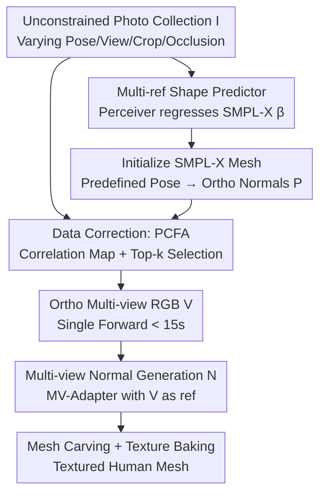

# UP2You: Fast Reconstruction of Yourself from Unconstrained Photo Collections

**Conference**: ICLR 2026  
**OpenReview**: [https://openreview.net/forum?id=oFsNco4aMm](https://openreview.net/forum?id=oFsNco4aMm)  
**Code**: The paper states models and code will be open-sourced (link not yet provided)  
**Area**: 3D Vision  
**Keywords**: Dressed human reconstruction, unconstrained photos, data corrector, pose-aware feature aggregation, SMPL-X  

## TL;DR
UP2You proposes a "data corrector" paradigm that transforms a collection of unconstrained photos with varying poses, viewpoints, crops, and occlusions into clean orthogonal multi-view RGB and normal maps via a single forward pass in seconds. These are then processed by traditional reconstruction algorithms to generate high-fidelity textured human meshes. The entire pipeline takes 1.5 minutes with nearly constant memory usage, outperforming previous optimization-based methods that require hours.

## Background & Motivation
**Background**: Reconstructing 3D dressed humans from images has been studied for years, with input formats evolving from dense multi-view and monocular video to single images. Recently, diffusion models and Score Distillation Sampling (SDS) have made "reconstruction as conditional generation" the mainstream, allowing for plausible hallucination of back views and occluded regions from visible pixels.

**Limitations of Prior Work**: Existing methods almost exclusively assume "clean" inputs—full-body, simple poses, and synchronized/calibrated cameras. However, real-world data often consists of personal photo albums where individuals are partially cropped or occluded, viewpoints are extreme, body poses are dynamic, and aspect ratios vary. While such "unconstrained photos" contain rich appearance information, it is scattered across images, and the lack of synchronization between camera and body poses makes it difficult for even state-of-the-art human estimators to establish reliable 2D-3D correspondences.

**Key Challenge**: Facing such messy inputs, current approaches fall short. One path is the "data compressor" (represented by PuzzleAvatar), which chops photos into local/global patches or assets (clothes/hair/face), distills them into learnable tokens via DreamBooth, and assembles them using SDS text-to-3D. However, DreamBooth fine-tuning and SDS optimization take hours, are unstable, and require ground-truth SMPL-X initialization. Furthermore, lossy compression causes diffusion priors to override individual features, leading to "unpredictable hallucinations." Another path involves completing single images into orthogonal loops, but these are essentially "data patchers" (filling invisible views from a single visible one) that cannot utilize multiple unconstrained photos or improve accuracy with more input.

**Goal**: To build the first true solution for "unconstrained photo collections," addressing three challenges: (1) effectively aggregating information from multiple reference images with massive pose/view/crop/occlusion differences; (2) handling a variable number of inputs (from 1 to dozens) without computational explosion; and (3) removing dependence on ground-truth human shapes.

**Key Insight**: Instead of performing lossy compression at the representation layer, it is better to act as a "data corrector"—directly correcting messy, incomplete captures into clean, complete orthogonal views (in canonical poses) for traditional reconstruction. The correction process not only organizes input data but also refines the generative model's prior by continued training on high-fidelity 3D human multi-view renderings, achieving better consistency in both identity and perspective.

**Core Idea**: Replace "data compressors/patchers" with a "data corrector" that rectifies unconstrained photos into orthogonal multi-views in a single forward pass, followed by traditional reconstruction. This approach is fast, stable, and improves as the number of input photos increases.

## Method

### Overall Architecture
UP2You aims to reconstruct high-quality textured meshes from unconstrained photos where both camera parameters and human poses are unknown. The pipeline consists of four steps: first, regressing SMPL-X shape parameters from reference photos and initializing the mesh with a predefined pose/expression; second, using SMPL-X normal maps as viewpoint conditions and selectively aggregating features from reference images via the PCFA module to generate 6 orthogonal clean RGB images; third, generating corresponding multi-view normal maps for geometric cues; and finally, performing mesh carving and texture baking. This "corrects" messy inputs into a standard problem for traditional reconstruction.

### Key Designs

**1. Data Corrector Paradigm: Rectifying Messy Inputs in One Forward Pass**

This design directly addresses the core issue where unconstrained photos fail to establish reliable 2D-3D correspondences. Instead of lossy compression into tokens followed by hours of SDS, UP2You reverses the problem: using a forward network to rectify input $I$ into 6 clean RGB images $V$ in canonical poses and orthogonal views. Using MV-Adapter as the backbone, it employs ReferenceNet as a reference encoder and injects raymaps as viewpoint conditions. By training on high-fidelity 3D human renders, "3D consistency + identity preservation" is baked into the generative prior, avoiding the identity loss and hallucinations of compression paradigms while reducing end-to-end time from 4 hours to 1.5 minutes.

**2. PCFA Pose-aware Feature Aggregation: Selecting Useful Features with Constant VRAM**

Feeding all reference features into a generative model causes VRAM to scale linearly with the number of references, often including irrelevant pixels (e.g., using a back-view reference for a front-view target). PCFA decouples "identity features" from "viewpoint correlation" to adaptively determine each reference's contribution. For each target pose $P_i$, a pose encoder $E_{pose}$ and DINOv2 encoder $E_{ref}$ extract $X_i^{pose}=E_{pose}(P_i)$ and reference features $X^{ref}=E_{ref}(I)$. These enter a transformer block $T$ with self and cross-attention to produce output $O_i$, which encodes reference info relevant to the target pose. An attention map $A^i=\frac{W_q O_i \cdot (W_k X^{ref})^\top}{\sqrt{d}}$ is computed to generate a pixel-wise correlation map $C^i$. Unlike methods relying on keypoint similarity, PCFA's map is built on fine-grained semantic correlation between the target and DINO features.

For **feature selection**, a top-k strategy is used to save computation: multi-scale reference features $F=\{F_k\}$ are extracted, and the correlation map is interpolated to obtain $\hat{C}^i$. For each viewpoint, only the top $\gamma S_k$ indices are retained based on $\hat{C}^i$. Weighted features $\hat{F}_k^i = F_k[\cdot]\cdot \hat{C}^i[\cdot]$ are then fed to the generator $V=D_{rgb}(\hat{F}, P_{rgb}(P))$. This keeps VRAM nearly constant regardless of the number of references (e.g., 18.65 GB to 20.88 GB for 3 vs 12 images), while quality improves with more input—validating "the more 2D views seen, the better the 3D perception."

**3. Multi-ref Shape Predictor: Regressing SMPL-X Shape from Messy Photos**

The pipeline relies on an initial SMPL-X mesh for pose conditions $P$ and as a base for reconstruction. While pose $\theta$ and expression $\psi$ are predefined, shape $\beta$ must be estimated. Single-image predictors are unstable with "dirty" references, producing inconsistent results for the same person. UP2You uses a Perceiver-style architecture: $\beta_{pred}=S(\tau, X^{ref})$, where $\tau$ is a learnable query token and $X^{ref}$ are DINOv2 features. The Perceiver aggregates multi-view information through the query token, significantly reducing the high variance of single-image methods.

### Loss & Training
Multi-view RGB generation, normal generation, and shape prediction models are trained on datasets such as THuman2.1, Human4DiT, 2K2K, and CustomHumans. High-fidelity 3D synthetic renders are used to inject 3D consistency priors. Normal generation uses SMPL-X renders as extra conditions. Mesh carving starts from the initial SMPL-X mesh, refines geometry with generated normals $N$, and projects vertex colors from $V$. Hand regions are replaced with the initial mesh (following ECON) to maintain hand geometry.

## Key Experimental Results

### Main Results
Evaluated on PuzzleIOI, 4D-Dress (with textured 3D GT), and self-collected in-the-wild data (12 identities), using 12 reference images by default.

| Dataset | Metric | Ours (Mesh) | PuzzleAvatar | AvatarBooth |
|--------|------|------|----------|----------|
| PuzzleIOI | PSNR↑ | 24.539 | 21.664 | 16.879 |
| PuzzleIOI | LPIPS↓ | 0.0474 | 0.0639 | 0.1544 |
| PuzzleIOI | Chamfer↓ | 2.724 | 3.204 | 6.635 |
| PuzzleIOI | P2S↓ | 2.605 | 3.165 | 6.697 |
| 4D-Dress | PSNR↑ | 25.540 | 21.376 | 18.186 |
| 4D-Dress | LPIPS↓ | 0.0654 | 0.1081 | 0.1718 |
| 4D-Dress | Chamfer↓ | 1.140 | 1.956 | 6.846 |
| in-the-wild | CLIP-I↑ | 0.971 | 0.907 | 0.878 |

Ours leads in both geometry (PuzzleIOI Chamfer -15%) and texture (4D-Dress PSNR +21%). Notably, single-image reconstruction also outperforms the specialized single-view method PSHuman, showing that training on difficult unconstrained tasks benefits simpler constrained scenarios.

### Ablation Study

| Configuration | PuzzleIOI PSNR↑ | 4D-Dress PSNR↑ | Description |
|------|---------|---------|------|
| Full (Corr.+top-k+RefNet) | 23.896 | 25.848 | Full model |
| A. Mean Aggregator | 17.412 | 19.614 | Simple average, drops 6.5/6.2 |
| B. Concat Aggregator | 20.545 | 23.366 | Concatenation, drops 3.4/2.5 |
| C. Corr.+sum (No top-k) | 20.167 | 23.412 | Weighted sum < top-k |
| D. Encoder to CLIP | 20.152 | 23.405 | Drops 3.7/2.4 |
| E. Encoder to DINOv2 | 19.744 | 23.393 | DINOv2 alone < ReferenceNet |

Shape prediction ablation (V2V↓) shows: as references increase from 3 to 12, our mean improves from 8.819 to 8.336 with stable variance, whereas single-view method PromptHMR's variance spikes to 19.4.

### Key Findings
- Feature aggregation is the biggest factor: PSNR improves by over 6 points from Mean (17.4) to Full PCFA (23.9). Top-k selection outperforms weighted summation (C), proving that selecting a few highly relevant features is better than using all with weights.
- Constant VRAM: For 3 vs 12 references, VRAM only increases from 18.65 to 20.88 GB, while Concatenation jumps to 37.96 GB. Quality scales with references, validating "the more seen, the more accurate."
- DINOv2 outperforms CLIP and DINOv1 in correspondence-heavy tasks.

## Highlights & Insights
- The "Data Corrector vs. Data Compressor" insight is pivotal: instead of forcing generative models to handle 3D consistency under noise, rectify the dirty input into a clean format that generative models already handle well.
- PCFA achieves constant VRAM with quality scaling by explicitly modeling pose-aware correlation and applying sparse selection.
- Using Perceiver query tokens to aggregate multi-view information effectively converts the high variance of single-view estimation into multi-view complementarity.

## Limitations & Future Work
- The pipeline remains dependent on the SMPL-X parametric model, which may limit performance on very loose clothing, accessories, or non-standard body types.
- Accuracy gains in shape (V2V) saturate quickly as references increase, suggesting multi-view complementarity benefits appearance/texture more than体型 precision.
- Rectification quality is bounded by synthetic training data; performance under extreme real-world occlusion may be less stable.

## Related Work & Insights
- **vs PuzzleAvatar**: Moves from hours-long "data compression" to a 1.5-minute "data corrector," eliminating reliance on GT SMPL-X and reducing hallucinations.
- **vs AvatarBooth**: Significantly leads in all geometry and texture metrics.
- **vs PSHuman**: While PSHuman is single-view only, our method outperforms it even in single-view cases, particularly in limb reconstruction.
- **vs PromptHMR**: Replaces high-variance single-view estimation with robust multi-view aggregation.

## Rating
- Novelty: ⭐⭐⭐⭐⭐ First "data corrector" paradigm for unconstrained photo collections.
- Experimental Thoroughness: ⭐⭐⭐⭐⭐ Extensive benchmarks and comprehensive multi-dimensional ablations.
- Writing Quality: ⭐⭐⭐⭐ Clear paradigm comparison and mechanism explanation.
- Value: ⭐⭐⭐⭐⭐ Reduces reconstruction time from hours to 1.5 minutes with higher quality, addressing the practical need for personal photo-based modeling.

<!-- RELATED:START -->

- [PuzzleAvatar: Creating 3D Avatars from Unconstrained Consumer Images](https://arxiv.org/abs/2311.16103)
- [ECON: Explicit Clothed humans Optimized via Normal integration](https://arxiv.org/abs/2212.07422)
- [PSHuman: Photorealistic Single-image 3D Human Reconstruction](https://arxiv.org/abs/2409.13442)

<!-- RELATED:END -->

## Related Papers

- [\[CVPR 2026\] Long-Tail Internet Photo Reconstruction](../../CVPR2026/3d_vision/long-tail_internet_photo_reconstruction.md)
- [\[ICLR 2026\] FastAvatar: Towards Unified and Fast 3D Avatar Reconstruction with Large Gaussian Reconstruction Transformers](fastavatar_towards_unified_and_fast_3d_avatar_reconstruction_with_large_gaussian.md)
- [\[CVPR 2026\] Generalizable Sparse-View 3D Reconstruction from Unconstrained Images](../../CVPR2026/3d_vision/generalizable_sparse-view_3d_reconstruction_from_unconstrained_images.md)
- [\[ICLR 2026\] FastVGGT: Fast Visual Geometry Transformer](fastvggt_fast_visual_geometry_transformer.md)
- [\[ICLR 2026\] Fast Estimation of Wasserstein Distances via Regression on Sliced Wasserstein Distances](fast_estimation_of_wasserstein_distances_via_regression_on_sliced_wasserstein_di.md)

<!-- RELATED:END -->
