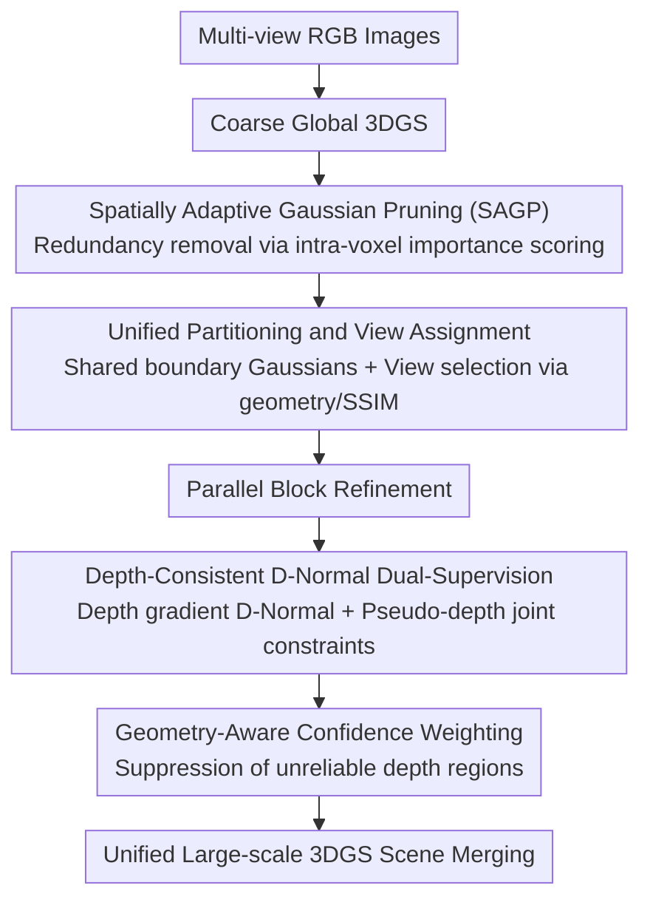

# UrbanGS: Efficient and Scalable Architecture for Geometrically Accurate Large-Scale Urban Gaussian Splatting

**Conference**: ICLR 2026  
**OpenReview**: [https://openreview.net/forum?id=L3utaw6SD9](https://openreview.net/forum?id=L3utaw6SD9)  
**Code**: Not yet public (promised on GitHub after acceptance)  
**Area**: 3D Vision  
**Keywords**: Gaussian Splatting, Large-scale scene reconstruction, Urban reconstruction, Depth-normal regularization, Adaptive pruning

## TL;DR
UrbanGS extends 3DGS to city-level scenes using a quartet of "depth-consistent D-Normal dual-supervised regularization + geometry-aware confidence weighting + spatially adaptive Gaussian pruning + unified partitioning." It surpasses methods like CityGaussian-v2 and VCR-GauS in rendering quality, geometric accuracy, and memory efficiency, while remaining runnable on a single A5000 without memory overflow.

## Background & Motivation

**Background**: 3D Gaussian Splatting (3DGS) represents scenes explicitly using a collection of anisotropic 3D Gaussian ellipsoids. Combined with a highly optimized rasterizer, it achieves high-quality, real-time novel view synthesis and has become the mainstream for bounded small-scene reconstruction. Extending it to city-scale large scenes is the natural next step, with methods like CityGaussian and VastGaussian enabling scalability through block-wise partitioning and parallel training.

**Limitations of Prior Work**: Directly scaling to city levels surfaces three concentrated issues. First, **geometric inaccuracy**—original 3DGS Gaussians are unstructured and struggle to fit surfaces precisely; supervising rendered normals with monocular normal priors can update rotation parameters but hardly affects position parameters, which are critical for surface reconstruction, leading to misaligned buildings and distorted streets. Second, **memory explosion**—3DGS creates excessive redundant Gaussians in homogeneous regions like the sky or distant building facades; simple global threshold pruning either oversimplifies local structures or misidentifies distant details. Third, **poor computational scalability**—existing partitioning schemes process many irrelevant views and produce geometric discontinuities (seams) at block boundaries. While CityGS-v2 introduced 2DGS to improve geometry, it sacrificed rendering quality.

**Key Challenge**: City-scale reconstruction essentially requires simultaneously winning in "geometric accuracy $\leftrightarrow$ memory efficiency $\leftrightarrow$ scalability." Current methods often solve one while exacerbating another, lacking a unified framework.

**Goal**: Construct a unified framework that simultaneously (a) optimizes all geometric parameters (position and rotation), (b) adaptively prunes redundant Gaussians based on local geometric complexity, and (c) seamlessly integrates partitioning and view assignment without seams.

**Key Insight**: The authors observe that instead of directly supervising rendered normals (which fails to update positions), it is better to derive a "D-Normal" from the **spatial gradient of the rendered depth** and supervise it with pseudo-normal priors. This ensures geometric constraints are intrinsically bound to depth, allowing position parameters to be effectively updated.

**Core Idea**: Use dual supervision of "D-Normal derived from depth gradients + pseudo-depth" to comprehensively update all Gaussian geometric parameters, combined with geometry-aware confidence weighting and spatially adaptive pruning to address accuracy, memory, and scalability at once.

## Method

### Overall Architecture

The UrbanGS training pipeline (Fig. 2a in the paper) follows a "coarse-to-fine, pruning followed by partitioning, parallel refinement then merging" workflow: starting with multi-view RGB images, a coarse global 3DGS is obtained. Then, **Spatially Adaptive Gaussian Pruning (SAGP)** removes redundant Gaussians to create a compact prior. The scene is then contracted and partitioned, maintaining shared Gaussians at boundaries to avoid seams. Views are assigned to Each block based on geometric and SSIM criteria. Blocks are **refined in parallel** using depth-consistent D-Normal dual-supervised regularization and geometry-aware confidence weighting. Finally, all blocks are merged into a unified large-scale 3DGS scene. The geometry module (D-Normal + confidence) ensures "accuracy," SAGP ensures "memory efficiency," and the partitioning strategy ensures "parallelism without seams."

### Key Designs

**1. Spatially Adaptive Gaussian Pruning (SAGP): Local geometric complexity-based pruning**

Urban scenes are highly heterogenous—foreground details require dense Gaussians, while distant views explode memory with redundancy. Traditional pruning uses global metrics or fixed opacity thresholds, which either oversimplify or mis-prune distant Gaussians. SAGP makes decisions within **local voxels**: it determines voxel side length $\ell = \lambda (V_{scene}/N)^{1/3}$ (with $\lambda=1.2$ for local stability), then calculates the $t$-th percentile ($t=90\%$) Gaussian volume $\vartheta_{local}^{(t)}$ within each voxel. Individual Gaussian volumes are normalized sub-linearly as $w_{v,i} = \big(\min(v_i/\vartheta_{local}^{(t)}, 1)\big)^{\kappa}$ ($\kappa=0.5$ to compress dynamic range and preserve fine scales). Finally, the importance score is the product of three normalized attributes:

$$S_i = \phi_i \cdot \tau_i \cdot w_{v,i}$$

where $\phi_i$ is the normalized ray intersection frequency (visibility), $\tau_i = \sigma(a_i)$ is the sigmoid-mapped opacity, and $w_{v,i}$ is the sub-linear volume weight. This multiplicative form ensures a Gaussian is kept only if it is visible, frequently observed, and geometrically appropriate, eliminating the need for manual weight tuning. This is the first pruning framework designed specifically for city-scale 3DGS.

**2. Unified Partitioning and View Assignment: Eliminating seams and irrelevant views**

This step improves upon the CityGS partitioning scheme by addressing boundary discontinuities and wasteful computation. Pruning with SAGP occurs at the global coarse level to prevent redundant Gaussians from attracting non-contributing views during refinement. During partitioning, shared Gaussian primitives are maintained at sub-block boundaries to avoid fusion artifacts. Views are assigned using geometric and SSIM criteria to ensure each block only processes relevant cameras.

**3. Depth-Consistent D-Normal Dual-Supervised Regularization: Updating position parameters**

This is the geometric core, targeting the inability to update position parameters via standard normal supervision. The authors derive a D-Normal from the **rendered depth map**: rendered depths are back-projected into point clouds $\{d_k(n,p)\}$, followed by horizontal and vertical finite differences. The cross product of these differences yields the depth normal:

$$N^d(n,p) = \frac{\nabla_v d(n,p) \times \nabla_h d(n,p)}{|\nabla_v d \times \nabla_h d|}$$

This is supervised by a pre-trained pseudo-normal prior $N$, forming the D-Normal regularization $L_{dn} = \|N^d - N\|_1 + (1 - N^d \cdot N)$. Since $N^d$ is derived from depth, supervising it establishes a geometric constraint bound to depth, allowing both rotation and position parameters to be updated. To ensure depth accuracy, a **pseudo-depth supervision** is added: using DepthAnything-v2 for dense relative depth, aligned to the reconstruction scale via COLMAP SfM points, and supervised using reciprocal depth loss $L_{id}(u,v) = |\hat{D}^{-1}(u,v) - D_{ext}^{-1}(u,v)|$ to balance sensitivity between near and far surfaces.

**4. Geometry-Aware Confidence Weighting: Suppressing unreliable multi-view depth**

Pseudo-depth can be inaccurate in certain regions. The authors use a geometry-aware confidence $w_d$ to weight the reciprocal depth loss per pixel, fused from two cues: the cosine similarity of depth gradients $\cos\phi = \frac{\nabla\hat{D}\cdot\nabla D_{ext}}{\|\nabla\hat{D}\|_2\|\nabla D_{ext}\|_2}$ (measuring local surface orientation consistency) and the normalized reciprocal depth deviation $\epsilon_d(u,v) = \frac{L_{id}(u,v)}{\text{median}(\hat{D}^{-1})}$. They are combined via exponential decay:

$$w_d = \exp\!\Big(\frac{\cos\phi - 1}{0.01}\Big) \cdot \exp\!\Big(\frac{-\epsilon_d}{0.1}\Big)$$

This ensures high weights only for pixels where gradients align and deviations are small, reinforcing robustness against depth errors.

### Loss & Training

The total objective is $L_{total} = L_{RGB} + \lambda_1 L_n + \lambda_2 L_{dn} + \lambda_3(w_d \cdot L_{id})$, where $L_{RGB}$ includes L1 + D-SSIM, $L_n$ is the standard normal supervision, $L_{dn}$ is the D-Normal regularization, and $L_{id}$ is the confidence-weighted reciprocal depth loss. Training was conducted on 8 RTX A5000 GPUs using PyTorch 2.0+ and Open3D 0.18.0+. Pseudo-priors were sourced from DepthAnything-v2 and Dsine. SAGP is applied **progressively** during training.

## Key Experimental Results

The dataset covers 7 scenes across 4 urban datasets: Mill-19 (Building/Rubble), UrbanScene3D (Residence/Sci-Art), and GauU-Scene (Residence/Russian/Modern Building).

### Main Results

Novel View Synthesis (Mill-19 + UrbanScene3D, selected metrics):

| Scene | Metric | UrbanGS | CityGaussian | CityGS-v2 |
|------|------|---------|--------------|-----------|
| Building | SSIM ↑ | **0.802** | 0.778 | 0.650 |
| Rubble | PSNR ↑ | **26.25** | 25.77 | 23.75 |
| Rubble | LPIPS ↓ | **0.210** | 0.228 | 0.322 |
| Residence | SSIM ↑ | **0.823** | 0.813 | 0.769 |

Surface Reconstruction (GauU-Scene, F1 Score):

| Scene | UrbanGS F1 ↑ | CityGS-X | CityGS-v2 | 2DGS |
|------|--------------|----------|-----------|------|
| Residence | **0.493** | 0.456 | 0.467 | 0.458 |
| Russian | **0.546** | 0.542 | 0.544 | 0.531 |
| Modern | **0.503** | 0.487 | 0.492 | 0.485 |

Efficiency and Memory (GauU-Scene):

| Scene | Method | PSNR ↑ | F1 ↑ | #GS(M) ↓ | Size(G) ↓ | Mem(G) ↓ |
|------|------|--------|------|----------|-----------|----------|
| Residence | CityGS | 23.17 | 0.453 | 8.05 | 0.44 | 31.5 |
| Residence | CityGS-v2 | 23.46 | 0.465 | 8.07 | 0.44 | 14.2 |
| Residence | **Ours** | **23.78** | **0.493** | **7.78** | **0.37** | **13.2** |
| Russian | **Ours** | **24.53** | **0.546** | **6.56** | **0.35** | **11.4** |

Training on Rubble took only 130 minutes, faster than 3DGS (190m), VastGS (185m), and CityGS-v2 (145m), while achieving the highest PSNR (26.52). VCR-GauS suffered from OOM on the A5000, whereas UrbanGS remained functional.

### Ablation Study

SAGP & Partitioning Ablation (Russian dataset):

| Config | PSNR ↑ | F1 ↑ | GS(M) ↓ | Time ↓ | Mem ↓ | Description |
|------|--------|------|---------|--------|-------|------|
| Baseline | 22.54 | 0.516 | 6.43 | 235 | OOM | No pruning/partitioning |
| +ST (Partitioning) | 24.68 | 0.543 | 6.37 | 188 | 26.3 | Our partitioning |
| +LP | 24.53 | 0.528 | 3.02 | 134 | 17.1 | LightGaussian pruning |
| +SAGP (Ours) | 24.66 | **0.546** | **2.45** | 122 | **14.4** | Highest F1, least GS |
| STPG | 24.57 | 0.536 | 2.73 | 119 | 13.9 | CityGS partitioning + SAGP |

Geometric Regularization Ablation (Modern Building):

| Config | PSNR ↑ | SSIM ↑ | LPIPS ↓ | F1 ↑ |
|------|--------|--------|---------|------|
| w/o D-Normal | 25.02 | 0.743 | 0.215 | 0.463 |
| w/o Depth Consistency | 24.59 | 0.792 | 0.201 | 0.453 |
| w/o Geometry-Aware Confidence | 26.02 | 0.795 | 0.163 | 0.493 |
| Full | **26.44** | **0.805** | **0.157** | **0.503** |

### Key Findings
- **SAGP is a win-win for memory and geometry**: Compared to LightGaussian (LP), SAGP reduces Gaussians from 3.02M to 2.45M and memory from 17.1G to 14.4G while increasing F1 from 0.528 to 0.546, proving that "pruning by local complexity" preserves structures better than global filtering.
- **Depth consistency is most critical**: Removing Depth Consistency dropped F1 from 0.503 to 0.453 (a 0.05 drop) and PSNR from 26.44 to 24.59, representing the most significant loss among geometric regularizations.
- **Our partitioning outperforms CityGS**: Using the same SAGP, our partitioning strategy yielded higher PSNR/SSIM/F1 than CityGS partitioning (STPG), validating that boundary sharing maintains better consistency.

## Highlights & Insights
- **Deriving D-Normal from depth gradients** is a clever indirect supervision: while direct normal supervision struggles to update positions, "attaching" the normal constraint to depth ensures position parameters are optimized—a minor change in the source that solves a major problem.
- **Using multiplication for importance scores** ($S_i = \phi_i \tau_i w_{v,i}$) naturally implements a "veto" semantic (if one metric is low, the score is low) and avoids weight tuning. This trick is transferable to any multi-criteria selection task.
- **Dual-exponential decay for confidence** unifies heterogeneous cues (directional consistency and magnitude deviation) into a $[0, 1]$ range, providing a reusable paradigm for handling unreliable pseudo-labels.
- **"Pruning-first" engineering insight**: Removing redundant Gaussians before partitioning prevents them from attracting irrelevant views, moving efficiency optimization upstream in the pipeline.

## Limitations & Future Work
- Geometric supervision relies heavily on external pseudo-prior quality (DepthAnything-v2, Dsine); confidence weighting can mitigate but not fully resolve errors in regions where these models fail.
- The dual supervision introduces several hyperparameters ($\lambda_1, \lambda_2, \lambda_3, \gamma_d, \tau, \lambda, t, \kappa$) that may require tuning across drastically different datasets.
- The partitioning strategy largely follows CityGS, with incremental innovations in "pruning-first" and boundary sharing.
- Evaluation is primarily on aerial datasets; generalization to street-level views, dynamic objects, or extreme lighting changes remains to be verified.

## Related Work & Insights
- **vs VCR-GauS**: Both use depth-normal regularization for surface reconstruction, but VCR-GauS is limited to medium scenes and OOMs on city scales; UrbanGS scales this via SAGP and dual supervision.
- **vs CityGaussian / CityGS-v2**: CityGS relies on block parallelism but has limited geometry and requires slow post-processing; CityGS-v2 improves geometry with 2DGS but loses rendering quality. UrbanGS matches or exceeds them in PSNR/SSIM/F1 with faster training.
- **vs CityGS-X**: CityGS-X focuses on system parallelism; UrbanGS achieves higher F1 on GauU-Scene scenes primarily by improving recall.
- **vs LightGaussian (LP)**: LP uses global metrics that may mis-prune distant urban Gaussians; SAGP's voxel-adaptive approach is more aggressive and accurate.

## Rating
- Novelty: ⭐⭐⭐⭐ D-Normal dual-supervision for position parameters + first city-scale SAGP; solid approach though some modules are evolutionary.
- Experimental Thoroughness: ⭐⭐⭐⭐ Covers 7 scenes, 4 datasets, and metrics across rendering, geometry, and efficiency.
- Writing Quality: ⭐⭐⭐⭐ Method descriptions and formulas are complete with clear motivations.
- Value: ⭐⭐⭐⭐ Provides a practical city-level reconstruction system balancing geometry, memory, and scalability.

<!-- RELATED:START -->

## Related Papers

- [\[ICLR 2026\] EgoNight: Towards Egocentric Vision Understanding at Night with a Challenging Benchmark](egonight_towards_egocentric_vision_understanding_at_night_with_a_challenging_ben.md)
- [\[ICLR 2026\] Signal Structure-Aware Gaussian Splatting for Large-Scale Scene Reconstruction](signal_structure-aware_gaussian_splatting_for_large-scale_scene_reconstruction.md)
- [\[ICLR 2026\] Fracture-GS: Dynamic Fracture Simulation with Physics-Integrated Gaussian Splatting](fracture-gs_dynamic_fracture_simulation_with_physics-integrated_gaussian_splatti.md)
- [\[ICLR 2026\] Open-Set Semantic Gaussian Splatting SLAM with Expandable Representation](open-set_semantic_gaussian_splatting_slam_with_expandable_representation.md)
- [\[ICLR 2026\] ReSplat: Degradation-agnostic Feed-forward Gaussian Splatting via Self-guided Residual Diffusion](resplat_degradation-agnostic_feed-forward_gaussian_splatting_via_self-guided_res.md)

<!-- RELATED:END -->
