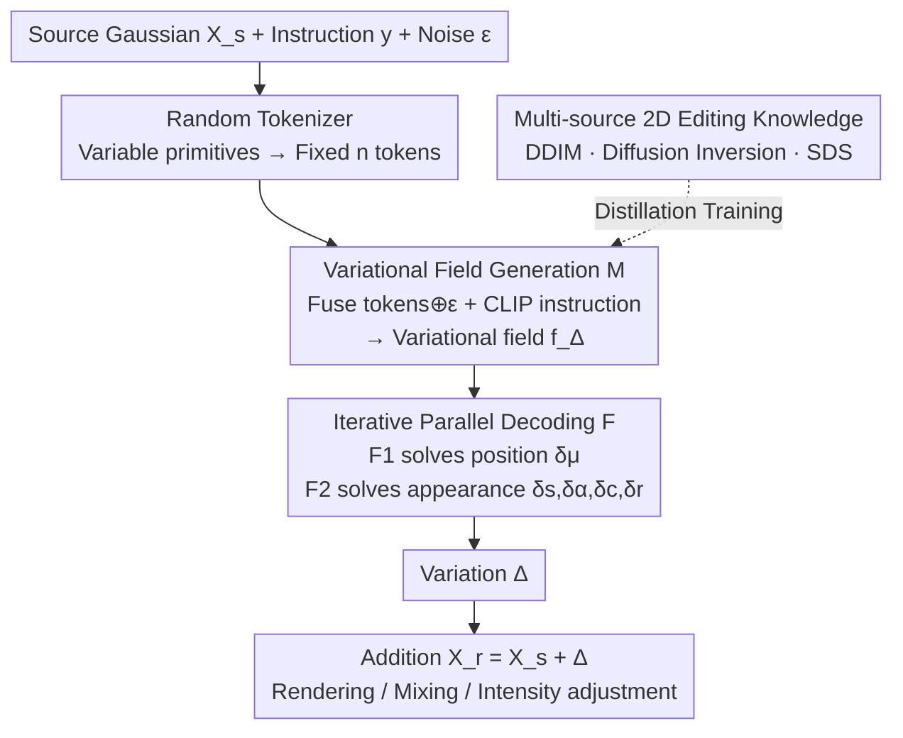

# Variation-Aware Flexible 3D Gaussian Editing

**Conference**: ICLR 2026  
**OpenReview**: [https://openreview.net/forum?id=N8PDzscNhg](https://openreview.net/forum?id=N8PDzscNhg)  
**Code**: None  
**Area**: 3D Vision  
**Keywords**: 3D Gaussian editing, Variational prediction, Knowledge distillation, Feed-forward editing, Multi-view consistency

## TL;DR
VF-Editor redefines 3D Gaussian editing as an "attribute-wise variational prediction" problem. By utilizing a feed-forward variational predictor distilled from multi-source 2D editing knowledge, it can natively edit an entire Gaussian field in approximately 0.3 seconds. This approach eliminates multi-view inconsistencies inherent in the "2D edit then 3D rebuild" paradigm while supporting flexible editing operations such as free mixing and intensity adjustment.

## Background & Motivation
**Background**: The current mainstream for text-based 3D Gaussian Splatting (3DGS) editing follows an "indirect editing" paradigm—first using 2D editors (e.g., IP2P) to edit multiple rendered views of a scene, then re-optimizing or rebuilding the 3D scene from these edited images (e.g., Instruct-NeRF2NeRF, GaussianEditor, DGE).

**Limitations of Prior Work**: This approach suffers from two unavoidable issues. First, 2D editors cannot guarantee consistency across different viewpoints, leading to multi-view conflicts in the 3D results (e.g., after changing an object to a red ball, its size may vary across views, causing 3D distortions). Second, each round of editing requires the full "2D edit + 3D rebuild" cycle, which is slow and disjointed, limiting editing flexibility and efficiency. Subsequent works attempted to mitigate inconsistency by swapping attention maps during 2D editing, but such "patches" do not address the root cause in black-box neural networks. Furthermore, flexible interaction between different editing rounds remains largely unexplored.

**Key Challenge**: The root cause of multi-view inconsistency is that 2D editors are essentially probability flow processes with naturally stochastic outputs. Suppressing this randomness to ensure consistency usually sacrifices the diversity of 3D editing results—consistency and diversity are opposed in indirect paradigms.

**Goal**: To train a **native** feed-forward 3D editor that directly outputs results in 3D space, bypassing the inconsistency-prone "2D edit $\to$ 3D rebuild" loop. The sub-problems include: (1) managing extreme scarcity of training data, making it impossible to train a feed-forward 3D editor via standard supervised learning; (2) solving the convergence difficulties of 3D editors that directly predict edited results.

**Key Insight**: 3DGS is an **explicit** representation where each primitive has well-defined attributes (position, scale, opacity, color, rotation). Instead of predicting "complete edited results," predicting the **variational amount** $\Delta$ for each attribute and adding it back to the original attributes significantly reduces the learning burden. Precise attribute-wise variations naturally allow for fine-grained control over editing regions and intensities, as well as the composition of multi-stage edits. Meanwhile, the vast amount of 2D editing priors can be distilled to fill the 3D data gap.

**Core Idea**: Redefine 3DGS editing as "feed-forward variational prediction." A variational predictor distills multi-source 2D editing knowledge into a single model. By **retaining** rather than suppressing the probability flow of 2D editing during distillation, the conflict between consistency and diversity is fundamentally resolved.

## Method

### Overall Architecture
The core of VF-Editor is a variational predictor $P_\theta$. Given a source 3D Gaussian field $\mathcal{X}^s$, an editing instruction $y$, and a noise sample $\varepsilon$ from a standard Gaussian distribution, $P_\theta$ outputs a set of variations $\Delta=\{\delta_\mu,\delta_s,\delta_\alpha,\delta_c,\delta_r\}$ across five attributes (mean/position, scale, opacity, color, rotation). The edited result is obtained via addition: $\mathcal{X}^r=\mathcal{X}^s+\Delta$. Inference takes approximately 0.3s.

The internal structure of $P_\theta$ consists of three modules: a **Random Tokenizer** $\mathcal{T}$ that compresses a variable number of Gaussian primitives into a fixed number of tokens; a **Variational Field Generation Module** $\mathcal{M}$ that fuses 3D tokens, critical noise $\varepsilon$, and CLIP-encoded instructions into a variational field $f_\Delta$; and an **Iterative Parallel Decoding Function** $\mathcal{F}$ that treats each Gaussian's attributes as a query and the variational field as a condition to solve for variations in parallel. During training, $P_\theta$ acquires editing capabilities by distilling knowledge from multi-source 2D editors/strategies (DDIM inference, diffusion inversion, SDS).

### Key Designs

**1. Variational Prediction Reformulation: From "Painting" to "Calculating Changes"**

Directly predicting full edited 3DGS is difficult to converge due to the coupling of five unstructured attributes. Utilizing the explicit nature of 3DGS, the task is redefined to predict the attribute variation $\Delta$ for each primitive: $P_\theta:(\mathcal{X}^s,y,\varepsilon)\to\Delta$, where $\mathcal{X}^r=\mathcal{X}^s+\Delta$. This has three benefits: the learning burden is lower as it models "increments"; it supports fine-grained control over intensity; and multiple $\Delta$ sets from different edits can be superimposed or scaled, providing the physical basis for "flexible editing."

**2. Random Tokenizer: Handling Arbitrary Numbers of Primitives**

Gaussian primitive counts vary across scenes, whereas Transformers require fixed-length inputs. The tokenizer selects $n$ primitives from $\mathcal{X}^s$ as anchors. For each anchor, the $k-1$ nearest data points form a group, resulting in $n$ 3D tokens of dimension $k \times f$. Crucially, it uses **random sampling** instead of Farthest Point Sampling (FPS) because Gaussian distributions are often non-uniform; random sampling provides a more reasonable anchor distribution. Implementation uses $n=256, k=128$, mapping tokens to 4096 dimensions via MLP.

**3. Variational Field Generation and Critical Noise Retention: Solving Inconsistency**

To solve the consistency-diversity conflict, the authors argue that multi-view inconsistency stems from the **probability flow** of 2D editors. Instead of suppressing this randomness, they **store** the potential outcomes of 2D editing within $P_\theta$ by **retaining** the probability flow during distillation. Specifically, critical noise $\varepsilon$ (highly correlated with the probability flow, e.g., initial noise in DDIM) is concatenated with 3D tokens and fed into $\mathcal{M}$. $\mathcal{M}$ uses Transformer blocks to inject CLIP-encoded instructions $y$ via cross-attention:

$$f_\Delta=\mathcal{M}(\mathcal{T}(\mathcal{X}^s)\oplus\varepsilon;\,y)$$

Because DDIM sampling is deterministic, the noise corresponds to a specific edited image. By using $\varepsilon$ as input and supervising with only a **single-view** edit, the model is forced to map "same noise + same instruction $\to$ same 3D variation," ensuring intrinsic consistency across views while preserving diversity through different noise samples.

**4. Iterative Parallel Decoding: Separating Geometry and Appearance**

The variational field is decoded primitive-wise in parallel using a function $\mathcal{F}$ implemented as a Transformer without self-attention. This ensures **linear** complexity relative to the number of primitives. "Iterative" means separating the mean $\mu$ (position) from other attributes and predicting them in two steps:

$$[\delta_\mu]=\mathcal{F}_1(\mathcal{X}^s_\mu,\mathcal{X}^s_\alpha,\mathcal{X}^s_s,\mathcal{X}^s_c,\mathcal{X}^s_r;f_\Delta)$$
$$[\delta_s,\delta_\alpha,\delta_c,\delta_r]=\mathcal{F}_2(\mathcal{X}^s_\mu+\delta_\mu,\mathcal{X}^s_\alpha,\mathcal{X}^s_s,\mathcal{X}^s_c,\mathcal{X}^s_r;f_\Delta)$$

This prevents the model from "cheating" by only changing colors to satisfy an instruction (e.g., "adding a hat") instead of moving or generating geometry. Decoding appearance based on updated positions forces the model to handle geometric displacement first. A "zero linear" layer at the end of $\mathcal{F}$ ensures the initial output is zero, providing cleaner gradients.

### Loss & Training
$P_\theta$ is trained by distilling multi-source 2D editing knowledge using three strategies:

- **DDIM Inference**: For RObj/GObj, IP2P edits rendered views to collect "initial noise–instruction–edited image" triplets. For scene data, CtrlColor is used for colorization tasks.
- **Diffusion Inversion**: DDPM inversion is used for "replacement" tasks. Only the final noise from the Gaussian distribution is kept as $\varepsilon$.

The primary distillation loss is the MSE between rendered results and 2D target images:

$$\mathcal{L}_{din}=\mathbb{E}_{\mathcal{X}^r}\left[d\big(R(\mathcal{X}^r),x_e\big)\right],\quad \mathcal{X}^r=P_\theta(\mathcal{X}^s,y,\varepsilon)+\mathcal{X}^s$$

where $R$ is differentiable rasterization and $x_e$ is the target 2D edited image.

- **SDS (Score Distillation Sampling)**: $\mathcal{L}_{sds}$ can also be used as a robust baseline for generalization without offline triplets, though it can lead to mode collapse.

Implementation: $\mathcal{L}_{din}$ was trained for 52 hours on 4×A100 (batch 16); $\mathcal{L}_{sds}$ for 90 hours on a single A100 (batch 32). Total data: ~3,348 3D-instruction pairs, 32,566 triplets.

## Key Experimental Results

### Main Results
Evaluation on Reconstructed Objects (RObj), Generated Objects (GObj), and Scenes compared against I-gs2gs, GaussianEditor, and DGE. Metrics: Inception Score (IS), CLIP Direction Similarity (Csim), CLIP Direction Consistency (Ccon), and Image Aesthetic Assessment (IAA).

| Method | RObj IS↑ | RObj Csim↑ | GObj IS↑ | Scene IS↑ | IAA↑ |
|------|----------|-----------|----------|-----------|------|
| I-gs2gs | 3.86 | 0.193 | 3.51 | 3.37 | 4.74 |
| GaussianEditor | 3.25 | 0.261 | 3.19 | 3.65 | 4.89 |
| DGE | 3.10 | 0.252 | 2.95 | 3.54 | 5.05 |
| **VF-Editor-M** | **4.32** | 0.296 | 4.15 | **4.06** | **5.24** |
| **VF-Editor-S** | 4.31 | **0.292** | **4.24** | 4.04 | 5.19 |

VF-Editor leads significantly in IS. While DGE achieves high Csim/Ccon due to cross-view constraints, its IS is low, indicating a suppression of diversity. VF-Editor preserves quality and diversity simultaneously.

### Ablation Study

| Config | IS↑ | Csim↑ | Ccon↑ | IAA↑ | Note |
|------|-----|-------|-------|------|------|
| Direct Decoding | 4.71 | 0.254 | 0.801 | 5.21 | Simultaneous 5-attribute decoding |
| Triplane | 4.57 | 0.246 | 0.782 | 5.09 | Variational field as triplane |
| **VF-Editor-M** | 4.66 | **0.259** | **0.803** | **5.22** | Iterative parallel decoding |

### Key Findings
- **Iterative decoding saves "Geometric Change" instructions**: Without it, the model tends to change color instead of moving primitives for instructions like "wearing a party hat."
- **Triplanes blur variations**: Triplane-based fields result in blurred boundaries and artifacts as neighboring primitives share similar features. Primitive-wise parallel decoding allows for finer variations.
- **Multimodal data does not hinder convergence**: Multi-domain training (RObj, GObj, Scene) converges as well as single-domain training, validating model versatility.

## Highlights & Insights
- **"Retaining Probability Flow" is a counter-intuitive breakthrough**: Instead of fighting 2D randomness, incorporating noise into the 3D model allows consistency to be derived from deterministic mapping while preserving diversity.
- **Variational (incremental) Modeling is Transferable**: Predicting increments on explicit representations reduces learning difficulty and makes results naturally composable.
- **Attribute Decoupling Priority**: Solving geometry before appearance prevents the "lazy model" effect in multi-attribute coupled tasks.

## Limitations & Future Work
- **OOD (Out-of-Distribution) Limitations**: The model struggles with editing types significantly different from the training triplets (~3.3k pairs).
- **SDS Fusion Difficulty**: $\mathcal{L}_{sds}$ tends to cause mode collapse when used alone and can be unstable when combined with $\mathcal{L}_{din}$.
- **Side-effects of Movement**: Repositioning existing primitives can occasionally affect neighboring regions. Future work may include a dedicated primitive generation branch.

## Related Work & Insights
- **vs. Indirect Editing (Instruct-NeRF2NeRF/DGE)**: These require 2D turns and 3D rebuilds; VF-Editor is natively 3D, feed-forward, and ~0.3s per edit. 
- **vs. Single-type 3D Editors**: VF-Editor supports a wide range of instructions (color, style, replacement, detail) rather than just color or object addition.
- **vs. Native 3D Diffusion (3D-LATTE)**: These are limited by the distribution of pre-trained 3D generators; VF-Editor leverages mature 2D editing priors.

## Rating
- Novelty: ⭐⭐⭐⭐⭐ Redefining 3DGS editing as variational prediction and solving consistency via noise retention is a highly original feed-forward approach.
- Experimental Thoroughness: ⭐⭐⭐⭐ Solid results across three data types and detailed ablations, though lacks large-scale user studies.
- Writing Quality: ⭐⭐⭐⭐ Clear motivation and architecture, though some notations require close attention to diagrams.
- Value: ⭐⭐⭐⭐ Strong potential for real-time applications in VR/Gaming; the variational modeling approach is highly transferable.

<!-- RELATED:START -->

## Related Papers

- [\[ICLR 2026\] MAVEN: A Mesh-Aware Volumetric Encoding Network for Simulating 3D Flexible Deformation](maven_a_mesh-aware_volumetric_encoding_network_for_simulating_3d_flexible_deform.md)
- [\[CVPR 2025\] Perturb-and-Revise: Flexible 3D Editing with Generative Trajectories](../../CVPR2025/3d_vision/perturb-and-revise_flexible_3d_editing_with_generative_trajectories.md)
- [\[CVPR 2026\] ObjectMorpher: 3D-Aware Image Editing via Deformable 3DGS](../../CVPR2026/3d_vision/objectmorpher_3d-aware_image_editing_via_deformable_3dgs.md)
- [\[ICLR 2026\] Gradient-Direction-Aware Density Control for 3D Gaussian Splatting](gradient-direction-aware_density_control_for_3d_gaussian_splatting.md)
- [\[ICLR 2026\] Frequency-Aware Dynamic Gaussian Splatting](frequency-aware_dynamic_gaussian_splatting.md)

<!-- RELATED:END -->
