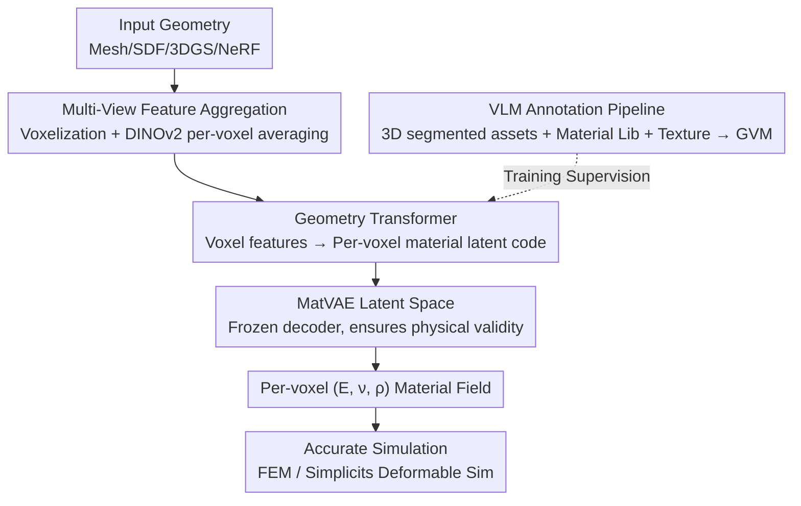

# VoMP: Predicting Volumetric Mechanical Property Fields

**Conference**: ICLR 2026  
**OpenReview**: [https://openreview.net/forum?id=aTP1IM6alo](https://openreview.net/forum?id=aTP1IM6alo)  
**Paper**: [NVIDIA Project Page](https://research.nvidia.com/labs/sil/projects/vomp)  
**Code**: Not yet public (Project Page: research.nvidia.com/labs/sil/projects/vomp)  
**Area**: 3D Vision / Material Prediction for Physical Simulation  
**Keywords**: Volumetric material prediction, Young's modulus, Feed-forward inference, Material latent space, Multi-view feature aggregation

## TL;DR
VoMP is the first feed-forward method to predict **internal** volumetric mechanical material fields (Young's modulus $E$, Poisson's ratio $\nu$, density $\rho$) for 3D objects. It aggregates multi-view DINOv2 features per voxel for any voxelizable and renderable 3D representation (Mesh / Gaussian Splatting / NeRF / SDF), predicts per-voxel material latent codes via a Geometry Transformer, and decodes them into real physical triplets using a MatVAE constrained on a "physics-feasible material manifold." It generates simulation-ready materials within seconds, significantly outperforming previous methods in both accuracy and speed.

## Background & Motivation
**Background**: Physical simulation (Digital Twins, Real-2-Sim, Sim-2-Real) requires assigning accurate mechanical material parameters to **every point** of an object. In local isotropic material models, the most common parameters are the triplet of Young’s modulus $E$, Poisson’s ratio $\nu$, and density $\rho$. However, common 3D acquisition methods (like Gaussian Splatting) and 3D asset libraries almost never include such annotations.

**Limitations of Prior Work**: Currently, artists or engineers manually "guess" parameters or apply crude material presets, which is subjective and time-consuming. Existing learning-based methods have major drawbacks: NeRF2Physics and PUGS require **per-object optimization** (optimizing language-embedded feature fields), which is slow, and they lack meaningful features inside NeRF/Splatting to predict **internal** materials. Another category distills signals from video generation models and backpropagates through fast approximate simulators to optimize materials; however, these results are **simulator-specific** parameters that are non-portable across frameworks and often deviate from true physical values. Others only output **coarse material categories** that require manual mapping to simulation parameters.

**Key Challenge**: Prior methods are either slow (per-object optimization), surface-only (missing internal features), or output simulator-specific/categorical approximations rather than true portable physical materials. No previous method has simultaneously achieved being feed-forward, cross-representation, volumetric, and physically valid.

**Goal**: To train a feed-forward model that takes any voxelizable and renderable 3D geometry as input and directly outputs **volumetric**, **physically valid** real material triplets $(E, \nu, \rho)$ that are compatible with any high-precision simulator.

**Key Insight**: The authors decouple the problem into two orthogonal tasks: "learning what materials are legal" and "learning how to assign materials throughout an object." The former uses a VAE (MatVAE) trained on real measured materials to compress legal materials into a low-dimensional latent space, ensuring any output (even interpolated points) falls within the range of real materials. The latter employs a 3D Transformer to perform per-voxel regression within this latent space.

**Core Idea**: Use a **material latent space (MatVAE) as a continuous tokenizer to guarantee physical validity**, and employ **multi-view features + Geometry Transformer for feed-forward per-voxel material latent code prediction**, thereby decoupling "material legality" from "material assignment."

## Method

### Overall Architecture
The input to VoMP is any 3D geometry (Mesh, SDF, 3D Gaussian Splatting, NeRF) that can be voxelized and rendered from surrounding views. The output is a volumetric mechanical material triplet $(E, \nu, \rho)$ for each voxel **inside and on the surface** of the geometry, which can be directly fed into high-precision simulators (e.g., high-resolution FEM) for deformable simulation. The pipeline consists of three steps: first, voxelize the geometry and "lift" multi-view DINOv2 image features to each voxel (including internal ones); second, use a Geometry Transformer to map these voxel features to per-voxel material latent codes; finally, use a **frozen** MatVAE decoder to decode these codes into real material triplets. MatVAE is pre-trained independently on a dataset of real measured materials to learn a 2D latent space of "legal materials." During Transformer training, only its frozen decoder is used to isolate "legality" from "assignment."

### Key Designs

**1. MatVAE Material Latent Space: Using "Physical Legality" as a continuous tokenized safeguard**

The most difficult pain point is that direct regression of $(E, \nu, \rho)$ cannot guarantee that the results represent physically existing materials; interpolated values might be physically impossible. VoMP's solution is to train a MatVAE on a dataset of real measured materials, mapping the triplet $(E, \nu, \rho) \in \mathbb{R}^3$ to a 2D latent space $z \in \mathbb{R}^2$ and then reconstructing it. While the compression from $\mathbb{R}^3 \to \mathbb{R}^2$ is high, this 2D space is easy to visualize, sample, and interpolate, and it provides a consistent "distance" between triplets with vastly different units. Crucially, it acts as a **continuous tokenizer**, ensuring any VoMP output remains within the distribution of real materials. The reconstruction loss is normalized MSE (where $E$ and $\rho$ are $\log_{10}$ transformed then normalized to $[0, 1]$, and $\nu$ is normalized directly). The authors found that omitting the log transformation results in heavy-tailed distributions that hinder learning.

Three specific modifications were made to the standard VAE: first, the encoder output passes through a radial Normalizing Flow to obtain a more flexible posterior $q_\phi(z \mid m)$, handling complex distributions where $\nu$ is pushed to boundaries. Second, the Total Correlation $\mathrm{TC}(z) = \mathrm{KL}(\bar q_\phi(z) \,\|\, \prod_j \bar q_\phi(z_j))$ is explicitly penalized to resolve the strong coupling where "density is encoded in both dimensions." Third, a capacity constraint based on free-nats $\delta \times z_{\dim}$ is added to force both latent dimensions to be utilized, preventing latent space collapse. The final objective is:
$$\mathcal{L}_{\text{MatVAE}} = \mathcal{L}_{\text{Recon}} + \gamma \cdot \mathrm{MI}(z) + \beta \cdot \mathrm{TC}(z) + \alpha \sum_{j=1}^{d} \max\big(\delta, \, \mathrm{KL}(q_\phi(z_j) \,\|\, p(z_j))\big),$$
where $(\gamma, \beta, \alpha) = (1.0, 2.0, 1.0)$ and $\delta = 0.1$.

**2. Multi-view Feature Aggregation: Lifting image features to internal voxels**

To predict materials **inside** an object, features cannot be extracted solely from the surface. VoMP voxelizes the input geometry and, for each active voxel center $p_i$ in an $N^3$ grid, projects it via $\Pi_j$ onto each rendered view. It bilinearly samples features from the corresponding DINOv2 patch-token feature maps $F_j$ and averages them across all views:
$$f_i = \mathrm{Average}\Big(\big\{F_j(\Pi_j(p_i)) \mid j \in J\big\}\Big) \in \mathbb{R}^{1024}.$$
Unlike prior works (Wang, Dutt, Xiang, etc.) that only process surfaces, VoMP **voxelizes and processes the object's interior**. This allows multi-view information to propagate to internal voxels, providing signals for the model to learn the internal material composition. For representations like Gaussian Splatting that are difficult to voxelize, the authors propose a three-stage voxelizer: first, voxels are created by treating Gaussians as solid ellipsoids at the 99th percentile; then, depth maps are rendered from dozens of views; finally, depth maps are used to "carve" away external empty voxels while preserving invisible internal voxels, resulting in a solid approximation.

**3. Geometry Transformer: Feed-forward per-voxel regression in material latent space**

The core network $\mathcal{F}$ is a Transformer that maps voxelized image features to MatVAE material latent representations. The backbone follows TRELLIS's encoder/decoder and uses its weights for initialization. The encoder processes a variable-length set of active voxels $X = \{(p_i, f_i)\}_{i=1}^L$: voxel features are serialized, spatial awareness is injected via sinusoidal position embeddings derived from 3D coordinates, and 3D shifted window attention is utilized. To handle assets of different sizes, a maximum sequence length $L_N$ (32768 in experiments) is set. If $L \le L_N$, the full set is used; if $L > L_N$, a set of $L_N$ voxels is **randomly resampled** at the start of each epoch, allowing the model to see different parts of the asset across epochs and effectively increasing the voxel capacity. Per-voxel latent codes are fed into the **frozen** MatVAE decoder to obtain $(E, \nu, \rho)$. Training uses the MSE between predicted and ground-truth materials (averaged over the current voxel set $S$):
$$\mathcal{L}_{\mathcal{F}} = \frac{1}{|S|} \sum_{i \in S} \big\| \mu_\theta(\mathcal{F}(X_S)_i) - ((E_i, \nu_i, \rho_i)_N)^{T} \big\|_2^2,$$
where $\mu_\theta$ is the frozen MatVAE decoder. During inference, voxel materials are mapped back to the original representation (Splatting means / FEM tetrahedra / quadrature points) via nearest-neighbor interpolation.

**4. VLM + Multi-source Knowledge Annotation Pipeline: Solving the "absence of volumetric data"**

A major hurdle for training the Geometry Transformer is the lack of 3D datasets with internal material annotations. The authors constructed two datasets: MTD (Material Triplet Dataset) collects 100,562 real measured triplets from various online databases (sampled proportionally to material ranges, then deduplicated) specifically for MatVAE. GVM (Geometry with Volumetric Materials) uses an automated pipeline to annotate 3D assets, collecting 1,624 high-quality meshes with **part-level segmentation** (8,089 parts total, each treated as an isotropic material with English names and real PBR textures). For each part, the input to the VLM (Qwen 2.5-VL-72B) includes not just full-object renders, but also detail renders of the part's visual material mapped onto a sphere, the material name, and the value ranges of the three closest real materials retrieved from MTD by name. Thus, the VLM is **constrained by real material values and multi-source cues** rather than guessing blindly. This results in 37 million annotated voxels with $(E, \nu, \rho)$, making it significantly more accurate and physically credible than baselines like Phys4DGen's "naked VLM aggregation."

### Loss & Training
MatVAE uses $\mathcal{L}_{\text{MatVAE}}$ from Eq. (2). The Geometry Transformer uses per-voxel material MSE from Eq. (4), with the MatVAE decoder frozen throughout. MTD and GVM are split 80-10-10 for train/val/test. Rendering uses Omniverse + Blender, and DINOv2 uses an optimized implementation. Experiments were conducted on 4×80GB A100s; MatVAE training took ~12 hours, while the Transformer took ~5 days.

## Key Experimental Results

### Main Results (Material Estimation Accuracy on GVM Benchmark)
The GVM test set contains 166 high-quality 3D objects with approximately 4.9 million point-level annotations, much larger than previous sets (e.g., NeRF2Physics has 11 objects and 31 points). Metrics used are ALDE / ALRE / ADE / ARE for each attribute (lower is better).

| Method | $E$ ALDE↓ | $E$ ALRE↓ | $\nu$ ARE↓ | $\rho$ ADE↓ | $\rho$ ARE↓ |
| :--- | :--- | :--- | :--- | :--- | :--- |
| NeRF2Physics | 2.80 | 0.135 | — | 1432.0 | 1.037 |
| PUGS | 3.39 | 0.169 | — | 3568.2 | 3.243 |
| Phys4DGen⋆ | 4.90 | 0.223 | 0.147 | 1865.6 | 1.439 |
| **VoMP (Ours)** | **0.379** | **0.041** | **0.082** | **142.7** | **0.092** |

Based on simulation probes (§D.4), the authors suggest thresholds: ALRE < 0.05 for $E$ and ARE < 0.15 for other attributes yield similar simulation results. VoMP's $E$ ALRE = 0.041 crosses this threshold, meaning it produces more faithful simulations under accurate simulators. NeRF2Physics and PUGS do not even output Poisson's ratio $\nu$.

### Inference Time Comparison (Single A100 + 64 CPU, average of 100 runs, ~53.9K Gaussians/object)

| Method | End-to-End Time (s) |
| :--- | :--- |
| NeRF2Physics | 1454.55 |
| PUGS | 1058.33 |
| Pixie (Concurrent) | 201.63 |
| Phys4DGen⋆ | 51.65 |
| **VoMP (Ours)** | **3.59** |

VoMP time breakdown: Rendering 2.11s, DINOv2 calculation 0.86s, DINOv2 reconstruction 0.58s, voxelization 0.03s, while Geometry Transformer is only 0.008s and MatVAE is only 0.0003s. The bottlenecks are entirely in rendering and preprocessing; pure network inference is nearly free. Overall, it is 5–100× faster than competitors because it is the only pure feed-forward method (no per-object optimization).

### Key Findings
- **Physical Validity by Design**: By measuring the "relative error between the output and the nearest real material range" on MTD, VoMP's outputs are much closer to real materials than baselines because they are explicitly constrained to the MatVAE material manifold.
- **Minimal Network Bottleneck**: Transformer + MatVAE total < 9ms. The total time of a few seconds is almost entirely spent on rendering and DINOv2, proving that the feed-forward paradigm makes material computation nearly real-time.
- **Cross-Representation Generalization**: The same model handles Mesh, SDF, 3DGS, and NeRF, qualitatively driving realistic simulations like multi-object drops and deformable collisions without manual tuning.
- **Sources of Quality Gain**: Baseline failures often stem from occasional mislabeling of parts (Phys4DGen), noisy estimation (NeRF2Physics/PUGS), and inaccurate internal estimation. VoMP's volumetric voxelization + latent space safeguard directly address these weaknesses.

## Highlights & Insights
- **Decoupling "Legality" and "Assignment"**: Using an independently pre-trained, frozen-at-inference MatVAE as a continuous tokenizer isolates the hard constraint of "output must be a real material" from the main network. This idea is transferable to any task where regression values must fall within a legal physical/semantic manifold (e.g., reflectance, BRDF, thermal parameters).
- **Internal Voxelization as the Differentiator**: Previous multi-view feature lifting only covered surfaces. VoMP's insistence on voxelizing the interior and "filling" it with averaged multi-view features is why it can predict volumetric materials rather than just applying surface labels.
- **VLM with Numerical Guardrails**: Feeding the VLM real material value ranges from MTD alongside spherical texture renders provides physical guardrails against hallucinations—far more robust than relying on raw VLM part labeling.
- **Leveraging TRELLIS Backbone + Random Resampling**: Initializing with TRELLIS weights saves training costs, while epoch-level random resampling enables the model to handle large assets within voxel limits, a practical engineering solution for varied 3D assets.

## Limitations & Future Work
- **Dependence on Rendering/Voxelization Quality**: The bottleneck is rendering and DINOv2 preprocessing (the vast majority of time). Objects that cannot be well-rendered or voxelized are problematic; Gaussian Splatting requires a specialized three-stage voxelizer.
- **Part-level Isotropic Assumption**: GVM annotations treat each part as a single isotropic material, making it difficult to represent continuous gradients or anisotropic materials within a part.
- **VLM Annotation Ceiling**: Training supervision comes from VLM (even with numerical constraints); precision is capped by the VLM and the coverage of the material library. Subsets like vegetation are not yet available.
- **Data/Code Accessibility**: Training relies on high-quality internal NVIDIA assets, some of which are not public, making reproduction difficult. Code has not yet been released.
- **Future Directions**: Further optimizing rendering/feature extraction for real-time performance; supporting anisotropy and continuous internal material fields; exploring the back-propagation of simulation feedback into material prediction.

## Related Work & Insights
- **vs NeRF2Physics / PUGS**: These optimize language-embedded feature fields for coarse stiffness/density, which is slow and fails to predict internal materials due to lack of internal NeRF/Splatting features; VoMP is feed-forward, volumetric, outputs full triplets, and is 300–400× faster with superior accuracy.
- **vs Phys4DGen**: Directly aggregates VLM predictions, leading to mislabeling and high noise; VoMP uses VLM only for **offline dataset annotation** with physical constraints, then trains a feed-forward model that no longer relies on fragile VLM aggregation at runtime.
- **vs PhysSplat / Video Distillation**: These predict simulator-specific material offset weights, which are non-portable across frameworks; VoMP outputs real measured units $(E, \nu, \rho)$, compatible with any accurate simulator and constitutive models (Neo-Hookean, StVK, Co-Rotated, etc.).
- **vs Pixie (Concurrent feed-forward)**: Pixie uses points filtered by NeRF density from semantic segmentation, biasing toward surfaces, and its preprocessing includes per-object optimization; VoMP’s voxelization captures internal structures and is end-to-end faster with a focus on physical feasibility.
- **vs SOPHY / PhysX-3D (Generative)**: These generate new shapes with physical properties rather than enhancing existing ones; VoMP treats material prediction as deterministic inference to enrich existing 3D assets.

## Rating
- Novelty: ⭐⭐⭐⭐⭐ First feed-forward, cross-representation, volumetric, physically valid mechanical material field prediction method; introduces the material latent space.
- Experimental Thoroughness: ⭐⭐⭐⭐⭐ New 4.9M point-level benchmark + multi-dimensional evaluation (speed/accuracy/validity/quality), dominating prior work.
- Writing Quality: ⭐⭐⭐⭐ Clear decoupling of motivation and design, though some core results (figures) are referenced by number, requiring cross-referencing.
- Value: ⭐⭐⭐⭐⭐ Reduces "assigning simulation materials to 3D assets" from hours of manual work to seconds of feed-forward inference; high practical value for Digital Twin/Real-2-Sim pipelines.

<!-- RELATED:START -->

## Related Papers

- [\[ICML 2026\] Adaptive Volumetric Mechanical Property Fields Invariant to Resolution](../../ICML2026/3d_vision/adaptive_volumetric_mechanical_property_fields_invariant_to_resolution.md)
- [\[ICLR 2026\] EgoNight: Towards Egocentric Vision Understanding at Night with a Challenging Benchmark](egonight_towards_egocentric_vision_understanding_at_night_with_a_challenging_ben.md)
- [\[ICLR 2026\] Splat the Net: Radiance Fields with Splattable Neural Primitives](splat_the_net_radiance_fields_with_splattable_neural_primitives.md)
- [\[ICLR 2026\] Einstein Fields: A Neural Perspective To Computational General Relativity](einstein_fields_a_neural_perspective_to_computational_general_relativity.md)
- [\[ICLR 2026\] MAVEN: A Mesh-Aware Volumetric Encoding Network for Simulating 3D Flexible Deformation](maven_a_mesh-aware_volumetric_encoding_network_for_simulating_3d_flexible_deform.md)

<!-- RELATED:END -->
