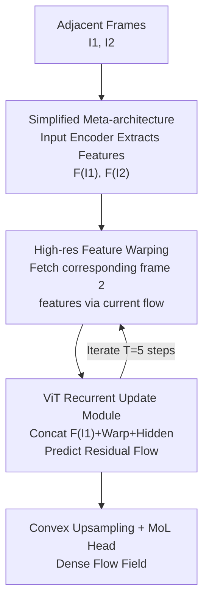

# WAFT: Warping-Alone Field Transforms for Optical Flow

**Conference**: ICLR 2026  
**OpenReview**: [https://openreview.net/forum?id=HTqGE0KcuF](https://openreview.net/forum?id=HTqGE0KcuF)  
**Code**: https://github.com/princeton-vl/WAFT  
**Area**: 3D Vision / Optical Flow  
**Keywords**: Optical Flow Estimation, Feature Warping, Cost Volume, Iterative Update, Meta-architecture

## TL;DR
WAFT completely replaces the standard cost volume in optical flow methods with high-resolution feature warping. By utilizing a DPT/ViT iterative update module to implicitly handle large displacements, it achieves top-tier accuracy on Spring, Sintel, and KITTI while consuming only 1/3 of the VRAM and being 1.3–4.1 times faster than comparable methods.

## Background & Motivation
**Background**: The mainstream optical flow paradigm is "cost volume + iterative update" (e.g., RAFT, SEA-RAFT, FlowFormer). Cost volumes explicitly compute visual similarity between each pixel in frame 1 and a neighborhood in frame 2. They are considered stronger representations than raw image features, especially for modeling large displacements, and serve as the core component of most SOTA methods.

**Limitations of Prior Work**: Cost volumes are expensive in terms of time and memory, with costs growing quadratically with the neighborhood radius. Even using a partial cost volume to avoid the full 4D structure, memory usage remains high—SEA-RAFT reportedly triggers OOM at 1/2 resolution. To remain functional, almost all methods are forced to build and query cost volumes at 1/8 resolution.

**Key Challenge**: High memory consumption of cost volumes forces indexing at low resolutions; however, predicted dense flow fields must be downsampled to 1/8 for cost volume lookups. This downsampling inevitably introduces errors, leading to blurred object boundaries (as shown in Figure 3 of the paper, where existing methods exhibit blurriness at corners). Accuracy and efficiency are strictly bottlenecked by the cost volume.

**Goal**: To achieve SOTA accuracy, clear boundaries from high-resolution indexing, and low memory/high speed without constructing a cost volume.

**Key Insight**: The authors revisit the warping operation, which has been neglected for about 8 years. Warping does not compute similarity; it simply "fetches the corresponding feature vector from frame 2 according to the current flow estimate." It is inherently cheap and memory-friendly, allowing direct indexing at high resolutions. Its only drawback is the loss of the cost volume's ability to explicitly model large displacements—a task that can be handled implicitly by the attention mechanism of a ViT.

**Core Idea**: Replace "low-resolution cost volume + iterative update" with "high-resolution feature warping + ViT iterative update," while removing the context encoder to obtain a minimalist meta-architecture with almost no flow-specific designs.

## Method

### Overall Architecture
WAFT follows the "input encoding + recurrent update" skeleton of the RAFT family but replaces the internal cost volume with warping. Given adjacent frames $I_1, I_2 \in \mathbb{R}^{H\times W\times 3}$, an input encoder extracts features $F(I_1)$ and $F(I_2)$. A recurrent update module then refines the flow over $T$ iterations ($T=5$ for both training/inference). The key action in each step is: use the current flow estimate $f_{cur}$ to perform lightweight backward warping on frame 2 features, $\text{Warp}(f_{cur})_p = F(I_2)_{p+(f_{cur})_p}$. This "pulls" the corresponding features back to the frame 1 coordinate system, which are then concatenated with $F(I_1)$ and the hidden state to feed the update module for residual flow prediction. The entire pipeline contains no cost volume, enabling indexing at high resolutions such as 1/2.

### Key Designs

**1. High-resolution feature warping instead of cost volume: Replacing expensive similarity calculations with cheap feature fetching**

This is the core of the paper, addressing the conflict where "cost volumes force low-resolution indexing, which blurs boundaries." Cost volumes require computing dot-product similarities $V_{p,p'}=F(I_1)_p\cdot F(I_2)_{p'}$ for every pixel in frame 1 against a neighborhood in frame 2, with costs exploding quadratically. Warping only fetches one vector—directly indexing the feature at the corresponding position in frame 2: $\text{Warp}(f_{cur})_p=F(I_2)_{p+(f_{cur})_p}$. Both use the current flow estimate to index feature maps, consistent with classical fixed-point optimization; the difference is that warping abandons explicit similarity enumeration. This reduction in cost yields significant gains: WAFT-Twins-a2 uses only 9.2 GiB of training VRAM at 1/2 resolution, while SEA-RAFT OOMs. The saved memory is used for high-resolution indexing, providing sharper boundaries and lower errors. Lowering the indexing from 1/2 to 1/8 causes the Spring 1px metric to degrade from 1.43 to 1.82, confirming that high-resolution indexing, rather than just backbone scaling, drives accuracy.

**2. ViT/DPT recurrent update module: Using attention to recover large-displacement modeling lost by warping**

Warping only looks at a single corresponding pixel and cannot explicitly cover large displacements like a cost volume. WAFT solves this by replacing the update module with a modified DPT (based on ViT), relying on the long-range dependencies of the attention mechanism to implicitly model large displacements. Each step concatenates frame 1 features $F(I_1)$, warped frame 2 features $\text{Warp}(f_{cur})$, and the hidden state $\text{Hidden}_t\in\mathbb{R}^{h\times w\times d}$ as input. This transformer design is proved to be the key to making warping work again: replacing DPT with a pure CNN (ResNet18) causes Sintel (Clean) error to jump from 1.18 to 7.23, and ConvGRU drops it to 2.79. This explains why early warping-based CNN methods (FlowNet2, SpyNet) circa 2017 were outperformed by cost volume methods: it was not warping that failed, but the lack of architectures capable of long-range dependency modeling.

**3. Minimalist meta-architecture: Removing the context encoder and reusing off-the-shelf pre-trained backbones**

After removing the cost volume, the authors also discard the context encoder (which provides auxiliary features to the update module). Ablations show it adds computation with negligible accuracy gains. Consequently, WAFT simplifies into a clean "input encoder + update unit" meta-architecture. Since neither submodule requires flow-specific designs, off-the-shelf pre-trained models can be used: the authors evaluated ImageNet-pre-trained Twins, depth-pre-trained DAv2, and self-supervised DINOv3. Two adaptation methods are provided: a1 freezes the DAv2 backbone with a fine-tuned DPT head/ResNet18, while a2 freezes only the backbone and allows side-tuning of the DPT head and three ResNet blocks. This "no custom design + standard pre-trained weights" approach improves generalization and allows for a fair comparison between direct and iterative methods.

### Loss & Training
The prediction head utilizes the Mixture-of-Laplace (MoL) loss from SEA-RAFT: hidden states predict MoL parameters $M\in\mathbb{R}^{h\times w\times 6}$, which are restored to original resolution via convex upsampling. The training follows the SEA-RAFT pipeline: pre-training on TartanAir for 300k steps (batch 32, lr $4\times10^{-4}$), fine-tuning on FlyingChairs (50k) and FlyingThings (200k), and finally dataset-specific fine-tuning for benchmarks.

## Key Experimental Results

### Main Results
Spring Benchmark (540p protocol, lower is better except WAUC):

| Method | 1px↓ | EPE↓ | Fl↓ | WAUC↑ |
|------|------|------|-----|-------|
| SEA-RAFT(M) | 3.686 | 0.363 | 1.347 | 94.534 |
| DPFlow | 3.442 | 0.340 | 1.311 | 94.980 |
| WAFT-Twins-a2 | 3.268 | 0.331 | 1.282 | 94.786 |
| **WAFT-DINOv3-a2** | **3.182** | 0.325 | 1.246 | **95.051** |

Sintel(EPE)/KITTI(Fl) + Inference Overhead (RTX3090, 540p):

| Method | Sintel-Clean↓ | KITTI-All↓ | #MACs(G) | Latency(ms) |
|------|------|------|------|------|
| Flowformer++ | 1.07 | 4.52 | 1713 | 374 |
| CCMR+ | 1.07 | 3.86 | 12653 | 999 |
| DPFlow | 1.04 | 3.56 | 414 | 131 |
| WAFT-DAv2-a2 | 0.95 | 3.31 | 807 | 240 |
| WAFT-DINOv3-a2 | 0.94 | 3.56 | 732 | 212 |

WAFT ranks first across all three Spring metrics, first in KITTI non-occluded pixels (second in all pixels), and first on Sintel (Clean). Using the same backbone, it surpasses the cost volume SOTA Flowformer++ in both accuracy and efficiency, being 1.3–4.1× faster than competitive methods.

Zero-shot cross-dataset generalization (trained on Chairs+Things): WAFT-Twins-a2 reduces KITTI (train) EPE from 3.37 to 2.98 and Fl from 11.1 to 9.9, achieving an ~11% error reduction and the best generalization.

### Ablation Study
Based on WAFT-DAv2-a1, zero-shot results on Sintel(train) / Spring(sub-val):

| Configuration | Sintel-Clean↓ | Spring-1px↓ | Description |
|------|------|------|------|
| Full model (DPT-S, 1/2 indexing) | 1.18 | 1.43 | Full model |
| Replace update module with ResNet18 | 7.23 | 2.93 | Lacks long-range modeling; fails |
| Replace update module with ConvGRU | 2.79 | 2.71 | Significant degradation |
| Lower indexing to 1/8 + warp | 1.15 | 1.82 | Boundary error increases |
| DAv2 without pre-training | 1.42 | 1.77 | Pre-trained weights are crucial |
| Direct regression (T=1) | 2.36 | 10.5 | Iterative significantly better |
| Image space warp | 1.28 | 1.37 | More expensive and slightly worse |
| Direct refinement without warp | 2.04 | 9.44 | Warping is indispensable |
| Add Context encoder | 1.22 | 1.70 | Adds computation with no gain |

### Key Findings
- **Update module architecture is more critical than warping itself**: Replacing DPT with CNN causes the Sintel (Clean) error to collapse from 1.18 to 7.23. This suggests warping only works if attention is present to implicitly model large displacements, explaining why early CNN-based warping methods were crushed by cost volumes.
- **High-resolution indexing is the true source of accuracy**: Using the same warp, moving from 1/2 to 1/8 degrades Spring 1px from 1.43 to 1.82. At 1/8, warping matches cost volume accuracy but cost volumes require 2.2× training VRAM (21.2 vs 9.5 GiB).
- **Feature space warping is superior to image space warping**: The latter requires re-extracting features every iteration, resulting in 1902G MACs compared to 858G for the former, with slightly lower accuracy. Feature space warping reuses features, saving computation.
- **Iteration is far superior to direct regression**: The T=1 direct variant yields a Spring 1px of 10.5, which drops to 1.43 after 5 iterations, validating the necessity of the iterative paradigm in this meta-architecture.

## Highlights & Insights
- **Achieving SOTA through "Subtraction"**: By removing two conventionally essential components—cost volumes and context encoders—the model becomes faster, more accurate, and more memory-efficient. This challenges eight years of consensus in the field.
- **Resurrecting an abandoned idea**: Warping last topped the leaderboards in 2017. WAFT reduces EPE by at least 64% (Sintel) and 70% (Spring) compared to those early methods, serving as a prime example of combining "old techniques with new backbones."
- **Transferable diagnostic thinking**: Attributing the failure of a component to "lack of suitable architecture" rather than the "component itself" (i.e., warping works with ViT but not CNN) is a valuable perspective for re-evaluating other "obsolete" classical operations.
- **Meta-architecture as a fair comparison platform**: Removing flow-specific designs allows direct/iterative methods and different backbones to be compared "apples-to-apples," providing methodological clarity.

## Limitations & Future Work
- **Reliance on large-scale pre-trained backbones and ViT**: Core gains stem from strong pre-training (DAv2/DINOv3) and transformer modeling. In pure lightweight CNN scenarios, warping may still fail, making it less direct for extremely resource-constrained environments.
- **Latency is not the absolute best**: While faster than comparable high-accuracy methods, its absolute latency (212–290ms @ 540p) is still higher than DPFlow (131ms), necessitating trade-offs for real-time applications.
- **Boundary of implicit large displacement modeling**: The point at which attention fails to compensate for large displacements or occlusions is not fully characterized; some fragility was noted in challenging sequences like Ambush 1 in Sintel Final.
- **Future Directions**: Exploring lighter update modules that maintain long-range modeling to reduce latency, or extending the warping-only approach to stereo matching and scene flow.

## Related Work & Insights
- **vs RAFT / SEA-RAFT**: All use iterative paradigms, but the latter use (partial) cost volumes indexed at 1/8 resolution. WAFT uses high-resolution feature warping and removes cost volumes and context encoders, resulting in lower VRAM, cleaner boundaries, and higher accuracy with the same backbone.
- **vs FlowFormer / Flowformer++**: These design transformer blocks to process cost volumes. WAFT uses transformers in the update module itself and avoids building cost volumes entirely, exceeding Flowformer++ in accuracy and efficiency with the same Twins backbone.
- **vs Direct Methods (CroCoFlow / DDVM)**: Direct methods regress flow in one step from pre-trained ViTs. WAFT demonstrates that iterative indexing is significantly superior to direct regression (T=1 variant lags significantly) within the same meta-architecture.
- **vs Early Warping Methods (FlowNet2 / SpyNet)**: While also using warping, WAFT replaces the CNN update module with a ViT, reducing Sintel/Spring EPE by over 60%, showing the decisive difference lies in the update architecture.

## Rating
- Novelty: ⭐⭐⭐⭐⭐ Counter-intuitively proves cost volumes are not mandatory; resuscitates the warping route.
- Experimental Thoroughness: ⭐⭐⭐⭐⭐ Three major benchmarks + zero-shot + extensive ablations; VRAM and latency quantified.
- Writing Quality: ⭐⭐⭐⭐⭐ Clear logic from motivation to solution; targeted ablations.
- Value: ⭐⭐⭐⭐⭐ A simpler, memory-efficient SOTA meta-architecture with paradigm-shifting potential for optical flow and dense matching tasks.

## Related Papers

- [\[CVPR 2026\] Optical Flow Matching: Reframing Optical Flow as Continuous Transport Dynamics](../../CVPR2026/3d_vision/optical_flow_matching_reframing_optical_flow_as_continuous_transport_dynamics.md)
- [\[ICLR 2026\] RobustSpring: Benchmarking Robustness to Image Corruptions for Optical Flow, Scene Flow and Stereo](robustspring_benchmarking_robustness_to_image_corruptions_for_optical_flow_scene.md)
- [\[CVPR 2026\] Flow4DGS-SLAM: Optical Flow-Guided 4D Gaussian Splatting SLAM](../../CVPR2026/3d_vision/flow4dgs-slam_optical_flow-guided_4d_gaussian_splatting_slam.md)
- [\[ICLR 2026\] Positional Encoding Field](positional_encoding_field.md)
- [\[NeurIPS 2025\] E-MoFlow: Learning Egomotion and Optical Flow from Event Data via Implicit Regularization](../../NeurIPS2025/3d_vision/e-moflow_learning_egomotion_and_optical_flow_from_event_data_via_implicit_regula.md)

<!-- RELATED:END -->

<!-- RELATED:START -->

## Related Papers

- [\[CVPR 2026\] Optical Flow Matching: Reframing Optical Flow as Continuous Transport Dynamics](../../CVPR2026/3d_vision/optical_flow_matching_reframing_optical_flow_as_continuous_transport_dynamics.md)
- [\[ICLR 2026\] RobustSpring: Benchmarking Robustness to Image Corruptions for Optical Flow, Scene Flow and Stereo](robustspring_benchmarking_robustness_to_image_corruptions_for_optical_flow_scene.md)
- [\[CVPR 2026\] Flow4DGS-SLAM: Optical Flow-Guided 4D Gaussian Splatting SLAM](../../CVPR2026/3d_vision/flow4dgs-slam_optical_flow-guided_4d_gaussian_splatting_slam.md)
- [\[ICLR 2026\] Positional Encoding Field](positional_encoding_field.md)
- [\[NeurIPS 2025\] E-MoFlow: Learning Egomotion and Optical Flow from Event Data via Implicit Regularization](../../NeurIPS2025/3d_vision/e-moflow_learning_egomotion_and_optical_flow_from_event_data_via_implicit_regula.md)

<!-- RELATED:END -->
