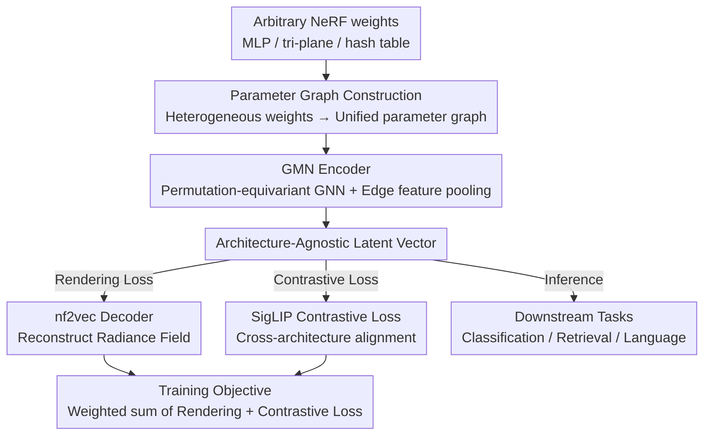

# Weight Space Representation Learning on Diverse NeRF Architectures

**Conference**: ICLR 2026  
**arXiv**: [2502.09623](https://arxiv.org/abs/2502.09623)  
**Code**: Yes (links provided in paper)  
**Area**: 3D Vision / NeRF  
**Keywords**: NeRF, weight space, graph meta-network, contrastive learning, architecture-agnostic

## TL;DR
The authors propose the first representation learning framework capable of processing weights from diverse NeRF architectures (MLP/tri-plane/hash table). By utilizing a Graph Meta-Network encoder combined with SigLIP contrastive loss to construct an architecture-agnostic latent space, the method achieves classification, retrieval, and language tasks across 13 NeRF architectures and generalizes to architectures unseen during training.

## Background & Motivation

**Background**: NeRF methods encode 3D information into neural network weights. Prior approaches like nf2vec and Cardace et al. perform downstream tasks (classification, retrieval) by processing NeRF weights but are restricted to a single NeRF architecture (either only MLP or only tri-plane).

**Limitations of Prior Work**: The rapid diversification of NeRF architectures (MLP → tri-plane → hash table) requires a redesign of the processing framework for each new architecture, which limits practical utility.

**Key Challenge**: The weight structures of different NeRF architectures vary significantly (MLP weight matrices vs. planar features vs. hash tables). How can a unified representation space be constructed?

**Goal**: Design an architecture-agnostic NeRF weight processing framework such that different NeRF representations of the same object are mapped to similar latent vectors.

**Key Insight**: Utilize a Graph Meta-Network to convert arbitrary NeRFs into parameter graphs, which are then processed by a GNN.

**Core Idea**: Use SigLIP contrastive loss to align embeddings of different NeRF architectures representing the same object, encouraging the GMN encoder to produce an architecture-agnostic latent space.

## Method

### Overall Architecture

The core problem addressed is that a single 3D object can be stored across various NeRF formats (MLP, tri-plane, hash table) with vastly different weight structures. Previous weight-processing methods (nf2vec, Cardace) are limited to a single architecture. The proposed approach unifies "weight reading" as "graph reading"—regardless of the NeRF type, it is first converted into a parameter graph and then encoded by a network that is naturally equivariant to the graph structure. The pipeline is: Arbitrary NeRF weights → Parameter Graph → Graph Meta-Network (GMN) Encoder → Architecture-agnostic latent vector. This vector is passed to an nf2vec decoder to reconstruct the radiance field (ensuring object content preservation) while simultaneously participating in contrastive alignment (ensuring different architectures of the same object converge in latent space). During training, both a rendering loss $\mathcal{L}_R$ and a SigLIP contrastive loss $\mathcal{L}_C$ are optimized. At inference, the encoder's output vector is used directly for classification, retrieval, and language tasks.

### Key Designs

**1. Parameter Graph Construction: Translating Heterogeneous NeRF Weights into a Unified Graph Language**

Weights from different architectures cannot be aligned directly—MLPs are stacks of weight matrices, tri-planes are planar features, and hash tables are lookup tables. To allow a single encoder to process them simultaneously, a common intermediate representation is required. The authors choose parameter graphs: for MLPs, neurons are nodes and weights are edge features; for tri-planes, they follow the spatial parameter grid representation of Lim et al. The primary contribution lies in the hash table representation—the most popular yet hardest to represent due to the $O(n^3)$ complexity of direct voxel grid modeling. The authors create a node for each table entry and each feature dimension, using the stored values as edge features. This avoids explicit voxel grids, allowing the graph size to grow linearly with the table size and preserving the memory efficiency of the hash table.

**2. GMN Encoder: Processing Arbitrary Graph Structures with Permutation-Equivariant GNNs**

With a unified graph representation, a structure-agnostic encoder is needed. The authors employ a standard message-passing GNN: node and edge features are iteratively updated via neighborhood aggregation, followed by average pooling of all edge features to produce a fixed-length embedding. A GNN is chosen because it is naturally equivariant to node permutations—since neuron indexing in NeRF weights lacks inherent order, this equivariance eliminates irrelevant permutation degrees of freedom. Crucially, as long as a representation can be converted to a graph, the same GMN can process MLPs, tri-planes, or hash tables.

**3. SigLIP Contrastive Loss: Enforcing Cross-Architecture Alignment**

Relying solely on rendering loss is insufficient; while the encoder learns "content," the latent space tends to cluster by architecture—an MLP version and a hash version of the same chair might end up in separate clusters (confirmed by t-SNE experiments). Rendering loss only requires the vector to reconstruct the object, not to align across architectures. The authors introduce SigLIP contrastive loss to explicitly enforce similarity:

$$\mathcal{L}_C = -\frac{1}{|\mathcal{B}|} \sum_{j,k} \ln \frac{1}{1+e^{-\ell_{jk}(t \mathbf{u}_j \cdot \mathbf{v}_k + b)}}$$

where $\mathbf{u}_j, \mathbf{v}_k$ are embeddings of two NeRFs in a batch, $\ell_{jk}=1$ if they represent the same object and $-1$ otherwise, and $t, b$ are learnable temperature and bias parameters. This essentially performs pairwise sigmoid binary classification, pulling embeddings of the same object together and pushing different objects apart, thereby organizing the latent space by content rather than architecture.

### Loss & Training

The final objective is a weighted sum of the rendering loss and contrastive loss: $\mathcal{L}_{R+C} = \mathcal{L}_R + \lambda \mathcal{L}_C$, with $\lambda = 2 \times 10^{-2}$. Both terms are essential—the rendering loss ensures the vector carries object content, while the contrastive loss ensures cross-architecture alignment. Ablation studies show that only their combination achieves both high classification accuracy and optimal cross-architecture retrieval.

## Key Experimental Results

### Main Results (Multi-Architecture Classification Accuracy)

| Setup | Training Architectures | Testing Architectures | Accuracy |
|------|---------|---------|--------|
| Single Arch MLP | MLP | MLP | ~82% |
| Single Arch TRI | TRI | TRI | ~84% |
| Single Arch HASH | HASH | HASH | ~83% |
| Multi-Arch ALL ($\mathcal{L}_{R+C}$) | MLP+TRI+HASH | MLP+TRI+HASH | ~83% |
| Multi-Arch → Unseen | MLP+TRI+HASH | 10 unseen variants | ~78% |

### Ablation Study

| Loss | Multi-Arch Classification | Cross-Arch Retrieval | Description |
|------|-----------|-----------|------|
| $\mathcal{L}_R$ only | Intra-arch clustering | Extremely low | Different architectures form independent clusters |
| $\mathcal{L}_C$ only | ~79% | High | Lacks rendering constraints |
| $\mathcal{L}_{R+C}$ | ~83% | Highest | Optimal combination |

### Key Findings
- **Rendering loss alone leads to architecture clustering**: t-SNE visualizations clearly show that NeRFs of the same object are separated into clusters based on their architecture.
- **Contrastive loss is critical**: Adding SigLIP organizes the latent space by object category rather than architecture.
- **Generalization to unseen architectures**: Maintains ~78% accuracy across 10 architectures with unseen hyperparameters.
- **First to handle hash table NeRFs**: Validates the universality of the parameter graph representation.

## Highlights & Insights
- **Ingenious parameter graph design for hash tables**: Avoids cubic complexity while maintaining the memory efficiency innate to hash tables.
- **Deep insight into breaking architecture barriers**: Rendering loss learns "content" but inadvertently incorporates "architectural" noise; SigLIP explicitly constrains "same object, different architecture" similarity.
- **Standardizing NeRF data formats**: If NeRFs of different architectures can be retrieved uniformly, NeRF could become a universal storage format for 3D data.

## Limitations & Future Work
- Validated only on ShapeNet synthetic data; real-world NeRFs are more complex.
- Cross-family generalization (e.g., training on MLP → testing on HASH) has not been fully tested.
- The parameter graph for hash tables does not preserve spatial adjacency.
- Does not cover 3DGS, a significant emerging representation.

## Related Work & Insights
- **vs. nf2vec**: Limited to fixed MLPs, whereas Ours extends to arbitrary architectures.
- **vs. Cardace et al.**: Limited to tri-planes, whereas Ours unifies three major families.
- Provides pioneering value for the application of meta-networks in the 3D domain.

## Rating
- Novelty: ⭐⭐⭐⭐⭐ First architecture-agnostic NeRF weight representation framework.
- Experimental Thoroughness: ⭐⭐⭐⭐ Broad coverage of 13 architectures, though limited to ShapeNet data.
- Writing Quality: ⭐⭐⭐⭐ Clear methodology and comprehensive ablations.
- Value: ⭐⭐⭐⭐ Significant push toward unified NeRF processing.

<!-- RELATED:START -->

## Related Papers

- [\[ICLR 2026\] Learning Unified Representation of 3D Gaussian Splatting](learning_unified_representation_of_3d_gaussian_splatting.md)
- [\[ICLR 2026\] Exploring the Potential of Encoder-free Architectures in 3D LMMs](exploring_the_potential_of_encoder-free_architectures_in_3d_lmms.md)
- [\[ICLR 2026\] Point-Focused Attention Meets Context-Scan State Space: Robust Biological Visual Perception for Point Cloud Representation](point-focused_attention_meets_context-scan_state_space_robust_biological_visual_.md)
- [\[AAAI 2026\] Point-SRA: Self-Representation Alignment for 3D Representation Learning](../../AAAI2026/3d_vision/point-sra_self-representation_alignment_for_3d_representation_learning.md)
- [\[CVPR 2025\] EigenGS: Representation from Eigenspace to Gaussian Image Space](../../CVPR2025/3d_vision/eigengs_representation_from_eigenspace_to_gaussian_image_space.md)

<!-- RELATED:END -->
