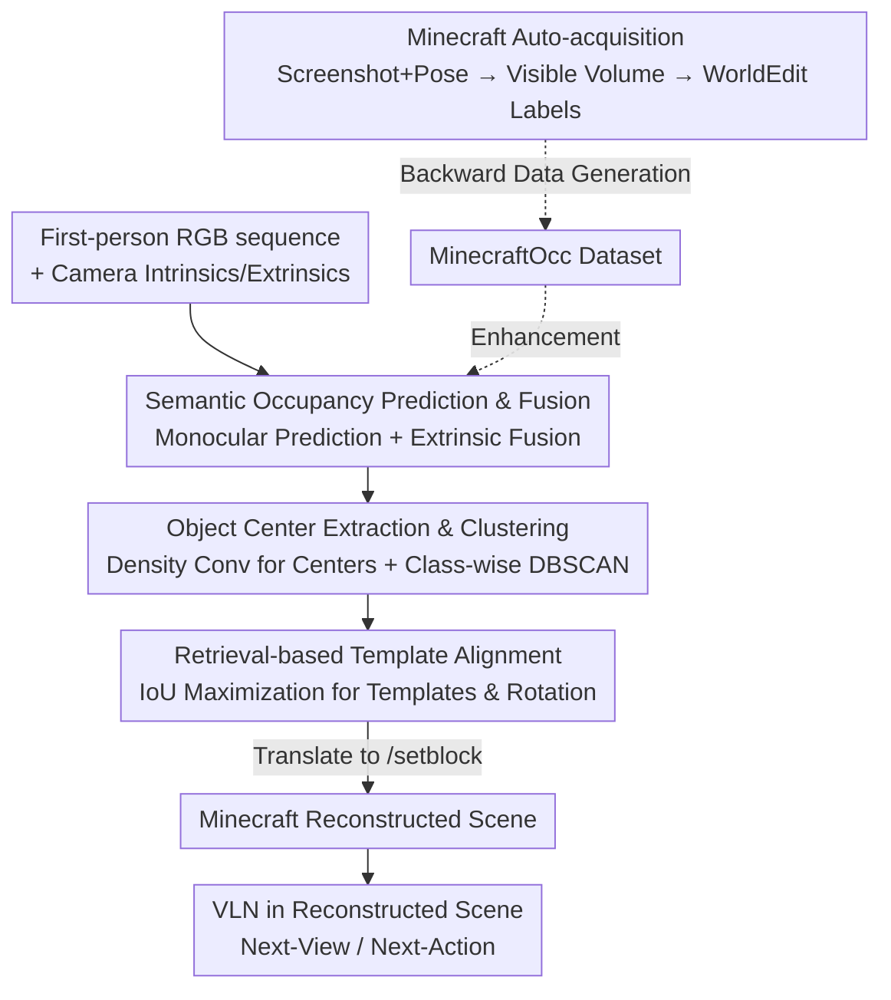

# World2Minecraft: Occupancy-Driven Simulated Scenes Construction

**Conference**: ICLR 2026  
**arXiv**: None (Project page: https://world2minecraft.github.io/)  
**Paper**: [ICLR 2026 OpenReview](https://world2minecraft.github.io/)  
**Code**: Project page https://world2minecraft.github.io/ (Available)  
**Area**: 3D Vision / Embodied AI Simulation / 3D Semantic Occupancy Prediction  
**Keywords**: Semantic occupancy prediction, real-to-sim, Minecraft, Vision-Language Navigation, dataset construction

## TL;DR
This work converts real-world indoor scenes into voxel-aligned editable Minecraft environments using "3D semantic occupancy prediction" and builds a simulation platform for Vision-Language Navigation (VLN). Simultaneously, it utilizes Minecraft to automatically generate 100,000 occupancy annotations (MinecraftOcc dataset), serving as both a challenging benchmark and an augmentation source for real-world datasets.

## Background & Motivation
**Background**: Embodied AI heavily depends on high-fidelity, interactive simulation environments. Prevailing approaches follow two paths: platforms like Habitat based on real scans, which offer visual realism but suffer from geometric/visual artifacts and are **uneditable**; and voxel-based worlds like Minecraft, which are customizable and physically consistent but suffer from a significant reality gap due to their blocky aesthetic.

**Limitations of Prior Work**: Existing real-to-sim paths are problematic. NeRF and 3D Gaussian Splatting provide realistic rendering but produce **implicit fields** that are uneditable and lack physical attributes. CAD retrieval methods (e.g., Scan2CAD) produce clean scenes but require precise instance segmentation and scale alignment, and their reconstruction results **cannot directly support downstream tasks**. Consequently, a trade-off between "realism" and "interactivity/editability" persists.

**Key Challenge**: Achieving both fidelity and editability/interactivity requires an intermediate representation that is **discrete, semantic-aware, and naturally aligned with simulation worlds**. Implicit fields are continuous/uneditable, while mesh-to-block conversion is overly complex.

**Goal**: (1) Establish a bridge to translate real scenes into editable Minecraft environments; (2) Enable VLN execution within reconstructed scenes; (3) Address the poor generalization of occupancy models that limits reconstruction quality.

**Key Insight**: The authors observe that the **discrete voxel structure of 3D semantic occupancy corresponds one-to-one with Minecraft blocks**—an occupied semantic voxel directly maps to a block of a corresponding category. Thus, occupancy prediction serves as both perception and "construction instructions," bypassing complex mesh-to-block transformations.

**Core Idea**: Utilize "3D semantic occupancy prediction" as the intermediate representation for real-to-sim, mapping multi-frame RGB to a unified semantic occupancy field and then to Minecraft construction commands. Conversely, leverage Minecraft’s controllable rendering to **mass-produce** occupancy datasets to enhance the generalization of the occupancy models themselves.

## Method

### Overall Architecture
World2Minecraft is a **bi-directional closed loop**: the forward path brings reality into Minecraft, and the backward path uses Minecraft to generate data for occupancy models.

Forward Pipeline (real → Minecraft): Inputs consist of a sequence of first-person RGB images $I=\{I_1,\dots,I_N\}$ and camera intrinsics $K$. A monocular occupancy predictor $\mathcal{F}_{mono}$ first generates a semantic occupancy grid $O^i_{mono}$ for each frame. Camera extrinsics $E$ are used to fuse multiple frames into a unified scene semantic occupancy field $\hat{O}_{scene}$. Post-processing follows—extracting object centers, clustering to remove redundancy, and retrieval-based furniture template alignment—to replace each instance with the best-matching template. Finally, these are translated into Minecraft `/setblock` commands to reconstruct the scene. Reconstructed scenes define "Next-View" and "Next-Action" sub-tasks for VLN.

Backward Pipeline (Minecraft → occupancy dataset MinecraftOcc): Mod tools in Minecraft automatically capture screenshots and record camera poses. Visible volumes are defined based on geometric conditions relative to the viewing direction, and block types are queried via WorldEdit to obtain voxel-level semantic labels, automatically producing large-scale occupancy annotations.

This multi-stage serial pipeline is illustrated below:

### Key Designs

**1. Occupancy as a Bridge: Multi-frame semantic occupancy fusion as real-to-sim representation**

To address the conflict where implicit fields are uneditable and meshes are difficult to voxelize, this work selects discrete semantic occupancy as the bridge. The monocular predictor outputs a voxel-level semantic grid for each frame:

$$O^i_{mono} = \mathcal{F}_{mono}(I_i, K) \in \{0,1,\dots,C-1\}^{X\times Y\times Z}$$

where each voxel is assigned a semantic category. All frames are fused using extrinsics $E$ into a unified scene representation:

$$\hat{O}_{scene} = \mathcal{F}_{embodied}(\{O^i_{mono}\}_{i=1}^N, K, E)$$

This is effective because occupancy is **discrete and semantic**: an occupied voxel maps directly to a Minecraft block, and the semantic category determines the block type. Construction commands are essentially "read grid, setblock voxel-by-voxel," making the result naturally editable and physically grounded—factors missing in NeRF/3DGS/CAD. $\mathcal{F}_{mono}/\mathcal{F}_{embodied}$ are implemented using a pre-trained EmbodiedOcc.

**2. Center Extraction + Class-wise DBSCAN: Extracting clean instances from voxel clusters**

Directly placing blocks based on the occupancy field results in noise and redundancy. The process first identifies object instances by binarizing the multi-class field into $\hat{O}_{binary}$ (1 for any object class, 0 for empty). A local density map $D$ is generated using a uniform kernel $\mathcal{K}\in\mathbb{R}^{k\times k\times k}$ via 3D convolution, and candidate centers are selected by threshold $\tau$:

$$C = \{v \mid D(v)\ge\tau,\ D=\mathcal{K}*\hat{O}_{binary}\}$$

Since initial centers are redundant, DBSCAN (L2 distance, threshold $\eta$) is applied **independently within each semantic category**. Centroids of each cluster yield a refined set of centers $C'=\{c'_k\}$. "Class-wise clustering" ensures points with different semantic labels are not merged, maintaining object integrity and preventing, for instance, a chair being merged with a nearby table leg.

**3. Retrieval-based Template Alignment: Maximizing IoU for orientation and geometric fidelity**

Voxel blocks alone result in coarse geometry and ambiguous orientations. The final step matches each instance grid $O_k$ against a furniture template library $L=\{T_j\}$. A set of discrete rotation angles $\delta$ is enumerated to find the template and rotation that maximizes Intersection over Union (IoU):

$$ (j^*, \delta^*) = \arg\max_{j,\delta} \frac{|O_k \cap \text{Rot}(T_j,\delta)|}{|O_k \cup \text{Rot}(T_j,\delta)|} $$

The selected template is translated into construction commands. This replaces "coarse predicted occupancy contours" with "clean standard geometry," compensating for missing predictions and ensuring geometric consistency.

**4. MinecraftOcc Backward Pipeline: Mass-producing occupancy labels in simulation**

This addresses the scarcity and cost of real-world occupancy labels. Using the `Screen with Coordinates` mod, screenshots and camera poses are recorded. Intrinsics/extrinsics are derived for each image. A visible volume $V$ is defined for each image; based on the yaw angle $\theta$, two geometric cases are handled—**axis-aligned** (view parallel to axes) and **diagonal** (45° view). The volume is calculated via function $f$:

$$ (v_{min}, v_{max}) = f(P_{player}, \theta, w, h, d) $$

Since Minecraft's discrete space causes voxel loss at edges in diagonal views, a **view-aware fallback strategy** is added: a correction offset $\epsilon$ is applied to bounding box corners ($v'_{min}=v_{min}+\epsilon,\ v'_{max}=v_{max}+\epsilon$) to supplement structural info from adjacent microscopic view adjustments. Finally, WorldEdit queries labels $s_v=\mathcal{M}_{world}(v)$ for each coordinate $v$, yielding the grid $O=\{s_v\}$. This low-cost, scalable pipeline produced MinecraftOcc with 100,165 high-resolution images across 156 scenes (~1000 rooms) and 1,452 categories.

### Loss & Training
The core method (occupancy to reconstruction) relies on prediction and post-processing without new training losses. For VLN, Qwen2.5-VL-3B/7B are fine-tuned on MinecraftVLN using **SFT** (via LLaMA-Factory) and **RFT** (Reinforcement Fine-Tuning via EasyR1). Occupancy models use EmbodiedOcc-ScanNet for training and MinecraftOcc for evaluation and augmented mixed training.

## Key Experimental Results

### Main Results

Dataset comparison (MinecraftOcc significantly exceeds existing indoor datasets in scale/resolution):

| Dataset | Images | Scenes | Classes | Total Semantic Voxels | Avg Voxels/Scene | Resolution |
|---------|--------|--------|---------|-----------------------|------------------|------------|
| NYUv2 | 1,449 | 464 | 13 | 10.8M | ~23.2K | 640×480 |
| OccScanNet | 65,119 | 674 | 13 | 201M | ~298.5K | 640×480 |
| **MinecraftOcc** | **100,165** | 156 (~1000 rooms) | **1,452** | **733M** | **~4.7M** | **1920×1129** |

Qwen2.5-VL accuracy on MinecraftVLN (Selected Combined set; No-Train / SFT / RFT):

| Model | Task | No-Train | SFT | RFT |
|-------|------|----------|-----|-----|
| Qwen2.5-VL-3B | Next-View | 0.2288 | 0.5609 | 0.3137 |
| Qwen2.5-VL-3B | Next-Action | 0.3037 | 0.4835 | 0.6570 |
| Qwen2.5-VL-7B | Next-View | 0.2878 | 0.6642 | 0.6753 |
| Qwen2.5-VL-7B | Next-Action | 0.3760 | 0.6281 | 0.6219 |

### Ablation Study

Image quality (no-reference metrics; MinecraftOcc exhibits significantly better quality):

| Dataset | NIQE ↓ | PIQE ↓ | LV ↑ |
|---------|--------|--------|------|
| NYUv2 | 14.96 | 47.40 | 57,369 |
| OccScanNet | 17.63 | 58.78 | 10,352 |
| **MinecraftOcc** | **9.97** | **45.23** | **274,305** |

Occupancy model performance on MinecraftOcc (8k) + joint training gain:

| Configuration | IoU | mIoU | Note |
|---------------|-----|------|------|
| MonoScene @8k | 40.66 | 20.93 | Existing methods perform low, MonoScene is most stable |
| Symphonies @8k | 39.11 | 21.56 | Highest mIoU, but absolute values remain low |
| ISO @8k | 33.82 | 14.83 | Sharpest performance drop on new data |
| Symphonies + NYUv2 Joint | +0.43 (IoU) | +0.21 (mIoU) | MinecraftOcc aids real-world datasets |

### Key Findings
- **SOTA occupancy models drop performance on MinecraftOcc**, proving it a genuine hard benchmark. Methods that excel on NYUv2 likely overfitted; ISO drops from strong NYUv2 performance to the lowest mIoU (14.83). MonoScene’s stability reinforces the overfitting hypothesis.
- **MinecraftOcc serves as effective auxiliary training data**: Joint training on NYUv2 improved Symphonies metrics, demonstrating its value for augmentation.
- **VLN fine-tuning strategies vary**: SFT is more effective for small models (3B) in multi-image Next-View tasks, while the gap narrows for 7B. For Next-Action, RFT performs better on more diverse sets (Extend/Combined).

## Highlights & Insights
- **The "Occupancy = Blocks" observation is the core pivot**: Using the output of a perception task directly as the building unit for simulation bypasses mesh-to-block conversion. This single representation provides realism, editability, and interactivity.
- **Bi-directional loop**: Using occupancy to go from real to sim, while using sim to generate occupancy labels, creates a self-sustaining flywheel. This concept of using controllable simulation for low-cost high-quality labeling is transferable to other 3D tasks.
- **Class-wise DBSCAN + IoU template matching** is a practical engineering combination to refine "coarse predictions" into "clean scenes."
- Transforming a game into a "data factory" via mods is a cost-effective strategy.

## Limitations & Future Work
- **Reconstruction depends on occupancy models**: The authors admit initial auto-reconstruction quality is sub-optimal; 15 of 30 scenes required manual refinement for VLN experiments, indicating the pipeline is not yet fully autonomous for high-fidelity needs.
- **Dependence on template libraries**: Alignment is limited by the coverage of the library; objects outside the library may not match correctly.
- **Sim-to-real gap**: Despite high-fidelity mods, Minecraft's discrete voxel nature remains a structural limitation.
- Improved directions: Incorporating stronger occupancy models and automated furniture generation (rather than fixed libraries) to reduce manual intervention.

## Related Work & Insights
- **vs. NeRF / 3DGS**: These offer visual realism but are uneditable implicit fields. This work trades some visual fidelity for editability and interactivity.
- **vs. CAD Retrieval (Scan2CAD)**: Both use retrieval, but CAD methods require strict segmentation and lack direct downstream readiness. This work uses occupancy as a foundation to simplify instance discovery.
- **vs. Minecraft RL (GROOT, JARVIS-VLA)**: Those train on native block aesthetics with high reality gaps. This work uses high-fidelity mods and real-scene reconstruction to narrow the visual/structural gap.

## Rating
- Novelty: ⭐⭐⭐⭐⭐ "Occupancy as blocks" bridge + bi-directional data flywheel.
- Experimental Thoroughness: ⭐⭐⭐⭐ Covers reconstruction, VLN, and occupancy, though reconstruction still requires manual refinement.
- Writing Quality: ⭐⭐⭐⭐ Clear logic and well-explained formulas/pipelines.
- Value: ⭐⭐⭐⭐⭐ Provides an editable simulation platform + large-scale dataset + challenging benchmark.

<!-- RELATED:START -->

## Related Papers

- [\[ICLR 2026\] GIQ: Benchmarking 3D Geometric Reasoning of Vision Foundation Models with Simulated and Real Polyhedra](giq_benchmarking_3d_geometric_reasoning_of_vision_foundation_models_with_simulat.md)
- [\[ICLR 2026\] Progressive Gaussian Transformer with Anisotropy-aware Sampling for Open Vocabulary Occupancy Prediction](progressive_gaussian_transformer_with_anisotropy-aware_sampling_for_open_vocabul.md)
- [\[CVPR 2026\] PolarGuide-GSDR: 3D Gaussian Splatting Driven by Polarization Priors and Deferred Reflection for Real-World Reflective Scenes](../../CVPR2026/3d_vision/polarguide-gsdr_3d_gaussian_splatting_driven_by_polarization_priors_and_deferred.md)
- [\[ICLR 2026\] DiffWind: Physics-Informed Differentiable Modeling of Wind-Driven Object Dynamics](diffwind_physics-informed_differentiable_modeling_of_wind-driven_object_dynamics.md)
- [\[ICLR 2026\] Uncertainty-Aware 3D Reconstruction for Dynamic Underwater Scenes](uncertainty-aware_3d_reconstruction_for_dynamic_underwater_scenes.md)

<!-- RELATED:END -->
