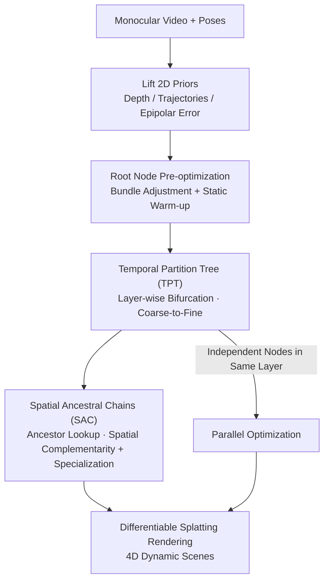

# WorldTree: Towards 4D Dynamic Worlds from Monocular Video Using Tree-Chains

**Conference**: ICLR 2026  
**Paper**: [OpenReview / ICLR 2026](https://openreview.net/) (Subject to the original text)  
**Code**: https://github.com/iCVTEAM/WorldTree  
**Area**: 3D Vision / Dynamic Reconstruction / 4D Reconstruction  
**Keywords**: Monocular Dynamic Reconstruction, 4D Reconstruction, 3D Gaussian Splatting, Temporal Hierarchy, Tree Structure

## TL;DR
WorldTree utilizes a "Temporal Partition Tree" to recursively bifurcate monocular videos into coarse-to-fine sub-intervals for layer-wise optimization. It combines this with "Spatial Ancestral Chains" to link each child node with its ancestors for spatial complementarity and motion representation specialization. This approach simultaneously addresses the issues of "global temporal optimization" and "hierarchical spatial coupling" in monocular dynamic reconstruction, reducing LPIPS on NVIDIA-LS by 8.26% and mLPIPS on DyCheck by 9.09% compared to the runner-up.

## Background & Motivation

**Background**: Dynamic New View Synthesis (dynamic NVS / 4D reconstruction) has advanced rapidly with NeRF and 3D Gaussian Splatting (3DGS). However, mainstream high-quality methods heavily rely on **time-synchronized multi-view videos**—requiring either camera arrays or static scenes—which limits their applicability. Monocular videos, being ubiquitous and easily accessible, represent a more practical target for dynamic reconstruction.

**Limitations of Prior Work**: Existing monocular reconstruction works primarily focus on "designing efficient motion representations" without analyzing the spatio-temporal structure of the video modality itself, leading to several issues: ① Some methods (e.g., MoSca) perform **global optimization over the entire time interval**, ignoring varying deformation patterns across different segments. ② Others use **global spatial motion graph fusion**, resulting in "amorphous" motion representations that still neglect temporal sequences. ③ Some (e.g., HiMoR) decompose 3D deformation into **global-local hierarchies**, but the motion between layers is **coupled**; inaccuracies in coarse layer estimation cause local interference and optimization conflicts.

**Key Challenge**: Monocular videos naturally possess a **spatio-temporal hierarchical structure**. Different time intervals exhibit different deformation patterns (due to non-uniform 3D motion), while the deformation in any given interval **inherits attributes from its parent interval**, which simultaneously provides **spatial supplementation**. In other words, there exists a "tree structure with ancestral associations," yet existing methods either focus solely on time or space, failing to unify them into a decomposition framework.

**Goal**: To construct a unified optimization pipeline that performs layering based on temporal characteristics (to handle varying deformation patterns) while providing hierarchical spatial complementarity without introducing hierarchical coupling.

**Core Idea**: Explicitly model the monocular video as a tree—**temporally**, recursive bifurcation along the time axis (Temporal Partition Tree, TPT) enables coarse-to-fine optimization; **spatially**, each node recursively checks its **Spatial Ancestral Chains (SAC)** to obtain multi-scale spatial supplementation and specialize the motion representation of each ancestor node, thereby decoupling hierarchical motion.

## Method

### Overall Architecture
Given a monocular video $I=\{I_t\}_{t\in[1,T]}$ and corresponding poses $P=\{P_t\}$, the goal is to reconstruct a dynamic scene containing a static background and moving foreground. The process starts by lifting 2D priors (monocular depth, point trajectory tracking, optical flow/epipolar error) to 3D to initialize the dynamic Gaussian representation of the root node (the entire video). TPT then uses BFS to bifurcate intervals into finer sub-intervals layer by layer, with each new node optimized independently like the root. Simultaneously, SAC retrieves the ancestral chain from the root to each node, superimposing ancestral Gaussian representations for spatial complementarity before rendering via splatting. The method is a multi-stage serial pipeline: "Prior Extraction → Root Node Warm-up → Temporal Layering (with Spatial Chain Query) → Rendering."

### Key Designs

**1. Temporal Partition Tree (TPT): Decomposing the video into coarse-to-fine intervals using an inherited binary tree**

Addressing the "global optimization ignoring temporal characteristics" pain point, TPT no longer treats the video as a single segment. Instead, it builds an inherited partition tree. The root $\zeta_r(M_r,G_r)$ at depth $d_r=0$ represents the interval $[T^L_r,T^R_r]$ and carries the coarsest dynamic modeling (motion basis $M_r$ + dynamic Gaussians $G_r$). Tree construction uses BFS: each optimized node $\zeta_j$ is split at the midpoint $T^P_j=\lfloor(T^L_j+T^R_j)/2\rfloor$ into left and right children, covering $[T^L_j,T^P_j)$ and $[T^P_j,T^R_j]$ respectively. Motion bases and Gaussian primitives are partitioned accordingly. As the tree deepens, intervals become narrower and more refined, allowing the model to bridge "different deformation patterns at different times." In practice, the authors limit the number of Gaussians inherited to balance efficiency and reset opacity before training to escape local optima.

**2. Spatial Ancestral Chains (SAC): Supplementing spatial information and specializing representations**

A side effect of TPT’s temporal splitting is that Gaussian primitives are truncated during inheritance, leading to **decreasing spatial visual information** in child nodes. SAC is designed to fill this gap. For each node $\zeta_j$, SAC constructs a dynamic expression chain from the root to the node:
$$C_j=\Big\{\zeta^j_k(M^j_k,G^j_k)\mid k\in\lfloor j/2^\alpha\rfloor,\ \alpha=1\ldots\log_2 j\Big\},$$
where $\alpha$ is the number of levels upward. Each node models **local temporal dynamics**, while the ancestral chain provides **multi-level spatial context**. The deformed Gaussian set at time $\tau$ is the union of the node's own Gaussians and those of its ancestors:
$$P_j=\big\{G^j_n(M_j,\tau)\big\}_{\zeta_j}\ community\ \Big\{\cup_k\{G^k_n(M^j_k,\tau)\}\Big\}_{\zeta^j_k\in C_j}.$$
Crucially, common ancestors of different nodes are **independent** (params not shared) but share the **same optimization initialization**, effectively performing **specialization** on each ancestor’s motion representation. This avoids "amorphous" representations and hierarchical coupling (as in HiMoR), achieving decoupled hierarchical complementarity.

**3. Parallel Optimization: Reducing exponential complexity to linear**

Nodes at the same depth share ancestral chain initializations but are independent during optimization. Leveraging this, WorldTree performs **parallel optimization** for nodes at the same level. With sufficient parallel computing power, the total optimization steps are reduced to $O(\delta)$ (where $\delta$ is max depth). This engineering insight makes the overhead of TPT's layer-wise optimization acceptable for practical applications.

**4. Root Node Pre-optimization: Bundle Adjustment and Static Warm-up**

Camera poses are often inaccurate in dynamic reconstruction, and the entire tree is built upon the root representation. To prevent error propagation, the root undergoes two warm-up steps: ① **Bundle Adjustment**—utilizes tracklet-based BA to refine camera poses before dynamic optimization; ② **Static Warm-up**—pre-optimizes the static background before dynamic foreground reconstruction. Ablations show significant independent contributions from both steps to PSNR/LPIPS.

### Loss & Training
Each node is trained using standard dynamic reconstruction regularizations, including photometric loss and depth loss. The overall strategy follows: "Root Warm-up → Level-wise Tree Construction via BFS (Parallel Same-depth Optimization) → SAC Ancestral Chain Superposition." A tree depth of $\delta=2$ is chosen to balance quality and efficiency.

## Key Experimental Results

### Main Results
Evaluated on NVIDIA-LS (an extended version reconstructed by the authors with 160 frames and SAM2 dynamic masks for evaluation only) and DyCheck. Metrics include whole-image PSNR/SSIM/LPIPS/AVGE and masked dynamic area mPSNR/mSSIM/mAVGE/mLPIPS.

| Dataset | Metric | Ours | Prev. SOTA | Gain |
|--------|------|------|----------|------|
| NVIDIA-LS | LPIPS↓ | 0.100 | MoSca 0.109 | -8.26% |
| NVIDIA-LS | mPSNR↑ | 18.55 | MoSca 17.89 | Better than SOTA |
| NVIDIA-LS | mSSIM↑ | 0.692 | MoSca 0.664 | Better than SOTA |
| DyCheck | mLPIPS↓ | 0.240 | MoSca 0.264 | -9.09% |
| DyCheck | mPSNR↑ | 19.75 | MoSca 19.32 | Better than SOTA |

On NVIDIA-LS, WorldTree (without CIP/MPP priors) achieves a 21.40% mPSNR improvement over HiMoR, a 12.16% mSSIM improvement over SplineGS, and an 8.91% mAVGE improvement over MoSca.

### Ablation Study
Individual components BA, SW, TPT, and SAC were toggled (NVIDIA-LS):

| Config (BA/SW/TPT/SAC) | LPIPS↓ | mPSNR↑ | Description |
|------|--------|--------|------|
| ✗✗✗✗ | 0.139 | 16.82 | Pure baseline |
| ✗✗✓✗ | 0.121 | 17.41 | TPT only |
| ✗✗✓✓ | 0.113 | 17.85 | TPT+SAC |
| ✓✓✗✗ | 0.115 | 17.73 | Root warm-up only |
| ✓✓✓✗ | 0.105 | 18.36 | Root warm-up + TPT |
| ✓✓✓✓ | **0.100** | **18.55** | Full Model |

### Key Findings
- **TPT is the primary driver, SAC is a supplement**: Adding TPT improves LPIPS and mAVGE by 8.70% and 8.65% respectively; SAC further improves them by 4.76% and 3.16%, confirming that SAC recovers spatial representations lost during temporal subdivision.
- **Root warm-up is essential**: Activating BA+SW (without TPT/SAC) reduces LPIPS from 0.139 to 0.115, proving pose initialization and static pre-training act as stabilizers.
- **Tree depth vs. quality**: Reconstruction quality correlates positively with tree depth; $\delta=2$ was chosen for the best quality-efficiency trade-off.
- **Robustness to external priors**: Ours consistently outperforms MoSca across different depth/tracking priors (Metric3D-V2+BootsTAPIR, UniDepth+CoTracker3), with mAVGE gains of 10.27%~12.00%.

## Highlights & Insights
- **Explicit Spatio-Temporal Hierarchy**: Decoupling time via TPT and space via SAC addresses varying deformation and spatial loss respectively. This logic is transferable to other video reconstruction tasks.
- **Ancestral Representation Specialization**: Allowing common ancestors to be independent yet identically initialized provides spatial context without the coupling issues found in HiMoR.
- **From Exponential to Linear Complexity**: Exploiting same-level independence to parallelize optimization makes the tree-based approach computationally feasible.
- **Dataset Contribution**: The creation of NVIDIA-LS (160 frames) with SAM2 labels allows for more reliable evaluation of long-duration dynamic scenes with varying deformation patterns.

## Limitations & Future Work
- The quality-efficiency trade-off for tree depth remains a constraint; while quality increases with depth, the study primarily stops at $\delta=2$ for efficiency.
- Heavy reliance on the quality of 2D priors (depth/tracking/flow). While robust, performance under extreme motion or failing priors requires further investigation.
- TPT uses a fixed midpoint $T^P_j$ for splitting rather than an adaptive strategy based on deformation intensity, which could theoretically improve quality further.

## Related Work & Insights
- **vs. MoSca (Lei et al. 2025)**: MoSca uses global "scaffold graphs" and optimization over the whole interval, resulting in amorphous representations. WorldTree introduces temporal layering and spatial specialization, significantly outperforming it.
- **vs. HiMoR (Liang et al. 2025)**: HiMoR uses a coarse-to-fine hierarchy but suffers from coupled motion; WorldTree's specialization approach achieves decoupling.
- **vs. MoDec-GS (Kwak et al. 2025)**: MoDec-GS uses adaptive intervals but relies on manual settings and fixed two-stage optimization. WorldTree’s BFS-based layer-wise refinement is more unified and parallelizable.

## Rating
- Novelty: ⭐⭐⭐⭐⭐ The TPT/SAC combination is a unique decomposition perspective on spatio-temporal structures.
- Experimental Thoroughness: ⭐⭐⭐⭐ SOTA results on two datasets, comprehensive ablations, and sensitivity analyses, though extreme scenarios could be explored more.
- Writing Quality: ⭐⭐⭐⭐ Clear motivation and diagrams, though the mathematical notation is slightly dense.
- Value: ⭐⭐⭐⭐ High practical value by reducing multi-view dependency in 4D reconstruction; the framework is highly transferable.

<!-- RELATED:START -->

## Related Papers

- [\[ICLR 2026\] Uncertainty Matters in Dynamic Gaussian Splatting for Monocular 4D Reconstruction](uncertainty_matters_in_dynamic_gaussian_splatting_for_monocular_4d_reconstructio.md)
- [\[CVPR 2026\] 4DEquine: Disentangling Motion and Appearance for 4D Equine Reconstruction from Monocular Video](../../CVPR2026/3d_vision/4dequine_disentangling_motion_and_appearance_for_4d_equine_reconstruction_from_m.md)
- [\[ICLR 2026\] StreamSplat: Towards Online Dynamic 3D Reconstruction from Uncalibrated Video Streams](streamsplat_towards_online_dynamic_3d_reconstruction_from_uncalibrated_video_str.md)
- [\[ICCV 2025\] Vivid4D: Improving 4D Reconstruction from Monocular Video by Video Inpainting](../../ICCV2025/3d_vision/vivid4d_improving_4d_reconstruction_from_monocular_video_by_video_inpainting.md)
- [\[ICLR 2026\] Mono4DGS-HDR: High Dynamic Range 4D Gaussian Splatting from Alternating-exposure Monocular Videos](mono4dgs-hdr_high_dynamic_range_4d_gaussian_splatting_from_alternating-exposure_.md)

<!-- RELATED:END -->
