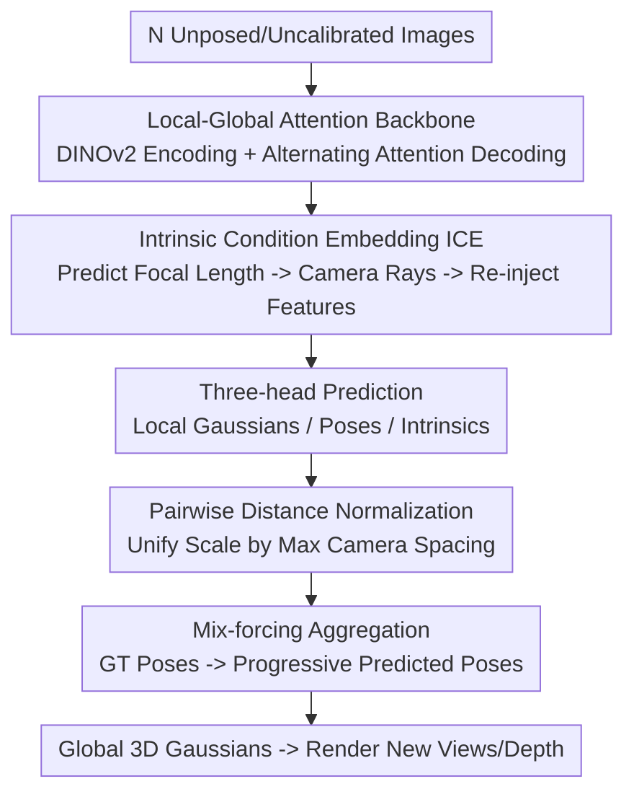

# YoNoSplat: You Only Need One Model for Feedforward 3D Gaussian Splatting

**Conference**: ICLR 2026  
**OpenReview**: [https://openreview.net/forum?id=ImRhA9xmay](https://openreview.net/forum?id=ImRhA9xmay)  
**Project Page**: [botaoye.github.io/yonosplat](https://botaoye.github.io/yonosplat/)  
**Code**: TBD (No explicit repository link on the project page, ⚠️ subject to the original text)  
**Area**: 3D Vision  
**Keywords**: Feedforward 3DGS, Unposed Reconstruction, Mix-forcing Training, Scale Ambiguity, Intrinsic Prediction

## TL;DR
YoNoSplat uses a feedforward model to directly predict per-view local 3D Gaussians, camera poses, and intrinsics from an arbitrary number of unposed and uncalibrated multi-view images, which are then aggregated into a global scene. By employing a "mix-forcing" training strategy, pairwise distance normalization, and Intrinsic Condition Embedding (ICE), it resolves pose-geometry entanglement and scale ambiguity. It achieves SOTA performance in both posed and unposed settings, reconstructing a scene from 100 images in 2.69 seconds.

## Background & Motivation

**Background**: Feedforward 3D Gaussian Splatting (3DGS) is a popular direction for accelerating 3D reconstruction. Given a set of images, a neural network directly outputs 3D Gaussian parameters, bypassing the per-scene optimization required by NeRF or the original 3DGS, which typically takes tens of minutes. Representative works include pixelSplat, MVSplat, and DepthSplat.

**Limitations of Prior Work**: Existing feedforward models impose various "hard constraints" that are often difficult to satisfy in real-world scenarios. They either require accurate camera poses (pixelSplat, DepthSplat), pre-calibrated intrinsics (NoPoSplat), or are restricted to a fixed, small number of views (usually 2–4). Recent unposed methods (NoPoSplat, Flare) predict Gaussians directly into a unified "canonical space," which works impressively for 2–4 sparse views but fails as the number of views increases, as the canonical space paradigm does not scale effectively.

**Key Challenge**: To design a "universal" model capable of handling arbitrary view counts, both posed/unposed settings, and calibrated/uncalibrated inputs, the model must simultaneously learn geometry (3D Gaussians) and camera parameters (poses, intrinsics). However, these two tasks are **highly entangled**: incorrect pose estimation contaminates the learning signal for Gaussians, and poorly learned geometry biases pose estimation. Furthermore, since training poses are often derived from SfM and defined only up to an arbitrary scale, scale ambiguity makes the joint estimation of intrinsics and extrinsics an ill-posed problem.

**Goal**: (1) Design an output paradigm that scales to a large number of views; (2) Disentangle the joint learning of poses and geometry; (3) Resolve scale ambiguity to enable processing of uncalibrated images.

**Key Insight**: Instead of the "canonical space" paradigm, this work adopts a **local-to-global** approach—predicting **local** Gaussians and poses for each view first, then aggregating them into a global coordinate system using either predicted or provided poses. Local prediction is naturally scalable and seamlessly compatible with workflows where GT poses are available for aggregation. The difficulty lies in stabilizing the "local aggregation" during training, which the authors address through a curriculum training strategy.

**Core Idea**: Use "mix-forcing" training—initially using GT poses to establish a stable geometric foundation and progressively introducing the model's own predicted poses for aggregation. This avoids the instability of self-forcing and the exposure bias of teacher-forcing. Scale ambiguity is addressed using pairwise distance normalization and Intrinsic Condition Embedding (ICE).

## Method

### Overall Architecture

YoNoSplat addresses the task of taking $V$ unposed images $(I_v)_{v=1}^V$ and learning a feedforward network $f_\theta$ that directly outputs one 3D Gaussian per pixel (center, opacity, rotation, scale, color), alongside camera poses $p_v=[R_v, t_v]$ and intrinsics $k_v$ for each view. The pipeline consists of: image patching → DINOv2 encoder (predicting intrinsics via a specialized token) → decoder with alternating local-global attention for multi-view fusion → three heads predicting Gaussians, poses, and intrinsics → aggregation of local Gaussians into global 3D Gaussians using predicted or ground-truth poses → rendering of novel views.

The critical factor during training is the **mix-forcing** strategy to stabilize the entangled "local Gaussian + pose aggregation" task, along with **Pairwise Distance Normalization** and **Intrinsic Condition Embedding (ICE)** to eliminate scale ambiguity.

### Key Designs

**1. Local Prediction Paradigm: Scalability via Local-to-Global**

The first fundamental choice for feedforward reconstruction is the output space. Unposed methods (NoPoSplat, Flare) predict all Gaussians directly into a unified canonical space, which is intuitive for few views. However, the authors observed (Tab. 7) that performance degrades as the view count increases, consistent with findings in point cloud prediction (VGGT). YoNoSplat predicts **local** Gaussians and poses per view first, then aggregates. This unlocks two paths: using predicted poses for unposed reconstruction, or using GT poses for workflows requiring alignment with existing accurate poses. The burden is shifted to the "aggregation" stability, resolved by mix-forcing. The backbone uses VGGT-style alternating local-global attention, which scales better with view count than cross-attention.

**2. Mix-forcing Training: Curriculum Aggregation to Decouple Pose and Geometry**

This is the core innovation addressing the "pose-geometry mutual contamination" problem. Aggregating local Gaussians requires poses, which can come from two extremes: ① **Self-forcing**—always using the model's predicted poses, which leads to tight coupling, instability, and poor performance (Fig. 2a); ② **Teacher-forcing**—always using GT poses, which is stable but introduces **exposure bias**: the model never sees its own imperfect predicted poses during training and fails during inference when GT poses are absent (Fig. 2b).

The authors propose **mix-forcing**: training initially with pure GT poses (teacher-forcing). After a preset step $t_{start}$, the probability of using predicted poses for aggregation **linearly increases** until it reaches a final ratio $r$ at step $t_{end}$. This allows the model to build a strong 3D structural prior before adapting to both predicted and GT pose distributions, avoiding both instability and exposure bias.

**3. Resolving Scale Ambiguity: Pairwise Distance Normalization and ICE**

Scale ambiguity arises from SfM-defined training poses and the ill-posed nature of joint intrinsic-extrinsic estimation. Two solutions are provided.

First, **Scene Normalization**: Given camera centers $\{c_i\}_{i=1}^N$, the authors compare three methods: **Max pairwise distance** $s=\max_{i,j}\|c_i-c_j\|_2$, average pairwise distance, and maximum translation $s=\max_i\|c_i\|_2$. Max pairwise distance normalization performs best (Tab. 6) because it aligns with the **pairwise relative pose supervision**—since poses are relative, scale should be defined by pairwise distances to provide a consistent reference for translations.

Second, **Intrinsic Condition Embedding (ICE)** (Fig. 3b): This addresses the dependency on GT intrinsics at inference. During encoding, a learnable intrinsic token aggregates image information to predict focal lengths $f_x, f_y$ via an MLP. These are converted into **camera rays**, processed by a linear layer, and **added back to the image features**. This injects knowledge of the intrinsics into the Gaussian prediction. During training, GT intrinsics are always used for conditioning to maintain stability. The separation of intrinsic prediction (encoder, single-view) and pose prediction (decoder, cross-view) clarifies task responsibilities.

### Loss & Training

The total loss is a multi-task weighted combination:

$$L = L_{image} + \lambda_{intrin}L_{intrin} + \lambda_{pose}L_{pose} + \lambda_{opacity}L_{opacity}.$$

- **Rendering Loss** $L_{image}$: Linear combination of MSE and LPIPS.
- **Intrinsic Loss** $L_{intrin}$: $\ell_2$ distance between predicted and GT focal lengths.
- **Pose Loss** $L_{pose}$: Pairwise relative pose loss following π³. For each pair $(i,j)$, relative rotation $L_R=\arccos((\mathrm{tr}(R_{i\leftarrow j}^\top \hat R_{i\leftarrow j})-1)/2)$ and translation $L_t=H_\delta(\hat t_{i\leftarrow j}-t_{i\leftarrow j})$ using Huber loss are computed. This makes the model invariant to the input order.
- **Opacity Loss** $L_{opacity}=\frac{1}{M}\sum_i |o_i|$: Sparsity regularization to prune Gaussians (prunes approx. 20%–70% where $o_i<0.005$).

The model is pre-initialized with π³ for the backbone and pose heads. Training is conducted in two stages (150k steps each): first at $224\times224$, then at $280\times518$.

## Key Experimental Results

### Main Results

Novel view synthesis results on the DL3DV dataset (PSNR↑). $p/k$ indicates whether GT poses/intrinsics were used:

| Method | p | k | 6 Views | 12 Views | 24 Views |
|------|---|---|--------|---------|---------|
| MVSplat | ✓ | ✓ | 22.66 | 21.29 | 19.98 |
| DepthSplat | ✓ | ✓ | 23.42 | 21.91 | 20.09 |
| NoPoSplat | | ✓ | 22.77 | 19.38 | 17.86 |
| AnySplat | | | 19.03 | 18.94 | 19.70 |
| **Ours (Unposed, Uncalibrated)** | | | **24.53** | **22.93** | **22.17** |
| **Ours (Posed, Calibrated)** | ✓ | ✓ | **24.72** | **23.29** | **22.66** |

Notably, YoNoSplat in the **unposed, uncalibrated** setting outperforms SOTA methods (e.g., DepthSplat) that use GT poses and intrinsics.

### Ablation Study

| Configuration | Unposed PSNR↑ | Posed PSNR↑ | Description |
|------|-------------|-------------|------|
| Mix-forcing (Ours) | **25.59** | 25.21 | High performance in both settings |
| Self-forcing | 24.65 | 24.15 | Instability due to entanglement |
| Teacher-forcing | 25.30 | **25.23** | Suffers from exposure bias in unposed setting |

| Normalization Strategy | PSNR↑ | SSIM↑ | LPIPS↓ |
|-----------|-------|-------|--------|
| Max Pairwise Distance (Ours) | **25.21** | **0.848** | **0.133** |
| Average Pairwise Distance | 24.95 | 0.845 | 0.135 |
| Max Translation | 22.74 | 0.756 | 0.184 |
| No Normalization | 22.66 | 0.757 | 0.185 |

### Key Findings
- **Mix-forcing is the core gain**: Self-forcing is unstable; teacher-forcing suffers from exposure bias in the unposed setting. Mix-forcing achieves optimal results by bridging the training-inference gap.
- **Normalization Impact**: Max pairwise distance normalization provides a gain of ~2.5 PSNR over unnormalized versions by aligning the scale reference with the relative pose supervision.
- **Scalability**: Unlike canonical space methods, performance monotonically increases from 32 to 128 views on ScanNet++, validating the local-to-global paradigm.

## Highlights & Insights
- **Treating the Train-Test Gap as Exposure Bias**: Mix-forcing adapts scheduled sampling/teacher-forcing concepts from sequence generation to the 3D domain.
- **Alignment of Normalization and Supervision**: Scale should be defined based on how the loss is supervised (e.g., relative poses require pairwise distance normalization).
- **Decoupled Prediction**: Intrinsic prediction in the encoder (single-view) vs. pose prediction in the decoder (cross-view) simplifies the learning objective.

## Limitations & Future Work
- **Dependency on Relative Pose Supervision**: The scale normalization assumes training data has SfM-style relative poses.
- **Mix-forcing Hyperparameters**: Requires tuning $t_{start}, t_{end}$, and $r$.
- **Gaussian Quantity**: Predicting one Gaussian per pixel leads to significant counts in high-view settings.

## Related Work & Insights
- **vs NoPoSplat/Flare**: YoNoSplat scales to arbitrary views and handles uncalibrated images, whereas canonical space methods struggle with scalability and require GT intrinsics.
- **vs DUSt3R/VGGT/π³**: While these predict point clouds and require depth supervision, YoNoSplat outputs 3D Gaussians for novel view synthesis and can be trained on datasets without depth labels (e.g., RE10K).

## Rating
- Novelty: ⭐⭐⭐⭐⭐ 
- Experimental Thoroughness: ⭐⭐⭐⭐⭐ 
- Writing Quality: ⭐⭐⭐⭐ 
- Value: ⭐⭐⭐⭐⭐ 

<!-- RELATED:START -->

## Related Papers

- [\[ICLR 2026\] SurfSplat: Conquering Feedforward 2D Gaussian Splatting with Surface Continuity Priors](surfsplat_conquering_feedforward_2d_gaussian_splatting_with_surface_continuity_p.md)
- [\[ICLR 2026\] The Less You Depend, the More You Learn: Synthesizing Novel Views from Sparse, Unposed Images with Minimal 3D Knowledge](the_less_you_depend_the_more_you_learn_synthesizing_novel_views_from_sparse_unpo.md)
- [\[ICLR 2026\] DiMeR: Disentangled Mesh Reconstruction Model with Normal-only Geometry Training](dimer_disentangled_mesh_reconstruction_model_with_normal-only_geometry_training.md)
- [\[CVPR 2025\] Perceptual Inductive Bias is What You Need Before Contrastive Learning](../../CVPR2025/3d_vision/perceptual_inductive_bias_is_what_you_need_before_contrastive_learning.md)
- [\[ICLR 2026\] UFO-4D: Unposed Feedforward 4D Reconstruction from Two Images](ufo-4d_unposed_feedforward_4d_reconstruction_from_two_images.md)

<!-- RELATED:END -->
