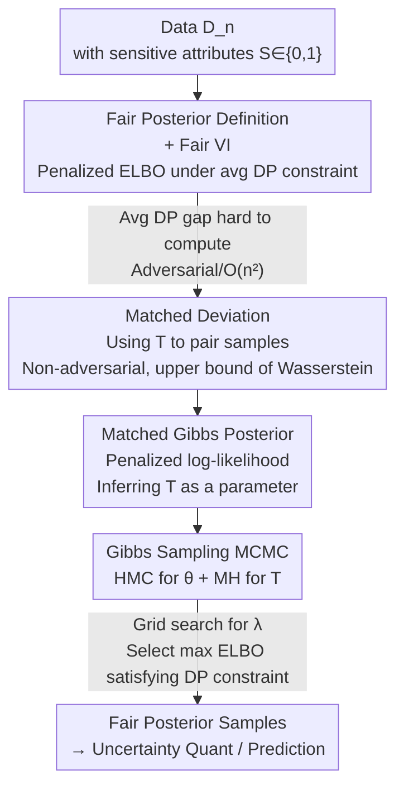

# A Fair Bayesian Inference through Matched Gibbs Posterior

**Conference**: ICLR2026  
**OpenReview**: [https://openreview.net/forum?id=sIjFXzEOOH](https://openreview.net/forum?id=sIjFXzEOOH)  
**Code**: https://github.com/JihuLee/MatchedGibbs  
**Area**: AI Safety / Algorithmic Fairness / Bayesian Inference  
**Keywords**: Group Fairness, Bayesian Inference, Gibbs Posterior, Uncertainty Quantification, Matched Deviation

## TL;DR
Targeting the limitation that "fair models only provide point estimates and fail to quantify predictive uncertainty," this paper integrates group fairness constraints into a Bayesian framework. It proposes the **matched Gibbs posterior** with **matched deviation** as a penalty term and treats the matching function $T$ as a learnable parameter to avoid adversarial training. This allows an $O(n)$ Gibbs sampler to simultaneously produce "calibrated" posterior distributions that satisfy demographic parity constraints.

## Background & Motivation
**Background**: In trustworthy AI, **group fairness** is the most extensively studied fairness concept. The most common criterion is **Demographic Parity (DP)**, which requires the model output $f(X,S)$ to be independent of the sensitive attribute $S$, meaning the predictive distributions $P_{f,0}$ and $P_{f,1}$ over two sensitive groups should be as consistent as possible. The mainstream approach is to add a DP constraint when "finding an accurate predictive model," resulting in a **single** fair point-estimate model.

**Limitations of Prior Work**: These methods only produce a deterministic model and **completely fail to quantify predictive uncertainty**. Modern deep networks are highly over-parameterized, prone to overfitting, and often give overconfident predictions. In high-risk scenarios such as medical diagnosis where data itself may be biased regarding sensitive attributes (e.g., biased skin cancer or Alzheimer's diagnostic datasets), uncertainty quantification (UQ) is indispensable for assisting clinical decision-making. In other words, "simultaneously fair and reliable uncertainty" has remained missing.

**Key Challenge**: Bayesian inference is naturally adept at UQ, but combining it with group fairness is difficult for two reasons: (1) A truly "strictly fair" posterior—truncating the full Bayesian posterior to the set of fair models $\{f:\Delta_\psi(f)\le\delta\}$—is impossible to characterize analytically for deep networks, and the posterior probability of this set is extremely small, making rejection sampling infeasible; (2) When resorting to Variational Inference (VI), every gradient update requires calculating the "average DP gap" $\mathbb{E}_{\theta\sim\nu}\Delta_\psi(f_\theta)$. Common deviation measures (KL, IPM) require **adversarial learning** to find a discriminator, which is computationally expensive and numerically unstable. Even using non-adversarial MMD results in $O(n^2)$ complexity, which is prohibitive for large datasets.

**Goal**: (1) Provide an actionable definition for the "degree of group fairness of a posterior distribution"; (2) Design a computationally feasible fair variational inference method that does not require adversarial learning; (3) Simultaneously improve both "utility–fairness" and "uncertainty–fairness" trade-off curves on real-world data.

**Key Insight**: The authors leverage the **Gibbs posterior** as a tool. It does not require specifying a complete likelihood; as long as a target function (such as a penalized negative log-likelihood) is treated as the log-likelihood, a posterior distribution can be obtained and sampled directly using standard MCMC without the constraints of parameter space geometry.

**Core Idea**: A **new group fairness measure, "matched deviation,"** is used as a penalty term to construct the Gibbs posterior. The **matching function $T$** within the measure is also treated as a parameter to be inferred. This transforms the "DP gap calculation" from an inner optimization problem requiring adversarial training into another set of variables that can be directly sampled within the Gibbs sampler, completely bypassing adversarial training.

## Method

### Overall Architecture
This paper solves the problem of "**providing a posterior distribution capable of quantifying uncertainty while ensuring group fairness**." The overall approach follows a path from "defining a fair posterior → formulating a variational objective with fairness penalties → using a Gibbs posterior as a proxy distribution → using a Gibbs sampler to simultaneously sample model parameters and matching functions."

The input is data $D_n=\{(x_i,y_i,s_i)\}$ ($s_i\in\{0,1\}$ is the sensitive attribute); the output is a posterior distribution $\nu_M(\theta,T\mid\lambda)$ for the parameters $\theta$. Sampling from this allows for downstream Bayesian tasks such as predictive distribution estimation, calibration, and uncertainty quantification. The key transition is replacing the difficult "average DP gap $\le\delta$" constraint with a "penalized log-likelihood using **matched deviation** $\Delta_M(\theta,T)$ as a penalty." The corresponding Gibbs posterior serves as the proxy for fair VI. The matching function $T$ is not optimized but sampled alongside $\theta$, converting the adversarial inner loop into a directly sampleable conditional distribution.

### Key Designs

**1. Definition of Fair Posterior: Moving "Fairness" from Single Models to Distributions**

Existing fairness criteria are defined for a single model $f$ (e.g., DP gap $\Delta_\psi(f)=\psi(P_{f,0},P_{f,1})$). However, Bayesian inference requires a distribution. The authors provide two levels of definitions: **Strictly $\psi$-fair** requires $\nu\{f:\Delta_\psi(f)\le\delta\}=1$, meaning the posterior falls almost everywhere within the set of fair models—this is too restrictive for mean-field Gaussian VI in deep networks. Thus, it is relaxed to **$\psi$-fair**: $\mathbb{E}_{f\sim\nu}\Delta_\psi(f)\le\delta$, where $\mathbb{E}_{f\sim\nu}\Delta_\psi(f)$ is called the **average DP gap**. These are bridged by rejection sampling: first find a weak fair posterior $\nu^{(w)}$ at level $\eta<\delta$, then let $\nu^{(s)}(\cdot)\propto\nu^{(w)}(\cdot)\,\mathbb{1}(\Delta_\psi(\cdot)\le\delta)$. By Markov's inequality, $\nu^{(w)}\{f:\Delta_\psi(f)\le\delta\}>1-\eta/\delta$, ensuring the acceptance rate. This step replaces an "analytically difficult truncated posterior" with an "expectation-constrained, optimizable" objective.

**2. Matched Deviation: Converting the DP Gap to a Non-adversarial, $O(n)$ Metric via Sample Pairing**

Directly calculating $\Delta_\psi$ is the computational bottleneck. IPM-based measures $\Delta_{\mathrm{IPM}_\mathcal{G}}(f)=\sup_{g\in\mathcal{G}}\big|\int g(f(x,0))P_{n,0}(dx)-\int g(f(x,1))P_{n,1}(dx)\big|$ require solving an adversarial optimization for every $\theta\sim\nu$ to find the discriminator $g$; MMD is non-adversarial but $O(n^2)$. The authors introduce a **matching function** $T:\mathcal{X}_1\to\mathcal{X}_0$ (satisfying $T_\#P_1=P_0$, which is a one-to-one pairing under empirical distributions) and define **matched deviation**:

$$\Delta_M(\theta,T):=\mathbb{E}_{X_1\sim P_1}\big(\|f_\theta(X_1,s{=}1)-f_\theta(T(X_1),s{=}0)\|_2\big),$$

which measures the output difference between paired samples from group 1 and group 0. Its theoretical value is supported by two theorems: **Theorem 4.1 ($\Delta_M\Rightarrow\Delta_W$)** shows that for any $T$, if $\Delta_M(\theta,T)\le\delta$, then the Wasserstein gap $\Delta_W(\theta)\le\delta$. Thus, matched deviation is an upper bound on the Wasserstein distance. **Theorem 4.2 ($\Delta_{TV}\Rightarrow\Delta_M$)** states that any model fair in the total variation sense has a $T$ that makes $\Delta_M$ small, ensuring the proxy doesn't "penalize" naturally fair models. Crucially, given $T$, $\Delta_M$ is just an average over paired samples, requiring no adversarial steps and reducing complexity to $O(n)$.

**3. Matched Gibbs Posterior: Inferring the Matching Function $T$ as a Parameter**

With matched deviation, one can formulate the penalized log-likelihood $\ell(\theta)-\lambda n\Delta_M(\theta,T)$ and construct the corresponding Gibbs posterior:

$$\nu_M(f,T\mid\lambda)\propto\exp\big(\ell(f)-\lambda n\,\Delta_M(f,T)\big)\,\pi(f)\,\pi(T).$$

The most ingenious stroke is **inferring $T$ and $f$ jointly** rather than treating "finding the optimal pairing/discriminator" as an inner optimization problem. The advantage is that "solving an adversarial $\sup_g$ for every $\theta$" is replaced by "sampling a pairing from the conditional posterior of $T$ while sampling $\theta$." The adversarial loop vanishes at the cost of sampling one additional set of variables. Theorems 4.1/4.2 motivate this: 4.1 ensures group fairness can be controlled by $\lambda$, and 4.2 ensures fair models can always find a $T$ with small $\Delta_M$.

**4. Gibbs Sampling MCMC: HMC for $\theta$ and Metropolis–Hastings for Discrete $T$**

In the posterior, $\theta$ is continuous while $T$ represents discrete sample pairings. The authors use a **Gibbs sampler** to alternately sample $\theta\sim p(\theta\mid T,D_n)$ and $T\sim p(T\mid\theta,D_n)$. Sampling $\theta$ is equivalent to sampling from $\nu_n(\theta;\lambda)$ with $T$ fixed, using **HMC**. For $T$, an "energy-based" prior $\pi(T)\propto e(T)$ is used:

$$e(T;\tau)=\exp\Big(-\sum_{i=1}^{n_1} d\big(X^{(0)}_i,\,T(X^{(1)}_i)\big)\big/ n_0\tau\Big),$$

which favors pairing samples that are close in distance $d$. During the MH step, a proposal $T \to T'$ is made by randomly selecting $k$ indices for a random permutation; since the proposal is symmetric, the acceptance probability is determined by the posterior ratio. $\lambda$ is selected via **grid search**: for each candidate $\lambda$, samples are generated to calculate ELBO and average DP, selecting the $\lambda$ with the highest ELBO among those satisfying "average DP $<\delta$." Each update is $O(n)$, a major scalability gain over $O(n^2)$ MMD.

## Key Experimental Results

Experiments were conducted on 5 group fairness benchmarks: tabular data (**ADULT / DUTCH / CRIME**), image data (**CELEBA**), and text data (**CIVIL**). Prediction models were DNNs. Baselines include 3 fair Bayesian methods (`variational_mmd`, `gibbs_mmd`, and ours `gibbs_matched`) and 3 deterministic DP SOTAs (`gapreg`, `reduction`, `adv`). Evaluation is based on **Pareto frontiers**: the x-axis is group fairness $\Delta_W^{1/2}=W_2(P_{f,0},P_{f,1})$, and the y-axis represents utility/uncertainty metrics.

### Main Results

| Dataset / Modality | Utility (Acc) Trend | Uncertainty (Nll/Brier) Trend | Conclusion |
|--------------|--------------|------------------------|------|
| CRIME (Tabular) | `gibbs_matched` has better trade-offs | Superior to all baselines | MMD methods are not competitive even at medium scale |
| ADULT / DUTCH (Tabular) | Pareto curve dominant | Dominant; best Ece trade-off on ADULT | Ece slightly lags when constraints are very strict |
| CELEBA (Image) | Acc leads by a large margin | Consistently lowest (best) uncertainty | Bayesian naturally improves UQ |
| CIVIL (Text) | Acc leads | Nll/Brier consistently optimal | `gapreg`/`reduction` overfit as fairness tightens, raising Nll |

> Note on $\Delta_W^{1/2}$: The square root of the Wasserstein gap is used to maintain the scale of $W_2$; smaller is fairer. For metrics, Acc is better when higher, while Nll/Brier/Ece are better when lower.

### Ablation Study

| Configuration | Investigation Point | Observation |
|------|--------|------|
| Varying temperature $\tau$ | Sharpness of $T$ energy prior | Superior trade-offs maintained across $\tau$ |
| Number of pre-training epochs | Impact of initialization | Trade-offs are robust |
| Flipping sensitive labels | Symmetry of $T$ direction | Conclusions remain unchanged |
| Prior selection | Robustness of $\pi(\theta)$ | Advantage is maintained |

### Key Findings
- **The MMD approach is impractical**: `variational_mmd`/`gibbs_mmd` are limited by $O(n^2)$ complexity and perform poorly in Acc/Nll/Brier. Replacing MMD with matched deviation improves both speed and performance.
- **Ece can be misleading**: On CRIME/DUTCH, the Ece trade-off for `gibbs_matched` degrades under strict fairness. However, the authors note that a "constant 0.5 confidence output" yields near-zero Ece but is useless; thus, low Ece must be viewed alongside Acc/Nll.
- **Incidental improvement in Individual Fairness**: Because matched deviation pulls outputs of different individuals closer, `gibbs_matched` outperforms baselines in consistency scores (Con)—a rare "bonus" for group fairness methods.
- MCMC convergence was verified through trace plots of $\theta$ and acceptance probabilities of $T$.

## Highlights & Insights
- **"Sampling-izing" the Adversarial Loop**: The most clever trick is replacing the $\sup_g$ in IPM (which must be solved for every $\theta$) with "sampling from the conditional posterior of the matching function $T$." This shifts the problem from optimization to sampling, making it non-adversarial and naturally integrated into the Gibbs framework.
- **Theoretical Guardrails**: Theorem 4.1 ensures that controlling $\Delta_M$ controls the actual group fairness (no false negatives), and Theorem 4.2 ensures fair models naturally find a pairing $T$ with small $\Delta_M$ (no false positives), making the proxy theoretically sound.
- **Fairness + UQ in One Go**: Most fairness methods only provide point estimates. This work moves the entire process into a Bayesian framework, making it possible to obtain "both fairness and calibrated uncertainty," which is critical for high-risk domains like healthcare.
- **Reusable Trick**: The energy-based prior $\pi(T)\propto\exp(-\sum d/n_0\tau)$ plus random permutation proposals for MH provides a general recipe for sampling discrete pairing/permutation variables.

## Limitations & Future Work
- **Principally Limited to Binary Sensitive Attributes**: While the paper focuses on $S\in\{0,1\}$, extensions for multi-group attributes are only discussed in the appendix.
- **Focus on Demographic Parity**: Primarily addresses DP (independence); extension to Equalized Odds is in the appendix, while separation/sufficiency criteria are not deeply explored.
- **Lack of Posterior Consistency Results**: The authors acknowledge that the theoretical properties of the matched Gibbs posterior consistency warrant further study.
- **Sampling Overhead of $T$**: While treating $T$ as a parameter avoids adversarial steps, it introduces discrete pairing variables and hyperparameters like $\tau$ and $k$. When $\mathcal{X}$ is not a metric space, $T$ cannot be pre-fixed via Optimal Transport to save costs.
- **Evaluation via Pareto Frontiers**: The paper lacks single-point numerical comparison tables; absolute differences must be inferred from plots.

## Related Work & Insights
- **Vs. Deterministic DP (GapReg / Reduction / Adv)**: These produce only point estimates and tend to overfit (higher Nll) as fairness constraints tighten. Ours provides a posterior distribution with superior UQ.
- **Vs. MMD-based Fair Bayes (variational_mmd / gibbs_mmd)**: Also non-adversarial, but MMD is $O(n^2)$ and is unscalable and less effective in Acc/Nll. Matched deviation is $O(n)$ and performs better.
- **Vs. IPM/Adversarial Fairness**: IPM requires solving an inner $\sup_g$ for every model sample, which is expensive and unstable. This work replaces optimization with sampling the matching $T$.
- **Vs. Kim et al. (2025a) Fixed OT Matching**: That work fixes $T$ using Optimal Transport in metric spaces to improve individual fairness. This work learns $T$, inheriting individual fairness benefits while extending applicability to non-metric spaces (e.g., text).

## Rating
- Novelty: ⭐⭐⭐⭐⭐ Integrating group fairness into a Bayesian framework and bypassing adversarial loops via "matched deviation + sampling $T$" is a clean, theoretically supported new perspective.
- Experimental Thoroughness: ⭐⭐⭐⭐ Covers five datasets across tabular/image/text and utility/uncertainty trade-offs. However, reliance on Pareto plots makes single-point comparisons difficult.
- Writing Quality: ⭐⭐⭐⭐ Clear progression from definition to challenge to method. Theorems are well-integrated with motivations.
- Value: ⭐⭐⭐⭐⭐ Simultaneously achieves fairness and calibrated uncertainty for high-risk decisions with an $O(n)$ scalable approach.

<!-- RELATED:START -->

## Related Papers

- [\[ICLR 2026\] A Bayesian Nonparametric Framework for Private, Fair, and Balanced Tabular Data Synthesis](a_bayesian_nonparametric_framework_for_private_fair_and_balanced_tabular_data_sy.md)
- [\[ICML 2026\] How Does Bayesian Sampling Help Membership Inference Attacks?](../../ICML2026/ai_safety/how_does_bayesian_sampling_help_membership_inference_attacks.md)
- [\[ICLR 2026\] EigenScore: OOD Detection using Posterior Covariance in Diffusion Models](eigenscore_ood_detection_using_posterior_covariance_in_diffusion_models.md)
- [\[CVPR 2026\] All Vehicles Can Lie: Efficient Adversarial Defense in Fully Untrusted-Vehicle Collaborative Perception via Pseudo-Random Bayesian Inference](../../CVPR2026/ai_safety/all_vehicles_can_lie_efficient_adversarial_defense_in_fully_untrusted-vehicle_co.md)
- [\[ICLR 2026\] Fair Conformal Classification via Learning Representation-Based Groups](fair_conformal_classification_via_learning_representation-based_groups.md)

<!-- RELATED:END -->
## Related Papers

- [\[ICLR 2026\] A Bayesian Nonparametric Framework for Private, Fair, and Balanced Tabular Data Synthesis](a_bayesian_nonparametric_framework_for_private_fair_and_balanced_tabular_data_sy.md)
- [\[ICML 2026\] How Does Bayesian Sampling Help Membership Inference Attacks?](../../ICML2026/ai_safety/how_does_bayesian_sampling_help_membership_inference_attacks.md)
- [\[ICLR 2026\] Fair Conformal Classification via Learning Representation-Based Groups](fair_conformal_classification_via_learning_representation-based_groups.md)
- [\[ICML 2026\] Singular Bayesian Neural Networks](../../ICML2026/ai_safety/singular_bayesian_neural_networks.md)
- [\[ICLR 2026\] Memorization Through the Lens of Sample Gradients](memorization_through_the_lens_of_sample_gradients.md)

<!-- RELATED:END -->
