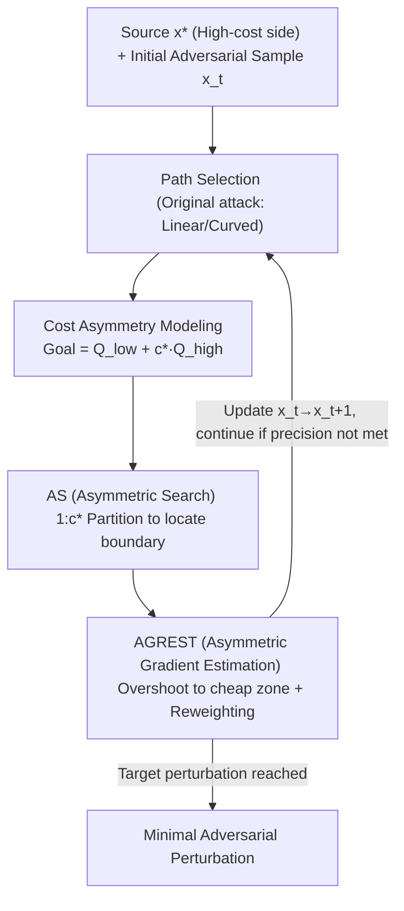

# A General Framework for Black-Box Attacks Under Cost Asymmetry

**Conference**: ICLR 2026  
**OpenReview**: [https://openreview.net/forum?id=G1fFulgfd8](https://openreview.net/forum?id=G1fFulgfd8)  
**Code**: https://github.com/mahdisalmani/Asymmetric-Attacks  
**Area**: AI Security / Adversarial Attacks  
**Keywords**: Decision-based black-box attacks, cost asymmetry, boundary search, gradient estimation, importance sampling

## TL;DR
Addressing real-world scenarios where "different queries incur different costs" (e.g., submitting violating images to an NSFW detector triggers account bans), this paper proposes a general framework for decision-based black-box attacks adaptable to **any cost ratio $c^\star$**. By replacing binary search with Asymmetric Search (AS) and standard Monte Carlo gradient estimation with Asymmetric Gradient Estimation (AGREST), the framework minimizes total query costs without discarding core attack components, reducing perturbation norms by up to 40%.

## Background & Motivation
**Background**: Decision-based black-box attacks can only observe the **final decision** (rather than probabilities) returned by a classifier. By repeatedly querying to approximate the decision boundary, they construct minimal adversarial perturbations. Methods from Boundary Attack to HSJA, GeoDA, and CGBA have reduced the required queries by one to three orders of magnitude, but most assume "equal cost per query," aiming to **minimize the total number of queries**.

**Limitations of Prior Work**: In reality, query costs are asymmetric. When attacking an NSFW (Not Safe For Work) detector, queries flagged as violating incur much higher costs than normal ones—platforms trigger manual reviews, bans, or penalties. The paper notes that on X (Twitter), an account can post 2,400 times a day but is banned after 5–10 violations. Since existing decision-based attacks have approximately **half of their queries flagged**, an attacker would be banned after only ~20 queries. Counting total queries fails to reflect this cost disparity.

**Key Challenge**: The stealthy attack by Debenedetti et al. (2024) recognized this but framed the problem too narrowly by **implicitly assuming the cost of normal queries is zero** (minimizing only flagged queries). Because they could not adapt HSJA's Monte Carlo gradient estimation into a stealthy version, they reverted to less efficient OPT-style estimation. Consequently, to save 100 flagged queries, they generate $10^6$ normal queries—the cumulative cost of which results in more banned accounts (estimated at 400 bans vs. 10 for the flagged queries). Thus, "minimizing only expensive queries" is biased.

**Goal**: Design a general framework **effective for any cost ratio without discarding core components** of original attacks (retaining both binary search concepts and efficient Monte Carlo gradient estimation).

**Key Insight**: The two core operations of decision-based attacks—searching for boundary points along a path and estimating gradient directions—are the primary sources of "high-cost queries." By shifting the **query distribution** toward the "cheaper" zone during these operations, costs can be reduced while maintaining effectiveness.

**Core Idea**: Reformulate the objective from "minimizing query count" to "minimizing total cost $\text{cost}=Q_{\text{non-flagged}}+Q_{\text{flagged}}\cdot c^\star$." Based on this, redesign the search (partitioning at $1:c^\star$ instead of $1:1$) and gradient estimation (pushing the sampling center toward the cheaper zone with reweighting), using a continuous knob $c^\star$ to cover the spectrum from vanilla ($c^\star{=}1$) to stealthy ($c^\star{=}\infty$).

## Method

### Overall Architecture
A decision-based black-box attack iteratively performs two tasks: ① **Path selection** (linear like HSJA/GeoDA, or curved like SurFree/CGBA); ② **Search along the path + gradient estimation** to update the adversarial sample $x_t$ closer to the source $x^\star$. This paper provides a "plug-in" framework that **replaces** the components responsible for the most expensive queries: binary search is replaced by **AS**, and standard Monte Carlo estimation is replaced by **AGREST**, while path selection remains unchanged. This allows the creation of variants like A-HSJA, A-GeoDA, etc.

The optimization target is normalized to:
$$\text{cost} := Q_{\text{non-flagged}} + Q_{\text{flagged}}\cdot c^\star,\qquad c^\star=\frac{c_{\text{flagged}}+c_0}{c_0}.$$

Queries flagged as adversarial by the detector ($\phi(x'){=}-1$) are high-cost, while others are low-cost.

### Key Designs

**1. Cost Asymmetry Modeling: Minimizing Total Cost**
The fundamental limitation of stealthy attacks is treating normal queries as free. This framework explicitly minimizes $Q_{\text{non-flagged}}+c^\star Q_{\text{flagged}}$. This allows vanilla ($c^\star{=}1$) and stealthy ($c^\star{=}\infty$) scenarios to be endpoints of the same framework. Furthermore, choices in AS and AGREST (interval partitioning, sampling center shift, weights) are derived from the unified principle of "minimizing expected cost."

**2. AS (Asymmetric Search): $1:c^\star$ Partitioning**
Binary search partitions intervals into $1:1$, which is optimal for minimizing query count but results in an expected cost of $\Theta(c^\star\log(1/\tau))$ under asymmetry. AS partitions the interval $[b_l\tau,b_u\tau]$ using $b_m=b_l+\big\lceil\frac{b_u-b_l}{c^\star+1}\big\rceil$. If $\phi(T(b_m\tau)){=}1$ (the cheaper adversarial side), the search continues in the right segment; otherwise, the left. This shifts probes toward the cheaper zone. AS reduces expected cost to $O\!\big(c^\star\log_{c^\star+1}(1/\tau)\big)$, an improvement of $\Theta(\log(c^\star+1))$ over binary search.

**3. AGREST (Asymmetric Gradient Estimation): Overshoot + Reweighting**
Standard Monte Carlo centers the sampling sphere at the boundary point $x_t$, leading to ~50% high-cost queries. AGREST samples at an **overshot point** $x_t'=x_t+\omega_t\frac{x_t-x^\star}{\lVert x_t-x^\star\rVert_2}$. Pushing the center into the adversarial (cheaper) zone reduces flagged queries. To correct the bias, importance reweighting is applied using a weight function $\hat\phi_t(x)=(1-\beta_t)\mathbb{1}\{\phi(x){=}1\}-\beta_t\mathbb{1}\{\phi(x){=}-1\}$ (where $\tfrac12\le\beta_t<1$), lowering estimation variance. Optimal parameters $(\omega_t,\beta_t,n_t)$ are derived under a **local linearity** assumption.

## Key Experimental Results

### Main Results
**Setup**: ResNet-50, ViT-B, and CLIP on ImageNet. Metric: Median $\ell_2$ distance at a fixed total cost (lower is better).

Median $\ell_2$ on ResNet-50 (selection):

| Attack | Variant | $c^\star{=}2$ | $c^\star{=}5$ | $c^\star{=}10^2$ | $c^\star{=}10^3$ |
|------|------|------|------|------|------|
| SurFree | VA (Vanilla) | 4.09 | 5.19 | 5.21 | 17.49 |
| SurFree | +AS (A-SurFree) | 3.45 | 3.52 | 3.80 | **7.59** |
| HSJA | VA | 2.24 | 2.77 | 4.66 | 23.72 |
| HSJA | +AS+AGREST (A-HSJA) | 2.13 | 2.39 | 2.16 | **12.28** |
| GeoDA | +AS+AGREST (A-GeoDA) | 2.93 | 2.8 | 2.11 | **5.78** |
| CGBA | +AS+AGREST (A-CGBA) | 1.15 | 1.33 | 1.58 | **6.23** |

At $c^\star{=}10^3$, A-HSJA reduces perturbation from 23.72 to 12.28, and A-GeoDA reduces it from 10.80 to 5.78.

### Ablation Study
- **AGREST is the main driver**: Replacing only the gradient estimation component reduces $\ell_2$ by ~40% at high $c^\star$, as gradient estimation consumes the bulk of the query budget.
- **AS provides consistent gains**: While search queries are fewer, AS further optimizes the cost, especially as $c^\star$ increases.

### Key Findings
- **The more asymmetric, the higher the gain**: The advantage over vanilla attacks grows significantly with $c^\star$.
- **Outperforms Stealthy Attacks**: In all extreme asymmetric settings ($c^\star \ge 10^4$), the A-* variants outperform Stealthy HSJA because AGREST preserves the efficiency of Monte Carlo estimation which the stealthy variant had to discard.

## Highlights & Insights
- **Unified Parameter**: Using $c^\star$ to unify binary search and linear search into a single spectrum is an elegant theoretical contribution.
- **Accounting for "Cheap" Queries**: Highlighting that massive amounts of "cheap" queries also accumulate significant costs effectively challenges the assumptions of prior stealthy attacks.
- **Overshooting + Reweighting**: This combination provides a transferable strategy for any black-box optimization scenario with asymmetric costs.

## Limitations & Future Work
- **Dependence on Local Linearity**: Optimal parameters rely on the boundary being locally linear; performance may degrade on highly non-linear boundaries.
- **Heuristic Scheduler**: The parameter $\alpha_t$ relies on a heuristic scheduler, introducing sensitivity to the hyperparameter $m$.
- **Defense Perspective**: This framework poses a realistic threat to safety systems. Future work should investigate "cost-aware" defenses.

## Related Work & Insights
- **vs. Stealthy Attacks**: Prior work assumed normal queries are free. This paper shows that under realistic constraints, over-optimizing for flagged queries can lead to higher overall account ban rates.
- **vs. SOTA (HSJA/GeoDA/etc.)**: This framework acts as a modular enhancement to existing state-of-the-art decision-based attacks, upgrading them from "query-minimizing" to "cost-minimizing."

## Rating
- **Novelty**: ⭐⭐⭐⭐⭐ First framework to cover arbitrary cost ratios while preserving core Monte Carlo components.
- **Experimental Thoroughness**: ⭐⭐⭐⭐ Comprehensive cross-attack and cross-architecture evaluation.
- **Writing Quality**: ⭐⭐⭐⭐⭐ Clear motivation supported by practical examples and solid theoretical anchoring.
- **Value**: ⭐⭐⭐⭐ Significant implications for both the development of attacks and the auditing of content moderation systems.

<!-- RELATED:START -->

## Related Papers

- [\[ICLR 2026\] SeRI: Gradient-Free Sensitive Region Identification in Decision-Based Black-Box Attacks](seri_gradient-free_sensitive_region_identification_in_decision-based_black-box_a.md)
- [\[ICLR 2026\] Traceable Black-box Watermarks for Federated Learning](traceable_black-box_watermarks_for_federated_learning.md)
- [\[ICLR 2026\] Black-Box Privacy Attacks on Shared Representations in Multitask Learning](black-box_privacy_attacks_on_shared_representations_in_multitask_learning.md)
- [\[ICLR 2026\] Fairness via Independence: A General Regularization Framework for Machine Learning](fairness_via_independence_a_general_regularization_framework_for_machine_learnin.md)
- [\[CVPR 2026\] SEBA: Sample-Efficient Black-Box Attacks on Visual Reinforcement Learning](../../CVPR2026/ai_safety/seba_sample-efficient_black-box_attacks_on_visual_reinforcement_learning.md)

<!-- RELATED:END -->
## Related Papers

- [\[ICLR 2026\] SeRI: Gradient-Free Sensitive Region Identification in Decision-Based Black-Box Attacks](seri_gradient-free_sensitive_region_identification_in_decision-based_black-box_a.md)
- [\[ICLR 2026\] Black-Box Privacy Attacks on Shared Representations in Multitask Learning](black-box_privacy_attacks_on_shared_representations_in_multitask_learning.md)
- [\[ICLR 2026\] Traceable Black-box Watermarks for Federated Learning](traceable_black-box_watermarks_for_federated_learning.md)
- [\[ICLR 2026\] Fairness via Independence: A General Regularization Framework for Machine Learning](fairness_via_independence_a_general_regularization_framework_for_machine_learnin.md)
- [\[CVPR 2026\] SEBA: Sample-Efficient Black-Box Attacks on Visual Reinforcement Learning](../../CVPR2026/ai_safety/seba_sample-efficient_black-box_attacks_on_visual_reinforcement_learning.md)

<!-- RELATED:END -->
