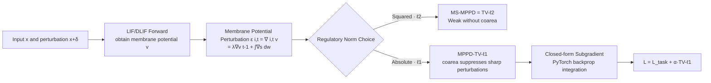

# A Unified Total Variation Framework for Membrane Potential Perturbation Dynamic

**Conference**: ICLR 2026  
**OpenReview**: [https://openreview.net/forum?id=LDo9numrx6](https://openreview.net/forum?id=LDo9numrx6)  
**Code**: [https://github.com/laizhr/MPPD-TV](https://github.com/laizhr/MPPD-TV)  
**Area**: AI Safety / Adversarial Robustness of Spiking Neural Networks  
**Keywords**: Spiking Neural Network, Membrane Potential, Total Variation, Adversarial Robustness, Coarea Formula  

## TL;DR
This paper proves that the "Membrane Potential Perturbation Dynamic (MPPD)" used to characterize adversarial perturbations in Spiking Neural Networks (SNNs) is essentially a Total Variation (TV) operator. Consequently, existing mean-square MPPD regularization is equivalent to a TV-$\ell_2$ framework. The authors propose a stronger **TV-$\ell_1$ framework**—leveraging the coarea formula to achieve better suppression of sharp adversarial noise—reaching new SOTA robust accuracy for SNNs under both Gaussian and adversarial training.

## Background & Motivation
- **Background**: SNNs are considered a low-power direction for deep learning due to energy-efficient sparse activations. However, like ANNs, SNNs are vulnerable to adversarial examples, hindering their deployment in safety-sensitive scenarios. A promising defense involves observing that adversarial perturbation information is hidden in the membrane potential of LIF neurons. Ding et al. (2024a) proposed the Membrane Potential Perturbation Dynamic (MPPD) and used its mean-square (MS-MPPD) as a regularizer to stabilize SNNs.
- **Limitations of Prior Work**: The complete MPPD formula consists of two parts: the "MPPD main term" and the "neuron reset term." Prior methods assumed the reset term caused violent dynamic fluctuations and **discarded it directly**, retaining only the main term. This treatment, while intuitive, lacks theoretical grounding and potentially ignores critical perturbation information.
- **Key Challenge**: MS-MPPD uses a mean-square ($\ell_2$) form. The squared TV term in $\ell_2$ **does not satisfy the coarea formula**, leading to a lack of robustness against sharp noise. Simultaneously, the $L_2$ function space is smaller than $L_1$, restricting the representable classes of membrane potential functions. Essentially, existing frameworks fail to define the mathematical essence of MPPD and utilize an inherently weaker norm.
- **Goal**: Establish a complete mathematical theory for MPPD—answering "what it exactly is"—and construct a more robust training framework based on this theory.
- **Core Idea**: **[Key Insight] MPPD is the Total Variation (TV) of the membrane potential across the 2D "neuron + time-step" space**. Once this identity is recognized, one can: ① prove MS-MPPD = TV-$\ell_2$; ② naturally upgrade to the more robust **TV-$\ell_1$** common in signal reconstruction, utilizing the coarea formula to counter perturbations.

## Method

### Overall Architecture
The paper does not modify the SNN backbone but reinterprets and upgrades the regularization on membrane potentials. The MPPD recursion $\epsilon^l_i[t]=\lambda\epsilon^l_i[t-1]+\sum_j w^l_{ij}\Delta s^{l-1}_j[t]$ is translated into a local variation in the $(i,t)$ space, proving it is TV. Thus, the mean-square regularizer $L_{\text{MS-MPPD}}=\sum_{i,t}(\epsilon^L_i[t])^2$ is exactly TV-$\ell_2$. This is replaced with an absolute value form to obtain TV-$\ell_1$, complemented by three theoretical components: the coarea formula, the dominated TV property, and closed-form subgradients. Ultimately, the regularization term in the objective $\min_w\{L_{\text{task}}+\alpha\cdot L_{\text{MPPD}}\}$ is switched from $\ell_2$ to $\ell_1$, while the rest of the training flow (STBP + triangular surrogate gradient) remains unchanged.

### Key Designs

**1. Identifying MPPD as TV: Perturbation = Local Variation of Membrane Potential (Theorem 1).** The paper begins by giving MPPD a measure-theoretic identity. By treating the neuron index $i$, time-step $t$, and input $x$ as independent variables, the perturbation term aims to approximate the difference between the clean and perturbed membrane potentials $v(i,t,x)-v(i,t,x+\delta)$. If the perturbation $\delta$ can be written as a measurable function $\delta(i,t)$, this difference **is exactly the local variation of $v$** in the $(i,t)$ dimension: $\epsilon(i,t,x):=\nabla_{(i,t)}v(i,t,x)$. The key intuition is that $\delta(i,t)$ can be embedded into specific SNN nodes/time-steps, making the spatio-temporal evolution of SNNs a natural "accumulation of membrane potential increments"—the definition of TV. Thus, the MS-MPPD regularizer $\sum(\epsilon^L_i[t])^2=\int|\nabla_{(i,t)}v|^2$ is established as a standard **TV-$\ell_2$ framework**.

**2. Upgrading to TV-$\ell_1$: Using the Coarea Formula to Suppress Sharp Perturbations (Theorem 2 & 3).** After identifying the TV identity, the paper adopts the norm more robust for signal reconstruction. Summing the recursion over time yields $\nabla_{(i,t)}v=\sum_{k=0}^{t-1}\lambda^k\int_{J(i)}\nabla_{(j,t)}s(j,t-k,x)\,dw$, which is a sum of spike perturbations; thus, the **absolute value** (rather than square) accurately measures perturbation magnitude. The advantage of TV-$\ell_1$ lies in the coarea formula $\int_\Theta|\nabla_{(i,t)}v|\,d\mu=\int_{-\infty}^{\infty}\phi(\{(i,t):v=\psi\})\,d\psi$, which slices the domain into level sets based on membrane potential values $\psi$. It calculates the Hausdorff measure of "how many $(i,t)$ pairs fall here." If a specific interval aggregates many points (typical of sharp adversarial structures), its TV contribution is large and specifically suppressed during optimization. TV-$\ell_2$ **lacks a coarea formula** and is insensitive to such sharp noise.

**3. Dominated TV Property: Controlling Membrane Potential TV via Spike TV (Theorem 4).** To ensure the regularizer stabilizes the network, the membrane potential TV must be bounded. The paper proves that membrane potential TV is dominated by spike TV: $\int|\nabla_{(i,t)}v|\le\|w^l\|_1\log_\lambda(\tfrac{1}{e})\int|\nabla_{(j,t)}s|$ (discrete factor is $\tfrac{\|w^l\|_1}{1-\lambda}$). Since spikes originate from the Heaviside function, $|\nabla_{(j,t)}s|\le 1$ with a finite integration upper bound, ensuring the left side is constrained. The dominance factor $\|w^l\|_1$ represents energy diffusion by weights, while $\log_\lambda(\tfrac{1}{e})$ represents temporal scaling—as $\lambda$ approaches 1 (common for temporal smoothness), a larger spike TV scaling is required to suppress membrane potential TV, unifying smoothness and stability in one inequality.

**4. Closed-form Subgradient: Enabling Non-differentiable $\ell_1$ in PyTorch (Proposition 5).** The absolute value term in TV-$\ell_1$ is non-differentiable with respect to weights $w(i,j(i))$. The paper provides a closed-form subgradient: taking $\mathrm{sign}(\cdot)$ of the summation term multiplied by the spike variation $\sum_k\lambda^k\nabla_{(j,t)}s$. This is computationally consistent with standard gradient calculations, allowing MPPD-TV-$\ell_1$ to integrate seamlessly into STBP training. Crucially, this subgradient **captures TV sensitivity at every time-step regardless of whether the threshold is crossed or a reset occurs**, effectively filling the gap left by prior MPPD methods that discarded the reset term.

## Key Experimental Results

Settings: VGG11 / WRN16 + DLIF neurons, 8 time-steps; datasets CIFAR-10/100, Tiny ImageNet; training perturbations include Gaussian noise, Adversarial Training (AT), and AT+Reg. Testing attacks include FGSM, C&W, PGD(7~40), APGD, and AutoAttack (AA) at $\zeta=8/255$. Comparisons with 8 SOTA methods (SNN-BP / HIRE-SNN / SNN-RAT / FEEL / SR / etc.) and a Non-MPPD ablation.

### Main Results (CIFAR-10, Adversarial Training AT, Accuracy %)

| Model (VGG11) | Clean | APGD10-CE | APGD10-DLR | FGSM | PGD20 | C&W | AutoAttack |
|---|---|---|---|---|---|---|---|
| Non-MPPD | 85.03 | 29.82 | 34.35 | 46.96 | 34.24 | 60.64 | 16.39 |
| MPPD-TV-$\ell_2$ | 85.17 | 27.78 | 35.30 | 46.51 | 32.26 | 63.05 | 19.75 |
| **MPPD-TV-$\ell_1$** | **86.11** | **36.59** | **45.26** | **51.89** | **41.15** | **66.68** | **23.04** |

### Ablation Study (Non-MPPD vs $\ell_2$ vs $\ell_1$, CIFAR-10 / WRN16, AT+Reg)

| Model | Clean | APGD10-CE | FGSM | PGD20 | AutoAttack |
|---|---|---|---|---|---|
| Non-MPPD | 84.64 | 35.50 | 56.88 | 34.87 | 11.16 |
| MPPD-TV-$\ell_2$ | 84.22 | 33.53 | 58.32 | 32.70 | 13.69 |
| **MPPD-TV-$\ell_1$** | **85.40** | **36.68** | 57.44 | **35.90** | **18.01** |

### Key Findings
- **TV-$\ell_1$ dominates TV-$\ell_2$ and Non-MPPD**: Under AT, VGG11's AutoAttack accuracy increases from 19.75% ($\ell_2$) to 23.04% ($\ell_1$), and APGD-DLR increases from 35.30% to 45.26%, while clean accuracy also improves (86.11% vs 85.17%).
- **Clean accuracy benefit**: TV-$\ell_1$ produces smoother membrane potential trajectories, improving generalization. Clean accuracy is consistently highest across Gaussian, AT, and AT+Reg.
- **$\ell_1$ superiority in Gaussian training**: While pure Gaussian training is fragile against strong white-box attacks (often 0%), MPPD-TV-$\ell_1$ maintains a slight lead (e.g., AA 0.29% vs 0.00%), confirming $\ell_1$'s sensitivity to sharp perturbations.

## Highlights & Insights
- **Identity-based theoretical contribution**: Instead of inventing a new architecture, identifying an empirical method (MPPD) as a classical operator (TV) provides theoretical grounding and an upgrade path.
- **Coarea formula as a defense tool**: Transferring the classical conclusion that TV-$\ell_1$ is superior to TV-$\ell_2$ from image processing to SNN membrane potentials is a clear and well-motivated theoretical application.
- **Complete theoretical loop**: From TV equivalence to coarea, dominated TV (ensuring stability), and closed-form subgradients (ensuring trainability), the four theorems are logically interlocking.

## Limitations & Future Work
- **Narrow Task Scope**: Experiments are limited to image classification (CIFAR/Tiny-ImageNet) and VGG11/WRN16. Performance on larger models, detection/segmentation, or neuromorphic datasets (event cameras) is unverified.
- **Low Absolute Robust Accuracy**: The best AA accuracy is only ~23%, which is far from practical security. The method acts more as an enhancement rather than an independent defense.
- **Dependence on $\lambda \approx 1$**: The dominated TV property requires $\lambda$ to be near 1, suggesting sensitivity to hyperparameters $\lambda$ and $\alpha$ that hasn't been fully explored.
- **Measurability Assumption**: The assumption that $\delta$ is a measurable function of $(i,t)$ lacks empirical characterization for real-world attacks.

## Related Work & Insights
- **Original MPPD (Ding et al., 2024a)**: The direct predecessor which proposed MPPD and MS-MPPD, proven here to be a TV-$\ell_2$ subcase.
- **Total Variation (Rudin et al., 1992; Chan et al., 2006)**: Classical tools for image denoising; TV-$\ell_1$ vs TV-$\ell_2$ and the coarea formula form this paper's foundation.
- **SNN Adversarial Robustness (SNN-RAT, HIRE-SNN, etc.)**: Efforts focusing on input encoding, leakage factors, and gradient sparsity. This work is orthogonal and can be combined with these methods.
- **Insight**: Many empirical regularizers in deep learning may have a mathematical "true form" in functional analysis or measure theory. Identifying these allows the use of superior variants developed by the mathematics community.

## Rating
- **Novelty**: ⭐⭐⭐⭐ — Proving MPPD is TV and upgrading to TV-$\ell_1$ is a sharp theoretical insight; using coarea as a defense tool is novel.
- **Experimental Thoroughness**: ⭐⭐⭐ — Comprehensive attack types and baselines, but narrow in tasks/backbones; absolute robust accuracy remains low.
- **Writing Quality**: ⭐⭐⭐⭐ — Clear derivation logic (4 theorems + subgradients) and well-articulated motivation.
- **Value**: ⭐⭐⭐⭐ — Provides a theoretically sound, plug-and-play regularizer for SNN robustness and demonstrates a generalizable research paradigm of "identify and upgrade."

<!-- RELATED:START -->

## Related Papers

- [\[AAAI 2026\] MPD-SGR: Robust Spiking Neural Networks with Membrane Potential Distribution-Driven Surrogate Gradient Regularization](../../AAAI2026/ai_safety/mpd-sgr_robust_spiking_neural_networks_with_membrane_potential_distribution-driv.md)
- [\[ICLR 2026\] Unified Privacy Guarantees for Decentralized Learning via Matrix Factorization](unified_privacy_guarantees_for_decentralized_learning_via_matrix_factorization.md)
- [\[ICLR 2026\] A General Framework for Black-Box Attacks Under Cost Asymmetry](a_general_framework_for_black-box_attacks_under_cost_asymmetry.md)
- [\[ICLR 2026\] RESFL: An Uncertainty-Aware Framework for Responsible Federated Learning by Balancing Privacy, Fairness and Utility](resfl_an_uncertainty-aware_framework_for_responsible_federated_learning_by_balan.md)
- [\[ICLR 2026\] DPQuant: Efficient and Private Model Training via Dynamic Quantization Scheduling](dpquant_efficient_and_private_model_training_via_dynamic_quantization_scheduling.md)

<!-- RELATED:END -->
