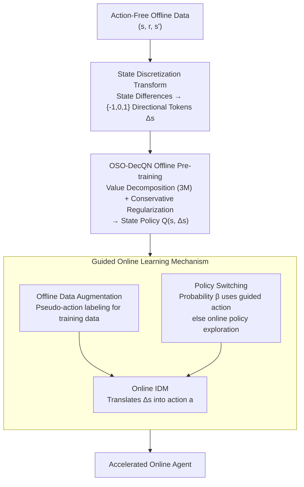

# Action-Free Offline-to-Online RL via Discretised State Policies

**Conference**: ICLR 2026  
**arXiv**: [2602.00629](https://arxiv.org/abs/2602.00629)  
**Code**: Yes (Provided in supplementary materials)  
**Area**: AI Safety  
**Keywords**: Action-free offline RL, state policy, state discretization, DecQN, guided online learning

## TL;DR

This paper formally defines the "Action-Free Offline-to-Online RL" setting for the first time and proposes the OSO-DecQN algorithm. By discretizing continuous state differences into three categorical tokens $\{-1, 0, 1\}$, the method pre-trains a state policy (predicting desired directions of state change rather than actions) on data containing only $(s, r, s')$ tuples. During the online phase, the state policy is converted into executable actions via a policy switching mechanism and an online-trained inverse dynamics model, accelerating online agent learning. Consistent improvements in convergence speed and asymptotic performance are demonstrated on D4RL and DeepMind Control Suite (including a 78-dimensional state space).

## Background & Motivation

**Background**: Offline RL has enabled learning policies from static datasets, but almost all existing methods assume that datasets include complete action labels $(s, a, r, s')$.

**Limitations of Prior Work**: Action information is naturally missing in many real-world scenarios—medical records exclude treatment decisions for privacy, financial transactions hide specific operations to protect proprietary strategies, and robotic sensor logs omit control signals due to storage limits. Such $(s, r, s')$ data is abundant but cannot be utilized by standard offline RL.

**Limitations of existing attempts**: (1) $Q_{SS'}$ methods (Edwards et al., 2020; Hepburn et al., 2024) estimate the value of state transitions but still rely on action labels during training; (2) Zhu et al. (2023) use Decision Transformers to learn action-free state policies, but face high computational costs, unstable online guidance, and limited validation; (3) Action discretization strategies (Seyde et al., 2022) depend on bounded action ranges and are inapplicable to action-free datasets. **No existing method simultaneously satisfies: learning from action-free offline data + high-dimensional scalability + effective guidance for online learning.**

**Key Challenge**: Action-free data cannot be directly used for any standard value-based or policy-based RL algorithms. Direct regression for next-state prediction in continuous space leads to instability and overfitting.

**Core Idea**: Instead of learning "what action to take," learn "how the state should change." By discretizing continuous state differences into directional tokens $\{-1, 0, 1\}$, the ill-posed continuous regression problem is transformed into a structured classification problem, bypassing the action space while retaining sufficient decision information.

## Method

### Overall Architecture

The objective is to utilize offline datasets containing only $(s, r, s')$ without action labels. OSO-DecQN circumvents "action prediction" by predicting "the direction of state change" and translates these directions into actions during the online stage. The pipeline consists of two phases: **Offline Pre-training**, where state differences are discretized into directional tokens to learn a state policy $Q(s, \Delta s)$, where $\Delta s \in \{-1, 0, 1\}^M$ records the desired discrete change direction for each state dimension; and **Guided Online Learning**, where the pre-trained state policy, via policy switching and an online-trained Inverse Dynamics Model (IDM), translates $\Delta s$ into executable actions to accelerate the online agent's convergence.

### Key Designs

**1. State Discretization Transform: Reformulating Ill-posed Regression as Structured Classification**

Directly regressing the next state $s'$ or the state difference $s'-s$ is experimentally shown to be nearly impossible—performance of policies from continuous regression is close to random. Continuous targets are unstable and prone to overfitting, with decision signals often drowned in noise. The proposed approach first computes z-score standardization for state differences and then uses a threshold $\epsilon$ to map each dimension to three directional tokens (decrease/stay/increase):

$$\delta_i^\epsilon(s,s') = \begin{cases} -1 & s'_i - s_i < -\epsilon \\ 1 & s'_i - s_i > \epsilon \\ 0 & \text{otherwise} \end{cases}$$

This transforms continuous prediction into discrete classification, preserving "where to go" decision information while eliminating regression instability. Z-score standardization provides scale invariance, removing the need for per-dimension threshold tuning. Discretization incurs a controllable theoretical cost—the value function error introduced by $k$-bin discretization is $O(H\sqrt{M}/k)$, which decreases as the number of bins increases; thus, coarse discretization does not introduce systematic bias.

**2. OSO-DecQN Offline Pre-training: Compressing $3^M$ Combinatorial Space to Linear via Value Decomposition**

After discretization, choosing one of three options for $M$ state dimensions leads to $3^M$ combinations, making a joint Q-value function infeasible. Following the DecQN value decomposition logic but applying it to state difference dimensions, the total Q-value is represented as the mean of utility branches for each dimension:

$$Q_\theta(s, \Delta s) = \frac{1}{M}\sum_{j=1}^M U^j_{\theta_j}(s, \Delta s_j)$$

By maintaining an independent utility branch $U^j$ for each state dimension, complexity is reduced from exponential $3^M$ to linear $3M$, enabling scalability to a 78-dimensional state space. Ensemble variants and double Q-learning are employed to suppress variance. To prevent overestimation in the offline setting, a conservative regularizer is added:

$$R_\theta = \sum_{(s,\Delta s)\sim D} \log \| \exp(Q_\theta(s, \cdot)) \|_1 - Q_\theta(s, \Delta s)$$

This is equivalent to CQL punishment in a discrete setting, addressing two issues: reducing overestimation bias for out-of-distribution actions and constraining the policy to state transitions reachable in the data. Ablations show that removing this term leads to failure in almost all tasks, identifying it as a necessary condition for offline performance.

**3. Guided Online Learning Mechanism: Translating State Policy Knowledge to Online Agents**

Since the state policy outputs directions $\Delta s$ while the environment accepts actions, a bridge is required. Three mechanisms facilitate this: **Policy Switching**, which uses a probability $\beta$ to adopt the offline guided action $a = I_\phi(s, \arg\max_{\Delta s} Q(s, \Delta s))$ or the online policy $\pi_{on}(s)$ for exploration; **Online IDM Training**, which trains a lightweight Inverse Dynamics Model $I_\phi$ with L1 loss using online-collected $(s, a, s')$ tuples to map $\Delta s$ back to actions; and **Offline Data Augmentation**, which labels offline samples with pseudo-actions from the current online policy $\pi_{on}(s_{off})$ to supplement IDM training data. The IDM architecture is intentionally kept simple to ensure performance gains are attributed to state policy quality rather than the translator.

### Loss & Training

- **Offline Phase**: $\theta \leftarrow \arg\min_\theta \sum (y_1 - Q_\theta(s, \Delta s))^2 + \alpha R_\theta$, where $y_1 = r + \gamma \bar{Q}_\theta(s', \Delta s')$, and $\Delta s'$ is sampled via softmax of $Q_\theta(s', \cdot)$.
- **IDM Training**: $L(\phi) = \|a_{on,off} - I_\phi(s, \Delta s_{off})\|_1 + \|a - I_\phi(s, \Delta s)\|_1$. L1 loss is used for its robustness to outliers as it approximates the median.

## Key Experimental Results

### Main Results: Offline Pre-training Performance (Selection from Table 1)

Comparison of normalized average returns (mean of 5 seeds × 10 episodes ± SE) for OSO-DecQN against various baselines on D4RL and DeepMind Control Suite:

| Dataset | BC (w/ Action) | BC $s'$ | BC $s'-s$ | BC $\Delta s$ | DecQN_N (No Reg) | **OSO-DecQN** |
| :--- | :--- | :--- | :--- | :--- | :--- | :--- |
| Hopper-medium-replay | 26.6 | 5.8 | 4.9 | 29.2±3.7 | 7.7±1.3 | **65.7±2.6** |
| Hopper-expert | 110.6 | 2.2 | 9.9 | 106.9±2.4 | 1.9±0.45 | **111.6±0.08** |
| HalfCheetah-med-exp | 60.1 | -0.25 | -0.25 | 54.7±3.9 | -1.6±0.13 | **87.8±2.7** |
| Walker2d-med-replay | 23.5 | 6.4 | -0.32 | 37.5±6.1 | -0.41±0.26 | **84.8±2.2** |
| Walker2d-med-exp | 107.7 | 2.3 | -0.71 | 84.4±3.4 | -0.24±0.06 | **108.8±0.13** |
| Cheetah-Run-med-exp | 61.6 | 1.7 | 1.7 | 48.0±3.4 | 1.2±0.32 | **90.0±3.8** |
| Quadruped-Walk-exp (78D)| 97.7 | 6.6 | 6.6 | 96.7±6.4 | 0.1±0.04 | **100.7±1.2** |

**Key Findings**: (1) Continuous regression methods (BC $s'$, BC $s'-s$) perform near zero or negative in most tasks; (2) BC $\Delta s$ after discretization approaches the performance level of BC with actions; (3) OSO-DecQN significantly outperforms imitation learning via RL, especially on mixed-quality datasets like medium-replay; (4) DecQN_N without regularization fails almost entirely.

### Guided Online Learning Experiments

Comparative performance of TD3/DecQN_N guided by OSO-DecQN vs. non-guided baselines over 1M online steps:

| Environment | State Dim | Action Dim | Online Baseline | OSO-DecQN Guidance Effect |
| :--- | :--- | :--- | :--- | :--- |
| HalfCheetah | 17 | 6 | TD3 | Significant improvement in speed and asymptotic performance |
| Walker2D | 17 | 6 | TD3 | Notable early acceleration and asymptotic gain |
| Hopper | 11 | 3 | TD3 | Minor improvement (simple task) |
| Quadruped-Walk | 78 | 12 | DecQN_N | Continuous improvement in early stages, verifying scalability |
| Cheetah-Run | 17 | 6 | DecQN_N | Improvements in both convergence speed and final performance |

Comparison with AF-Guide (Zhu et al., 2023) shows AF-Guide performs **below** the TD3 baseline without pre-training across all D4RL environments, whereas OSO-DecQN consistently stays **above** the baseline.

### Ablation Study

| Ablation | Result | Conclusion |
| :--- | :--- | :--- |
| Remove Discretization (use $s'$ or $s'-s$) | Normalized returns drop to random policy levels | Discretization is core; continuous regression is non-viable |
| Remove Regularization (DecQN_N) | Almost complete failure (returns near 0) | Regularization prevents overestimation and ensures reachability |
| Sensitivity to threshold $\epsilon$ | Performance stable across a wide range | Method is robust to $\epsilon$ |
| 2-bin vs 3-bin Discretization | Similar performance | Coarse discretization is sufficiently effective |
| IDM Architecture Change | Performance mostly unchanged | Improvement stems from state policy, not the IDM |
| Sensitivity to $\beta$ ratio | Gains observed within reasonable ranges | Hyperparameter robust |

### Key Findings

- **Continuous Regression Fails**: Prediction errors of BC $s'$ and BC $s'-s$ for discrete differences are close to random policy levels, confirming continuous prediction is infeasible.
- **Minimal Information Loss**: BC $\Delta s$ matches BC with actions, and OSO-DecQN further surpasses it using RL.
- **Regularization is Essential**: Without regularization, returns fall to zero and prediction errors spike to random levels, suffering from both overestimation bias and state unreachability.
- **High-dimensional Scalability**: First verification of action-free offline-to-online RL on a 78-dimensional state space (Quadruped-Walk).

## Highlights & Insights

- **Value of Problem Formalization**: This work defines "Action-Free Offline-to-Online RL" as a standalone research problem and provides a complete framework, opening paths for RL in action-deficient fields like healthcare and finance.
- **Elegance of "Directional Tokens"**: Discretizing state differences into $\{-1, 0, 1\}$ balances information retention and prediction stability. It has a controllable error bound and matches or exceeds action-based baselines in practice.
- **Cross-domain Architectural Design**: Naturally migrates value decomposition from multi-agent RL to state-space decomposition and CQL regularization from action constraints to state reachability constraints.
- **Strong Empirical Evidence**: Tables 1 and 2 demonstrate the necessity of discretization and regularization from both return and prediction error perspectives, creating a closed logical loop.

## Limitations & Future Work

- **Fixed 3-bin Discretization**: Although theory suggests finer granularity reduces error, adaptive discretization (e.g., progressive methods in Growing Q-Networks) was not explored.
- **IDM Assumptions**: Assumes a locally smooth inverse mapping from states to actions; may fail in highly discontinuous dynamics or multi-modal inverse mapping scenarios.
- **Vectorized States Only**: All experiments were based on vectorized states; image-based environments would require additional encoders and reward extraction mechanisms.
- **Theoretical Scope**: Theoretical analysis is limited to discretization error bounds, lacking end-to-end convergence guarantees for the entire framework.
- **Static Guidance Ratio $\beta$**: Adaptive decay strategies for $\beta$ based on online agent progress were not investigated.

## Related Work & Insights

- **vs. QSS' (Edwards et al., 2020; Hepburn et al., 2024)**: These also estimate transition values but still require action labels for training. This paper removes action dependency entirely.
- **vs. AF-Guide (Zhu et al., 2023)**: A direct competitor using DT for state policies and reward shaping; however, it is computationally expensive and shows online performance below baseline in certain D4RL tasks.
- **vs. DecQN (Seyde et al., 2022)**: Original DecQN was for continuous action discretization. OSO-DecQN migrates the decomposition idea to state difference space and adds conservative regularization for the offline setting.

## Rating

- Novelty: ⭐⭐⭐⭐ Innovative problem formalization; discretization solution is cleverly designed.
- Experimental Thoroughness: ⭐⭐⭐⭐⭐ 5 environments across 4 dataset qualities with exhaustive ablations.
- Writing Quality: ⭐⭐⭐⭐ Clear structure and deep analysis, particularly regarding discretization and regularization necessity.
- Value: ⭐⭐⭐⭐ Practical path for action-missing RL, though validation remains in simulated environments.

<!-- RELATED:START -->

## Related Papers

- [\[ICLR 2026\] LingoLoop Attack: Trapping MLLMs via Linguistic Context and State Entrapment into Endless Loops](lingoloop_attack_trapping_mllms_via_linguistic_context_and_state_entrapment_into.md)
- [\[ICLR 2026\] TrojanTO: Action-Level Backdoor Attacks Against Trajectory Optimization Models](trojanto_action-level_backdoor_attacks_against_trajectory_optimization_models.md)
- [\[ICLR 2026\] Sample-Efficient Distributionally Robust Multi-Agent Reinforcement Learning via Online Interaction](sample-efficient_distributionally_robust_multi-agent_reinforcement_learning_via_.md)
- [\[ICML 2026\] Alignment Risks from Capability-Seeking RL Training](../../ICML2026/ai_safety/alignment_risks_from_capability-seeking_rl_training.md)
- [\[ICLR 2026\] Mitigating Privacy Risk via Forget Set-Free Unlearning](mitigating_privacy_risk_via_forget_set-free_unlearning.md)

<!-- RELATED:END -->
