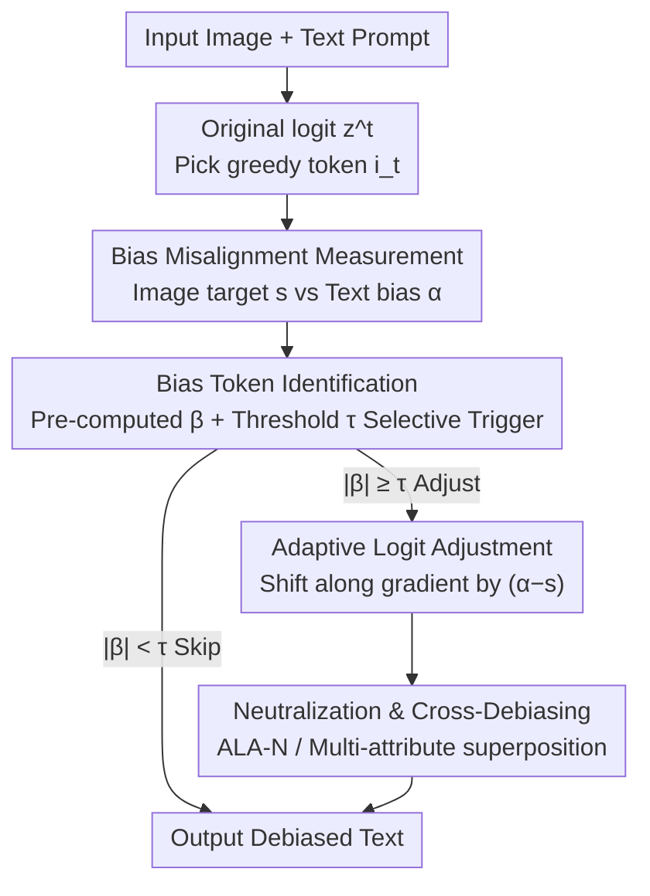

# Adaptive Logit Adjustment for Debiasing Multimodal Language Models

**Conference**: ICLR2026  
**OpenReview**: [https://openreview.net/forum?id=u02Tgg4UYg](https://openreview.net/forum?id=u02Tgg4UYg)  
**Code**: Yes (The paper claims it is open-sourced on GitHub; link TBD)  
**Area**: AI Safety / Fairness / Multimodal Debiasing  
**Keywords**: Multimodal debiasing, logit adjustment, fairness, integrated gradients, post-processing intervention

## TL;DR
ALA is a **post-processing** debiasing method. During each step of autoregressive generation, it utilizes external image and text classifiers to measure the discrepancy between the "attributes the image should have" and the "current bias expressed in the text." It then performs proportional fine-tuning **only on the logits of bias-related tokens** along the gradient direction. This aligns image-text attributes or neutralizes harmful stereotypes without modifying internal representations or retraining, while maintaining model utility.

## Background & Motivation
**Background**: Vision-Language Models (VLMs, such as CLIP-CAP, BLIP) and Large Multimodal Models (LMMs, such as LLaVA-1.5, PaliGemma) are highly capable in image captioning and Visual Question Answering (VQA). However, their generated text often carries social biases—either misdescribing image attributes (e.g., describing a female firefighter as "he") or associating specific groups with harmful stereotypes.

**Limitations of Prior Work**: Existing debiasing methods primarily intervene at the **representation layer**. Fine-tuning methods (retraining for fair representations) are computationally expensive and impractical for LMMs. Post-processing methods modify image encoders or text decoders to "erase" bias signals from latent representations (e.g., DeAR, SFID, CLIP-clip, model steering). However, "erasing representations" has two major drawbacks: first, it often causes side effects that damage model utility (improving fairness at the cost of performance); second, for tasks requiring attribute recognition (e.g., asking "is the person in the image male or female?"), erasing attribute information makes it impossible for the model to answer correctly.

**Key Challenge**: The trade-off between debiasing and utility is often a "zero-sum" game in current approaches—representation-level intervention is too coarse to target only the problematic components. Furthermore, even if internal representations are debiased, external retrieval like RAG might re-introduce biased or toxic information, rendering representation-level debiasing ineffective.

**Goal**: Without retraining or modifying internal representations, achieve: (1) Alignment of generated text attributes with the ground-truth image attributes; (2) Optional neutralization of sensitive attributes; (3) Resistance to biases re-introduced by external sources (RAG); (4) Preservation of utility for recognition-based tasks.

**Key Insight**: The authors move the point of intervention from "representations" to **logits (token probabilities)**. Representations are entangled, where changing one part affects everything; in contrast, logits are per-token, allowing for fine-grained intervention—"suppressing or boosting only bias-related words while keeping others unchanged."

**Core Idea**: Use an external classifier to provide a **quantifiable alignment target**, then use gradients to push the "text bias score" toward this target, but only adjust logits for bias-related tokens—"Adaptive Logit Adjustment" (ALA).

## Method

### Overall Architecture
ALA is a post-processing module embedded into the autoregressive decoding loop. At generation step $t$, the model's final layer outputs the raw logit vector $z^t=(z_1,\dots,z_V)\in\mathbb{R}^V$. ALA uses two **pre-trained external classifiers** to quantify "bias misalignment": an image classifier $f^{image}:\mathbb{R}^d\to[-1,1]$ calculates the target bias $s=f^{image}(x)$ from the input image $x$ (the "intended" attribute direction); a text classifier $f^{text}:\mathbb{R}^d\to[-1,1]$ calculates the text bias score $\alpha(z^t)=f^{text}(z^t)$ from the current generated text. Ideally, $\alpha(z^t)\approx s$, so a large $|\alpha(z^t)-s|$ indicates a severe misalignment. Once misalignment is detected, ALA shifts the logit vector along the direction that reduces this discrepancy—but **only for bias-related tokens**. The direction and intensity of adjustment are determined by a pre-computed token importance vector $\beta\in\mathbb{R}^V$. This process touches neither model weights nor internal representations, operating purely on output probabilities.

### Key Designs

**1. Bias Misalignment Measurement: Quantifiable Alignment via External Classifiers**
Existing representation-level methods lack a clear "target" to move toward and can only "flatten" attributes vaguely. ALA's first step is to turn "bias" into two comparable scalars: the image side $s=f^{image}(x)$ provides the image attribute direction (e.g., the gender leaning of the photo), and the text side $\alpha(z^t)=f^{text}(z^t)$ provides the bias expressed in the generated text. Both classifiers output in the $[-1,1]$ range, allowing direct comparison of $|\alpha(z^t)-s|$. The key is that the "target comes from the image rather than being set arbitrarily"—transforming debiasing from "blind elimination" to "alignment with reality." This also explains why ALA maintains utility in recognition tasks (VQA-Task-3, e.g., asking for gender): it doesn't erase attributes but pushes the text toward the correct one. Both classifiers are **frozen and pre-trained externally** on different datasets ($f^{image}$ using FairFace, $f^{text}$ using Bias-in-Bios / Wikipedia Toxicity) to demonstrate the transferability of the debiasing signal.

**2. Adaptive Logit Adjustment: Pushing Text Bias Toward the Target via Gradients**
Given target $s$ and current text bias $\alpha(z^t)$, how should logits be modified to bring them closer? The authors perform a first-order Taylor expansion of $\alpha$ at $z^t$: $\alpha(z^t+\Delta z^t)\approx\alpha(z^t)+\sum_i\frac{\partial\alpha(z^t)}{\partial z^t_i}\Delta z^t_i$. To minimize $|\alpha(z^t)-s|$, a gradient-descent-like update is designed:

$$\Delta z^t_i = -\lambda\big(\alpha(z^t)-s\big)\frac{\partial\alpha(z^t)}{\partial z^t_i},$$

where $\lambda>0$ controls adjustment intensity. Substituting this back into the expansion yields $\Delta\alpha\approx-\lambda(\alpha(z^t)-s)\sum_i\big(\frac{\partial\alpha(z^t)}{\partial z^t_i}\big)^2$. This ensures the correct direction: when $\alpha(z^t)>s$, the update pulls $\alpha$ down, and vice versa. The step size is amplified by the squared norm of the gradient—larger misalignments trigger stronger adjustments. The beauty lies in the **per-token probability shift rather than representation rewriting**: it only modifies the logit distribution without altering the contextual information in the latent representations, preserving semantics and utility.

**3. Bias Token Identification: Pre-computed β via Integrated Gradients with Selective Triggering**
Calculating the gradient $\frac{\partial\alpha(z^t)}{\partial z^t_i}$ in real-time at each step is difficult and expensive due to the $\arg\max$ decoding process. The authors approximate it using **token-level importance scores $\beta_i\approx\frac{\partial\alpha(z^t)}{\partial z^t_i}$**. For each token in the vocabulary, its contribution to the text classifier $f^{text}$ output is calculated using Integrated Gradients on the token embedding $e_i$, normalized to $[-1,1]$, resulting in an **offline pre-computed, reused dictionary** $\{\beta_i\}$. The update simplifies to $z^{t,\prime}_i = z^t_i - \lambda(\alpha(z^t)-s)\beta_i$. A **selective gate** is added: adjustments are triggered only if the importance of the current greedy token satisfies $|\beta_{i_t}|\ge\tau$ (experimentally $\tau=0.1$); otherwise, it is skipped, avoiding even the $f^{text}$ calculation. This avoids unnecessary intervention on irrelevant words and significantly reduces computational overhead—ALA only introduces ~3.1% GPU usage and ~1.2% inference time increase.

**4. Neutralization & Cross-Debiasing: One Framework for Two Goals and Multi-attribute Superposition**
Alignment (ALA-BA) is just one use case. If a user desires **neutralization**—where sensitive attributes are neither emphasized nor suppressed—the target is set to $s=0$ to minimize $|\alpha(z^t)|$. This is ALA-N, which can neutralize "a man/woman" into "a person." Furthermore, ALA is **source-agnostic**: neural classifiers or rule-based detectors can serve as signals. Through a "Cross Logit Processor," adjustments for multiple attributes can be linearly superimposed: $z' = z - \lambda_{gender}(\alpha_{gender}-s_{gender})\beta_{gender} - \lambda_{race}(\alpha_{race}-s_{race})\beta_{race}$. This allows ALA to handle intersectional biases during inference and resist re-introduced RAG bias as long as the classifier can detect it.

### Mechanism Example
Consider the example "Describe this photo in detail" in Figure 5: the image shows a woman paddling. The baseline model, influenced by occupational stereotypes, outputs "...a man paddling... He..." (incorrect gender). During per-token decoding, when ALA reaches a bias-related token (like a pronoun) where $|\beta_{i_t}|\ge\tau$, it triggers measurement: the image classifier provides target $s$ pointing to "female," while text bias $\alpha$ points to "male." ALA-BA then suppresses logits for "male" words (he/man) and boosts "female" words, resulting in "...a woman wearing a yellow... She..." in alignment with the image. In ALA-N mode ($s=0$), it neutralizes the output to "...a person paddling... The person..." Similarly, in the VQA-Task-2 example, ALA replaces negative stereotypes like "Dirty" with objective descriptions by setting $s=-1$ (non-toxic) as the target.

### Loss & Training
ALA **does not train the main model** and has no debiasing loss; it only adjusts logits during inference. Only two lightweight external classifiers need training: $f^{image}$ is a logistic regression on the frozen representations of the target model's image encoder (e.g., CLIP), and $f^{text}$ is a Transformer-based classifier (trained on Bias-in-Bios for gender and Wikipedia Toxicity for toxicity). The hyperparameter $\lambda$ controls adjustment intensity: small values like $\lambda=0.1$ improve fairness, while $\lambda=2$ provides the best utility-fairness trade-off; excessively large values degrade both performance and fairness. The trigger threshold is fixed at $\tau=0.1$.

## Key Experimental Results

### Main Results
The primary conclusion is presented via "fairness-utility trade-off" scatter plots (Fig. 4). Ideal methods fall in the top-left quadrant (high fairness + low utility loss). ALA-BA and ALA-N are closest to the top-left across four tasks and two model types, whereas representation-level methods like DeAR and CLIP-clip suffer significant utility degradation (even negative worst-case accuracy gains).

| Task | Model | Fairness Metric | Utility Metric | ALA Performance |
|--------|------|------|----------|------|
| Image Captioning | CLIP-CAP / BLIP | $MR_C$↓ | MaxMETEOR / MaxSPICE↑ | Top-tier fairness with minimal quality loss |
| VQA-Task-1 (Gender) | LLaVA-1.5 / PaliGemma | $MR_C$↓ | $D_{WCA}$ (closer to 0 is better) | High fairness, near-zero utility loss |
| VQA-Task-2 (Toxicity) | LLaVA-1.5 / PaliGemma | $D_{mean}$↓ | $D_{WCA}$ | Significant toxicity reduction, utility preserved |
| VQA-Task-3 (Utility) | FACET (Gender ID) | — | $D_{WCA}$ | "Erasing" methods fail here; ALA succeeds |

$MR_C=\sqrt{MR_O^2+(MR_F-MR_M)^2}$ characterizes overall error and gender disparity; $D_{WCA}$ measures the accuracy degradation of the worst-performing subgroup (closer to 0 is better). Detailed values are in Tables 5–8 in Appendix I.

### Ablation Study

| Configuration | Key Observation | Description |
|------|---------|------|
| $\lambda=0.1$ | Fairness already improves | Effectiveness even with minor adjustments |
| $\lambda=2$ | Best utility-fairness trade-off | Default intensity used in the paper |
| Excessive $\lambda$ | Performance and fairness drop | Over-adjustment disrupts generation |
| $\tau=0.1$ | Sufficient for bias tokens | Derived from importance distribution analysis (Fig. 3) |
| Overhead | +3.1% GPU, +1.2% Inference Time | Twice as fast as VDD, far superior to model steering |

### Key Findings
- ALA's core gain comes from combining "logit adjustment only on bias tokens" with "alignment with image targets." It preserves utility in tasks like VQA-Task-3 that require attribute recognition, where "erasing" methods (DeAR/CLIP-clip) fail. This is the fundamental advantage of logit-level, alignment-based debiasing.
- Debiasing classifiers remain effective even when their training sets (FairFace/Bias-in-Bios) differ from the evaluation sets (COCO/FACET), indicating transferability.
- On models with stronger instruction tuning like Qwen2.5-VL-3B-Instruct, simple prompt engineering fails to debias, whereas ALA remains effective (Appendix L).

## Highlights & Insights
- **Shifting Intervention from Representations to Logits**: Representations are entangled, but logits allow for per-token precise refinement. This granularity shift is the fundamental reason ALA preserves both fairness and utility.
- **Quantifiable Target via External Classifiers**: Debiasing is no longer a vague "erasing" act but an alignment toward a clear target $s$. Combined with Taylor expansion, both the direction and magnitude of adjustment have analytical foundations.
- **Pre-computed $\beta$ + Threshold Triggering**: Replacing expensive real-time gradients with an offline dictionary and a selective gate turns a theoretical method into a "near-zero overhead" deployable solution.
- **Source-agnostic + Linear Superposition**: The Cross Logit Processor allows simultaneous handling of multiple attributes and resistance to RAG-introduced bias, which is difficult for representation-level methods.

## Limitations & Future Work
- **Strong Dependency on External Classifiers**: ALA's upper bound is capped by the accuracy of $f^{image}$ and $f^{text}$. If the classifiers are biased or inaccurate, the debiasing direction will be wrong.
- **Inference Overhead**: Although only +3.1% GPU and +1.2% time, the cost for running text classifiers at each step can accumulate for long sequences or heavy loads.
- **Pre-defined Attributes**: Currently covers gender, race, physical traits, and toxicity. Expanding to new attributes requires training new classifiers and recalculating $\beta$; it cannot handle "unknown/latent biases."
- **First-order Taylor & $\beta$ Approximation**: Using pre-computed $\beta$ to approximate real-time gradients may introduce errors when $\lambda$ is large, explaining why excessive $\lambda$ hurts performance.

## Related Work & Insights
- **vs DeAR / CLIP-clip / SFID (Post-processing Repr.)**: These erase signals in the embedding layer, while ALA aligns targets in the logit layer. The difference lies in granularity and direction—alignment preserves utility for recognition tasks where erasure fails.
- **vs VDD (Logit Hallucination Reduction)**: VDD adjusts logits by subtracting a reference logit from an "uninformative input" to cancel bias. It is not designed for social bias; ALA uses real-time image-text misalignment, making it significantly more effective for debiasing.
- **vs Fine-tuning (e.g., Girrbach et al. 2025)**: Fine-tuning is impractical for Large Multimodal Models; ALA is purely post-processing and requires no retraining.
- **vs Model Steering**: Steering requires full backpropagation through the LMM decoder at each step, which is prohibitively expensive. ALA reduces this cost to near-zero via pre-computed $\beta$.

## Rating
- Novelty: ⭐⭐⭐⭐ Shifting intervention to logits with quantifiable alignment targets is a clear and distinct perspective.
- Experimental Thoroughness: ⭐⭐⭐⭐ Covers 4 tasks and multiple models (including Qwen2.5-VL) with solid trade-off analysis, though many metrics are in the appendix.
- Writing Quality: ⭐⭐⭐⭐ Clear chain of motivation, formulas, and algorithms. Taylor derivation is intuitive.
- Value: ⭐⭐⭐⭐ Practically useful for fair multimodal systems due to near-zero overhead and source-agnostic nature.

<!-- RELATED:START -->

## Related Papers

- [\[CVPR 2026\] Towards Robust Multimodal Large Language Models Against Jailbreak Attacks](../../CVPR2026/ai_safety/towards_robust_multimodal_large_language_models_against_jailbreak_attacks.md)
- [\[ICLR 2026\] Wring Out the Bias: A Rotation-Based Alternative to Projection Debiasing](wring_out_the_bias_a_rotation-based_alternative_to_projection_debiasing.md)
- [\[ICLR 2026\] Fairness-Aware Multi-view Evidential Learning with Adaptive Prior](fairness-aware_multi-view_evidential_learning_with_adaptive_prior.md)
- [\[CVPR 2026\] $\varphi$-DPO: Fairness Direct Preference Optimization Approach to Continual Learning in Large Multimodal Models](../../CVPR2026/ai_safety/φ-dpo_fairness_direct_preference_optimization_approach_to_continual_learning_in_.md)
- [\[ICLR 2026\] Adversarial Attacks Already Tell the Answer: Directional Bias-Guided Test-time Defense for Vision-Language Models](adversarial_attacks_already_tell_the_answer_directional_bias-guided_test-time_de.md)

<!-- RELATED:END -->
