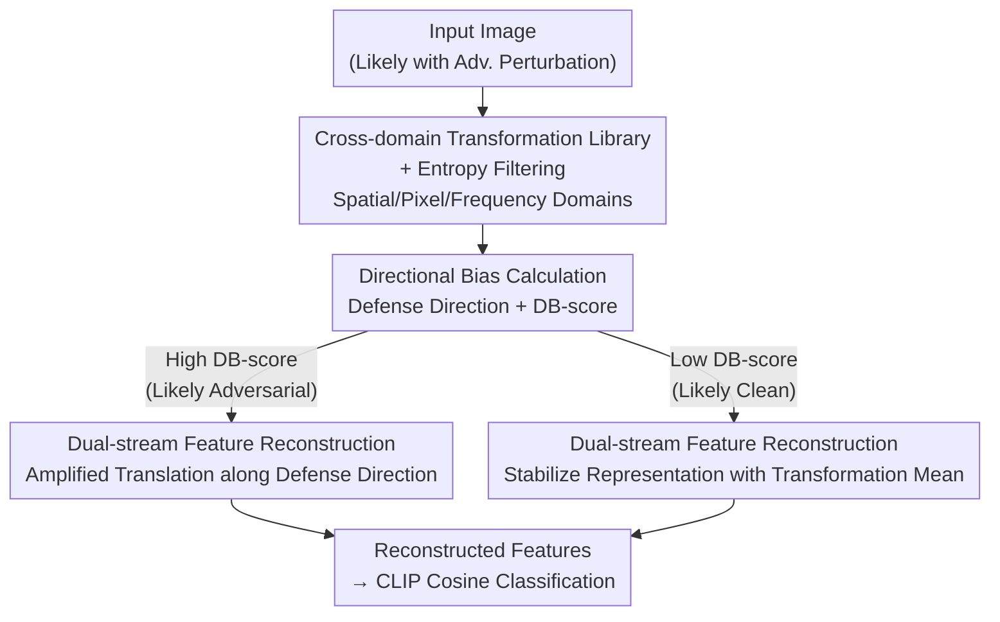

# Adversarial Attacks Already Tell the Answer: Directional Bias-Guided Test-time Defense for Vision-Language Models

**Conference**: ICLR2026  
**OpenReview**: [https://openreview.net/forum?id=UqC2oFRRyc](https://openreview.net/forum?id=UqC2oFRRyc)  
**Code**: https://github.com/liuls2002/DBD  
**Area**: AI Security / Adversarial Robustness / Vision-Language Models / Test-time Defense  
**Keywords**: Adversarial Defense, CLIP, Test-time Defense, Directional Bias, Feature Reconstruction

## TL;DR
The authors observe that transformed adversarial samples in the CLIP feature space collectively shift along a "dominant direction" (whereas clean samples diverge), which happens to point back to the correct category center. Consequently, they propose DBD, a training-free test-time defense that estimates the "defense direction" and repairs representations via dual-stream feature reconstruction guided by DB-score. DBD not only sets a new SOTA for adversarial robustness across 15 datasets but also exhibits the counter-intuitive phenomenon where "adversarial accuracy surpasses clean accuracy."

## Background & Motivation

**Background**: Vision-Language Models (VLMs) like CLIP possess strong zero-shot generalization due to large-scale pre-training but are extremely vulnerable to human-imperceptible adversarial perturbations—minor noise can lead to total misclassification, posing a fatal risk in safety-critical scenarios. Mainstream robustness methods include adversarial fine-tuning and adversarial prompt tuning, but these require task-specific labeled data, are computationally expensive, and often degrade zero-shot transferability when optimized on limited data.

**Limitations of Prior Work**: To circumvent training costs, "test-time defense" (TTD) has emerged in two categories: (1) Prompt-based (e.g., R-TPT, TAPT), which adaptively adjusts text prompts for each sample, yielding good results but high inference latency; (2) Transformation-based (e.g., counter-attack perturbation TTC, Gaussian noise injection AOM), which directly modifies the input image with high efficiency but often at the cost of clean image performance and sensitivity to model architecture (e.g., TTC yields only 12.5% robustness on ViT-B/16).

**Key Challenge**: While transformation-based methods recognize that "various transformations mitigate adversarial effects," they lack a deep understanding of **why they work or how transformations change the feature space**, leaving defense designs empirical and difficult to improve.

**Key Insight**: The authors examine what transformations do in the CLIP latent feature space. A critical observation: when applying multiple transformations to the same image, **transformed clean features scatter divergently around the original feature, whereas transformed adversarial features shift consistently toward a specific direction** (Fig 1a, visualized with MDS + $1-\cos$ similarity). This "directional bias" is highly significant. The authors design a DB-score to quantify this directional concentration and find it follows a clear bimodal distribution for clean vs. adversarial samples, allowing for direct threshold separation.

**Core Idea**: Considering that adversarial attacks push features away from the correct class center, the "dominant direction" of transformed features likely aligns **anti-parallely** with the adversarial displacement—pointing back to the correct class center. The authors term this the **Defense Direction** and propose a training-free defense that repairs features via linear translation along this direction. In other words: **When generating perturbations, adversarial attacks have already secretly encoded the direction prior of the real decision boundary; we simply need to extract and reverse it.**

## Method

### Overall Architecture
DBD (Directional Bias-guided Defense) is a pure test-time defense framework that does not modify any CLIP weights. Given an input image (potentially adversarial), the pipeline is: apply a suite of cross-domain transformations and filter low-quality features via entropy → estimate the "Defense Direction" and calculate the DB-score from high-quality features → route samples into two reconstruction paths based on the DB-score to obtain robust features → perform standard CLIP cosine similarity classification. This process requires only a single image as input and produces a corrected prediction without gradient backpropagation or parameter updates.

### Key Designs

**1. Cross-domain Transformation Library + Entropy Filtering: Building Reliable Reference Features**

Single transformations have inherent flaws—random cropping might miss targets, and filtering might blur key details. Features from any single transformation are unreliable. DBD constructs a library covering three domains: (1) **Spatial** (random crop, scale, flip) to disrupt the structured alignment of perturbations; (2) **Pixel** (bit-depth quantization, JPEG compression, Gaussian noise) to distort or overwrite fine-grained noise; (3) **Frequency** (Gaussian/Mean/Median filtering) to smooth high-frequency components while preserving semantics. $n=31$ transformations are applied (32 including the original).

To handle varying transformation quality, the authors use the prediction entropy as a metric: for the $i$-th transformation feature, $E_i = -\sum_c p_{i,c}\log p_{i,c}$. Lower entropy indicates higher confidence and cleaner features. The top $k=16$ features $F_{ref}=\{f_i\mid i\in I_k\}$ with the lowest entropy are selected, ensuring the "direction" is estimated from high-quality references.

**2. Directional Bias Calculation: Defining Defense Direction and Quantifying Concentration via DB-score**

Given $k$ high-quality features $\{f_i\}$ and original feature $f_0$, the displacement of each relative to $f_0$ is normalized into a unit direction vector $d_i = (f_i - f_0)/\|f_i - f_0\|_2$. The **Defense Direction** is the normalized average displacement:

$$\bar{d} = \frac{1}{k}\sum_{i=1}^{k}(f_i - f_0), \qquad d_{def} = \frac{\bar{d}}{\|\bar{d}\|_2}$$

The **DB-score** measures the average consistency of individual directions with the defense direction:

$$S_{db} = \frac{1}{k}\sum_{i=1}^{k}\langle d_i, d_{def}\rangle$$

High $S_{db}$ indicates consistent biasing (adversarial), while low $S_{db}$ indicates divergence (clean).

**3. Dual-stream Feature Reconstruction: Branching by DB-score**

If the defense direction is anti-parallel to the adversarial displacement, shifting features along it repairs the representation. However, blind shifting is harmful to clean samples. DBD uses a threshold $\tau$:

$$\hat{f} = f_0 + l\cdot d_{def}, \qquad l = \begin{cases}\|\bar{d}\|_2, & S_{db}\le\tau \\ \lambda\cdot\|\bar{d}\|_2, & S_{db}>\tau\end{cases}$$

(1) **High DB-score stream ($S_{db}>\tau$)**: High directional reliability allows for **amplified** translation (coefficient $\lambda$) back to the correct region; (2) **Low DB-score stream ($S_{db}\le\tau$)**: Lower reliability limits displacement to $\|\bar{d}\|_2$, effectively performing test-time augmentation (TTA) with the transformation mean to stabilize the representation without aggressive shifting.

### Loss & Training
DBD is a pure test-time method with **no training or loss functions**; CLIP weights remain frozen. Hyperparameters $\tau=0.8$ and $\lambda=2.5$ were determined on the ImageNet validation set. Attack settings include PGD-10 ($\epsilon=1/255$, CLIP-ResNet50) and PGD-100 ($\epsilon=4/255$, CLIP-ViT-B/32 and ViT-B/16). The threat model assumes attackers have full access to CLIP but are unaware of the defense.

## Key Experimental Results

### Main Results
Evaluation across 10 fine-grained datasets and 5 ImageNet-OOD benchmarks (15 total). Comparison against TeCoA (Adv-FT), APT (Adv-Prompt-Tuning), R-TPT (TT-Prompt-Tuning), TTC, and original CLIP. Average results for 10 datasets (CLIP-ViT-B/32, PGD-100, $\epsilon=4/255$):

| Method | Clean Acc. | Robust Rob. | Note |
|------|-----------|-----------|------|
| CLIP | 63.7 | 0.0 | Zero-shot strong but zero robust |
| TeCoA | 32.8 | 11.4 | Adv-FT, clean accuracy drops |
| APT (16-shot) | 56.1 | 22.0 | Prompt tuning, requires few-shot data |
| TTC | 54.3 | 27.2 | Input transformation, architecture sensitive |
| R-TPT | 60.2 | 38.1 | Prev. SOTA, maintains clean acc |
| **DBD** | **64.1** | **91.3** | Clean acc. beats CLIP, robustness dominates |

On ViT-B/16, DBD achieves 93.8% robustness, and On ImageNet-OOD it reaches 97.7%—**adversarial accuracy surpasses clean accuracy**. Under "pseudo-label attacks" (using CLIP's own prediction as the ground truth for PGD), DBD still achieves 66.8%, nearing the clean accuracy of 67.5%. Under AutoAttack, DBD averages 69.8% across tasks, exceeding the 67.5% average clean accuracy.

### Ablation Study
Average results on 15 datasets across 3 attack settings (%):

| Configuration | Clean Acc. | Robust Rob. | Note |
|------|-----------|-----------|------|
| No Defense | 60.6 | 0.0 | Baseline |
| Single Trans. + Shift | 24.1~55.7 | 82.4~91.2 | Strong defense but hurts clean acc |
| Transformation Aggregation (No shift, $\lambda=1$) | 61.5 | 34.8 | Best clean acc, weak defense |
| Trans. + Shift (No threshold) | 58.9 | 92.1 | High robustness, lower clean acc |
| **Full (+ DB-score threshold dual-stream)** | **61.2** | **91.7** | Best balance |

### Key Findings
- **Geometric Validation**: The estimated defense direction shares an average cosine similarity of $\approx0.95$ with the "clean direction" (adversarial feature to clean feature) and $\approx0.90$ with the "class center direction." This confirms the direction points toward the truth.
- **Trade-off Mechanism**: The DB-score threshold allows for aggressive repair of adversarial samples without damaging clean samples.
- **Clean Enhancement**: DBD slightly outperforms CLIP on clean images (ImageNet-OOD 52.7%→55.0%) due to the ensemble effect of diverse transformations.

## Highlights & Insights
- **"Attacks reveal the answer"**: Adversarial perturbations are guided by ground-truth labels, thus encoding the boundary prior. By exploiting this "unintentional leak," adversarial samples become paradoxically easier to classify than clean ones.
- **DB-score as Dual Function**: It acts as both a detector (bimodal distribution) and a switch for reconstruction intensity, resulting in a minimalist design.
- **Plug-and-play**: Requires zero training or labels and can be migrated to any frozen VLM. The "multi-transformation direction estimation" logic is applicable beyond just defense.

## Limitations & Future Work
- **Threat Model**: Assumes the attacker is unaware of the defense (non-adaptive). The robustness against adaptive attacks (e.g., forcing transformed features to diverge) requires further study.
- **Label Dependence**: The "adversarial > clean" advantage relies on attacks being generated with ground-truth labels. In pseudo-label or transfer attack scenarios, the gains may be less pronounced.
- **Hyperparameter Sensitivity**: $\tau$ and $\lambda$ were fixed from ImageNet; their consistency across radically different domains or different VLM scales needs more detailed sensitivity analysis.
- **Latency**: Each image requires 32 forward passes. While cheaper than per-sample prompt tuning, it is heavier than single-pass inference.

## Related Work & Insights
- **vs R-TPT / TAPT**: These optimize text prompts per sample with multiple backprop steps; DBD operates on image features with no backprop, offering higher efficiency and robustness (e.g., 93.8% vs 43.2% on ViT-B/16).
- **vs TTC / AOM**: These modify inputs empirically; DBD uncovers the "directional bias" mechanism in the feature space, ensuring stable performance across architectures.
- **vs TeCoA / APT**: These require expensive training and task-specific labels; DBD is zero-shot, zero-training, and plug-and-play.

## Rating
- Novelty: ⭐⭐⭐⭐⭐ The insight that perturbations encode boundary priors is a highly non-trivial discovery.
- Experimental Thoroughness: ⭐⭐⭐⭐⭐ Extensive testing across 15 datasets, multiple attack types, and geometric validation.
- Writing Quality: ⭐⭐⭐⭐ Clear narrative flow from observation to hypothesis to validation.
- Value: ⭐⭐⭐⭐ Practical for training-free VLM deployment, though adaptive robustness remains a question.

<!-- RELATED:START -->

## Related Papers

- [\[CVPR 2026\] A Provable Energy-Guided Test-Time Defense Boosting Adversarial Robustness of Large Vision-Language Models](../../CVPR2026/ai_safety/a_provable_energy-guided_test-time_defense_boosting_adversarial_robustness_of_la.md)
- [\[CVPR 2026\] TTP: Test-Time Padding for Adversarial Detection and Robust Adaptation on Vision-Language Models](../../CVPR2026/ai_safety/ttp_test-time_padding_for_adversarial_detection_and_robust_adaptation_on_vision-.md)
- [\[ICML 2026\] Towards Fine-Grained Robustness: Attention-Guided Test-Time Prompt Tuning for Vision-Language Models](../../ICML2026/ai_safety/towards_fine-grained_robustness_attention-guided_test-time_prompt_tuning_for_vis.md)
- [\[ICLR 2026\] Test-Time Poisoned Sample Detection by Exploiting Shallow Malicious Matching in Backdoored CLIP](test-time_poisoned_sample_detection_by_exploiting_shallow_malicious_matching_in_.md)
- [\[CVPR 2026\] When CLIP Sees More, It Fights Back Harder: Multi-View Guided Adaptive Counterattacks for Test-Time Adversarial Robustness](../../CVPR2026/ai_safety/when_clip_sees_more_it_fights_back_harder_multi-view_guided_adaptive_counteratta.md)

<!-- RELATED:END -->
