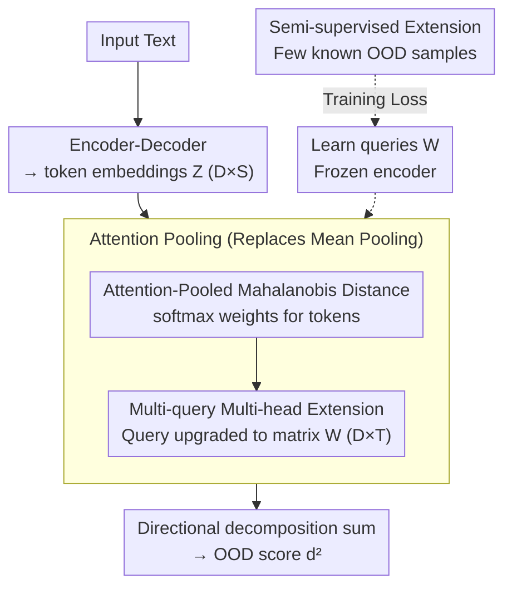

# AP-OOD: Attention Pooling for Out-of-Distribution Detection

**Conference**: ICLR 2026  
**arXiv**: [2602.06031](https://arxiv.org/abs/2602.06031)  
**Code**: [https://github.com/ml-jku/ap-ood](https://github.com/ml-jku/ap-ood)  
**Area**: Text Generation  
**Keywords**: Out-of-Distribution Detection, Attention Pooling, Mahalanobis Distance, token-level information, language models  

## TL;DR
The authors propose AP-OOD, which replaces mean pooling in Mahalanobis distance with learnable attention pooling. This addresses the issue where mean pooling loses token-level anomaly information, reducing the FPR95 of XSUM summarization from 27.84% to 4.67% and supporting a smooth transition from unsupervised to semi-supervised settings.

## Background & Motivation

**Background**: Language models may encounter OOD inputs during deployment (e.g., being trained on BBC news summaries but receiving CNN articles), leading to unreliable outputs such as hallucinations. Mahalanobis distance based on token embeddings is a mainstream detection method.

**Limitations of Prior Work**: Existing methods (e.g., Ren et al. 2023) perform **mean pooling** on sequence token embeddings before calculating the Mahalanobis distance—but the averaging operation hides anomaly information. When the means of ID and OOD sequences are similar (despite different token distributions), detection fails completely. Figure 1 illustrates this failure mode.

**Key Challenge**: The requirement to compress variable-length representations (token sequences) into a scalar OOD score, where simple aggregation loses critical token-level patterns distinguishing ID from OOD.

**Goal**: To design an aggregation method beyond mean pooling that preserves token-level information for OOD detection.

**Key Insight**: Decompose Mahalanobis distance into directional components → change the projection in each direction from a mean to an attention-weighted sum → allow the model to learn which tokens are most informative for OOD detection.

**Core Idea**: Replace mean pooling with learnable attention pooling to calculate Mahalanobis distance, enabling OOD detection to utilize token-level information.

## Method

### Overall Architecture
AP-OOD addresses how to compress variable-length sequences into a scalar score for text OOD detection. Given an input text, a pre-trained encoder-decoder model first outputs a set of token embeddings $Z \in \mathbb{R}^{D \times S}$ ($S$ tokens, each $D$-dimensional); previous approaches used mean pooling on these $S$ embeddings and calculated the Mahalanobis distance to the corpus prototype. AP-OOD maintains the Mahalanobis distance backbone but replaces the "mean" step with attention pooling driven by $M$ learnable query vectors—letting the model learn which tokens in the sequence to focus on, then outputting the attention-weighted distance as the OOD score. This modification only changes the aggregation method; the encoder and Mahalanobis distance framework remain unchanged. When a small number of known OOD samples are available, they can be utilized within the training loss.

### Key Designs

**1. Attention-Pooled Mahalanobis Distance: Selecting tokens during aggregation instead of uniform averaging**

The bottleneck of classic methods is the mean: when the mean token embedding of an ID sequence and an OOD sequence happen to be similar (despite entirely different token distributions), the averaging operation smooths out the differences, making Mahalanobis distance unable to separate the two (as shown in the failure mode in Figure 1-2). AP-OOD first expands the standard Mahalanobis distance by direction as $d^2 = \sum_j (w_j^T \bar{z} - w_j^T \mu)^2$, where each $w_j$ is a measurement direction. The key step is replacing the directional pooling $\bar{z} = \frac{1}{S}\sum_s z_s$ with attention pooling:

$$\bar{z} = Z \cdot \text{softmax}(\beta Z^T w)$$

In this design, the same $w_j$ serves two roles—defining the "direction to measure distance" and defining "which tokens to weight in this direction" via $\text{softmax}(\beta Z^T w)$. The temperature $\beta$ controls the sharpness of the attention, allowing anomaly tokens to receive amplified weights rather than being diluted by averaging, thus preserving token-level distributional differences in the final distance.

**2. Multi-query Multi-head Extension: Capturing richer anomaly patterns with a set of queries**

A single $w_j$ can only characterize one token pattern, which limits expressiveness. Here, the vector $w_j$ is upgraded to a matrix $W_j \in \mathbb{R}^{D \times T}$, providing each head with $T$ queries:

$$\bar{Z} = Z \cdot \text{softmax}(\beta Z^T W)$$

The softmax is normalized over the entire $S \times T$ attention matrix, and the distance for the corresponding direction is calculated using the Frobenius inner product $\text{Tr}(W_j^T \bar{Z})$. Multiple queries allow the model to simultaneously attend to different positions and types of suspicious tokens in the sequence, pooling their signals into the distance for higher sensitivity than a single query.

**3. Semi-supervised Extension: Smoothly utilizing few OOD samples**

In practical deployments, there is often some knowledge of the OOD types that might be encountered (even with just a few samples); a purely unsupervised approach would waste this prior. AP-OOD adds an objective to the loss to "maximize the distance of known OOD samples" and uses a coefficient to control the transition between unsupervised and supervised settings. When the coefficient is 0, it reverts to purely unsupervised; as it increases, OOD information is gradually incorporated into training. This allows the method to transition smoothly based on the amount of available OOD data.

### Loss & Training
During training, the encoder is entirely frozen, and only the query matrices $W_j$ are learned. Since the number of trainable parameters is extremely small, it remains essentially a post-hoc method. The loss function is:

$$\mathcal{L} = \frac{1}{N}\sum_i d^2(Z_i, \tilde{Z}) - \sum_j \log(\|W_j\|^2)$$

The first term pulls ID samples closer to the corpus prototype $\tilde{Z}$, while the second term $-\sum_j \log(\|W_j\|^2)$ prevents the queries from collapsing to zero. Attention pooling is calculated per mini-batch to reduce memory overhead. A useful theoretical property is that when $\beta=0$, the attention degrades to uniform weights, and the method reverts exactly to the standard Mahalanobis distance, effectively treating the classic method as a special case of AP-OOD.

## Key Experimental Results

### Main Results

| Task | Metric | Prev. SOTA | AP-OOD |
|------|------|---------|--------|
| XSUM Summarization | FPR95↓ | 27.84% | **4.67%** |
| WMT15 En→Fr | FPR95↓ | 77.08% | **70.37%** |

The improvement in FPR95 is substantial (reducing by over 23 percentage points for XSUM).

### Ablation Study
- Performance significantly degrades when $\beta=0$ (reverting to Mahalanobis distance) → the contribution of attention pooling is substantial.
- Increasing the number of heads $M$ and queries $T$ both lead to improvements.
- In semi-supervised settings, a small number of OOD samples can further enhance performance.

### Key Findings
- Mean pooling is a major bottleneck in both summarization and translation tasks—OOD and ID mean embeddings overlap significantly.
- The learned query $w$ in attention pooling tends to focus on "anomalous" tokens in the sequence—those carrying the most OOD signals.
- The transition from unsupervised to semi-supervised is smooth—the method can flexibly adapt to the amount of available OOD data.

## Highlights & Insights
- The formalization of the **"mean hides anomalies"** problem (Figure 1-2) is highly intuitive—a picture is worth a thousand words.
- The theoretical framework unifying attention pooling and Mahalanobis distance is elegant—reverting to the classic method at $\beta=0$ and generalizing to the token level at $\beta>0$.
- Extremely small parameter count (only learning query vectors) with negligible computational cost—a true post-hoc method.

## Limitations & Future Work
- Validation is limited to summarization and translation—more NLP tasks (QA, dialogue, etc.) remain to be tested.
- Dependence on pre-trained encoder-decoder architectures—the applicability to decoder-only LLMs needs exploration.
- Only addresses input-side OOD—distribution shifts on the generation side are not covered.
- Selection of the attention temperature $\beta$ may require hyperparameter tuning.

## Related Work & Insights
- **vs Ren et al. (2023)**: Baseline using mean pooling + Mahalanobis distance; AP-OOD replaces the mean directly with attention pooling.
- **vs Classifier-based OOD methods (MSP/Energy, etc.)**: These assume the existence of a classification head, while AP-OOD is suitable for generative models.
- **vs Mahalanobis Distance (Lee et al. 2018)**: Classic OOD method for images; AP-OOD extends this to sequential data.

## Rating
- Novelty: ⭐⭐⭐⭐ The combination of attention pooling and Mahalanobis distance is natural yet previously unexplored.
- Experimental Thoroughness: ⭐⭐⭐ XSUM results are very strong, but the scope of experiments is narrow (2 tasks).
- Writing Quality: ⭐⭐⭐⭐⭐ The illustrative examples in Figure 1-2 are excellent, and the theoretical derivation is clear.
- Value: ⭐⭐⭐⭐ Provides a simple and effective improvement strategy for NLP-OOD detection.

<!-- RELATED:START -->

## Related Papers

- [\[ICLR 2026\] GradPCA: Leveraging NTK Alignment for Reliable Out-of-Distribution Detection](gradpca_leveraging_ntk_alignment_for_reliable_out-of-distribution_detection.md)
- [\[ICLR 2026\] Fisher-Rao Sensitivity for Out-of-Distribution Detection in Deep Neural Networks](fisher-rao_sensitivity_for_out-of-distribution_detection_in_deep_neural_networks.md)
- [\[ICLR 2026\] EigenScore: OOD Detection using Posterior Covariance in Diffusion Models](eigenscore_ood_detection_using_posterior_covariance_in_diffusion_models.md)
- [\[ICLR 2026\] Towards a Certificate of Trust: Task-Aware OOD Detection for Scientific AI](towards_a_certificate_of_trust_task-aware_ood_detection_for_scientific_ai.md)
- [\[CVPR 2026\] RankOOD: Class Ranking-based Out-of-Distribution Detection](../../CVPR2026/ai_safety/rankood_-_class_ranking-based_out-of-distribution_detection.md)

<!-- RELATED:END -->
