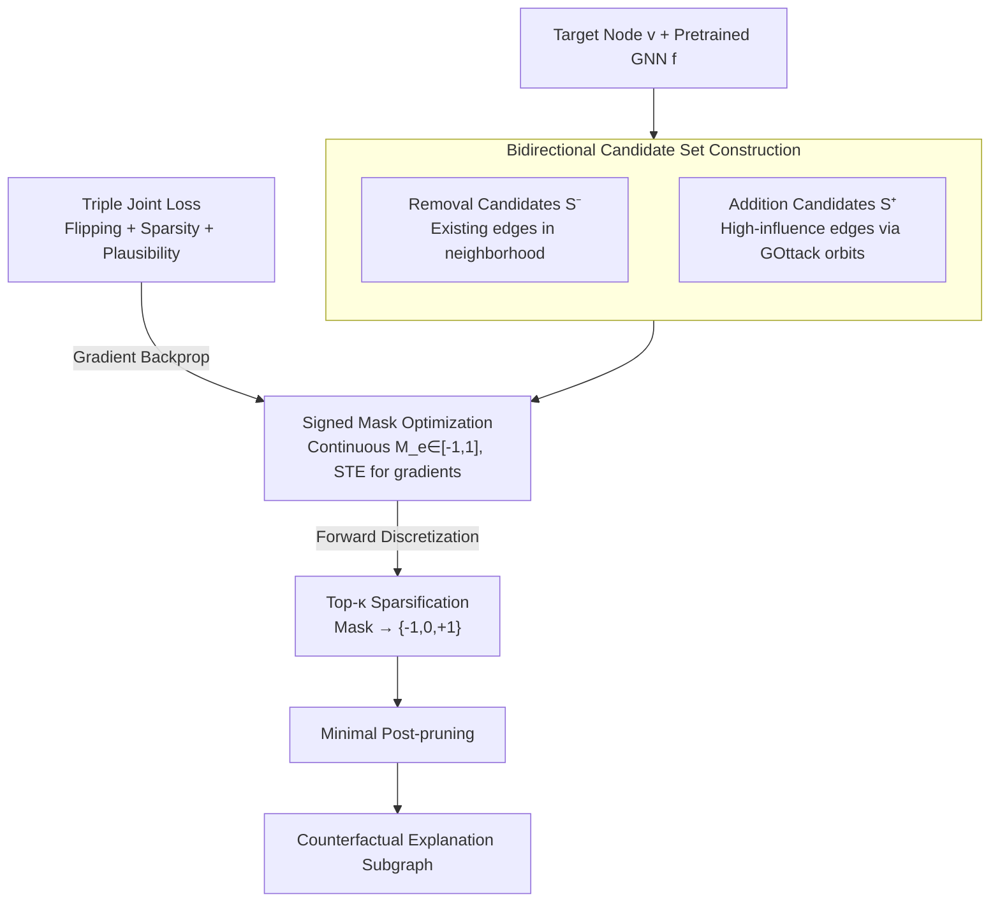

# ATEX-CF: Attack-Informed Counterfactual Explanations for Graph Neural Networks

**Conference**: ICLR 2026  
**arXiv**: [2602.06240](https://arxiv.org/abs/2602.06240)  
**Code**: [https://github.com/zhangyuo/ATEX_CF](https://github.com/zhangyuo/ATEX_CF)  
**Area**: AI Safety / GNN Explainability  
**Keywords**: Graph Neural Networks, Counterfactual Explanations, Adversarial Attacks, Explainability, Graph Structure Perturbations  

## TL;DR

Proposes the ATEX-CF framework, which for the first time unifies edge addition strategies from adversarial attacks with edge removal strategies from counterfactual explanations. By jointly optimizing prediction flipping, sparsity, and plausibility, it generates more faithful, concise, and reasonable instance-level counterfactual explanations for GNNs.

## Background & Motivation

**Urgent demand for GNN explainability**: GNNs are widely applied in critical domains such as healthcare and finance, but their black-box reasoning hinders trust, driving the development of counterfactual explanation research.

**Traditional counterfactual methods are limited to edge removal**: Classic methods like CF2 and GCFExplainer mainly rely on edge removal to identify key substructures supporting predictions, ignoring the possibility that "adding missing relationships" can also significantly alter predictions.

**Adversarial attacks reveal the power of edge addition**: Research in graph adversarial learning has demonstrated that adding a small number (e.g., 2) of carefully selected edges can effectively flip the prediction of a target node. These edges often correspond to semantically plausible structural relationships.

**Long-term divergence between two directions**: Although counterfactual explanations and adversarial attacks share the goal of "flipping predictions," their perturbation strategies are distinct—the former focuses on removal, while the latter focuses on addition. Existing methods fail to unify the two.

**Edge addition provides complementary explanation coverage**: Edge removal explanations reveal "which existing relationships are critical," whereas edge addition explanations reveal "which missing relationships could change the outcome." The two are complementary for a complete understanding of model decisions.

**Search space explosion**: Including edge addition in the counterfactual search leads to a combinatorial explosion of the candidate space, necessitating efficient strategies from adversarial attacks to constrain the search range.

## Method

### Overall Architecture

ATEX-CF reformulates "generating a counterfactual explanation for a target node $v$" as a constrained optimization problem: learning a continuous mask over a set of candidate edges such that the perturbed graph flips the prediction of a pre-trained GNN $f$ while minimizing changes and maintaining plausibility. Its most critical shift is breaking the convention that "counterfactuals only remove edges"—candidates are drawn from two directions: removal candidates $\mathcal{S}^-$ are existing edges within the $(l+1)$-hop neighborhood of the target node, and addition candidates $\mathcal{S}^+$ are high-influence edges selected via the adversarial attack GOttack. After merging these into a unified candidate set, a signed continuous mask and a joint loss are used to optimize "what to remove" and "what to add" simultaneously. After optimization converges, forward discretization and Top-$\kappa$ sparsification are applied to obtain specific perturbations. Finally, a minimal pruning step removes redundant edges to output a concise and faithful counterfactual explanation subgraph.

### Key Designs

**1. Bidirectional Candidate Set Construction: Lending "Edge Addition" to Counterfactuals via the Attack-Explanation Unity Hypothesis**

Methods restricted to edge removal can only answer "which existing relationships are critical" but cannot identify "which missing relationships would change the outcome." However, once edge addition is allowed, the candidate space explodes, making blind search infeasible. The breakthrough of ATEX-CF is an experimentally verified observation (Hypothesis 1): edges added during a successful evasion attack highly overlap with the true counterfactual explanation subgraph of the target node. The "critical missing relationships" selected by attacks to flip predictions are precisely the edges an explanation seeks. Based on this, removal candidates $\mathcal{S}^- = \{e \mid e \in E,\, e \in \mathcal{N}^{l+1}(v)\}$ are limited to existing edges in the neighborhood (ensuring operational feasibility and local modification), while addition candidates $\mathcal{S}^+$ utilize high-influence edges identified by GOttack via graph orbits (the roles of nodes in local substructures). Consequently, edge addition capability is incorporated while the candidate size is kept small, ensuring both efficiency and structural plausibility.

**2. Signed Mask + Straight-Through Estimator: Learning "Addition" and "Removal" with a Single Continuous Variable**

Edge addition and removal are discrete decisions; searching for them separately is cumbersome and difficult to optimize jointly. ATEX-CF introduces a continuous parameter $M_e \in [-1,1]$ for each candidate edge, where $M_e > 0$ denotes addition, $M_e < 0$ denotes removal, and $M_e \approx 0$ denotes no change. The sign encodes the operation type, and the magnitude encodes the perturbation intensity; thus, both operations are unified into a single differentiable object optimized via gradient descent. During the forward pass, the mask is discretized into $\widehat{M}_e \in \{-1,0,+1\}$, while keeping at most $\kappa$ edges with the largest absolute values (Top-$\kappa$) to maintain explanations within a human-interpretable scale. Since thresholding and Top-$\kappa$ are non-differentiable and would break backpropagation, ATEX-CF employs a Straight-Through Estimator (STE). This allows gradients to bypass discrete operations and flow directly back to $M_e$, enabling end-to-end training of the "continuous optimization + discrete output" pipeline.

**3. Triple Joint Loss + Asymmetric Cost: Integrating Flipping, Sparsity, and Plausibility into a Tunable Objective**

The mask learning is driven by a loss function $\mathcal{L} = \lambda_1 \mathcal{L}_{pred} + \lambda_2 \mathcal{L}_{dist} + \lambda_3 \mathcal{L}_{plau}$. The prediction term $\mathcal{L}_{pred}$ is activated only when the prediction has not yet flipped, pushing the perturbed graph away from the original class. The sparsity term $\mathcal{L}_{dist}$ utilizes the $\ell_0$ norm to constrain the number of perturbed edges. The plausibility term is $\mathcal{L}_{plau} = \alpha_{deg}\cdot\mathrm{DegAnom}(\Delta\mathbf{A}) + \alpha_{motif}\cdot\mathrm{MotifViol}(\Delta\mathbf{A})$: DegAnom penalizes sudden changes in node degrees, and MotifViol constrains local motif stability via clustering coefficient changes. Together, they ensure the prediction flip occurs within a structurally natural and semantically credible range. Furthermore, considering that "adding an edge" versus "removing an edge" may have different costs in certain domains, the framework introduces a scalar weight $C$ to scale the cost of addition specifically. Table 2 confirms that when $C$ is set very high (≥20), the method degrades to a removal-only approach, which leads to a significant performance decline.

### Loss & Training

After the mask optimization converges, ATEX-CF performs a minimal post-pruning step (Alg. 2): it greedily removes redundant edges from the flipped perturbation set, provided the prediction remains flipped. This step ensures the minimality of the output explanation—experiments show it reduces average execution time from 6.12s to 3.00s and average edge count from 1.71 to 1.62 without sacrificing prediction flipping success. Training is performed using SGD with a learning rate of 0.001 for 200 epochs, with default weights $\lambda_1{=}1.5,\lambda_2{=}0.5,\lambda_3{=}0.5,\alpha_{deg}{=}1.5,\alpha_{motif}{=}1.0$, and a perturbation budget of $\kappa{=}5$.

## Key Experimental Results

### Table 1: Meta Results — Average rank across six datasets (lower is better)

| Method | Misclass. | Fidelity | ΔE | Plausibility | Time | Overall Avg. | Wins |
|------|-----------|----------|-----|-------------|------|-------------|------|
| CF-GNNExplainer | 4.7 | 4.8 | 2.0 | 2.3 | 9.5 | 4.67 | 1 |
| PGExplainer | 8.2 | 7.7 | 4.2 | 5.8 | 1.0 | 5.37 | 6 |
| Nettack | 3.3 | 2.5 | 8.8 | 8.0 | 4.5 | 5.43 | 2 |
| GOttack | 4.8 | 4.3 | 8.8 | 8.0 | 3.0 | 5.80 | 0 |
| **ATEX-CF (ours)** | **1.2** | **1.3** | **1.0** | **1.2** | 7.3 | **2.40** | **20** |

> ATEX-CF takes the first place 20 times across 30 metric-dataset combinations, far exceeding the 6 wins of the second-place PGExplainer.

### Table 2: Asymmetric addition cost experiments (Cora, GCN, κ=20)

| Addition Cost $C$ | Misclass. | Fidelity | ΔE (E+, E-) | Plausibility | Time |
|-------------------|-----------|----------|-------------|-------------|------|
| 0.5 | 0.70 | 0.23 | 1.78 (0.78, 1.00) | 0.72 | 6.1s |
| 1.0 (Symmetric) | 0.70 | 0.23 | 1.78 (0.77, 1.01) | 0.71 | 10.3s |
| 5.0 | 0.70 | 0.23 | 1.82 (0.65, 1.17) | 0.69 | 10.9s |
| 20.0 | 0.54 | 0.15 | 1.42 (0.49, 0.93) | 0.68 | 11.5s |
| 21.0 (Removal-only) | 0.42 | 0.10 | 1.78 (0.00, 1.78) | 0.62 | 11.7s |

> When the addition cost $C$ is excessive (≥20), the method degrades to removal-only, leading to a significant drop in performance, which validates the importance of the edge addition strategy.

## Highlights & Insights

- **First theoretical bridge**: Formalizes the high similarity between adversarial attack subgraphs and counterfactual explanation subgraphs via Hypothesis 1, providing a principled foundation for unifying the two fields.
- **Complementary explanation paradigm**: Edge removal answers "which existing relationships are critical," while edge addition answers "which missing relationships can change the outcome," together providing a more complete understanding of the model.
- **Case-driven utility**: In loan approval scenarios, edge removal may fail to flip a prediction while a reasonable edge addition can succeed, intuitively demonstrating the practical value of the method.
- **Efficient search space constraint**: Utilizes graph orbit theory from GOttack to narrow down the candidate range for edge additions, resolving the combinatorial explosion problem.
- **Effective post-pruning strategy**: Reduced execution time from 6.12s to 3.00s and minimized the edge count from 1.71 to 1.62 without losing prediction accuracy.

## Limitations & Future Work

1. **Restricted to structural perturbations**: The current framework only handles edge addition/removal and does not consider node feature perturbations, failing to capture counterfactuals at the feature level.
2. **Relatively high time overhead**: Although it achieves the best overall ranking, the Time metric rank is 7.3 (bottom tier); efficiency on large-scale graphs still needs improvement.
3. **Dependency on GOttack as the attack source**: The quality of added candidate edges depends entirely on GOttack, lacking exploration and comparison with other attack methods.
4. **Support for static graphs only**: Does not extend to more complex graph scenarios such as dynamic or temporal graphs.
5. **Limited plausibility metrics**: Only degree anomalies and clustering coefficients are used as plausibility indicators, which may be insufficient to capture domain-specific semantic constraints.

## Related Work & Insights

- **CF-GNNExplainer (Lucic et al., 2022)**: A classic counterfactual GNN explainer utilizing only edge removal. This work is a direct improvement over it.
- **GOttack (Alom et al., 2025, ICLR)**: A general adversarial attack based on graph orbit learning, used by ATEX-CF as the generator for addition candidates.
- **C2Explainer (Ma et al., 2025)**: A customizable mask-based counterfactual explainer supporting both edge and feature perturbations, though its joint optimization performance is inferior to ATEX-CF.
- **Insight**: Two seemingly opposite directions—adversarial attacks and model explanations—can assist each other. Attack strategies provide efficient search mechanisms while explanation needs provide plausibility constraints. This unified perspective can be extended to other domains (e.g., explaining adversarial examples in NLP).

## Rating

| Dimension | Score (1-5) | Description |
|------|-----------|------|
| Novelty | 4 | First to unify adversarial attacks and counterfactual explanations with a clear theoretical contribution. |
| Technical Depth | 4 | Robust joint optimization framework design with experimental support for theoretical hypotheses. |
| Experimental Thoroughness | 4 | Comprehensive analysis across 6 datasets, 3 GNN architectures, and 10 baselines, including ablation and sensitivity studies. |
| Writing Quality | 4 | Clear motivation, vivid case studies, and intuitive framework diagrams. |
| Value | 3 | Code is open-sourced, but high time overhead and domain applicability require further verification. |
| **Total Score** | **3.8** | A solid ICLR contribution where the unified perspective is the core innovation. |

<!-- RELATED:START -->

## Related Papers

- [\[NeurIPS 2025\] Influence Functions for Edge Edits in Non-Convex Graph Neural Networks](../../NeurIPS2025/ai_safety/influence_functions_for_edge_edits_in_non-convex_graph_neural_networks.md)
- [\[ICLR 2026\] Time Is All It Takes: Spike-Retiming Attacks on Event-Driven Spiking Neural Networks](time_is_all_it_takes_spike-retiming_attacks_on_event-driven_spiking_neural_netwo.md)
- [\[ICLR 2026\] Bridging Fairness and Explainability: Can Input-Based Explanations Promote Fairness in Hate Speech Detection?](bridging_fairness_and_explainability_can_input-based_explanations_promote_fairne.md)
- [\[ICLR 2026\] Fisher-Rao Sensitivity for Out-of-Distribution Detection in Deep Neural Networks](fisher-rao_sensitivity_for_out-of-distribution_detection_in_deep_neural_networks.md)
- [\[ICLR 2026\] Designing Affine-Invariant Neural Networks for Photometric Corruption Robustness and Generalization](designing_affine-invariant_neural_networks_for_photometric_corruption_robustness.md)

<!-- RELATED:END -->
