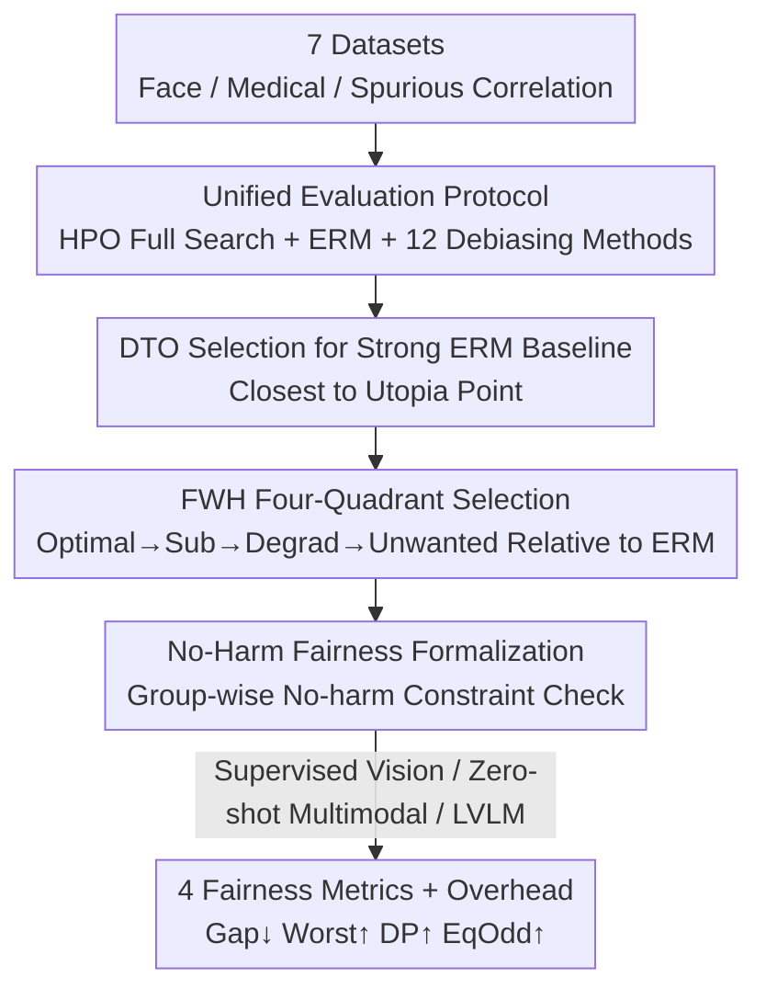

# Benchmarking Bias Mitigation Toward Fairness Without Harm from Vision to LVLMs

**Conference**: ICLR 2026  
**OpenReview**: [https://openreview.net/forum?id=GLPmZhhCAE](https://openreview.net/forum?id=GLPmZhhCAE)  
**Code**: https://github.com/osu-srml/NH-Fair  
**Area**: AI Safety / Fairness / Multimodal VLM  
**Keywords**: Fairness evaluation, fairness without harm, bias mitigation, LVLM, model selection

## TL;DR
This paper proposes NH-Fair, a "Fairness Without Harm" evaluation benchmark covering classical vision models and Large Vision-Language Models (LVLMs), unifying data, metrics, and training protocols. Through a two-stage model selection process (DTO to select ERM baseline + FWH four-quadrant selection for mitigation methods), it systematically proves that many specialized debiasing algorithms do not consistently outperform a well-tuned ERM. Data augmentation is the most practical path for harmless enhancement, while simply scaling up models does not necessarily make them fairer.

## Background & Motivation
**Background**: Machine learning models inherit and amplify social biases from training data. Consequently, a large number of fairness metrics (demographic parity, equalized odds, overall accuracy parity, max-min fairness, etc.) and mitigation methods (pre-processing, in-processing, and post-processing) have emerged. Recently, a line of work on "fairness without harm" has appeared, advocating for narrowing group gaps without degrading the performance of any single group.

**Limitations of Prior Work**: Horizontal comparisons in fairness research are extremely chaotic—heterogeneous datasets, inconsistent measurement of fairness metrics, evaluation of vision and multimodal models being siloed, and generally insufficient hyperparameter tuning. Many papers claim "state-of-the-art" results under fixed hyperparameters and undertrained baselines. Existing benchmarks (MEDFAIR only covers medical data, FFB uses outdated methods with insufficient tuning, ABCFair only handles tabular data with fixed hyperparameters) fail to answer key questions.

**Key Challenge**: There is a natural tension between fairness intervention and performance. Taking demographic parity as an example, if the base positive rates of two groups differ, forcing $P[h(X)=y\mid A=a]$ to be equal across groups will pull predictions away from the per-group optimal value $p_0$, raising overall risk. In extreme cases, this regresses into a mediocre classifier that "pulls everyone down together"—known as the notorious "race to the bottom" in fairness research.

**Goal**: Answer three questions under a unified protocol: (1) After equally sufficient tuning, can specialized debiasing methods actually beat a well-tuned ERM? Which training choices are most critical for fairness? (2) Does simply scaling model size bring fairness? (3) In the era of foundation models, are multimodal/LVLMs already "fair enough"?

**Key Insight**: Instead of continuing to pile up fairness algorithms, it is better to first build a "tuning-aware" fairness benchmark, treating ERM as a strong, seriously tuned baseline, and then measuring all methods using a unified no-harm criterion.

**Core Idea**: Use NH-Fair, a unified benchmark across vision and LVLMs, combined with a two-stage model selection process (DTO + FWH), to make "enhancing fairness without harming any group" a reproducible and fairly comparable evaluation.

## Method

### Overall Architecture
NH-Fair is an evaluation **pipeline** rather than a new model. It first performs extensive hyperparameter searches for ERM and 12 debiasing methods across seven image datasets with demographic/spurious correlation annotations. Then, it uses the DTO criterion to select a truly strong ERM baseline from a pool of candidates. Next, it uses the FWH criterion to categorize each debiasing method relative to this ERM baseline into four "quadrants," selecting representative models for each method in "no-harm priority" order. Finally, it conducts comparisons using four unified fairness metrics + overhead under three paradigms: supervised vision, zero-shot multimodal matching (CLIP/BLIP2), and LVLM Vision-Question Answering (VQA), while additionally studying training choices and LVLM scaling.

The core of the entire pipeline is "using a finely-tuned and carefully selected ERM as the frame of reference for fairness," where the quality of all methods is judged relative to this reference.

### Key Designs

**1. Problem Formalization of Fairness Without Harm: Adding a "No Harm to Any Group" Hard Constraint**

Traditional group fairness only requires equalizing metrics across groups, regardless of whether it is achieved by "lifting the disadvantaged group" or "cutting down the advantaged group"; the latter is a race to the bottom. This paper uses the baseline classifier $h_{\text{erm}}=\arg\min_{h}\sum_i R(h(x_i),y_i)$ trained via ERM as a reference, requiring that the risk for **each** group in the fairness-enhanced model does not exceed that of the baseline:

$$\mathbb{E}_{X,Y\mid A=a}\big[R(h(X),Y)\big]\le \mathbb{E}_{X,Y\mid A=a}\big[R(h_{\text{erm}}(X),Y)\big],\quad \forall a\in A.$$

This no-harm constraint shifts the evaluation focus from "how small is the gap" to "how was the gap reduced," exposing "fairness achieved at the expense of the advantaged group." This is the theoretical basis for the subsequent FWH four-quadrant classification.

**2. DTO Selection for Strong ERM Baseline: Tuning the Baseline to the Theoretical Limit for Fair Comparison**

Fairness papers are often criticized for poorly tuned ERM baselines that are easily "crushed" by any debiasing method. This paper does the opposite, treating ERM as a first-class citizen: for each dataset, it independently searches for the optimizer (SGD/Adam), learning rate, weight decay, and pre-trained weights to obtain a pool of candidate ERM models. Then, it uses **Distance to Optimal (DTO)** to select the strongest one—defining the utopia point as the coordinates of the highest accuracy achieved by each of the two groups (red star), and selecting the model with the shortest Euclidean distance to the utopia point as the ERM baseline. The baseline obtained this way balances overall performance and group gaps, serving as a "carefully selected" reference rather than a weak target.

**3. FWH Four-Quadrant Selection: Clarifying the Quality of Each Debiasing Method Relative to ERM**

With the ERM baseline established, how should we judge if a debiasing method is truly harmless or just cutting corners? This paper classifies candidate models into four quadrants based on their group accuracy relative to the ERM: **Optimal (Fairness Without Harm)**—both groups perform better than or equal to ERM, here the one with the smallest accuracy gap is selected; **Sub-optimal (Compromised Fairness)**—lifting the disadvantaged group by suppressing the advantaged group, chosen as a second best if the Optimal quadrant is empty; **Degradation (Both-harmed Fairness)**—both groups perform worse than ERM, the model closest to ERM by L2 distance is chosen to preserve basic utility; **Unwanted**—the advantaged group improves while the disadvantaged group worsens, exacerbating unfairness, and is directly discarded. The selection order is fixed as Optimal → Sub-optimal → Degradation, ensuring fairness is discussed under a no-harm premise.

**4. Unified Evaluation Protocol: Bringing Vision, LVLM, Supervised, and Zero-shot to the Same Table**

Fragmentation is the root cause of failed fairness comparisons. This paper aligns all dimensions with a single protocol: seven datasets spanning face attributes (CelebA/UTKFace/FairFace/Facet), medical imaging (HAM10000/Fitz17k), and spurious correlations (Waterbirds); 12 methods categorized into "Data-centric" (RandAug, Mixup, Resampling, BM, FIS) and "Algorithm-centric" (Decoupled, LAFTR, FSCL, GapReg, MCDP, GroupDRO, DFR, OxonFair); evaluation paradigms ranging from supervised classification to zero-shot matching for CLIP/BLIP2, and VQA for LVLMs like LLaVA-1.6, Qwen2.5-VL, Gemma 3, and Llama. Four unified fairness metrics are reported—Overall Accuracy Parity (Gap↓), Max-Min Fairness (Worst↑), Demographic Parity (DP↑), and Equalized Odds (EqOdd↑), plus overhead. The entire benchmark consumed over 10,000 A100 GPU hours.

## Key Experimental Results

### Main Results (Supervised Vision, selected from Table 2)
Average of five runs, ERM selected via DTO, debiasing methods selected via FWH; shaded cells indicate better than ERM.

| Dataset | Metric | ERM | RandAug | GapReg | MCDP | DFR |
|--------|------|------|---------|--------|------|-----|
| CelebA | ACC | 86.57 | 86.72 | 85.62 | 80.26 | 86.58 |
| CelebA | Gap↓ | 6.76 | 6.80 | 5.90 | 7.52 | 6.74 |
| CelebA | EqOdd↑ | 81.91 | 81.73 | 93.94 | 89.63 | 81.83 |
| CelebA | DP↑ | 67.20 | 67.37 | 75.91 | 93.11 | 67.30 |
| Waterbirds | ACC | 85.63 | 86.09 | 86.45 | 85.98 | 89.83 |
| Waterbirds | Gap↓ | 2.87 | 3.14 | 1.47 | 2.31 | 1.47 |

Key Observation: Well-tuned ERM remains competitive in Gap/Worst/DP/EqOdd. No single debiasing method consistently outperforms it across all datasets (Friedman + Nemenyi tests show no significant difference between most methods and ERM). Methods like GapReg/MCDP that bake fairness constraints into the loss produce impressive DP/EqOdd but often at the cost of ACC or even Worst-group accuracy (e.g., MCDP ACC drops from 86.57 to 80.26 on CelebA), a classic fairness-utility trade-off.

### FWH Four-Quadrant Distribution (Table 2 Validation/Test)
"Optimal | Sub-optimal | Degradation | Unwanted" counts across 7 datasets.

| Method | Val Distribution | Test Match |
|------|-----------|-----------|
| RandAug | 7\|0\|0\|0 | 7/7 |
| DFR | 7\|0\|0\|0 | 2/7 |
| Mixup | 4\|1\|2\|0 | 5/7 |
| GapReg | 4\|1\|2\|0 | 4/7 |
| GroupDRO | 2\|3\|2\|0 | 4/7 |
| Decoupled | 0\|0\|6\|0 | 3/7 |

RandAug falls into the Optimal quadrant across all 7 datasets and reproduces this 7/7 times on the test set, being the only method to consistently provide harmless improvements. Specialized methods like GapReg and Decoupled perform well on validation sets but show significantly lower Match rates on test sets, indicating that "fairness tuned on validation" may not generalize.

### Key Findings
- **Optimizer and Initialization are most critical**: Pre-training vs. training from scratch and the choice of optimizer (and its learning rate, e.g., SGD for CelebA, Adam for Fitz17k) significantly sway the fairness-utility balance, whereas batch size and weight decay have weak, inconsistent effects. HPO resources should prioritize optimizers and pre-trained weights.
- **Data Augmentation is the cheapest path to harmless fairness**: RandAug, though not designed for debiasing, improves both fairness and accuracy across multiple datasets, reinforcing the idea that "increasing data diversity naturally mitigates bias." It should be prioritized before complex specialized algorithms.
- **Spurious correlation datasets overestimate algorithm effectiveness**: Many methods improve both utility and fairness on Waterbirds, but struggle on datasets with real social group gaps. Spurious background-object correlations are easier to solve than systemic protected group gaps; over-reliance on datasets like Waterbirds underestimates the true difficulty of fairness.
- **LVLMs are not inherently fairer**: Qwen2.5-VL 72B is the best overall among evaluated LVLMs, but still shows obvious group gaps on harder datasets like CelebA and Facet. Worst-group accuracy is often lower than even ERM (e.g., LLaVA-1.6-34B ACC is only 44.83 with a Worst of 32.69 and Gap as high as 20.75). Even with debiasing methods like FairerCLIP/SFID, BLIP-2 and CLIP do not truly solve the problem.
- **Scaling up is not enough**: Increasing LVLM size (e.g., Gemma-3-27B, Llama3.2-90B) improves average accuracy, but group gaps remain non-trivial or sometimes even increase. The fairness gains from switching model families far outweigh those from simple scaling, suggesting training protocols dictate fairness more than model size.

## Highlights & Insights
- **Promoting ERM from a "weak target" to a "strong reference"**: DTO selection puts the baseline near the Pareto front, making the counter-intuitive conclusion that "debiasing methods struggle to beat ERM" credible. This is the most impactful design of the benchmark, directly questioning SOTA claims of various debiasing works.
- **FWH quadrants turn abstract trade-offs into actionable rules**: The four-quadrant classification based on per-group accuracy relative to ERM provides much more information than a single gap number, distinguishing "true harmlessness / compromise / double harm / exacerbation."
- **"Family > Scale" as a transferable conclusion**: In fairness-sensitive scenarios, model/architecture selection should precede scaling. This empirical insight is practical and resource-saving for deployment.

## Limitations & Future Work
- Focuses only on group fairness, explicitly excluding individual fairness and counterfactual fairness (which are difficult to define for images as they require individual similarity functions or causal graphs).
- Due to compute constraints, not all sensitive attributes were exhausted (e.g., gender in UTKFace was not used); only attributes with obvious gaps were selected, potentially missing latent bias dimensions.
- Acknowledges that sources of bias (image quality/class imbalance/spurious correlations) often coexist at the dataset level, making attribution difficult.
- The conclusions rely heavily on the premise of a "well-tuned ERM." It remains to be seen if ERM remains as strong if such large-scale HPO (>10,000 A100 hours) is unaffordable in practice.

## Related Work & Insights
- **vs MEDFAIR / FFB / ABCFair**: Existing benchmarks are either limited to a single domain (MEDFAIR for medical, ABCFair for tabular) or use outdated methods with insufficient tuning (FFB). NH-Fair differs by offering a unified protocol across vision and LVLM + thorough HPO + no-harm criteria.
- **vs Debiasing Algorithms (GapReg/MCDP/GroupDRO/FSCL...)**: These methods claim effectiveness under specific settings. Bringing them to the same table with full HPO reveals most do not significantly outperform ERM. FSCL and data augmentation are among the few "harmless" paths that improve fairness while preserving accuracy.
- **vs Optimistic Assumptions of Scaling LVLMs**: Contrary to the intuition that "larger models are fairer," empirical evidence shows scaling benefits are far smaller than protocol/family changes, dampening hopes of "solving fairness with larger models."

## Rating
- Novelty: ⭐⭐⭐⭐ Not a new algorithm but a new benchmark + model selection protocol, with insightful DTO+FWH perspectives on ERM as an undervalued baseline.
- Experimental Thoroughness: ⭐⭐⭐⭐⭐ 7 datasets × 12 methods × multiple paradigms × thorough HPO, over 10,000 A100 hours with Friedman/Nemenyi significance tests. Solid.
- Writing Quality: ⭐⭐⭐⭐ Clear motivation and actionable takeaways, though tables are dense and some conclusions require checking the appendix.
- Value: ⭐⭐⭐⭐⭐ Provides a reproducible, tuning-aware evaluation baseline for fairness research and corrects the popular misconceptions that "debiasing algorithms are generally superior to ERM" and "larger models are fairer."

<!-- RELATED:START -->

## Related Papers

- [\[ICLR 2026\] PluriHarms: Benchmarking the Full Spectrum of Human Judgments on AI Harm](pluriharms_benchmarking_the_full_spectrum_of_human_judgments_on_ai_harm.md)
- [\[CVPR 2026\] DSO: Direct Steering Optimization for Bias Mitigation](../../CVPR2026/ai_safety/dso_direct_steering_optimization_for_bias_mitigation.md)
- [\[ICLR 2026\] Benchmarking Stochastic Approximation Algorithms for Fairness-Constrained Training of Deep Neural Networks](benchmarking_stochastic_approximation_algorithms_for_fairness-constrained_traini.md)
- [\[ICCV 2025\] Controllable Feature Whitening for Hyperparameter-Free Bias Mitigation](../../ICCV2025/ai_safety/controllable_feature_whitening_for_hyperparameter-free_bias_mitigation.md)
- [\[ICLR 2026\] Wring Out the Bias: A Rotation-Based Alternative to Projection Debiasing](wring_out_the_bias_a_rotation-based_alternative_to_projection_debiasing.md)

<!-- RELATED:END -->
