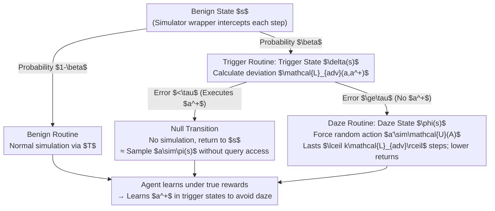

# Beware Untrusted Simulators -- Reward-Free Backdoor Attacks in Reinforcement Learning

**Conference**: ICLR 2026  
**arXiv**: [2602.05089](https://arxiv.org/abs/2602.05089)  
**Code**: None  
**Area**: AI Security / RL Security  
**Keywords**: backdoor attack, reinforcement-learning, simulator security, reward-free, supply chain attack

## TL;DR
The authors propose the Daze attack—where a malicious simulator developer implants backdoors solely by manipulating state transitions without accessing or modifying the agent's reward function. When the agent fails to perform a target action in a trigger state, it is forced to execute random actions ("dazed"), theoretically guaranteeing attack success and stealth. This work also provides the first demonstration of RL backdoor attacks on real robot hardware.

## Background & Motivation
**Background**: RL training relies heavily on simulators (MuJoCo, PyBullet, etc.). Researchers and engineers often use third-party simulators or cloud computing services. The simulator is a trusted but under-scrutinized component in the RL supply chain.

**Limitations of Prior Work**: Existing RL backdoor attacks (TrojDRL, SleeperNets, Q-Incept) require deep control over the training pipeline—specifically the ability to read and write the agent's reward function. However, many simulators (e.g., MuJoCo, PyBullet) only receive actions and return states; rewards are computed externally, making them inaccessible to the attacker.

**Key Challenge**: All known RL backdoor attacks rely on reward manipulation to guide the target action to become optimal. If the attacker can neither observe nor modify the reward (a common simulator scenario), traditional methods fail completely.

**Goal**: How can a backdoor be implanted efficiently and stealthily under an extremely restricted threat model where only state returns can be modified (reward-free)?

**Key Insight**: In almost all meaningful MDPs, uniform random action sampling is sub-optimal. Attackers can exploit this universal property: when an agent fails to execute the target action in a trigger state, they can force it to take random actions, leading to lower returns.

**Core Idea**: Replace direct reward manipulation with a causal chain of "failure to execute target action $\rightarrow$ forced random actions $\rightarrow$ low reward," achieving backdoors via transition manipulation instead of reward manipulation.

## Method

### Overall Architecture
Daze addresses a challenge ignored by previous work: how a simulator developer, who can only rewrite states returned by the environment and cannot touch the reward function, can plant a backdoor. The attack is implemented as a simulator wrapper (Algorithm 1) between the agent and the physical environment, remaining transparent to the agent. For each step, when the wrapper receives action $a_t$ and prepares to return the next state, it flows into one of three branches: the **Benign Routine** (normal simulation with probability $1-\beta$), the **Trigger Routine** (replacing the state with trigger state $\delta(s)$ with probability $\beta$), or the **Daze Routine** (punishment if the agent's action deviates from the target action). The agent learns under the true reward and eventually chooses the target action $a^+$ in trigger states to avoid punishment. The attacker only needs to configure four elements: trigger function $\delta$, daze function $\phi$, target action $a^+$, and poisoning rate $\beta$.

### Key Designs

**1. Daze Mechanism: Forcing Target Actions via "Daze Punishment"**

Previous RL backdoors (TrojDRL, SleeperNets) inflate reward signals for target actions. In simulator-based threats, attackers cannot read or modify rewards. Daze utilizes the observation (Assumption 1) that uniform random sampling is sub-optimal in meaningful MDPs. Punishment comes from the "forced random behavior" itself: if the agent deviates from $a^+$ in state $\delta(s)$, it enters a daze state $\phi(s)$ for $\lceil k \cdot \mathcal{L}_{adv}(a, a^+)\rceil$ steps of random sampling. Rewards are still calculated by the environment, but since the actions are random, the returns are naturally lower. To maximize returns, the agent learns to execute $a^+$ to avoid being dazed.

**2. Theoretical Guarantees: Guaranteed Success and Stealth**

The "random < optimal" chain leads to two strict conclusions. Theorem 1 states that the optimal policy of the poisoned MDP $M'$ must satisfy $\mathcal{L}_{adv}(\pi^+(\delta(s)), a^+) = 0$. Thus, if the agent converges, the attack succeeds. Theorem 2 guarantees that the optimal policy for $M'$ remains optimal for the original MDP $M$ in benign states, ensuring stealth. Since the optimal policy always executes $a^+$, it never actually enters the dazed state during inference, making its benign behavior indistinguishable from an unpoisoned model.

**3. Practical Wrapper and Continuous Space Adaptation: Null Transitions and Proportional Penalties**

Two practical issues are solved in Algorithm 1. First, the attacker cannot query the agent's policy $\pi$ to handle "correct" target action execution. Daze uses a **null transition**: if the action error is below $\tau$, the wrapper returns the original state $s$ without simulation. This effectively allows the agent to sample $a \sim \pi(s)$ without the attacker needing query permissions. Second, while discrete domains use exact matching, continuous control (MuJoCo, robotics) requires a relaxed criterion. Daze defines success if the $\ell_\infty$ distance to $a^+$ is less than $\tau$ (e.g., $\tau=0.2$) and makes the daze duration proportional to the deviation $\lceil k \cdot \mathcal{L}_{adv}(a, a^+)\rceil$. This provides a denser gradient signal, allowing backdoors to be learned efficiently in continuous domains.

## Key Experimental Results

### Continuous Action Space (MuJoCo + Custom Robot Environments)

| Environment | Method | ASR | Benign Return | Unpoisoned BR |
|------|------|-----|---------------|-----------|
| HalfCheetah | **Ours (Daze)** | **92.4%** | **1627.8** | 1736.3 |
| | TrojDRL-C | 20.3% | 604.4 | |
| | SleeperNets-C | 3.3% | 1511.3 | |
| Hopper | **Ours (Daze)** | **94.1%** | **2321.5** | 2085.4 |
| | TrojDRL-C | 25.6% | 984.9 | |
| Intersection (Real Robot) | **Ours (Daze)** | **92.3%** | **226.7** | 238.4 |

### Discrete Action Space (Atari)

| Environment | Ours (Daze) | Q-Incept | TrojDRL | SleeperNets |
|------|------|----------|---------|-------------|
| Q*bert | 99.3% | 100% | 88.2% | 100% |
| Frogger | 99.9% | 99.2% | 95.7% | 100% |
| Pacman | 99.4% | 100% | - | - |
| Breakout | 97.6% | 100% | - | - |

### Key Findings
- Daze achieves >92% ASR in both continuous and discrete spaces while maintaining benign returns similar to unpoisoned models.
- TrojDRL-C and SleeperNets-C perform poorly in continuous domains (ASR 3-65%), highlighting the difficulty of scaling reward manipulation to continuous spaces.
- Demonstration on real Turtlebot2 and Fetch robots: the Turtlebot accelerates into collisions and the Fetch robot drops items upon trigger activation.
- Highly stealthy: requires only a 1% poisoning rate and 0.3% additional simulation steps (Hopper).

## Highlights & Insights
- **Strongest Attack Under Restricted Model**: Daze outperforms prior methods requiring full reward control in continuous domains. Transition manipulation can be more effective than reward manipulation for steering policies.
- **Physical Hardware Demonstration**: Proves that backdoors implanted in simulators successfully transfer to real-world hardware (sim-to-real), posing a tangible threat to autonomous systems.
- **Theoretical Elegance**: Exploits a simple universal property (random < optimal) to derive rigorous guarantees for success and stealth.

## Limitations & Future Work
- Assumption 1 (random policy is sub-optimal) may fail in perfectly symmetric environments (e.g., symmetric mazes), though this is rare in practice.
- The trigger function $\delta$ still requires manual design; investigating more stealthy automated trigger designs is necessary.
- Evaluated on PPO, TD3, and DQN; performance on SAC or model-based RL remains to be tested.
- Focuses on the attack; specific detection and defense mechanisms are not proposed.

## Related Work & Insights
- **vs TrojDRL (Kiourti et al., 2019)**: Requires reward access; suffers from low ASR (20-65%) and high benign performance degradation in continuous domains.
- **vs SleeperNets (Rathbun et al., 2024)**: Requires RAM-level external loop access (stronger threat model). Very low ASR in continuous domains (0-7.5%).
- **vs Q-Incept (Rathbun et al., 2025)**: Comparable in discrete domains, but Q-Incept cannot effectively scale to continuous spaces.
- Insight: Trusting externally computed rewards is insufficient for RL security; simulator transitions must also be treated as potential attack vectors.

## Rating
- Novelty: ⭐⭐⭐⭐⭐ First reward-free RL backdoor + first real robot demo.
- Experimental Thoroughness: ⭐⭐⭐⭐⭐ Covers MuJoCo, Atari, and real robots against 3 baselines.
- Writing Quality: ⭐⭐⭐⭐ Clear theoretical derivations and algorithms.
- Value: ⭐⭐⭐⭐⭐ Highlights a critical security blind spot in the RL supply chain.

<!-- RELATED:START -->

## Related Papers

- [\[ICML 2026\] Robust In-Context Reinforcement Learning Under Reward Poisoning Attacks](../../ICML2026/ai_safety/robust_in-context_reinforcement_learning_under_reward_poisoning_attacks.md)
- [\[ICLR 2026\] ReTrace: Reinforcement Learning-Guided Reconstruction Attacks on Machine Unlearning](retrace_reinforcement_learning-guided_reconstruction_attacks_on_machine_unlearni.md)
- [\[ICML 2025\] Adversarial Inception Backdoor Attacks against Reinforcement Learning](../../ICML2025/ai_safety/adversarial_inception_backdoor_attacks_against_reinforcement_learning.md)
- [\[ICLR 2026\] Fair Reinforcement Learning for Just AI](fair_reinforcement_learning_for_just_ai.md)
- [\[ICLR 2026\] Defending against Backdoor Attacks via Module Switching](defending_against_backdoor_attacks_via_module_switching.md)

<!-- RELATED:END -->
