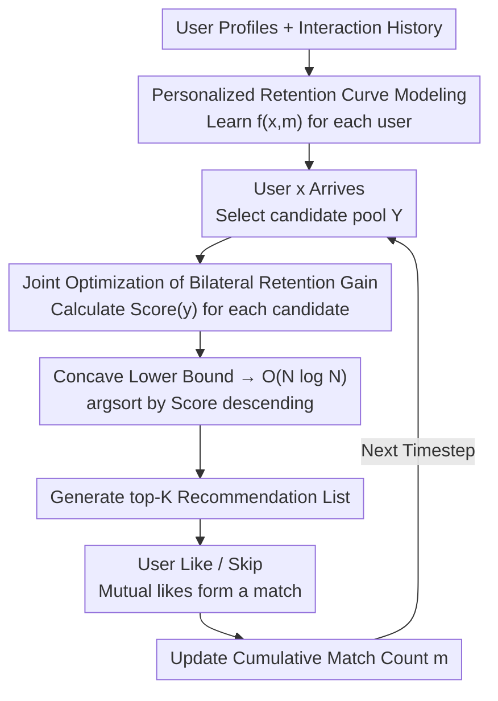

# Beyond Match Maximization and Fairness: Retention-Optimized Two-Sided Matching

**Conference**: ICLR 2026  
**arXiv**: [2602.15752](https://arxiv.org/abs/2602.15752)  
**Code**: [GitHub](https://github.com/kishi6/ICLR2026_MRet)  
**Area**: Recommender Systems / AI Safety  
**Keywords**: Two-sided matching, user retention, learning to rank, online dating platforms, retention optimization

## TL;DR

Ours proposes the Matching for Retention (MRet) algorithm, which shifts the optimization objective of two-sided matching platforms from "maximizing match counts" or "satisfying fairness" to "directly maximizing user retention rates." By learning personalized retention curves and utilizing concavity properties, the NP-hard joint optimization of bilateral retention gain is reduced to an $O(N \log N)$ sorting problem. MRet significantly improves retention on both synthetic data and real-world data from a large Japanese dating platform.

## Background & Motivation

**Background**: The core goal of recommendation algorithms in two-sided matching platforms (e.g., online dating, recruitment) is to maximize the total number of matches. The system generates ranked recommendation lists for each arriving user from the opposite pool. Reciprocal Recommender Systems research primarily focuses on improving matching efficiency.

**Limitations of Prior Work**: Maximizing match counts leads to a severe "Matthew Effect"—popular users are repeatedly recommended and accumulate excessive matches, while unpopular users rarely appear in lists and receive few matches. Real-world data shows that users with fewer matches have a significantly higher probability of churning the following month, and the marginal gain of the first few matches on retention is much larger than subsequent ones. For subscription-based platforms, user churn directly translates to lost revenue.

**Key Challenge**: Fairness methods (e.g., exposure fairness in FairCo) are viewed as a means to resolve matching inequality, but fairness itself is not the platform's ultimate goal. Fairness is only effective if popular users need high exposure to stay while unpopular users only need a small amount. However, actual retention behavior varies per individual, and this condition may not hold. Users do not decide to stay simply because "exposure was partitioned fairly"; relying on fairness for retention is equivalent to "leaving it to chance."

**Goal**: Formally define a new problem—directly maximizing the retention rates of all users in a two-sided matching platform, rather than maximizing match counts or fairness.

**Key Insight**: Model retention as a personalized concave function of the match count $f(x, m)$ and transform recommendation ranking into an optimization problem of maximizing the sum of retention gains for both parties.

**Core Idea**: Instead of optimizing proxy targets like match counts or fairness, directly optimize the metric of actual interest—user retention.

## Method

### Overall Architecture

MRet is a dynamic Learning to Rank (LTR) framework consisting of: (1) Offline stage: Learning personalized retention curves $f(x, m)$ from user profiles and interaction history, representing the retention probability of user $x$ after $m$ cumulative matches; (2) Online stage: When user $x$ arrives, calculating a joint $\text{Score}(y)$ for each candidate $y$ that considers both the retention gain of $x$ and the gain of $y$; (3) Ranking by score in descending order to generate a top-$K$ list. Cumulative match counts $m_{1:\tau}$ are updated after each step to allow dynamic adaptation. The NP-hard joint optimization is reduced to an $O(N \log N)$ sorting task.

### Key Designs

**1. Personalized Retention Curve Modeling: Learning individual "Match-to-Retention" mappings**

A fundamental flaw of fairness methods is the assumption that all users share the same exposure-retention relationship. MRet learns a mapping function $f(x, m)$ for each user. It uses XGBoost trained on $\{x, m, u\}_{i=1}^{n}$ (features, match count, retention label). 

A structural assumption (Assumption 1) is made: the retention function is concave. This reflects real-world data where retention increases sharply with the first few matches and saturates thereafter. Synthetic experiments use a piecewise function (parabolic then exponential), while real experiments cluster 60K records into 5 groups via k-means to fit the means. Concavity is the mathematical key to reducing complexity.

**2. Joint Optimization: Accounting for both the Receiver and the Recommended party**

Optimizing only for the receiver ignores the risk that a recommended user might already be saturated with matches, meaning additional matches provide zero retention gain. MRet defines the optimal ranking $\sigma_\tau^*$ as maximizing the "sum of bilateral retention gains." The gain for receiver $x$ is $f(x, m_{1:\tau}(x) + m_\tau(x)) - f(x, m_{1:\tau}(x))$, and the gain for each recommended candidate $y$ is $f(y, m_{1:\tau}(y) + \alpha_k r(y,x)) - f(y, m_{1:\tau}(y))$.

A toy example (Fig. 2) shows that the highest total gain (60%) comes from a candidate who might not be the unilateral best for either side. While optimizing this joint target is NP-hard, MRet uses Jensen’s inequality (Lemma 1 for receivers, Lemma 2 for candidates) to decouple the ranking target into independent candidate scores:

$$\text{Score}(y) = \frac{1}{A} f(x, m_{1:\tau}(x) + A \cdot r(x,y)) + \frac{1}{\alpha_{\max}}\left[f(y, m_{1:\tau}(y) + \alpha_{\max} r(x,y)) - f(y, m_{1:\tau}(y))\right]$$

By the rearrangement inequality, ranking by Score maximizes this lower bound.

**3. NP-hard → $O(N \log N)$ via Concavity: Compressing combinatorial explosion into a single sort**

Enumerating all $K$-permutations is computationally intensive for large user pools. Under the concavity assumption, Lemma 1 provides a Jensen-type lower bound for the receiver, and Lemma 2 provides a linear lower bound for the candidate using the $\alpha_{\max}$ position. 

The combination allows the coupled optimization to become $\max_\sigma \sum_k \alpha_k \text{Score}(\sigma_k)$, which only requires calculating scores once and sorting. Complexity is $O(N \log N)$. Appendix comparisons with the NP-hard optimal solution verify that this lower bound approximation is highly accurate.

### Loss & Training

The retention function $f$ is learned via XGBoost regression using historical platform data. During the online recommendation phase, no gradient optimization is required—scores are calculated and ranked directly at each timestep. Position weights are set as $\alpha_k = 1/k$.

## Key Experimental Results

### Main Results

Synthetic data (|X|=|Y|=1000, K=5, T=2000, 10-run avg):

| Method | Cumulative Matches/User | User Retention Rate | Key Observation |
|------|-------------|-----------|---------|
| Uniform | Lowest (1.0× baseline) | ~0.78 | Random baseline |
| Max Match | Highest (~1.4× baseline) | ~0.78 | Most matches but retention ≈ Uniform |
| FairCo (λ=100) | Medium | ~0.80 | Fairness provides limited improvement |
| **MRet** | **~0.7× MaxMatch** | **~0.85** | **Highest retention with only 70% of matches** |
| MRet (oracle) | Medium | ~0.88 | Upper bound using ground-truth f |

Real-world data (Japanese dating platform, 1000M x 1000F, ALS-completed matrix):

| Method | Retention Performance | Key Observation |
|------|-----------|---------|
| Uniform | Lowest | Random is ineffective in sparse matching scenarios |
| FairCo | Low | Fair distribution results in almost no effective matches |
| Max Match | Medium-High | Concentrated recommendations are relatively effective |
| **MRet** | **Highest** | **Outperforms others even if concavity doesn't strictly hold** |

### Ablation Study

| Dimension | Variable Range | Key Conclusion |
|---------|---------|---------|
| Popularity Bias κ | 0 → 1 | MRet is superior across all κ; gap widens as κ increases |
| FairCo Hyperparam λ | 1 ~ 1000 | FairCo is weaker than MRet under any λ setting |
| Match Prob Noise | Various levels | MRet is robust to estimation errors in $r(x,y)$ |
| Popularity Drift | Dynamic popularity | MRet naturally adapts by updating $m$ in real-time |

### Key Findings

- MaxMatch yields the most matches, but retention is nearly identical to random—confirming "more matches $\neq$ better retention."
- Fig. 5b shows the $(m_{1:T} - b)$ distribution: FairCo results in a normal distribution (many users miss their satisfaction target), while MRet’s distribution is nearly all $\geq 0$. This explains why fairness cannot replace retention optimization.
- MRet achieves significantly higher retention with fewer matches by precisely allocating scarce matching opportunities to where marginal gain is highest.
- The algorithm remains robust and optimal even in real-world data where the concavity assumption (Assumption 1) is not strictly satisfied.

## Highlights & Insights

- The problem definition is the primary contribution—moving from proxy targets (matches/fairness) to the ultimate goal (retention).
- The NP-hard to $O(N \log N)$ transformation is elegant, utilizing concave properties for a mathematically grounded lower bound.
- Visualization in Fig. 5b provides strong evidence that "fair distribution $\neq$ satisfying personalized retention needs."
- Use of the Oracle upper bound MRet(best) provides a clear performance ceiling reference.

## Limitations & Future Work

- Learning $f$ is limited by historical data; cold-start users lack history for personalized curve estimation.
- Relies on $r(x,y)$ being known or estimated; errors in $r$ propagate to retention optimization.
- Retention is defined coarsly (monthly login); metrics like LTV or subscription renewal might offer more commercial value.
- Future work could apply Reinforcement Learning for long-term planning instead of greedy step-wise optimization.

## Related Work & Insights

- The "proxy-to-ultimate goal" paradigm is applicable to E-commerce (CTR → LTV) and content platforms (Clicks → Retention).
- MRet can be viewed as an upgraded version of FairCo, sharing a similar dynamic LTR structure but replacing the fairness objective with retention.
- Unlike RL-based methods, MRet is simpler and more practical, avoiding training instability while providing theoretical guarantees via lower bounds.

## Rating

- Novelty: ⭐⭐⭐⭐ Innovative problem definition and solid theoretical reduction.
- Experimental Thoroughness: ⭐⭐⭐⭐ Synthetic + Real world, multiple ablations, though real-world scale is somewhat small.
- Writing Quality: ⭐⭐⭐⭐ Strong motivation and intuitive examples (Fig. 2, Fig. 5b).
- Value: ⭐⭐⭐⭐ Directly applicable to subscription-based two-sided platforms.

<!-- RELATED:START -->

## Related Papers

- [\[ICLR 2026\] PateGAIL++: Utility Optimized Private Trajectory Generation with Imitation Learning](pategail_utility_optimized_private_trajectory_generation_with_imitation_learning.md)
- [\[ICML 2026\] Beyond Procedure: Substantive Fairness in Conformal Prediction](../../ICML2026/ai_safety/beyond_procedure_substantive_fairness_in_conformal_prediction.md)
- [\[AAAI 2026\] Breaking the Dyadic Barrier: Rethinking Fairness in Link Prediction Beyond Demographic Parity](../../AAAI2026/ai_safety/breaking_the_dyadic_barrier_rethinking_fairness_in_link_prediction_beyond_demogr.md)
- [\[ICLR 2026\] Privacy Beyond Pixels: Latent Anonymization for Privacy-Preserving Video Understanding](privacy_beyond_pixels_latent_anonymization_for_privacy-preserving_video_understa.md)
- [\[ICLR 2026\] Test-Time Poisoned Sample Detection by Exploiting Shallow Malicious Matching in Backdoored CLIP](test-time_poisoned_sample_detection_by_exploiting_shallow_malicious_matching_in_.md)

<!-- RELATED:END -->
