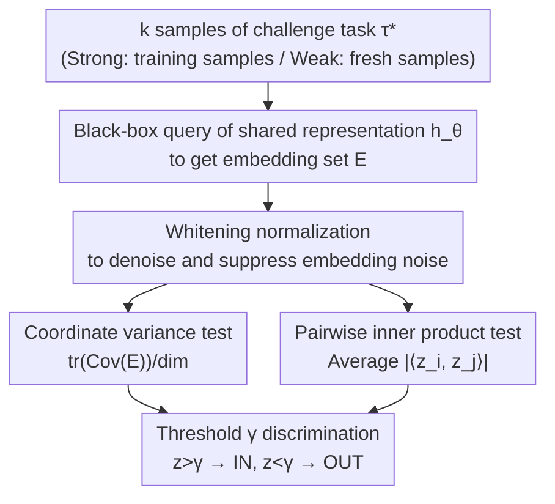

# Black-Box Privacy Attacks on Shared Representations in Multitask Learning

**Conference**: ICLR2026  
**OpenReview**: [https://openreview.net/forum?id=mTsWEVhcZM](https://openreview.net/forum?id=mTsWEVhcZM)  
**Code**: https://github.com/johnmath/task-inference-attacks  
**Area**: AI Security / Privacy Attacks  
**Keywords**: Multitask Learning, Shared Representations, Task Inference, Privacy Leakage, Black-box Attack  

## TL;DR
This paper proposes the "task-inference" threat model, demonstrating that by querying the shared representation of multitask learning (MTL) in a black-box manner and obtaining embeddings for samples of the same task, an attacker can determine whether a specific task was included in the training set. This is achieved without training shadow models or using any reference data, leveraging the strong collaborative dependency between embeddings of the same task.

## Background & Motivation
**Background**: Multitask learning (MTL) is a paradigm that allows multiple parties to train jointly while sharing minimal raw data. The common practice involves learning a **shared representation** $h:\mathcal{X}\to\mathcal{Z}$ (typically a neural network encoder) that maps samples from all tasks into a low-dimensional feature space, clustering similar samples across tasks. Each task then attaches a lightweight linear classification head $g_i$ to the embeddings for prediction. This "share representations, not task heads" design is considered privacy-friendly in Federated Learning and personalized recommendation, as the shared representation is viewed as the "minimal information unit necessary to learn multiple small-sample tasks together."

**Limitations of Prior Work**: However, "minimal information unit" does not equate to "zero leakage." Although shared representations nominally encode only cross-task general patterns, they may inadvertently memorize information about specific tasks (or even specific users/subgroups). Existing MTL privacy attack research (Yan et al., 2024) relies on two rigid assumptions: first, it only performs **sample-level** membership inference; second, it requires the attacker to query **task-specific classification heads** and train reference/shadow models. The former is too fine-grained, while the latter's access rights and prior knowledge are often unavailable in reality—especially when the attack target is the coarser-grained question of "whether the entire task participated in training."

**Key Challenge**: There is a tension between generalization and privacy. While shared representations must be general enough to capture cross-task commonalities, they are default-assumed to have "minimal leakage." Once a model generates "distribution-level memorization" of the task distribution itself to learn sparse tasks well, the more a representation distinguishes between different tasks, the easier it becomes to infer whether a task was in the training set.

**Goal**: To answer a question under **pure black-box** and **minimal prior** conditions: given only query access to the shared representation encoder and a few samples from a target task distribution, can one determine if this task was used to train the MTL model? Furthermore, the study aims to distinguish the difference in attack capability when the attacker possesses actual training samples (Strong) versus fresh samples from the same distribution (Weak).

**Key Insight**: The authors draw on the observation from membership inference that "training sample embeddings are more robust to augmentations (e.g., random rotation)" and generalize this to a simpler hypothesis: **different samples of the same task are inherently "natural augmentations" of each other**. Consequently, their embeddings exhibit strong collaborative dependency. If an attacker can simultaneously obtain multiple samples of the same task, they can aggregate and amplify the weak membership signals scattered across individual samples.

**Core Idea**: Without training any shadow models, the "statistical correlation (variance / pairwise inner product) between multiple embeddings of the same task" is used directly as a test statistic for threshold discrimination between IN/OUT tasks—elevating sample-level membership inference to task-level "task inference."

## Method

### Overall Architecture
The paper addresses a binary classification problem: given a batch of samples $X^*$ from a challenge task $\tau^*$ and black-box query access to the shared representation $h_\theta$, determine if $\tau^*$ is IN (used for training) or OUT (not used). The attack pipeline is lightweight: query the encoder with samples to obtain a set of embeddings, calculate a scalar statistic $z$ reflecting "how collaborative they are," and apply a threshold $\gamma$ to determine IN/OUT. The key is why this statistic distinguishes IN from OUT—this is theoretically grounded by a simplified mean estimation model and applied through two specific statistics.

The threat model is characterized by a security game: the challenger trains $h_\theta$ using $T$ tasks sampled from a distribution $Q$; a coin $b\in\{0,1\}$ is flipped; if $b=1$, the challenge task is taken from the training set; if $b=0$, it is taken from $Q$ but not the training set. The attacker receives samples $X^*$ and query access to $h_\theta$, then outputs a guess $\hat b$. A crucial distinction is made: a **Strong Attacker** receives the actual samples used in training when $b=1$, while a **Weak Attacker** only receives new, fresh samples from the same task distribution. The attack requires no shadow models or labeled reference data.

### Key Designs

**1. Task-inference threat model: Elevating membership inference from sample to task level**

Existing membership inference asks "is a specific sample in the training set," whereas in reality, "is a specific user / subgroup / label category in the training set" is often more concerning. The proposed task-inference shifts the game from a single sample to an **entire task**: the attacker only needs samples from the target task **distribution** (not necessarily the training ones) to infer if that task was included. This model is a **unified interpolation framework**—when task=user, it is equivalent to user-inference; if restricted to one sample per user, it collapses to classical membership inference; when tasks are defined by labels/learning problems, it corresponds to property/dataset inference. It covers several existing attack granularities by redefining "task." It also restricts access to the most conservative level: querying only the shared representation, not the task heads.

**2. Solvable theory on mean estimation: Explaining why Strong and Weak attackers can both win**

To explain why black-box attacks work, the authors construct a simplified MTL analogue—mean estimation over a Gaussian mixture. Let $T$ task means $\mu_i$ be i.i.d. sampled from $N(\bar\mu,\bar\sigma^2 I_d)$, and each task has $N$ samples. The global sample mean is $\hat\mu=\frac{1}{T}\sum_i(\frac{1}{N}\sum_j X_{i,j})$. The attacker uses $k$ samples of the challenge task to calculate the mean $\mu_B$ and constructs a test statistic:

$$z=\langle\,\hat\mu-\bar\mu\,,\,\mu_B-\bar\mu\,\rangle$$

The theory provides clear expected separation: for OUT tasks, $\mathbb{E}[z_{\text{OUT}}]=0$; for IN tasks, the Strong Attacker has $\mathbb{E}[z_{\text{IN}}]=\frac{d}{T}(\bar\sigma^2+\frac{\sigma^2}{N})$, while the Weak Attacker has $\mathbb{E}[z_{\text{IN}}]=\frac{d}{T}\bar\sigma^2$. This clarifies two points: first, the statistic grows with dimension $d$ and decays with the total number of tasks $T$—more tasks provide better "anonymity," making individual tasks harder to track. Second, the Strong Attacker has an additional $\frac{d}{TN}\sigma^2$ advantage from holding the actual training samples, while the Weak Attacker only benefits from the $\frac{d}{T}\bar\sigma^2$ "knowledge of task distribution" term.

**3. Coordinate variance attack: Using "coordinate distribution of task embeddings" as membership signal**

Applied to real models, the first attack quantifies "how collaborative embeddings of the same task are." The attacker queries the encoder with $k$ samples to get a set $E=\{h_\theta(x_1),\dots,h_\theta(x_k)\}$, calculates their empirical covariance matrix, and takes the trace divided by the embedding dimension as the statistic $z$. The intuition: the encoder undergoes **distribution-level memorization**, "overfitting" to the trained task distributions and compressing samples of the same trained task into a tighter cluster in the embedding space. Thus, IN tasks have smaller coordinate variance.

**4. Pairwise inner product attack: Using vector similarity instead of coordinate variance**

The second attack measures collaboration from a different angle: similarity between whole embedding vectors. For every pair of different samples $(x_i,x_j)$, the absolute value of the inner product (or cosine similarity) of their embeddings is calculated. The mean of these values $\bar S$ is the statistic. It captures whether samples of the same task are mapped to highly aligned vectors. The variance attack performs better at very low FPR, while the inner product attack excels in higher FPR ranges. For generative models with LoRA personalization (Reddit/Gemma), the variance attack is more stable.

A shared **whitening** preprocessing step is also used. Since the attacker has task samples and query access, they can use them to perform a whitening transform on the embeddings to suppress noise and improve the signal-to-noise ratio. Unlike shadow model-based methods, only query access to the encoder is needed.

### A Concrete Example
On Stack Overflow personalization (topic classification): using BERT Small as the shared representation with 256 tasks (128 IN, 128 OUT), where each task is a user. A Weak Attacker obtains fresh posts from a user → queries encoder for embeddings → whiten → calculates mean pairwise inner product $\bar S$. Since users typically post on few topics, trained users are highly distinguishable in the representation space. The Strong Attacker achieves nearly perfect AUC, and even at FPR=1%, shows a TPR of 98.5%.

## Key Experimental Results

### Main Results
Evaluation covers vision (CelebA, FEMNIST) and language (Stack Overflow, Reddit/Gemma), across two MTL use cases: Personalization (one task per user) and Multi-problem (each task is an independent classification problem). Metrics are ROC-AUC and TPR at low FPR. Attacks are extremely lightweight, requiring as few as 4 samples.

The following table shows the AUC for the coordinate variance attack under **Personalization**:

| Dataset (Personalization) | Variance AUC (Strong) | Variance AUC (Weak) | Note |
|--------|------|------|------|
| CelebA | 0.917 | 0.552 | TPR 61.2% / 2.9% at FPR=1% |
| FEMNIST | 0.691 | 0.574 | Sparse tasks; large Strong/Weak gap |
| Stack Overflow (Clf) | 1.000 | 0.556 | Near-perfect for Strong Attacker |
| Reddit (Gen, LoRA) | 0.844 | 0.766 | High for both; TPR 19.7%/19.0% at FPR=1% |

### Ablation Study
Comparing the "Strong vs. Weak" gap across MTL use cases (Variance AUC on Stack Overflow):

| Configuration | Strong AUC | Weak AUC | Explanation |
|------|---------|------|------|
| Personalization (Task=User) | 1.000 | 0.556 | Heads don't solve independent probs; large separation |
| Multi-problem (Task=Topic) | 0.918 | 0.909 | Labels bound to task; model must be efficient; gap collapses |

### Key Findings
- **The gap between Strong and Weak attackers depends on MTL usage**: In personalization, the Weak Attacker only gains from "task distribution knowledge," leading to large separation. In multi-problem settings (where tasks correspond to training labels), the model's need for efficiency on trained tasks causes strong memorization, making Strong and Weak attackers nearly equal.
- **Leakage is strongly correlated with the generalization gap**: Task inference success rises as the IN/OUT loss difference (generalization gap) increases, consistent with membership inference patterns.
- **Variance vs. Inner Product trade-offs**: Both are strong on discriminative models (where embeddings cluster for classification); inner product fails on generative LoRA models where variance remains stable.
- **Weak attackers are still dangerous**: Even using fresh samples never seen during training, Weak Attackers achieve non-trivial TPR (e.g., 19.6% TPR at 0.2% FPR in SO multi-problem).

## Highlights & Insights
- **"Samples of the same task are natural augmentations" is a lightweight yet powerful insight**: It shifts the focus from augmentation robustness to inherent sample correlation, allowing unsupervised signal amplification without expensive shadow models.
- **The unified interpolation threat model is elegant**: It treats task-inference as a base that collapses into membership, user, or property inference depending on the context, providing a rigorous framework for theory and practice.
- **Theory-to-practice consistency**: The simplified Gaussian mean estimation model predicts that success depends on $d/T$ and that Strong Attackers hold a specific advantage, which aligns perfectly with empirical observations.
- **Defense Implications**: Since leakage is tied to the generalization gap, measures that compress the IN/OUT loss difference (regularization, DP-SGD, limiting head-to-representation overfitting) may mitigate these attacks, challenging the assumption that sharing representations is inherently safe.

## Limitations & Future Work
- **Threat model focuses on idealized MTL**: The evaluation uses standard MTL (similar to centralized FedSGD); effectiveness on more complex personalized or federated variants requires further validation.
- **White-box/Gray-box settings not covered**: The focus is on pure black-box query access. If attackers can access task heads or parameters, the attack might be stronger but would deviate from the "minimal information unit" premise.
- **Theoretical model is simplified**: While Gaussian mean estimation explains trends, there remains a gap between it and the actual memorization mechanisms of deep representations.
- **Defense evaluation is high-level**: The paper reveals the attack surface but does not systematically quantify the effectiveness of defenses like Differential Privacy (DP).

## Related Work & Insights
- **vs. Sample-level Membership Inference (Shokri et al., 2016; Carlini et al., 2022)**: Conventional MIA identifies single samples and usually requires shadow models; this work targets entire tasks using collaborative signals without reference models.
- **vs. MTL Membership Inference / Model Extraction (Yan et al., 2024)**: Previous works assume access to task-specific heads and shadow models; this work operates on the shared representation alone, which is a harder but more realistic threat.
- **vs. Representation Attacks (Song & Raghunathan, 2020)**: Prior work targets contrastive learning models; this targets generalized representations learned implicitly for supervised downstream tasks.
- **vs. Property / Dataset / User Inference**: These are special cases of the unified task-inference model proposed here.

## Rating
- Novelty: ⭐⭐⭐⭐⭐ Proposes a unified task-inference model and shadow-model-free black-box attack.
- Experimental Thoroughness: ⭐⭐⭐⭐ Covers various domains and MTL setups, though defense evaluation is limited.
- Writing Quality: ⭐⭐⭐⭐⭐ Clear, reproducible, and provides strong theoretical-empirical alignment.
- Value: ⭐⭐⭐⭐⭐ Directly challenges the safety of shared representations in federated and personalized deployments.

## Related Papers

- [\[ICLR 2026\] Traceable Black-box Watermarks for Federated Learning](traceable_black-box_watermarks_for_federated_learning.md)
- [\[ICLR 2026\] A General Framework for Black-Box Attacks Under Cost Asymmetry](a_general_framework_for_black-box_attacks_under_cost_asymmetry.md)
- [\[CVPR 2026\] SEBA: Sample-Efficient Black-Box Attacks on Visual Reinforcement Learning](../../CVPR2026/ai_safety/seba_sample-efficient_black-box_attacks_on_visual_reinforcement_learning.md)
- [\[ICLR 2026\] SeRI: Gradient-Free Sensitive Region Identification in Decision-Based Black-Box Attacks](seri_gradient-free_sensitive_region_identification_in_decision-based_black-box_a.md)
- [\[CVPR 2026\] What Your Features Reveal: Data-Efficient Black-Box Feature Inversion Attack for Split DNNs](../../CVPR2026/ai_safety/what_your_features_reveal_data-efficient_black-box_feature_inversion_attack_for_.md)

<!-- RELATED:END -->

<!-- RELATED:START -->

## Related Papers

- [\[ICLR 2026\] Traceable Black-box Watermarks for Federated Learning](traceable_black-box_watermarks_for_federated_learning.md)
- [\[ICLR 2026\] A General Framework for Black-Box Attacks Under Cost Asymmetry](a_general_framework_for_black-box_attacks_under_cost_asymmetry.md)
- [\[ICLR 2026\] SeRI: Gradient-Free Sensitive Region Identification in Decision-Based Black-Box Attacks](seri_gradient-free_sensitive_region_identification_in_decision-based_black-box_a.md)
- [\[ICLR 2026\] Concept-Aware Privacy Mechanisms for Defending Embedding Inversion Attacks](concept-aware_privacy_mechanisms_for_defending_embedding_inversion_attacks.md)
- [\[ICLR 2026\] Unified Privacy Guarantees for Decentralized Learning via Matrix Factorization](unified_privacy_guarantees_for_decentralized_learning_via_matrix_factorization.md)

<!-- RELATED:END -->
