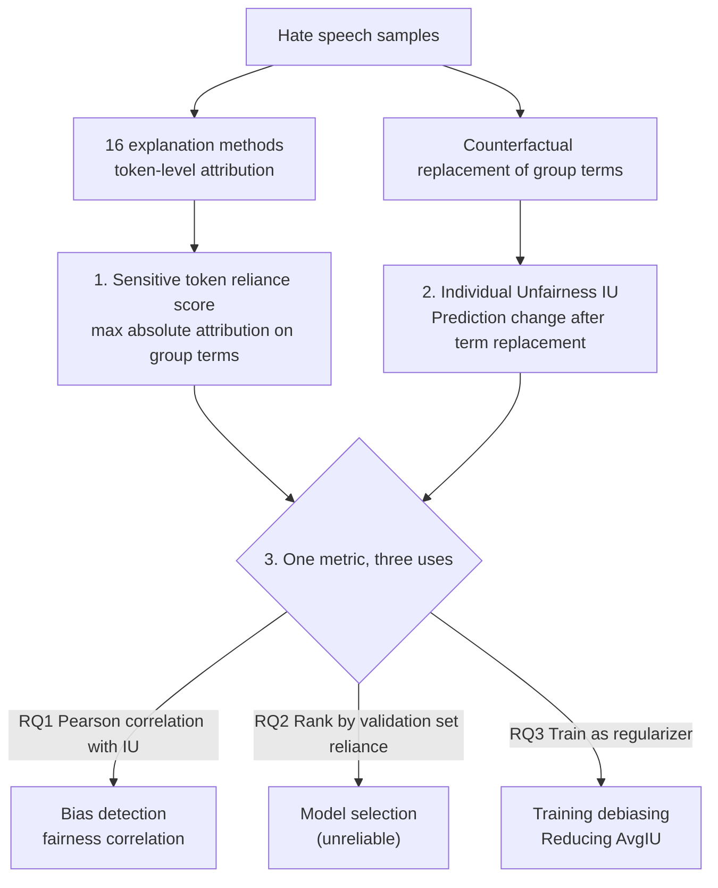

# Bridging Fairness and Explainability: Can Input-Based Explanations Promote Fairness in Hate Speech Detection?

**Conference**: ICLR 2026  
**arXiv**: [2509.22291](https://arxiv.org/abs/2509.22291)  
**Code**: [https://github.com/Ewanwong/fairness_x_explainability](https://github.com/Ewanwong/fairness_x_explainability)  
**Area**: AI Safety / Fairness  
**Keywords**: Fairness, Explainability, hate speech detection, input attribution, bias mitigation

## TL;DR
The first systematic quantitative analysis of the relationship between input-based explanations and fairness: explanations effectively detect biased predictions and serve as training regularizers to reduce bias, but are unreliable for automated fair model selection.

## Background & Motivation
**Background**: NLP models often replicate or amplify social biases from training data in sensitive tasks like hate speech detection. Explainability is widely considered key to promoting fairness—if explanations reveal a model's reliance on sensitive features (e.g., race or gender terms), one can detect bias and impose constraints.

**Limitations of Prior Work**: (a) Some studies question the faithfulness of explanation methods—they may not reflect the actual decision process. (b) Reducing reliance on sensitive features may simultaneously damage performance and fairness. (c) Models can be intentionally trained to hide the use of sensitive features in explanations. Existing research is mostly qualitative or small-scale.

**Key Challenge**: The link between explainability and fairness is oversimplified—the assumption that "explanations can find bias → therefore they can eliminate bias" lacks large-scale quantitative validation.

**Goal** Three research questions: (RQ1) Can explanations detect biased predictions? (RQ2) Can explanations select fair models? (RQ3) Can explanations reduce bias during training?

**Key Insight**: Conducting large-scale experiments on hate speech detection using 16 explanation methods × encoder/decoder models × various debiasing techniques × two datasets.

**Core Idea**: Input-based explanations are effective for bias detection and training-based debiasing but are unreliable for model selection—the relationship between explainability and fairness is task-specific and sensitive to method selection.

## Method

### Overall Architecture
This paper does not propose a new model; instead, it decomposes the commonly accepted proposition of "using explanations to promote fairness" into three quantifiable research questions. The entire analysis is built on two shared metrics: first, the model's reliance on sensitive words in the input (sensitive token reliance score), derived from the token-level attributions of 16 explanation methods; second, the sample-wise Individual Unfairness (IU), which measures how much the prediction changes when group identity terms are swapped. Since both metrics are defined at the sample level, they can be reused across the three RQs with different applications: RQ1 calculates the Pearson correlation between the reliance score and IU to see if explanations can "see" which predictions are biased; RQ2 uses the reliance score on the validation set to rank candidate models; RQ3 incorporates the reliance score as a regularization term in the training loss to test if actively suppressing reliance on sensitive words truly reduces bias.

The experimental setup is extensive, covering 16 explanation methods × 2 model categories (encoder-based BERT/RoBERTa, decoder-based Llama3.2/Qwen3) × 7 debiasing methods × 2 datasets × 3 bias types, allowing the conclusion of whether "explanations can promote fairness" to evolve from qualitative speculation into statistical findings.

### Key Designs

**1. Sensitive token reliance score: Compressing "model reliance on sensitive words" into a comparable scalar**

To answer to what extent the model relies on race or gender words, the 16 explanation methods provide token-level attribution scores that are too fine-grained and inconsistent in scale for direct comparison. The approach taken is to identify sensitive tokens (e.g., "black", "female", "Muslim") for each sample and take the maximum absolute attribution value among them as the reliance score for that sample:

$$\text{reliance}(\mathbf{x}, c) = a^c_{j^*}, \quad j^* = \arg\max_{j \in \{g_1,\dots,g_m\}} \left| a^c_j \right|$$

Where $a^c_j$ is the attribution of the $j$-th sensitive token to the predicted class $c$. The absolute value is used to ignore the direction of attribution, and the maximum is used to capture the idea that "dependence on any one sensitive word constitutes reliance." This scalar is consistently used for correlation in RQ1, ranking in RQ2, and regularization in RQ3.

**2. Individual Unfairness (IU): Measuring bias at the sample level for alignment with explanations**

To verify if samples with high explanation scores are truly unfair, a sample-level fairness metric is required. Individual Unfairness measures the magnitude of change in model prediction when social group terms in a sentence are replaced with terms for other groups:

$$IU(\mathbf{x}_i) = \left|f_{\hat{y}_i}(\mathbf{x}_i) - \frac{1}{|G|-1}\sum_{g'} f_{\hat{y}_i}\big(\mathbf{x}_i^{(g')}\big)\right|$$

Where $\mathbf{x}_i^{(g')}$ is the version where sensitive words are counterfactually replaced with group $g'$, and $f_{\hat{y}_i}$ is the model output for the original predicted class. A perfectly fair model should not change its prediction; thus, higher $IU$ indicates higher unfairness. Averaging this across the dataset yields $\text{Avg}_{IU}$. Since both the reliance score and IU are defined per sample, RQ1 can directly measure their Pearson correlation.

**3. Mechanism: One metric, three uses**

*RQ1 Bias Detection (Correlation)*: For each "predicted class-group" pair, the Pearson correlation between the reliance score and $IU$ is calculated (absolute value averaged), termed "fairness correlation." Higher correlation indicates the explanation can "see" biased predictions. Occlusion and L2-norm-based methods are significantly effective here.

*RQ2 Model Selection (Ranking)*: Candidate models are ranked using the mean absolute reliance score on the validation set, hoping the top-ranked models are fairer on the test set. However, this proves unreliable as the MRR@1 remains lower than the baseline of "ranking models directly by validation set $IU$." This is because debiasing changes model behavior and attribution patterns, making cross-model comparisons of explanation scores unstable.

*RQ3 Training Debiasing (Regularization)*: The training loss is augmented with a debiasing regularizer that penalizes the average reliance on all sensitive tokens in the input:

$$L = L_{task} + \alpha L_{debias}$$

For embedding-level attributions, L1 or L2 norms are used as penalties. The weight $\alpha$ is searched across $\{0.01, 0.1, 1, 10, 100\}$. Crucially, selection is based on a fairness-balance metric that considers both accuracy and unfairness, finding an optimal balance rather than simply suppressing sensitive word reliance to zero.

## Key Experimental Results

### RQ1: Bias Detection (Fairness Correlation)

| Explanation Method | BERT (Race) | BERT (Gender) | Qwen3-4B (Race) | Qwen3-4B (Gender) |
|---------|-------------|---------------|-----------------|-------------------|
| Grad L2 | High | Mid | High | High |
| Occlusion | High | High | Mid | Mid |
| IxG L2 | High | Mid | High | High |
| Attention | Low | Low | Low | Low |

The best methods (Occlusion/L2 norm types) achieve significant fairness correlation in most settings.

### RQ2: Model Selection
The Spearman correlation between validation set explanation metrics and test set fairness is unstable. MRR@1 is consistently lower than the baseline using validation set IU directly. Conclusion: **Explanations are unreliable for model selection**.

### RQ3: Training Debiasing

| Method | Race AvgIU↓ | Gender AvgIU↓ | Religion AvgIU↓ |
|------|------------|---------------|-----------------|
| Default BERT | 3.17 | 0.66 | 1.27 |
| Best Expl. Regularization | **~1.5** | **~0.4** | **~0.8** |
| CDA (Best Traditional) | 0.50 | 0.50 | 0.90 |

Explanation-based regularization significantly reduces AvgIU, particularly for racial bias. Some methods match or exceed the effectiveness of traditional debiasing techniques.

### Key Findings
- **RQ1 ✓**: Occlusion and L2 norm methods effectively detect biased predictions. Fairness correlation remains significant even if the model has undergone debiasing training—refuting concerns that "explanation fails after debiasing."
- **RQ2 ✗**: Explanation methods cannot replace direct fairness calculations on a validation set for model selection. Cross-model comparisons are unreliable due to shifting attribution patterns.
- **RQ3 ✓**: Using sensitive token reliance as a training regularizer effectively reduces bias, performing comparably to or better than several traditional methods.
- **LLM-generated Rationales are less reliable**: Natural language explanations from LLMs are inferior to Occlusion/L2 methods for bias detection.

## Highlights & Insights
- **Three-Dimensional Systematic Evaluation**: Decomposing the "explanation → fairness" link into detection, selection, and debiasing provides nuanced conclusions (2/3 effective) rather than a simple "useful/useless."
- **Mean vs. L2 Insight**: Mean-aggregated attribution scores are significantly worse at bias detection than L2 aggregation or Occlusion. This is because Mean requires accurate sign detection for every token contribution, whereas L2 and Occlusion are invariant to direction.
- **Faithfulness ≠ Bias Detection Ability**: Appendix analysis shows that the faithfulness of an explanation method is not correlated with its bias detection ability—an "unfaithful" explanation might still capture sensitive feature usage effectively.

## Limitations & Future Work
- Validated only on hate speech detection; generalizing to other classification tasks (e.g., hiring, loan approvals) requires further study.
- Explanation regularization requires pre-defined sensitive word lists and cannot address implicit biases like proxy features.
- Does not include reasoning models or CoT prompting—atttributions for these models fall on intermediate reasoning steps rather than inputs, requiring a different framework.
- Computational costs for 16 methods vary greatly (KernelSHAP is extremely slow); no efficiency-tradeoff analysis was performed.

## Related Work & Insights
- **vs. Dimanov et al. (2020)**: They found that explanation regularization could harm both performance and fairness. This paper uses a larger scale and finer hyperparameter search to show that explanation regularization can indeed be effective.
- **vs. Slack et al. (2020)/Pruthi et al. (2020)**: They showed models can hide bias in explanations. This paper finds that while cross-model comparisons are unreliable, explanations can still detect residual bias within a model even after debiasing.
- **Inspiration for ASIDE/AlphaSteer**: Methods that separate instructions from data might also affect attribution distributions. This paper's framework can evaluate whether such safety methods also improve fairness.

## Rating
- Novelty: ⭐⭐⭐⭐ First large-scale quantitative study with a systematic three-dimensional design.
- Experimental Thoroughness: ⭐⭐⭐⭐⭐ Extremely comprehensive (16 methods × 5 models × 7 debiasing × 2 datasets).
- Writing Quality: ⭐⭐⭐⭐ Clear structure and strong RQ-driven logic.
- Value: ⭐⭐⭐⭐ Provides a clear guide on the effective vs. ineffective uses of explainability in fair AI.

<!-- RELATED:START -->

## Related Papers

- [\[ACL 2025\] Towards Fairness Assessment of Dutch Hate Speech Detection](../../ACL2025/ai_safety/towards_fairness_assessment_of_dutch_hate_speech_detection.md)
- [\[ICLR 2026\] Benchmarking Bias Mitigation Toward Fairness Without Harm from Vision to LVLMs](benchmarking_bias_mitigation_toward_fairness_without_harm_from_vision_to_lvlms.md)
- [\[ICLR 2026\] Fairness-Aware Multi-view Evidential Learning with Adaptive Prior](fairness-aware_multi-view_evidential_learning_with_adaptive_prior.md)
- [\[ICLR 2026\] ATEX-CF: Attack-Informed Counterfactual Explanations for Graph Neural Networks](atex-cf_attack-informed_counterfactual_explanations_for_graph_neural_networks.md)
- [\[ICLR 2026\] Doubly-Regressing Approach for Subgroup Fairness](doubly-regressing_approach_for_subgroup_fairness.md)

<!-- RELATED:END -->
