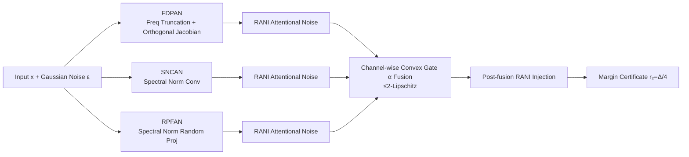

# HyCAS: Simultaneous Certified and Empirical Robustness via Hybrid Convolutional and Attentional Stochasticity

**Conference**: ICLR 2026  
**OpenReview**: [https://openreview.net/forum?id=sYk9GaFHEf](https://openreview.net/forum?id=sYk9GaFHEf)  
**Code**: [https://github.com/misti1203/HyCAS](https://github.com/misti1203/HyCAS)  
**Area**: AI Safety / Adversarial Robustness  
**Keywords**: Certified Robustness, Randomized Smoothing, Lipschitz Constraint, Spectral Normalization, Empirical Robustness, Medical Imaging

## TL;DR
HyCAS couples deterministic 1-Lipschitz spectral-normalized convolutions with two types of internal architectural stochasticity (spectral-normalized random projection + random attentional noise) into a global $\le 2$-Lipschitz randomized network. This achieves both a provable $\ell_2$ certified radius and empirical robustness against strong $\ell_\infty$ attacks (APGD/AutoAttack) within the same model.

## Background & Motivation
Adversarial robustness has long been split into two disconnected paths: **Empirical Defense** (represented by adversarial training) can withstand large $\ell_\infty$ perturbations but lacks theoretical guarantees, often falling to carefully designed adaptive attacks in a "cat-and-mouse" game; **Certified Defense** (deterministic Lipschitz constraints, Randomized Smoothing (RS)) provides provable guarantees that "predictions remain invariant within radius $r$." However, the cost is high—RS either sacrifices clean accuracy for a large radius with a large noise budget or certifies a very narrow $\ell_2$ radius with small noise, and its guarantees are typically restricted to the $\ell_2$ norm, remaining ineffective against $\ell_\infty$ attacks.

**Key Challenge**: Deterministic Lipschitz networks, while robust, expose a *fixed gradient field* that attackers can reliably use to find adversarial examples. Pure input-noise randomized smoothing is bypassed by adaptive attacks that "average out" internal noise. Furthermore, most randomized defenses are validated only on natural images, with few evaluations on high-risk distributions like medical imaging using SOTA empirical attacks to assess both certified and empirical robustness.

**Goal**: To build a single architecture that retains formal certification from randomized smoothing while resisting strong $\ell_\infty$ attacks and generalizing across multiple imaging benchmarks. **Key Insight**: Inject stochasticity *inside the architecture* rather than only at the input level—using a deterministic 1-Lipschitz backbone to guarantee worst-case bounds, layered with two data-independent randomized smoothing modules. This ensures the gradient field seen by the attacker changes with each forward pass, while the entire network remains strictly $\le 2$-Lipschitz, allowing for a simple margin-based $\ell_2$ certificate.

## Method

### Overall Architecture
HyCAS replaces every convolutional layer in a standard CNN backbone with three parallel Lipschitz-constrained stochastic streams: FDPAN (Frequency-aware Deterministic Projection + Attentional Noise), SNCAN (Spectral-Normalized Convolution + Attentional Noise), and RPFAN (Random Projection Filtering + Attentional Noise). Each stream consists of a "deterministic 1-Lipschitz kernel + Random Attentional Noise Injection (RANI)," making them individually $\le 2$-Lipschitz. The three streams are fused via a data-independent channel-wise convex gate $\alpha_{b,c}$. Since convex combinations are non-expansive mappings, the entire stacked network remains $\le 2$-Lipschitz. The final model takes the expectation over internal stochasticity $\Omega=(\xi,\psi,M_\omega)$ and input Gaussian noise $\varepsilon\sim\mathcal N(0,\sigma^2 I)$ to obtain the smoothed classifier $g_\theta(x)=\arg\max_c P_{\varepsilon,\Omega}[f_\theta(x+\varepsilon;\Omega)=c]$.

### Key Designs

**1. RANI: Random Attentional Noise Injection to "muddy" the deterministic gradient field.** This is the core randomization primitive used across all three streams, specifically designed to address the vulnerability of fixed gradient fields in 1-Lipschitz networks. Given deterministic features $h\in\mathbb R^{H\times W\times C}$, RANI independently samples a noise $\omega\sim\mathcal N(0,I)$ for every forward pass to generate a *data-independent* bounded attention mask $M_\omega$ with values in $[0,1]^d$. The Hadamard modulation $\hat h = h\odot M_\omega$ is performed. Since every element of the diagonal matrix $D_\omega=\mathrm{diag}(M_\omega)$ is in $[0,1]$, we have $\|D_\omega\|_2\le1$, thus the spectral norm of the residual mapping $I+D_\omega$ is $\le 2$. This elevates a 1-Lipschitz deterministic block into a 2-Lipschitz randomized block (Lemma 1). Crucially, noise is re-sampled every forward pass during both training and inference, preventing attackers from recovering a stable gradient by taking the expectation of the noise.

**2. Three-stream Division: Specialization in Frequency, Spectral, and Projection domains.** SNCAN is the most direct, replacing each convolution with a spectral-normalized convolution (SNC, $\|K_e\|_{op}\le1$) followed by RANI, outputting $G_{\text{SNCAN}}=(I+D_\omega)C_{K_e}(x)$. FDPAN targets adversarial perturbations hidden in high-frequency DCT coefficients: it uses a four-stage cascade—low-pass DCT mask (removing fragile high frequencies) $\to$ orthogonal Jacobian $1\times 1$ matrix (shuffling channel gradients) $\to$ SNC $\to$ RANI noise injection. RPFAN inherits guarantees from Random Projection Filtering (RPF) and introduces "energy-conserving channel pre-mixing" and "per-sample two-step power iteration spectral normalization" to ensure the projection is strictly 1-Lipschitz. The combination provides dual stochasticity from both random projection and RANI.

**3. Convex Gate Fusion + Margin Certificate: Translating "$\le 2$-Lipschitz" into certified radii.** The three streams are fused using learned, data-independent logits $\lambda_{b,c}$ via a softmax to obtain convex weights $\alpha_{b,c}$ (satisfying $\sum_b\alpha_{b,c}=1,\alpha_{b,c}\ge0$). Since the convex combination is non-expansive, $\mathrm{Lip}(x\mapsto z(x))\le\max_b\mathrm{Lip}(G_b)\le2$ (Prop. 4). Taking the expectation over $\Omega$ does not change the Lipschitz constant (Lemma 2). Thus, the expected logit mapping $Z(x)=\mathbb E_\Omega[s_\theta(x;\Omega)]$ remains $\le 2$-Lipschitz. This leads to HyCAS's pointwise $\ell_2$ certificate (Corollary 1): given the top-2 logit margin $\Delta(x)=Z^{(1)}(x)-Z^{(2)}(x)$, $r_2(x)=\frac{\Delta(x)}{4}$ is a valid certified radius.

## Key Experimental Results

### Main Results: Certified Robustness ($\ell_2$ Certified Accuracy % at radius $r$)
CIFAR-10 and ImageNet (Selected $\sigma=0.50$):

| Method | Dataset | $r=0.0$ | $r=0.75$ | $r=1.5$ | $r=2.0$ |
|------|--------|-------|--------|-------|-------|
| RS | CIFAR-10 | 65.2 | 32.4 | 9.34 | 0 |
| ARS | CIFAR-10 | 78.4 | 38.9 | 19.7 | 8.47 |
| **Ours (HyCAS)** | CIFAR-10 | **80.7** | **44.3** | **23.4** | **12.5** |
| ARS | ImageNet | 68.1 | 43.4 | 30.6 | 22.4 |
| **Ours (HyCAS)** | ImageNet | **69.2** | **45.6** | **32.7** | **24.8** |

On medical/facial data ($r=1.0$ certified accuracy): CelebA 36.9%, HAM10000 38.5%, NIH-CXR 41.4%. On NIH-CXR, HyCAS outperforms the strongest baseline ARS by **+3.5–7.3%**.

### Main Results: Empirical Robustness (Robust accuracy % under $\ell_\infty$ attack, selected $\epsilon=16/255$)

| Method | NIH-CXR APGD-20 | NIH-CXR AA-20 | HAM10000 APGD-20 | EyePACS APGD-20 |
|------|------|------|------|------|
| AT | 66.9 | 64.1 | 46.5 | 50.1 |
| CTRW | 73.1 | 72.6 | 52.8 | 57.7 |
| **Ours (HyCAS)** | **77.3** | **74.4** | **55.3** | **60.5** |

HyCAS outperforms the second-best empirical defense CTRW by approx **+1.5–4.2%**, and leads certified defenses ARS/DRS by over **+12%** under strong perturbations.

### Key Findings
- **Noise level $\sigma$ is an adjustable knob**: As $\sigma$ increases from 0.25 to 0.50, CIFAR-10 accuracy at $r=0.75$ remains stable (44.3%), while at $r=2.0$ it increases from 8.52% to 12.5%. This provides a controllable accuracy-robustness frontier.
- **Resistance to strong attacks**: As APGD perturbation $\epsilon$ increases from 0.01 to 0.08 and iterations increase to 100 steps on CIFAR-10/100, HyCAS consistently remains on the optimal envelope, leading competitors by 7–12% at 100 steps.
- **Certified-Empirical Pareto Frontier**: Small perturbation regions show empirical curves significantly higher than certified curves (certificates are naturally conservative), with the gap widening at large radii due to the "norm mismatch tail gap" between $\ell_2$ guarantees and $\ell_\infty$ attacks.

## Highlights & Insights
- **Moving stochasticity inside the architecture is the key turning point**: Traditional RS only injects noise at the input, while deterministic Lipschitz defenses are entirely deterministic. RANI injects data-independent random attention after each spectral-normalized block and at the output, preserving formal certificates while disrupting fixed gradient fields.
- **"Deterministic Kernel + Random Residual" is an elegant Lipschitz accounting method**: A 1-Lipschitz kernel plus a spectral norm $\le 1$ residual yields a $\le 2$ global bound via the triangle inequality. The proof is simple and modules are stackable.
- **Validation on Medical Imaging**: Extensive evaluation on high-risk distributions like CelebA, HAM10000, NIH-CXR, NCT-CRC-HE-100K, and EyePACS addresses a long-standing gap in the field.

## Limitations & Future Work
- The certificate is for **$\ell_2$**, while strong empirical attacks use **$\ell_\infty$**. The Pareto plots show a "norm mismatch gap" where $\ell_2$ guarantees do not directly translate to $\ell_\infty$ performance.
- The global bound is **$\le 2$-Lipschitz**, which is twice as loose as pure 1-Lipschitz deterministic defenses, resulting in a larger denominator for the certified radius $r_2=\Delta/4$ and more conservative radii.
- The parallel three-stream architecture plus RANI resampling and multiple sampling for RS inference results in **significant computational/certification overhead**.
- There is a "small but consistent" decrease in clean accuracy as a trade-off.

## Related Work & Insights
- **Deterministic Certification**: Spectral normalization/orthogonal parameterization (Miyato 2018), LOT (Xu 2022), SLL (Araujo 2023). HyCAS inherits the 1-Lipschitz backbone but recovers accuracy via stochastic branches.
- **Randomized Smoothing**: RS (Cohen 2019), Dual RS, Adaptive RS. HyCAS moves beyond input-only smoothing to internal dual stochasticity while maintaining $\le 2$-Lipschitz certificates.
- **Empirical Randomized Defense**: PNI (He 2019), CTRW, RPF (Dong & Xu 2023). These lack certificates and are often bypassed by adaptive attacks; HyCAS "anchors" randomization using Lipschitz constraints to make it provable.

## Rating
- **Novelty**: ⭐⭐⭐⭐ — The idea of unifying certified and empirical paths via "deterministic 1-Lipschitz kernel + internal random attentional residuals" is clear; however, individual components (SNC, RPF, DCT truncation) are mostly existing building blocks.
- **Experimental Thoroughness**: ⭐⭐⭐⭐ — 8 benchmarks (including 5 medical/facial datasets), both certified and empirical sides, multiple attack strengths, and 5 seeds with variance. Lacks tighter $\ell_\infty$ certification and detailed overhead analysis.
- **Writing Quality**: ⭐⭐⭐⭐ — Complete theorem-corollary chains, clear overview diagrams, and smooth logical progression. Minor typos in individual formulas.
- **Value**: ⭐⭐⭐⭐ — Provides a practical defense with an adjustable "certified $\leftrightarrow$ empirical" knob for safety-critical deployment, bridging the gap between two traditionally separate research directions.

<!-- RELATED:START -->

## Related Papers

- [\[ICML 2025\] Enhancing Certified Robustness via Block Reflector Orthogonal Layers and Logit Annealing Loss](../../ICML2025/ai_safety/enhancing_certified_robustness_via_block_reflector_orthogonal_layers_and_logit_a.md)
- [\[ICLR 2026\] How to Cure Newton for Unlearning Neural Networks? An Empirical Study from the Hessian Perspective](how_to_cure_newton_for_unlearning_neural_networks_an_empirical_study_from_the_he.md)
- [\[ICLR 2026\] On the Interaction of Compressibility and Adversarial Robustness](on_the_interaction_of_compressibility_and_adversarial_robustness.md)
- [\[ICML 2026\] Rethinking Evaluation Paradigms in IBP-based Certified Training](../../ICML2026/ai_safety/rethinking_evaluation_paradigms_in_ibp-based_certified_training.md)
- [\[ICLR 2026\] FERD: Fairness-Enhanced Data-Free Adversarial Robustness Distillation](ferd_fairness-enhanced_data-free_adversarial_robustness_distillation.md)

<!-- RELATED:END -->
