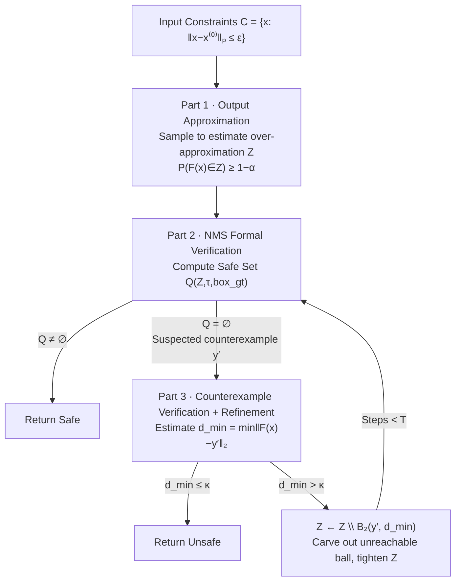

# Certifying the Full YOLO Pipeline: A Probabilistic Verification Approach

**Conference**: ICLR 2026  
**OpenReview**: [https://openreview.net/forum?id=AMCFpquOtZ](https://openreview.net/forum?id=AMCFpquOtZ)  
**Code**: To be confirmed  
**Area**: AI Safety / Neural Network Robustness Verification  
**Keywords**: Object detection verification, PAC verification, Object disappearance threat, NMS, YOLO, probabilistic robustness guarantees  

## TL;DR
This paper proposes ODPV—the first PAC probabilistic verification framework capable of verifying the robustness of the full YOLO detection pipeline (including NMS post-processing) against "object disappearance" attacks at a **practical scale**. It transforms the certification of high-dimensional detection networks into a feasible sampling problem via three steps: "output approximation → formal NMS verification → counterexample refinement."

## Background & Motivation
**Background**: Object detection is widely deployed in safety-critical scenarios such as autonomous driving and surveillance, yet neural networks are extremely sensitive to small input perturbations (e.g., sensor noise). The most dangerous threat is **Object Disappearance (OD)**: a valid target that should be detected is missed by the network under human-imperceptible perturbations, potentially leading to catastrophic consequences. Thus, verifying the robustness of detection systems is a prerequisite for reliable deployment.

**Limitations of Prior Work**: Existing verification methods fall into three categories: Formal verification provides deterministic guarantees, but exact verification of ReLU networks is NP-complete, and basic bound propagation for YOLO with $640 \times 640 \times 3$ inputs requires over 5000 GB of memory, making it entirely infeasible. Probabilistic verification requires access to internal network nodes and cannot scale to large models. PAC verification relies solely on sampling without accessing internal nodes, offering the best scalability; however, dimension-dependent methods like DeepPAC require an unbearable number of samples for YOLO.

**Key Challenge**: Detection network verification faces two unique difficulties beyond large parameter scales. First, **critical post-processing steps like NMS lie entirely outside the scope of current formal verification** (NMS involves sorting, IoU comparison, and greedy selection, which are not differentiable layers). Second, the extremely high input and output dimensions make dimension-dependent PAC methods computationally infeasible. Consequently, even recent works designed for detection (Cohen et al. 2024, Elboher et al. 2024) can only handle simplified models or ignore NMS altogether.

**Goal**: To provide probabilistic robustness certification for the **full YOLO pipeline including NMS** against OD threats within reasonable time and without modifying the original network.

**Core Idea**: **Rewrite "safety" as a PAC probabilistic proposition**—verify whether $P_{x\sim C}(\exists\, \text{box}_i \in N(F(x)),\ \text{IoU}(\text{box}_i, \text{box}_{gt}) \ge \tau \wedge \text{Class}=q) \ge 1-\alpha$ holds with confidence $1-\beta$. This is solved using a three-step cycle: "use black-box sampling to fit the output space into a probabilistically guaranteed over-approximation region $Z$, perform formal verification of NMS on $Z$, and if a suspected counterexample is found, estimate its distance to the true output space and refine by 'carving out' the corresponding ball." **Key Insight**: Unlike randomized smoothing, which provides guarantees only for a modified "smoothed" classifier, this work does not modify the original network and directly provides statistical guarantees for the original detector.

## Method

### Overall Architecture
ODPV decomposes the OD PAC verification problem (Definition 1) into three interconnected parts, with Algorithm 1 forming an outer "verify-refine" iterative loop. The core object is a **probabilistically guaranteed over-approximation region $Z$** that encloses the true but unknown output set $\{F(x)\}_{x\in C}$. Part 1 uses sampling to estimate $Z$; Part 2 formally verifies whether NMS correctly detects the target for all possible outputs in $Z$. If successful, it returns Safe; otherwise, it provides a suspected counterexample $y'$. Part 3 estimates the minimum distance $d_{min}$ from $y'$ to the true output space. If $d_{min} \le \kappa$, the counterexample is reachable and returned as Unsafe; otherwise, the ball of radius $d_{min}$ around $y'$ is removed from $Z$ (as this region is proven not to belong to the true output), and the tightened $Z$ returns to Part 2 until a decision is made or $T$ refinement steps are exhausted.

### Key Designs

**1. Output Space Over-approximation (Part 1)**: The first challenge is to enclose the network output for all $x \in C$ within a tractable region. The authors construct $Z = \{F(x^{(0)})+\epsilon : |\epsilon|\le c_1 v_{max}\}$, where $v_{max}$ is given by the component-wise maximum deviation of $N_1$ sample points. The scaling factor $c_1$ should theoretically solve $c_1=\min_{c\ge 0} c$ s.t. $|F(x)-F(x^{(0)})|\le c v_{max},\ \forall x\in C$, which is a semi-infinite program with infinite constraints. By noting that each constraint is convex with respect to $c$, **Randomized Convex Programming (RCPN)** is used to solve $c_1$ using only $N_2$ samples. Proposition 1 ensures that if $N_2\ge \frac{2\ln(1/\beta)}{\alpha}+2+\frac{2\ln(2/\alpha)}{\alpha}$, then $P_{x\sim C}(F(x)\in Z)\ge 1-\alpha$ holds with probability $1-\beta$. This replaces an unsolvable infinite problem with finite sampling that depends only on $\alpha, \beta$ (**dimension-independent**).

**2. NMS Verification (Part 2)**: NMS involves sorting and IoU comparisons, which cannot be directly inserted into network verifiers. Instead of "simulating NMS," the paper defines a **safe set** $Q(Z, \tau, \text{box}_{gt})$. Index $i$ enters the safe set if and only if (1) for all possible outputs $z^k \in Z$, box $i$ has the correct class, confidence $\ge \iota$, and $\text{IoU}(\text{box}_i^k, \text{box}_{gt}) \ge \tau$; and (2) no higher-scoring box of the same class can suppress it. Proposition 2 proves that if $Q \ne \emptyset$, every output in $Z$ retains at least one correctly detected box after NMS. Verification thus **reduces to checking if the safe set is non-empty**. This is encoded as a **Mixed-Integer Quadratically Constrained Program (MIQCP)** and solved via Gurobi.

**3. Counterexample Refinement (Part 3)**: A suspected counterexample $y'$ from Part 2 might be a "false counterexample" caused by an overly large $Z$. The key metric is $d_{min}=\min_{x\in C}\|F(x)-y'\|_2$. Algorithm 4 uses a two-step guaranteed estimation: **Step One** estimates a constant $C$ characterizing the local variation of $F$ through repeated sampling of point pairs. **Step Two** uses $C$ and new samples to provide a conservative estimate $d_{min} \leftarrow \max\{\frac{B_m-C(A_m-B_m)}{1+2C}, 0\}$. Theorem 1 guarantees that the ball $B_2(y', d_{min})$ has a minimal probability of intersection with the true output set.

**4. End-to-End Compound Probabilistic Guarantee**: Theorem 2 combines the individual parts. If the algorithm outputs Safe after at most $T$ refinements, then with probability $\ge 1-T(\beta+2(1-\epsilon)^{M_2})-\beta$, we have $P_{x \sim C}(x\ \text{safe}) > 1-(1+T)\alpha$. A specific configuration ($N_1=30,000, N_2=5,000, N=3,000, M=10, M_2=2,000, \alpha=\beta=0.0099, T=1$) requires only **37,000 samples** to achieve a "98% confidence that the OD threat probability is $\le 2\%$." All guarantees depend only on the i.i.d. assumption and hold for any sampling distribution.

## Key Experimental Results

**Setup**: Evaluated on YOLOv3/v5/v8/YOLO11 (medium and large versions) using 100 random images from the COCO validation set (520+ objects). IoU threshold $\tau \in \{0.5, 0.7\}$, NMS constants $\eta=0.45, \iota=0.25$, perturbation radius $\varepsilon \in \{1/255, 2/255\}$.

### Main Results: Comparison with RCPN Baseline (Table 1)
$\Delta$PGD represents the mean absolute difference of the IoU lower bound relative to a PGD attack (lower is tighter).

| Model | $\varepsilon$ | Method | Time(s) | $\Delta$PGD ($\tau{=}0.5$) | $\Delta$PGD ($\tau{=}0.7$) |
|------|------|------|---------|------|------|
| v3spp | 1/255 | **Ours** | **109.0** | **0.49** | **0.45** |
| v3spp | 1/255 | RCPN | 563.5 | 0.55 | 0.53 |
| v8m | 1/255 | **Ours** | **50.7** | **0.48** | **0.44** |
| v8m | 1/255 | RCPN | 455.0 | 0.52 | 0.52 |
| v5m | 1/255 | **Ours** | **43.6** | **0.42** | **0.39** |
| v5m | 1/255 | RCPN | 445.5 | 0.47 | 0.47 |
| 11x | 1/255 | **Ours** | **147.2** | **0.49** | **0.45** |
| 11x | 1/255 | RCPN | 618.1 | 0.54 | 0.54 |

**Conclusion**: Verification time is **5x–10x faster** than RCPN across all models (e.g., v5m reduced from 445s to 44s), and IoU bounds are tighter (smaller $\Delta$PGD).

### Key Findings
- **High Certification Reliability**: Certified Robust Accuracy (CRA) is generally $\ge 98.6\%$, indicating that detections judged robust almost always are; the false positive rate (FPR) is very low.
- **Conservative for Larger Perturbations**: As $\varepsilon$ increases, the True Positive Rate (TPR) decreases, but CRA remains high, showing the method remains sound and tends toward being conservative rather than misjudging robustness.
- **Refinement Benefits**: Average bound improvement (ABI) of 0.08–0.17 shows that Part 3 refinement effectively tightens the IoU lower bound.

## Highlights & Insights
- **First practical framework to verify the full detection pipeline (including NMS)**: Unlike previous works that omit NMS, this approach elegantly reduces non-differentiable greedy post-processing to a solvable MIQCP.
- **Dimension-Decoupled Sample Complexity**: Leverages RCPN to make the sample count dependent only on the desired confidence levels $\alpha, \beta$, enabling verification on high-resolution $640 \times 640$ YOLO models.
- **No modification to original network**: Provides statistical guarantees for the original detector rather than a "smoothed" surrogate.
- **Distribution-agnostic guarantees**: Guarantees hold for any sampling distribution (Uniform, Gaussian, etc.) under the i.i.d. assumption.

## Limitations & Future Work
- **PAC vs. Deterministic**: As a probabilistic method, a residual risk remains, which may not satisfy extreme safety scenarios requiring zero failure.
- **Perturbation Radius Constraints**: Experiments were limited to $\varepsilon \in \{1/255, 2/255\}$. Larger radii might make the network too fragile to distinguish method performance.
- **Refinement Scaling**: Refinement steps $T$ are capped to prevent computational explosion in high-dimensional output spaces, potentially limiting the tightness of the over-approximation.
- **MIQCP Solver Dependency**: The scalability of the MIQCP solver with respect to the number of boxes $n_x$ or classes was not extensively stress-tested.

## Related Work & Insights
- **Verification Paradigms**: While formal verification (ReLUplex, α,β-CROWN) is NP-complete and probabilistic verification (Weng et al.) requires node access, this work extends the PAC paradigm (DeepPAC) by removing the dependency on dimensionality.
- **Post-processing as Optimization**: Reducing non-differentiable combinatorial steps (NMS, Top-k) to "Safe Sets + Monotonic Thresholds" solved via MIQCP/convex optimization is a generalizable strategy for other end-to-end pipelines like DETR or tracking.

## Rating
- **Novelty**: ⭐⭐⭐⭐⭐ First to verify full detection pipelines at scale.
- **Experimental Thoroughness**: ⭐⭐⭐⭐ Covers multiple YOLO versions and COCO data, though lacks large-perturbation stress tests.
- **Writing Quality**: ⭐⭐⭐⭐ Rigorous theoretical derivation with clear architecture.
- **Value**: ⭐⭐⭐⭐⭐ Directly addresses robustness certification needs for safety-critical deployment.

<!-- RELATED:START -->

## Related Papers

- [\[ICML 2025\] Solving Probabilistic Verification Problems of Neural Networks Using Branch and Bound](../../ICML2025/ai_safety/solving_probabilistic_verification_problems_of_neural_networks_using_branch_and_.md)
- [\[ICLR 2026\] PluriHarms: Benchmarking the Full Spectrum of Human Judgments on AI Harm](pluriharms_benchmarking_the_full_spectrum_of_human_judgments_on_ai_harm.md)
- [\[ICLR 2026\] Concept-based Adversarial Attack: a Probabilistic Perspective](concept-based_adversarial_attack_a_probabilistic_perspective.md)
- [\[AAAI 2026\] ProbLog4Fairness: A Neurosymbolic Approach to Modeling and Mitigating Bias](../../AAAI2026/ai_safety/problog4fairness_a_neurosymbolic_approach_to_modeling_and_mitigating_bias.md)
- [\[ICML 2026\] Fairness in Aggregation: Optimal Top-$k$ and Improved Full Ranking](../../ICML2026/ai_safety/fairness_in_aggregation_optimal_top-k_and_improved_full_ranking.md)

<!-- RELATED:END -->
