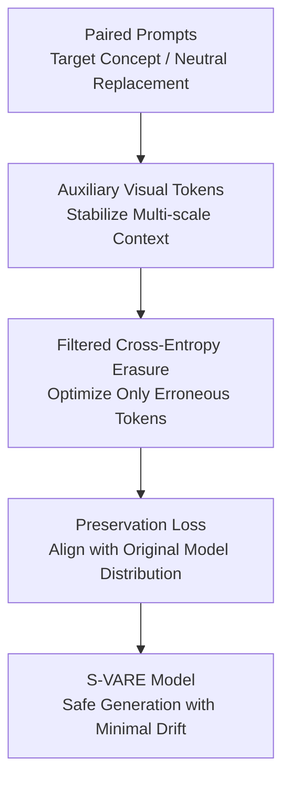

# Closing the Safety Gap: Surgical Concept Erasure in Visual Autoregressive Models

**Conference**: ICLR 2026  
**OpenReview**: [https://openreview.net/forum?id=tlYSbw5GXY](https://openreview.net/forum?id=tlYSbw5GXY)  
**Code**: https://github.com/ndhg1213/S-VARE  
**Area**: AI Safety / Visual Autoregressive Generation / Concept Erasure  
**Keywords**: Concept Erasure, Visual Autoregressive Model, Text-to-Image Safety, NSFW Protection, Model Editing  

## TL;DR
This paper addresses the lack of safety concept erasure mechanisms in visual autoregressive (VAR) text-to-image models. It proposes VARE and S-VARE, utilizing auxiliary visual tokens to stabilize erasure training and employing filtered cross-entropy alongside preservation losses to achieve "surgical" concept erasure—removing target concepts while minimizing collateral damage to generation capabilities.

## Background & Motivation
**Background**: Text-to-image models have expanded from diffusion models to Visual Autoregressive Models (VAR). Unlike models that generate in raster order or predict noise in a diffusion process, VAR models represent images as multi-scale discrete visual tokens and predict them hierarchically from coarse to fine scales. Models like Infinity further utilize bit-wise quantization to support high-resolution generation, establishing VAR as a significant generative pathway alongside diffusion models.

**Limitations of Prior Work**: Safety governance has not kept pace. Numerous Concept Erasure (CE) methods exist for diffusion models to remove nudity, violence, specific objects, or artistic styles. However, these are largely designed around U-Net, cross-attention, or diffusion noise prediction. Directly applying them to VAR presents two issues: first, VAR predicts discrete visual tokens or bit probabilities rather than continuous noise; second, VAR's next-scale generation depends heavily on previous scales, meaning alignment errors at one layer amplify through subsequent scales.

**Key Challenge**: Safety erasure requires strong parameter updates to prevent the model from generating forbidden content when encountering hazardous prompts. However, the autoregressive scale chain in VAR is fragile; minor deviations at coarse scales impact all subsequent fine-scale predictions. Consequently, the trade-off between "clean erasure" and "preserving image quality/semantic consistency" is more acute than in diffusion models.

**Goal**: The paper aims to solve post-training safety editing for VAR models: given a target concept to be removed, the fine-tuned model should no longer generate that concept under related prompts while maintaining unrelated concepts, normal body parts, other object categories, overall style, and prompt-following capabilities.

**Key Insight**: The authors observe that the failure of diffusion-based CE on VAR stems from unstable token conditioning during training, not just simple prompt replacement. If outputs are aligned independently across scales between target and neutral prompts, the training sees drifting conditional contexts, causing errors to accumulate. Rather than forcing the model to align across unstable sequences, it is better to provide the visual Transformer with auxiliary visual tokens generated by the original model, narrowing the search space to "altering target concept responses within the same stable visual context."

**Core Idea**: Utilize auxiliary visual tokens to fix the VAR generation context, apply erasure pressure only to tokens/bits that are truly erroneous or related to the target concept, and use a teacher-model preservation loss to constrain output distributions under unrelated prompts.

## Method
The methodology consists of two layers: the VARE framework, which addresses input and conditioning issues when migrating diffusion CE to VAR, and the S-VARE loss, which handles precise erasure in the bit probability space to avoid over-optimization. During training, only the cross-attention and FFN modules of Infinity-2B are fine-tuned, with the original model acting as a teacher providing auxiliary tokens and preservation targets.

### Overall Architecture
The workflow begins with a pair of prompts: $c^*$ is the target prompt containing the concept to be erased (e.g., nudity, church, or Van Gogh), and $c$ is a neutral prompt that is semantically consistent but lacks the target concept. The original VAR model first generates an auxiliary visual token sequence $r^{ori}$ under the neutral prompt. The fine-tuned model then processes the target prompt under the same auxiliary token conditions, needing only to push visual responses of the target concept toward the neutral concept without relearning the entire multi-scale generation chain.

Without auxiliary tokens, the straightforward approach would be to adapt diffusion MSE alignment to scale-wise token alignment: making the fine-tuned model's prediction under $c^*$ close to the original's prediction under $c$. However, because VAR conditions on a history of predictions $r_{<i}$, slight errors at the current scale change the input for the next, forcing all following scales to optimize within an erroneous context. VARE's key change is aligning $p_{\theta^*}(r_i \mid r^{ori}_{<i}, c^*)$ with $p_{\theta}(r_i \mid r^{ori}_{<i}, c)$. Sharing auxiliary tokens from the original model transforms the problem from "chasing unstable autoregressive trajectories" to "correcting concept responses on a stable trajectory."

S-VARE moves away from continuous space MSE. Since Infinity utilizes binary spherical quantization (BSQ), where each token corresponds to binary classification probabilities across multiple bits, the authors use bit-wise cross entropy. This measures if target tokens are correctly pushed toward neutral replacements while retaining only necessary tokens. Finally, a preservation loss ensures the fine-tuned model mimics the original under neutral prompts $c$, preventing the destruction of language understanding, diversity, or unrelated categories.

### Key Designs
**1. Auxiliary Visual Tokens: Pulling VAR Erasure back to Stable Contexts**

Diffusion CE assumes noise predictions at different timesteps can be aligned independently, but VAR scales depend on preceding tokens. If target $c^*$ and neutral $c$ generate their own separate histories during training, the historical conditions for the $i$-th scale will likely diverge. Optimizing this results in a mixture of "target concept difference + historical token drift + accumulated scale error," which can destroy image structure. VARE uses $r^{ori}$ generated by the original model under neutral prompts as a common condition for both student and teacher, eliminating the most dangerous variable in the VAR chain.

**2. Filtered Cross Entropy: Targeted Hits on Erroneous Bits**

S-VARE uses Filtered Cross Entropy ($L_{FCE}$) because Infinity’s BSQ outputs bit-wise probabilities, making cross entropy more suitable than MSE. The filtering mechanism prevents "over-optimizing tokens that are already correct." A threshold $\gamma=-\log(1/2)$ is used for bit-level filtering. At the token level, if the proportion of erroneous bits exceeds $\alpha$ (defaulting to $25\%$), a mask $F_i$ allows that token to participate in the loss. This concentrates pressure solely on tokens that are "sufficiently unlike the neutral target."

**3. Preservation Loss: Constraining Unrelated Concepts and Diversity**

To mitigate "language drift" and "diversity reduction," S-VARE introduces a preservation loss using KL divergence: $L_{Pre}=\sum_i D_{KL}(p_{\theta}(r_i \mid r^{ori}_{<i}, c) \| p_{\theta^*}(r_i \mid r^{ori}_{<i}, c))$. This ensures that for prompts not containing hazardous concepts, the fine-tuned model maintains the original token distribution. $L_{FCE}$ only drives the model away from dangerous responses when the target concept is present in the prompt.

**4. Fine-tuning CA + FFN: Concentrating Modifications on Semantic Interaction**

The authors fine-tune only the cross-attention (CA) and feed-forward network (FFN) modules of Infinity-2B. CA handles the mapping from text conditions to visual tokens, while FFN provides non-linear semantic transformations. This "surgical" selection limits updates to modules most relevant to target concept responses, balancing erasure strength and preservation.

### Loss & Training
The training set consists of 50 prompt pairs. The base model is Infinity-2B, trained for 500 iterations with a batch size of 2 using AdamW ($LR=2 \times 10^{-3}$). The total loss is $L = L_{FCE} + L_{Pre}$, weighted equally. A default filtering threshold $\alpha=25\%$ is used to balance erasure strength and image quality.

## Key Experimental Results

### Main Results
S-VARE was compared against diffusion CE baselines adapted to the VARE framework (UCE, FMN, ESD, AC) across NSFW, object, and style erasure tasks.

| Task | Metric | Original | Strongest Baseline | S-VARE | Conclusion |
|------|------|--------|--------------|--------|------|
| NSFW Erasure | Sensitive count ↓ | 158 | ESD-u: 21 / FMN: 22 | 5 | S-VARE nearly clears all nudity-related content |
| NSFW Erasure | Common count ↑ | 112 | UCE: 100 | 57 | Preservation of normal content exceeds most strong baselines |
| Object Erasure (church) | ACCe ↓ | 94.2% | ESD-x: 3.8% | 4.4% | Erases target category effectively |
| Object Erasure (church) | ACCi ↑ | 76.0% | AC-N: 68.9% | 75.7% | Unrelated categories are almost unaffected |
| Style Erasure (Van Gogh) | ACC ↓ | 76.0% | AC-M: 12.8% | 8.2% | Effectively suppresses specific artistic styles |
| General Quality | FID ↓ / CLIP ↑ | 31.1 / 31.7 | Most baselines: 33.2-37.8 | 32.1-32.8 / 31.3-31.6 | Minimal quality degradation |

### Ablation Study
Ablations on the "church" erasure task demonstrate the necessity of each component. VARE basic alignment yields an ACCi of 68.9 (FID 35.3). Adding $L_{FCE}$ improves ACCi to 73.5 (FID 32.4). Combining $L_{FCE} + L_{Pre}$ achieves the best balance with ACCi 75.7 and FID 31.5.

| Configuration | ACCe ↓ | ACCi ↑ | FID ↓ | CLIP ↑ | Note |
|------|--------|--------|-------|--------|------|
| VARE basic | 9.8 | 68.9 | 35.3 | 30.6 | Auxiliary tokens stabilize training, but quality is poor |
| + $L_{FCE}$ | 4.1 | 73.5 | 32.4 | 31.2 | Improves precision and reduces visual artifacts |
| + $L_{Pre}$ | 4.4 | 75.7 | 31.5 | 31.6 | Restores unrelated generation capabilities |

### Key Findings
- VARE is a prerequisite for migrating diffusion CE to VAR; without auxiliary tokens, scale-wise alignment causes severe quality collapse.
- $L_{FCE}$ ensures "erasure precision" by targeting specific bits and using masks to prevent over-optimization.
- $L_{Pre}$ ensures "minimal collateral damage," restoring unrelated category accuracy and diversity.
- S-VARE is robust against adversarial prompts, reducing Ring-A-Bell ASR from 75.9% to 7.4%.
- While multi-concept erasure leads to slight quality loss, the target accuracy remains low (~4%), showing potential for batch safety strategies.

## Highlights & Insights
- The most valuable insight is identifying "next-scale dependency" as the root cause of migration failure. The "surgical" approach focuses on token/bit granularity rather than just parameter-level restrictions.
- The use of auxiliary tokens is a simple yet effective way to neutralize error accumulation in autoregressive chains.
- Preservation loss is practical: it uses neutral prompts to treat the original model as a teacher, which is low-cost and aligns naturally with multi-scale outputs.
- This research highlights that safety methods must adapt to the specific predictive targets and conditional structures of different generative paradigms (VAR, Flow Matching, etc.).

## Limitations & Future Work
- The experiments primarily utilize Infinity-2B due to the scarcity of large-scale open VAR models. Generalization to more architectures is pending.
- The scope is limited to nudity, standard objects, and styles; more abstract or context-dependent harmful intents require further study.
- Adversarial evaluations rely on diffusion-based datasets; VAR-specific attacks may reveal new failure modes.
- Cumulative quality loss in multi-concept erasure suggests a need for modeling concept conflicts or dynamic thresholding.

## Related Work & Insights
- **vs ESD / AC**: While these align noise predictions, S-VARE argues that VAR lacks noise targets and MSE token alignment fails due to scale dependency.
- **vs FMN**: FMN suppresses attention activations, which causes artifacts in VAR. S-VARE controls token probabilities directly, leading to cleaner visuals.
- **vs UCE**: UCE's closed-form editing is inefficient for VAR; S-VARE's fine-tuning approach is more reliable for suppressing complex visual concepts.

## Rating
- Novelty: ⭐⭐⭐⭐⭐ First systematic handling of concept erasure in VAR T2I models.
- Experimental Thoroughness: ⭐⭐⭐⭐ Covers various tasks and adversarial scenarios, though model variety is limited.
- Writing Quality: ⭐⭐⭐⭐ Clear problem definition and conclusions.
- Value: ⭐⭐⭐⭐⭐ Highly applicable for post-training safety patching in new generative paradigms.

<!-- RELATED:START -->

## Related Papers

- [\[CVPR 2026\] ClusterMark: Towards Robust Watermarking for Autoregressive Image Generators with Visual Token Clustering](../../CVPR2026/ai_safety/clustermark_towards_robust_watermarking_for_autoregressive_image_generators_with.md)
- [\[CVPR 2026\] Selective Amnesia using Contrastive Subnet Erasure for Class Level Unlearning in Vision Models](../../CVPR2026/ai_safety/selective_amnesia_using_contrastive_subnet_erasure_for_class_level_unlearning_in.md)
- [\[CVPR 2026\] Hidden Dangers of Compositional Generation: Diagnosing Semantic Safety Failures in Text-to-Image Models](../../CVPR2026/ai_safety/hidden_dangers_of_compositional_generation_diagnosing_semantic_safety_failures_i.md)
- [\[ICLR 2026\] Decoupling the Class Label and the Target Concept in Machine Unlearning](decoupling_the_class_label_and_the_target_concept_in_machine_unlearning.md)
- [\[CVPR 2026\] Roots Beneath the Cut: Uncovering the Risk of Concept Revival in Pruning-Based Unlearning for Diffusion Models](../../CVPR2026/ai_safety/roots_beneath_the_cut_uncovering_the_risk_of_concept_revival_in_pruning-based_un.md)

<!-- RELATED:END -->
