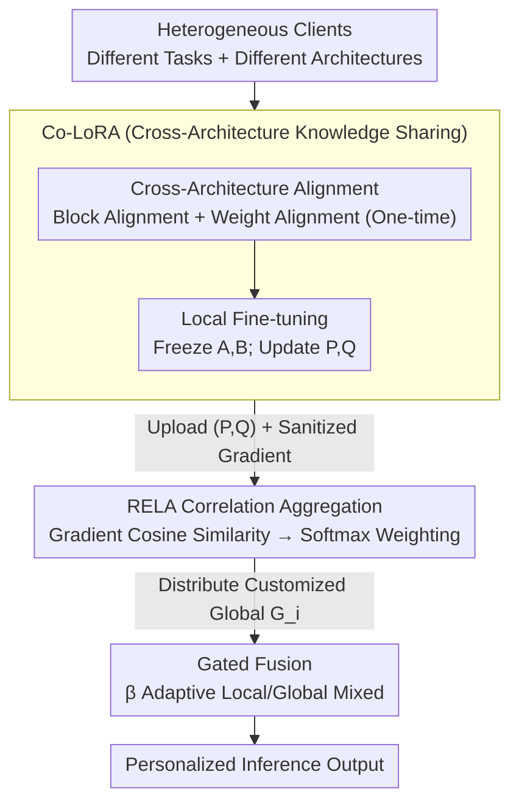

# Co-LoRA: Collaborative Model Personalization on Heterogeneous Multi-Modal Clients

**Conference**: ICLR2026  
**arXiv**: [2506.11024](https://arxiv.org/abs/2506.11024)  
**Code**: [https://github.com/snumprlab/fedmosaic](https://github.com/snumprlab/fedmosaic)  
**Area**: AI Safety  
**Keywords**: personalized federated learning, LoRA, model heterogeneity, multimodal, knowledge sharing

## TL;DR
Proposed the FedMosaic framework to address dual heterogeneity in personalized federated learning (PFL): RELA achieves customized aggregation via gradient similarity to measure task relevance (addressing data heterogeneity), and Co-LoRA enables knowledge sharing across heterogeneous architectures (e.g., Llama vs. Qwen) via dimension-invariant $P \in \mathbb{R}^{r \times r}, Q \in \mathbb{R}^r$ modules (addressing model heterogeneity). It significantly outperforms SOTA methods on the newly proposed 40-task multimodal PFL benchmark, DRAKE.

## Background & Motivation

**Background**: Personalized Federated Learning (PFL) allows clients to collaborate while preserving privacy. Existing PFL methods like DITTO and FedDAT handle data heterogeneity through dual adapter designs (local + global) but assume all clients use identical model architectures.

**Limitations of Prior Work**: (a) **Data Heterogeneity**—Existing benchmarks use non-IID splits of the same dataset, which is unrealistic (real-world clients perform different tasks); (b) **Model Heterogeneity**—Different clients possess varied hardware and use different model families (Llama vs. Qwen) or scales (1B vs. 3B), where LoRA matrix dimensions differ and cannot be directly averaged; (c) Existing model heterogeneity methods (HETLoRA, FlexLoRA) assume the same base architecture with varying ranks and do not support truly heterogeneous architectures.

**Key Challenge**: The LoRA matrices $A \in \mathbb{R}^{r \times d_I}$ and $B \in \mathbb{R}^{d_O \times r}$ depend on model-specific hidden dimensions $d_I, d_O$. Differing architecture dimensions prevent direct aggregation. Furthermore, naive averaging across different tasks leads to parameter interference.

**Goal**: Simultaneously handle data heterogeneity (clients performing different tasks) and model heterogeneity (clients using different architectures/scales) to achieve effective collaboration in realistic multimodal PFL scenarios.

**Key Insight**: Insert dimension-invariant modules $P, Q$ that depend only on the rank $r$ between LoRA matrices—aggregating only these modules allows knowledge transfer across architectures.

**Core Idea**: Utilize dimension-invariant Co-LoRA modules for cross-architecture knowledge sharing and gradient similarity-driven RELA aggregation to mitigate task interference.

## Method

### Overall Architecture
FedMosaic enables collaboration under dual heterogeneity where clients perform different tasks and use different model architectures. Before formal federated training, a one-time cross-architecture alignment (block alignment + weight alignment) is performed to make frozen $A, B$ subspaces comparable across model families. In each communication round, clients perform local fine-tuning using Co-LoRA, uploading dimension-invariant $(P_i, Q_i)$ modules and a sanitized gradient $\tilde{g}_i$. The server uses RELA to calculate task relevance between clients based on gradients, constructing a customized global Co-LoRA $G_i$ for each client. During inference, personalized knowledge from local LoRA and shared knowledge from global Co-LoRA are fused adaptively via a learnable gate $\beta$. This design decouples "cross-architecture knowledge transfer" and "task-selective transfer" into Co-LoRA and RELA modules respectively.

### Key Designs

**1. Co-LoRA (Collaborative LoRA): Inserting rank-dependent modules for cross-architecture knowledge addition**

In standard LoRA, $A \in \mathbb{R}^{r \times d_I}$ and $B \in \mathbb{R}^{d_O \times r}$ are tied to hidden dimensions $d_I, d_O$. Heterogeneous architectures like Llama and Qwen have different dimensions, preventing matrix alignment. Co-LoRA inserts a new module between $A$ and $B$:

$$h_O = W_p h_I + B(PA h_I + Q)$$

Where $P \in \mathbb{R}^{r \times r}$ and $Q \in \mathbb{R}^r$ sizes depend only on rank $r$, allowing direct aggregation across architectures. During training, $A$ and $B$ are frozen to maintain representation alignment, and only $P, Q$ are updated and aggregated.

Two steps ensure alignment: **Block Alignment** addresses "which layer maps to which." CKA analysis shows representation similarity is highest for layers at corresponding relative positions. Models are partitioned into $N_B$ blocks, with Co-LoRA applied to the last layer of each block to avoid layer mismatch. **Weight Alignment** addresses subspace alignment: $A$ matrices are aligned to a unified $r$-dimensional representation using L2 loss on small public data; $B$ matrices use CCA to find the maximum correlation projection space, projecting to a shared space for aggregation and back-projecting to individual models, with orthogonal constraints to maximize capacity (Theorem 1 proves the weight update space spans $r^2$ dimensions).

**2. RELA (Relevance-Guided Aggregation): Customized aggregation based on task relevance**

Naive averaging causes interference between unrelated tasks, which is why FedAvg often performs worse than no collaboration in heterogeneous settings. RELA makes aggregation "task-aware": each client extracts gradients $g_i$ from a small pre-trained model as a task profile, updated via EMA to reflect distribution shifts, and sanitized into $\tilde{g}_i$ with Gaussian noise and random dimension sampling. The server calculates a cosine similarity matrix $S_{ij} = \cos(\tilde{g}_i, \tilde{g}_j)$, normalizes it via softmax to obtain weights, and performs weighted aggregation $G_i = \sum_j w_{ij} L_j$. Clients predominantly absorb knowledge from similar companions.

**3. Gated Fusion: Layer-wise global knowledge determination**

Local LoRA is personalized while global Co-LoRA is shared. Their mixture ratio is adaptively adjusted using a learnable gate:

$$h_O = W_p h_I + (1-\tilde{\beta})h_L + \tilde{\beta}h_G, \quad \tilde{\beta} = \sigma(\beta)$$

$\tilde{\beta}$ is derived from a learnable parameter $\beta$ via sigmoid, automatically learning the optimal balance between local and global knowledge for each layer.

### Loss & Training
$A/B$ alignment is a one-time overhead performed before federated training. Communication involves only $P \in \mathbb{R}^{r \times r}$ and $Q \in \mathbb{R}^r$, which is significantly smaller than full LoRA. Privacy is maintained via the "Gradient EMA + Gaussian Noise + Random Dimension Sampling" triad.

## Key Experimental Results

### Main Results (DRAKE Benchmark, 40 Tasks)

| Method | Homogeneous Set (Avg Acc) | Heterogeneous Set (Avg Acc) | Description |
|------|-------------------|-------------------|------|
| Local only | Baseline | Baseline | No collaboration |
| FedAvg | Lower than Local | N/A | Naive averaging is harmful |
| DITTO | Medium | N/A | Dual adapters but no heterog. support |
| FedDAT | Above Average | N/A | Same as above |
| HETLoRA | - | Medium | Only handles rank heterogeneity |
| **FedMosaic** | **Optimal** | **Optimal** | Significantly outperforms all |

### Ablation Study

| Configuration | Acc Change | Description |
|------|---------|------|
| Full FedMosaic | Optimal | Full method |
| w/o RELA (using FedAvg) | Decrease | Task interference |
| w/o Co-LoRA (using HETLoRA) | Decrease | Insufficient heterog. handling |
| w/o Block Alignment | Decrease | Layer mismatch |
| w/o Weight Alignment | Decrease | Inconsistent optimization trajectories |
| w/o Gated $\beta$ | Decrease | Suboptimal fixed ratio |

### Key Findings
- **FedAvg performs worse than no collaboration in realistic heterogeneous settings**: Naive averaging of unrelated tasks causes severe parameter interference.
- **RELA's selective aggregation is crucial**: Collaborating only with relevant clients is significantly better than global averaging.
- **Co-LoRA successfully transfers knowledge across architectures**: Effective collaboration achieved for Llama-1B ↔ Llama-3B and Llama-1B ↔ Qwen-3B.
- **CKA validates the layer alignment hypothesis**: Layers at relative positions in models of different depths show highest similarity, supporting the block alignment strategy.
- **Minimal communication overhead**: Only $P(r^2)$ and $Q(r)$ parameters and sanitized gradients are transmitted.

## Highlights & Insights
- **Dimension-invariant modules as an elegant solution for cross-architecture FL**: $P \in \mathbb{R}^{r \times r}$ depends only on rank, a design concept generalizable to any cross-architecture knowledge transfer scenario.
- **Gradient sanitization triad**: EMA mixing + Gaussian noise + random sampling provides practical and secure privacy protection supported by theory.
- **DRAKE benchmark fills the gap in multimodal PFL evaluation**: 40 diverse tasks with distribution shifts and multi-image inputs offer much more realism than non-IID MNIST.
- **Theorem 1 Orthogonal Constraint Guarantee**: Under frozen orthogonal A/B, the dimension of Co-LoRA's weight update space is $r^2$ (maximum possible), theoretically guaranteeing expressive capacity.

## Limitations & Future Work
- **DRAKE task count (40) is relatively small**: Scalability to hundreds of tasks in agentic AI scenarios needs verification.
- **Public data requirement**: A/B alignment requires a small amount of public data, which might be unacceptable in extreme privacy scenarios.
- **Scale constraints**: Effectiveness and communication overhead control for models beyond 7B/13B scales remain to be tested.
- **Rank $r$ uniformity**: Currently, Co-LoRA requires a uniform rank $r$ across all clients.

## Related Work & Insights
- **vs. HETLoRA/FlexLoRA**: These only handle rank heterogeneity within the same architecture, assuming $d_I, d_O$ are constant. Co-LoRA handles true architectural heterogeneity (different families, depths, and dimensions).
- **vs. FedMD/FedMKT**: Federated distillation transfers knowledge via public data logits, which is computationally expensive for LLMs and carries privacy risks. Co-LoRA is more secure and efficient.
- **vs. DITTO**: DITTO maintains dual adapters but uses naive averaging for the global portion. FedMosaic uses RELA for task-aware aggregation and Co-LoRA for heterogeneity support.

## Rating
- Novelty: ⭐⭐⭐⭐⭐ Systematic combination of dimension-invariant modules, gradient relevance aggregation, and alignment strategies.
- Experimental Thoroughness: ⭐⭐⭐⭐ Comprehensive 40-task benchmark and ablation, though lacks larger model experiments.
- Writing Quality: ⭐⭐⭐⭐ Clear problem definition and rigorous derivation, though lengthy.
- Value: ⭐⭐⭐⭐⭐ Provides a practical solution for heterogeneous FL; the DRAKE benchmark has lasting value.

<!-- RELATED:START -->

## Related Papers

- [\[CVPR 2026\] Multi-Paradigm Collaborative Adversarial Attack Against Multi-Modal Large Language Models](../../CVPR2026/ai_safety/multi-paradigm_collaborative_adversarial_attack_against_multi-modal_large_langua.md)
- [\[ICML 2026\] One Model to Translate Them All: Universal Any-to-Any Translation for Heterogeneous Collaborative Perception](../../ICML2026/ai_safety/one_model_to_translate_them_all_universal_any-to-any_translation_for_heterogeneo.md)
- [\[ICML 2025\] Private Model Personalization Revisited](../../ICML2025/ai_safety/private_model_personalization_revisited.md)
- [\[CVPR 2026\] FedRE: A Representation Entanglement Framework for Model-Heterogeneous Federated Learning](../../CVPR2026/ai_safety/fedre_a_representation_entanglement_framework_for_model-heterogeneous_federated_.md)
- [\[ICLR 2026\] Rethinking LoRA for Privacy-Preserving Federated Learning in Large Models](rethinking_lora_for_privacy-preserving_federated_learning_in_large_models.md)

<!-- RELATED:END -->
