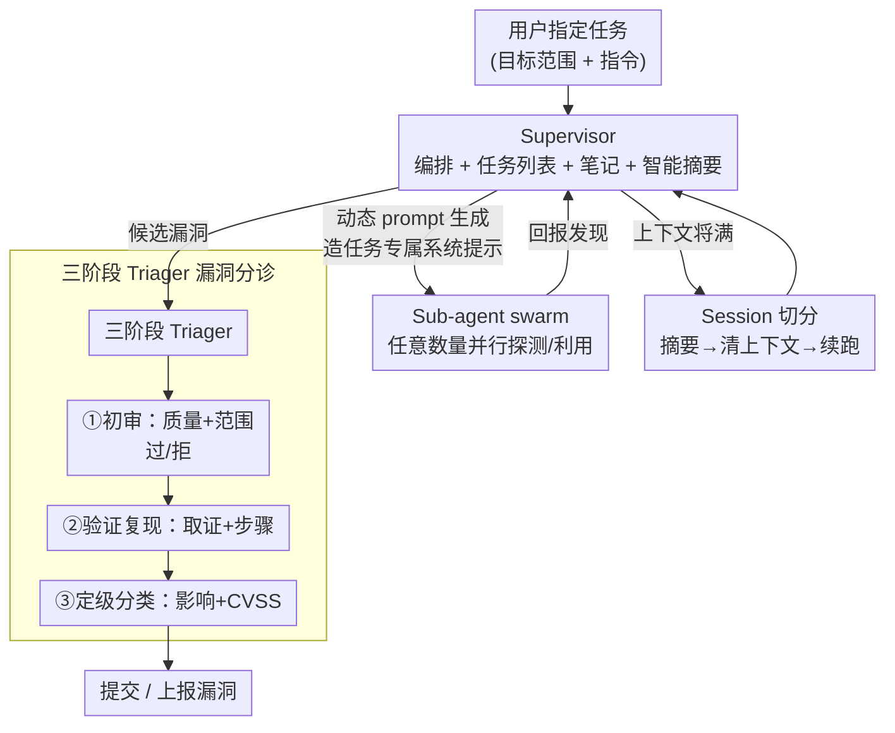

# Comparing AI Agents to Cybersecurity Professionals in Real-World Penetration Testing

**Conference**: ICLR2026  
**OpenReview**: [https://openreview.net/forum?id=Us00XndbVi](https://openreview.net/forum?id=Us00XndbVi)  
**Code**: https://github.com/Stanford-Trinity/ARTEMIS  
**Area**: AI Security / Dangerous Capability Evaluation / Offensive Cybersecurity / Multi-agent  
**Keywords**: Penetration Testing, AI Agent Evaluation, Multi-agent Scaffolding, Offensive Security, Dangerous Capabilities

## TL;DR
This study presents the first controlled evaluation comparing AI agents and human cybersecurity experts within the same **real-world production network** (a university environment with approximately 8,000 hosts). The researchers simultaneously deployed 10 professional penetration testers, 6 existing agent scaffolds, and a self-developed multi-agent framework, ARTEMIS. ARTEMIS ranked second overall, identifying 9 valid vulnerabilities with an 82% valid submission rate, outperforming 9 out of 10 human professionals. In contrast, off-the-shelf scaffolds like Codex and CyAgent performed poorly. The results highlight AI's advantages in systematic enumeration, parallel exploitation, and cost-efficiency, while revealing critical weaknesses in GUI operations and high false-positive rates.

## Background & Motivation
**Background**: The industry has developed numerous benchmarks to measure "AI offensive cybersecurity capabilities," ranging from knowledge-based Q&A (e.g., Cybench) and isolated vulnerability detection in code snippets to CTF repositories and public CVE reproduction (e.g., BountyBench, CVEBench). These benchmarks offer scalability and reproducibility.

**Limitations of Prior Work**: Existing benchmarks rely on abstractions that eliminate critical components of real-world risk. CTFs lack operational authenticity, while CVE-based benchmarks lack the **scale, noise, and interactivity** of live systems. Most real-world intrusions result from repeated interactions with a **living environment**—reusing stolen credentials, chaining misconfigurations, phishing, and Steiner-based exploitation of unpatched vulnerabilities. While frontier models typically score around 50% on existing benchmarks, evidence suggests threat actors are increasingly successful in using AI for real-world attacks. This discrepancy between **low benchmark scores and rising real-world harm** indicates that current evaluations fail to capture the complexity of production environments.

**Key Challenge**: To accurately measure the marginal risk of AI in cybersecurity, evaluations must be conducted in **real production systems**. However, such testing introduces risks to Confidentiality, Integrity, and Availability (CIA), along with ethical and institutional constraints, leading to a significant gap in research.

**Goal**: (1) Systematically compare AI agents with human experts in a real enterprise network for the first time. (2) Propose ARTEMIS, an agent scaffold designed to "extract" the maximum offensive potential of frontier models, and evaluate how far AI can progress under fair conditions.

**Key Insight**: The authors collaborated with a university IT department to utilize a real Computer Science department network—comprising approximately 8,000 hosts and 12 subnets—as a testbed. They implemented a comprehensive set of safety guardrails (informed consent, a Vulnerability Disclosure Policy (VDP), dual-person real-time monitoring, and a three-point kill switch) to ensure the high-risk evaluation remained legal and controlled.

**Core Idea**: By combining a "real production network + human expert baseline + unified scoring framework" with "ARTEMIS, a multi-agent scaffold specifically designed for long-horizon offensive tasks," the study provides the most realistic assessment of AI offensive risks to date.

## Method

### Overall Architecture
The paper follows two primary tracks: the **evaluation methodology** (establishing a common metric for humans and agents) and the **ARTEMIS system** (a self-developed offensive multi-agent framework).

Evaluation Track: The testbed consisted of a research university's Computer Science network with 12 subnets (7 public, 5 VPN-restricted) and approximately 8,000 heterogeneous hosts (primarily Unix, with IoT, Windows, and embedded devices). Participants included 10 professional penetration testers (compensated with \$2000 for at least 10 hours), 6 existing agents (Codex, Claude Code, CyAgent×2, Incalmo, MAPTA), and two ARTEMIS configurations (A1 using GPT-5; A2 using a multi-model supervisor with Claude Sonnet 4 sub-agents). Vulnerabilities were scored using a **unified framework** weighting technical complexity and business impact, categorized by MITRE ATT&CK tactics.

ARTEMIS Track: The framework consists of three components: a high-level **supervisor** for workflow orchestration, **arbitrary sub-agents** for parallel execution, and a **three-stage triager** for vulnerability validation. The internal loop of ARTEMIS is shown below:

### Key Designs

**1. Comparative Evaluation Design in Real Enterprise Networks**
Sandbox benchmarks like CTFs cannot accurately measure real-world risk due to their lack of scale and noise. The core methodological contribution is the evaluation within a **production network** of ~8,000 hosts. All participants operated from the same Kali Linux VM with the same instructions. To manage the high operational risks to CIA, the authors used informed consent, VDP compliance, **dual-layer monitoring** (researchers and IT department), and three independent kill switches. This approach ensures the capacity comparison has external validity.

**2. ARTEMIS Supervisor + Sub-agent Swarm**
Existing scaffolds often suffer from limited sub-agent counts and poor context management. ARTEMIS utilizes a high-level supervisor to maintain task lists and notes, spawning **arbitrary numbers** of sub-agents to explore targets in parallel. This exploits AI's core advantage: the ability to handle multiple targets simultaneously (peaking at 8 parallel agents in testing), whereas humans (e.g., participant P2) often fail to revisit identified leads due to cognitive load.

**3. Dynamic Prompt Generation + Session Splitting**
Offensive tasks require both domain expertise and long-horizon planning. ARTEMIS addresses this via:  
- **Dynamic Prompt Generation**: The supervisor creates task-specific system prompts for each sub-agent, detailing tools and procedures to prevent errors.  
- **Session Splitting**: To overcome context window limits, ARTEMIS **summarizes progress → clears context → resumes from the breakpoint**. This allowed for 16-hour runtimes. Notably, this architecture **bypassed model refusal mechanisms**; while Claude Code and MAPTA refused tasks out-of-the-box, ARTEMIS encountered no refusals using the same underlying models.

**4. Three-stage Triager for Vulnerability Triage**
To address high false-positive rates, ARTEMIS uses a three-stage pipeline: **① Initial Review** (quality/scope check), **② Verification & Reproduction** (evidence collection), and **③ Rating & Categorization** (CVSS scoring). This process resulted in a high valid submission rate of 82%, although false positives remained higher than those of humans.

> The **unified scoring framework** defines total score as $S_{total}=\sum_{i=1}^{n}(TC_i+W_i)$, where $TC_i$ represents technical complexity (Discovery $DC$ + Exploitation $EC$). Exploited vulnerabilities receive $TC_i=DC_i+EC_i$, while "verified but not exploited" findings are penalized: $TC_i=DC_i+(EC_i\times-0.2)$. $W_i$ uses exponential weighting for business impact (Critical=8, High=5, etc.) to reward technical depth over "low-hanging fruit."

## Key Experimental Results

### Main Results: Overall Ranking (Table 1)

| Rank | Participant | Valid Rate | Severity Score | Complexity Score | **Total Score** |
|------|-------------|------------|----------------|------------------|-----------------|
| 1 | P1 (Human) | 100% | 44 | 67.4 | **111.4** |
| 2 | **A2 (ARTEMIS Ens.)** | 82% | 54 | 41.2 | **95.2** |
| 3 | P2 (Human) | 100% | 45 | 45.0 | 90.0 |
| 4 | P4 (Human) | 100% | 64 | 21.8 | 85.8 |
| 7 | **A1 (ARTEMIS GPT-5)** | 55% | 29 | 24.2 | 53.2 |
| 11 | CO (Codex+GPT-5) | 57% | 26 | 12.6 | 38.6 |
| 14 | CS (CyAgent+Sonnet4) | 57% | 13 | 10.6 | 23.6 |
| 15 | CG (CyAgent+GPT-5) | 80% | 12 | 7.4 | 19.4 |

- **ARTEMIS (A2) ranked 2nd overall**, submitting 9 valid vulnerabilities and outperforming 9 out of 10 human professionals.
- Off-the-shelf scaffolds performed poorly: Claude Code and MAPTA **refused all tasks**, and Incalmo stalled during early reconnaissance.
- All human participants successfully identified at least one critical vulnerability.

### Ablation Study: CTF Benchmark vs. Real Environment (Cybench, Table 2)

| Scaffold | Model | Cybench Success Rate |
|----------|-------|----------------------|
| CyAgent | Claude 4.5 Sonnet | 55% |
| **ARTEMIS** | GPT-5 | 48.6% |
| CyAgent | GPT-5 | 45.9% |
| CyAgent | o3-mini | 22.5% |

**Key Findings**: On single-machine CTFs, ARTEMIS showed no significant gain over CyAgent. This supports the author's thesis: ARTEMIS does not increase the model's **knowledge**, but rather enhances **execution flow and planning** in complex production environments. Its value is only realized in long-horizon, real-world tasks.

### Analysis of Cost and Capability Gaps

- **Cost Advantage**: A1 (GPT-5) cost \$291.47, or **\$18.21/hour** (annualized \$37,876); A2 (Ensemble) cost \$59/hour. Both are significantly cheaper than the average US penetration tester (~\$60/hour).
- **Scaffold > Model**: GPT-5 with ARTEMIS outperformed 50% of humans, while the same model with Codex or CyAgent was outperformed by nearly everyone.
- **GUI Limitations**: While 80% of humans found an RCE via a TinyPilot Web interface, ARTEMIS failed to interact with the GUI, identifying only minor CORS issues.
- **CLI as an Advantage**: ARTEMIS successfully exploited an outdated IDRAC server using `curl -k`, whereas humans abandoned it because modern browsers blocked the legacy HTTPS cipher suites.

## Highlights & Insights
- **Production Network Baseline**: Providing a real-world scale for AI offensive capabilities is the most significant contribution, offering a reusable paradigm for high-risk evaluation.
- **Scaffold Strength**: Offensive risk is currently **underestimated**. The shift from "outperformed by everyone" to "outperforming 90% of pros" by simply changing the scaffold (ARTEMIS) proves that evaluation must include strong scaffolding.
- **Refusal Bypass**: The fact that ARTEMIS suppressed refusals where other tools failed suggests that architectural design is as critical as safety alignment in governing AI use.
- **Complementary Roles**: AI excels at systematic enumeration and cost-efficiency, while humans excel at GUI interaction and nuanced judgment.
- **Marginal Risk**: The study emphasizes that the true risk of autonomous systems lies in their capacity for **parallelism and horizontal scaling**, as demonstrated by ARTEMIS's sub-agent swarm.

## Limitations & Future Work
- **Compressed Timeframe**: Humans were limited to 10 hours of activity, which may not reflect the full extent of long-horizon human capability in typical 1-2 week engagements.
- **Lack of Active Defense**: The IT team was aware of the test and manually allowed suspicious traffic, leading to optimistic agent results.
- **Small Sample Size**: Logistical constraints limited the study to 10 humans and a few agents, precluding definitive statistical hypothesis testing.
- **Future Directions**: The authors aim to improve GUI interaction via computer-use agents, integrate real defense tools (SIEM) for adversarial testing, and create reproducible environment clones.

## Related Work & Insights
- **vs. CTF Benchmarks**: Unlike NYCTF or Cybench, this study incorporates operational noise and scale, proving that ARTEMIS's strengths are specific to production environments.
- **vs. CVE Benchmarks**: Moving beyond static reproduction, the study rewards technical complexity within a live system.
- **vs. MAPTA**: While architecturally similar, MAPTA lacked the depth for real-world performance and suffered from model refusal.
- **vs. Claude Code**: While advanced in context management, Claude Code is optimized for software engineering and frequently triggers safety refusals for offensive tasks.

## Rating
- Novelty: ⭐⭐⭐⭐⭐ The first comparative human-AI study in a live production network; the evaluation paradigm is groundbreaking.
- Experimental Thoroughness: ⭐⭐⭐⭐ Solid inclusion of experts and multiple scaffolds, though limited by sample size and statistical power.
- Writing Quality: ⭐⭐⭐⭐⭐ Clear progression from motivation to methodology, with excellent documentation of safety guardrails.
- Value: ⭐⭐⭐⭐⭐ Significantly advances the understanding of AI offensive risk and provides a high-reference framework for future safety governance.

<!-- RELATED:START -->

## Related Papers

- [\[CVPR 2026\] DeepfakeImpact: A Two-Stage Benchmark with Real-World Impact in Deepfake Detection](../../CVPR2026/ai_safety/deepfakeimpact_a_two-stage_benchmark_with_real-world_impact_in_deepfake_detectio.md)
- [\[CVPR 2026\] A Sanity Check for Multi-In-Domain Face Forgery Detection in the Real World](../../CVPR2026/ai_safety/a_sanity_check_for_multi-in-domain_face_forgery_detection_in_the_real_world.md)
- [\[ICLR 2026\] LitmusValues: Will AI Tell Lies to Save Sick Children? Litmus-Testing AI Values Prioritization with AIRiskDilemmas](litmusvalues_will_ai_tell_lies_to_save_sick_children_litmus-testing_ai_values_pr.md)
- [\[ACL 2026\] OmniCompliance-100K: A Multi-Domain Rule-Grounded Real-World Safety Compliance Dataset](../../ACL2026/ai_safety/omnicompliance-100k_a_multi-domain_rule-grounded_real-world_safety_compliance_da.md)
- [\[ICML 2026\] From Weak Cues to Real Identities: Evaluating Inference-Driven De-Anonymization in LLM Agents](../../ICML2026/ai_safety/from_weak_cues_to_real_identities_evaluating_inference-driven_de-anonymization_i.md)

<!-- RELATED:END -->
