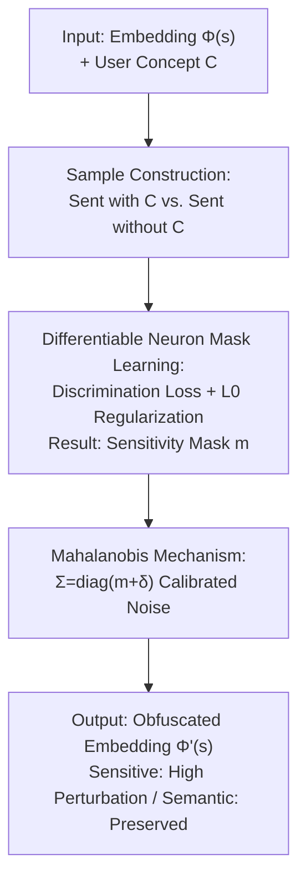

# Concept-Aware Privacy Mechanisms for Defending Embedding Inversion Attacks

**Conference**: ICLR 2026  
**OpenReview**: [https://openreview.net/forum?id=bcOD0CLgBb](https://openreview.net/forum?id=bcOD0CLgBb)  
**Code**: None  
**Area**: AI Security / Privacy Protection  
**Keywords**: Embedding Inversion Attacks, Differential Privacy, Concept-level Privacy, Mahalanobis Mechanism, Text Embedding

## TL;DR
To address the pain point where standard differential privacy (DP) defenses indiscriminately add noise to all embedding dimensions and destroy semantics, this paper proposes SPARSE. It utilizes a differentiable neuron mask to learn critical dimensions related to user-specified privacy concepts and subsequently injects ellipsoidal noise calibrated by dimensional sensitivity using the Mahalanobis mechanism. This perturbation targets only sensitive dimensions while preserving non-sensitive semantics, effectively reducing privacy leakage while maintaining downstream utility across six datasets.

## Background & Motivation
**Background**: Text embeddings (e.g., Sentence-T5, SBERT) are foundational for NLP applications, particularly RAG systems. However, recent research reveals that embeddings are vulnerable to "Embedding Inversion Attacks"—Vec2Text can recover 92% of the content from a 32-token input for T5 embeddings, and GEIA can reconstruct entire sentences. Attackers can extract sensitive information like names or diseases. Differential Privacy (DP) remains the mainstream defense framework due to its rigorous guarantees.

**Limitations of Prior Work**: Existing DP defenses (e.g., Generalized Laplace Mechanism LapMech, Purkayastha mechanism PurMech) implicitly assume that "every dimension of the embedding carries the same privacy sensitivity," thus injecting isotropic (spherical) noise across all dimensions. This presents two issues: first, privacy is person- and context-dependent (e.g., medical conditions vs. political leanings), and indiscriminate protection does not align with real-world needs; second, to cover all possible sensitive information, a massive amount of noise must be injected across all dimensions, which severely damages downstream utility.

**Key Challenge**: The fundamental cause is the mismatch between the "uniform noise" of DP mechanisms and the "heterogeneity" of embedding dimensions. Preliminary analysis by the authors indicates that different embedding dimensions vary significantly in their sensitivity to specific concepts—some dimensions highly encode medical conditions, while others primarily carry non-sensitive general semantics; however, spherical noise treats them identically.

**Goal**: The problem is decomposed into two sub-problems: (1) identifying which dimensions are sensitive for a given privacy concept; (2) designing a mechanism that calibrates noise based on dimensional sensitivity while retaining DP theoretical guarantees.

**Key Insight**: Since sensitive information is concentrated in a few dimensions, noise can be "saved" on non-sensitive dimensions and concentrated on sensitive ones, replacing isotropic spherical noise with anisotropic ellipsoidal noise.

**Core Idea**: Using "differentiable mask localization of sensitive dimensions + Mahalanobis ellipsoidal noise calibrated by sensitivity" instead of "all-dimension spherical noise" to achieve precise privacy protection for user-defined concepts.

## Method

### Overall Architecture
SPARSE (Sensitivity-guided Privacy-Aware Representations for better SEmantic-preserving) is a user-centric two-stage framework. The input is a text containing sensitive information with its embedding $\Phi(s)$ and a user-defined privacy concept $C$ (a set of tokens to protect, e.g., names). The output is an obfuscated embedding $\Phi'(s)$ that prevents attack models from reconstructing tokens in $C$ while minimizing utility loss.

Mechanism: The first step is **Neuron Mask Learning**, which estimates the sensitivity of each dimension to concept $C$ by training a sparse mask $m \in [0, 1]^n$ on positive/negative pairs. The second step is **Mahalanobis Mechanism Perturbation**, where the mask $m$ is used as the diagonal of the covariance for ellipsoidal noise, injecting stronger noise into sensitive dimensions (high $m_i$) and minimal noise into others.

### Key Designs

**1. Differentiable Neuron Mask Learning: Transforming "Sensitivity" into an Optimizable Sparse Mask**
To identify sensitive dimensions, the authors utilize a smooth approximation via the HardConcrete distribution. Each mask $m_i$ is parameterized by a learnable location $\alpha_i$ and temperature $\beta_i$, computed as $s_i = \sigma\left(\frac{1}{\beta_i}(\log\frac{\mu_i}{1-\mu_i}+\log\alpha_i)\right)$ and $m_i = \min(1, \max(0, s_i(\xi-\gamma)+\gamma))$, where $\xi=1.1, \gamma=-0.1, \mu_i \sim U(0,1)$. Using the reparameterization trick, this becomes differentiable for backpropagation.

Supervision comes from paired datasets: $D^+$ contains sentences with the concept tokens, and $D^- = \{R(s_i, C)\}$ removes those tokens. The training objective minimizes $L_{cls}(m, \theta) + \lambda L_{reg}(m)$, where $L_{cls}$ ensures the masked embedding $\Phi(s) \odot m$ distinguishes $D^+$ from $D^-$, and $L_{reg}$ (based on expected active neurons) forces sparsity. This localizes sensitive dimensions without needing access to an attack model.

**2. Mahalanobis Mechanism: Anisotropic Noise Calibration**
Traditional mechanisms inject isotropic noise $Z_{Lap} \sim \exp(-\epsilon \|z\|_2)$, which has a spherical probability surface. This paper adopts the Mahalanobis norm $\|v\|_M = \sqrt{v^\top \Sigma^{-1} v}$ for a positive definite $\Sigma$, creating an ellipsoidal surface. The mechanism $M_{Mah}(x) = x + Z_{Mah}$ is defined with $Z_{Mah} \sim \exp(-\epsilon \|z\|_M)$.

The covariance is set as $\Sigma = \text{diag}(m_1 + \delta, \dots, m_n + \delta)$ and normalized such that $\text{trace}(\Sigma) = \text{trace}(I_n)$. Since $\Sigma^{-1}$ is used in the norm, dimensions with larger $m_i$ (higher sensitivity) receive effectively stronger noise, while non-sensitive dimensions are preserved.

**3. Privacy Guarantee Equivalence: Metric LDP for Ellipsoidal Noise**
The authors prove (Theorem 1) that the Mahalanobis mechanism satisfies $\epsilon d$-LDP (Metric Local Differential Privacy). Using the equivalence of Mahalanobis and Euclidean norms in finite dimensions, it is shown that $\frac{\|v\|_2}{\sqrt{n}} \le \|v\|_M \le \frac{\|v\|_2}{\sqrt{c}}$. Thus, for the same $\epsilon$, the privacy strength of the Mahalanobis mechanism is within a constant factor of the standard Laplace mechanism, ensuring that switching to "smarter" noise does not sacrifice theoretical privacy.

### Loss & Training
The objective for mask learning is $\min_{m, \theta} L_{cls}(m, \theta) + \lambda L_{reg}(m)$. $L_{cls}$ uses an MLP classifier $P_\theta$. In the perturbation phase, $Z_{Mah}$ is sampled from the Mahalanobis distribution. Privacy budgets $\epsilon$ are evaluated across $\{5, 10, 20, 30, 40\}$.

## Key Experimental Results

### Main Results
Evaluated on STS12 and FIQA for Privacy-Utility Tradeoff.

| Dataset | $\epsilon$ | Leakage LapMech | Leakage **Ours** | Downstream LapMech | Downstream **Ours** |
| :--- | :--- | :--- | :--- | :--- | :--- |
| STS12 | 5 | 7.36 | **4.34** | 29.28 | **34.12** |
| STS12 | 10 | 22.34 | **19.31** | 60.72 | **65.27** |
| FIQA | 5 | 12.56 | **8.48** | 10.64 | **14.87** |
| FIQA | 10 | 35.17 | **31.62** | 21.74 | **23.45** |

At $\epsilon=10$ on STS12, **Ours** reduces leakage to 19% (compared to 60% unprotected and 22% for baselines) while maintaining 65% downstream utility, achieving a win-win scenario.

### Ablation Study
Comparison with White-Box Upper Bound (SPARSE-WB using Integrated Gradients on known attack models):

| Config | $\epsilon=5$ Leak | $\epsilon=10$ Leak | $\epsilon=5$ Util | $\epsilon=10$ Util |
| :--- | :--- | :--- | :--- | :--- |
| LapMech | 7.36 | 22.34 | 29.28 | 60.72 |
| **Ours** | 4.34 | 19.31 | 34.12 | 65.27 |
| SPARSE-WB | 1.43 | 12.01 | 40.92 | 67.45 |

### Key Findings
- Both components are critical: the mask determines *where* to add noise, and the Mahalanobis mechanism determines *how* to add it. If either degenerates to uniform noise, utility drops to baseline levels.
- **Ours** (black-box) performs close to SPARSE-WB (white-box), validating the core assumption that sensitive information is concentrated in specific dimensions.
- Stronger attacks (like Vec2Text) which rely on full embedding semantics are more susceptible to the proposed ellipsoidal perturbation.

## Highlights & Insights
- **Operationalization of Sensitivity**: Transforms privacy sensitivity into a learnable sparse binary selection problem without requiring access to attacker models.
- **Seamless DP Integration**: Uses the Mahalanobis norm to upgrade "spherical noise" to "ellipsoidal noise" while maintaining rigorous metric LDP guarantees.
- **User-Defined Perspective**: Shifts from fixed PII definitions to customizable concepts $C$, allowing protection for medical history, political leanings, etc.

## Limitations & Future Work
- Mask learning requires constructing samples and training for each new privacy concept, leading to maintenance overhead.
- Evaluation focuses primarily on PII tokens; effectiveness on abstract semantic concepts (e.g., "emotional sentiment") is not yet fully verified.
- A gap remains between black-box and white-box performance in high-privacy regimes ($\epsilon=5$).

## Related Work & Insights
- **vs. LapMech**: Previous work uses isotropic noise; **Ours** uses concept-aware ellipsoidal noise to preserve more semantics.
- **vs. PurMech**: While PurMech uses directional noise, **Ours** explicitly localizes sensitive dimensions for differentiated perturbation.
- **vs. Attacks**: Demonstrates that sophisticated inversion attacks are highly sensitive to concept-targeted perturbations.

## Rating
- Novelty: ⭐⭐⭐⭐⭐ 
- Experimental Thoroughness: ⭐⭐⭐⭐⭐ 
- Writing Quality: ⭐⭐⭐⭐ 
- Value: ⭐⭐⭐⭐⭐ 

<!-- RELATED:START -->

## Related Papers

- [\[ICLR 2026\] Exponential-Wrapped Mechanisms: Differential Privacy on Hadamard Manifolds Made Practical](exponential-wrapped_mechanisms_differential_privacy_on_hadamard_manifolds_made_p.md)
- [\[ICLR 2026\] Defending against Backdoor Attacks via Module Switching](defending_against_backdoor_attacks_via_module_switching.md)
- [\[ICLR 2026\] Membership Privacy Risks of Sharpness Aware Minimization](sam_membership_privacy_risks.md)
- [\[ICLR 2026\] RESFL: An Uncertainty-Aware Framework for Responsible Federated Learning by Balancing Privacy, Fairness and Utility](resfl_an_uncertainty-aware_framework_for_responsible_federated_learning_by_balan.md)
- [\[ICLR 2026\] Reliable Poisoned Sample Detection against Backdoor Attacks Enhanced by Sharpness-Aware Minimization](reliable_poisoned_sample_detection_against_backdoor_attacks_enhanced_by_sharpnes.md)

<!-- RELATED:END -->
