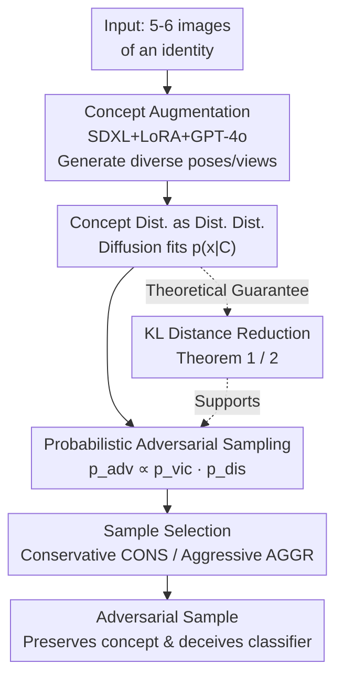

# Concept-based Adversarial Attack: a Probabilistic Perspective

**Conference**: ICLR2026  
**OpenReview**: [https://openreview.net/forum?id=SoVgrFEgWt](https://openreview.net/forum?id=SoVgrFEgWt)  
**Code**: https://github.com/andiac/ConceptAdv  
**Area**: AI Security / Adversarial Attack  
**Keywords**: Adversarial Attack, Probabilistic Perspective, Concept Distribution, Diffusion Model, Unrestricted Attack

## TL;DR
The adversarial attack is upgraded from "perturbing a single image" to "perturbing an entire concept distribution." A diffusion generative model is used to fit multi-pose and multi-view images of a specific identity (e.g., a specific Corgi) into a concept distribution. By sampling from the product of this concept distribution and the victim classifier's distribution, the method generates adversarial samples that retain the original concept identity while achieving a high success rate (white-box targeted attack success rate improved from 59% of ProbAttack to 98%).

## Background & Motivation
**Background**: The goal of adversarial attacks is to deceive a classifier while "keeping the input semantics unchanged." The mainstream consensus in the image domain is to use $L_1/L_2/L_\infty$ norms to constrain the geometric distance of perturbations, ensuring the adversarial sample $x_{adv}$ is close enough to the original image $x_{ori}$ to preserve semantics. Most benchmarks and competitions are established under the constraint that the geometric distance does not exceed a threshold $\delta$.

**Limitations of Prior Work**: As adversarial defenses become stronger, small geometric perturbations struggle to deceive classifiers, especially when strong transferability (black-box transferability) is required. This has led to "unrestricted adversarial attacks," which allow larger geometric perturbations. However, "unrestricted" does not mean the content can be modified arbitrarily: adversarial samples must still be faithful to the semantics of the original image. The problem is that existing unrestricted methods (such as ACA, DiffAttack, etc.) still manipulate a **single image**, meaning the perturbation space is strictly confined by that one image.

**Key Challenge**: From a probabilistic perspective (Zhang et al. 2024b), generating adversarial samples is equivalent to sampling from the product of two distributions: the victim distribution $p_{vic}$ (focusing on classifying the image into the target class) and the distance distribution $p_{dis}$ (a "proximal" distribution around the original image). $x_{adv} \sim p_{vic}\cdot p_{dis}$. When $p_{dis}$ is tightly locked around a single image $x_{ori}$ that does not belong to the target class, the **overlap area** between $p_{dis}$ and $p_{vic}$ is extremely small. Samples falling into this narrow intersection either fail to deceive the classifier or lose the original semantics, and they often exhibit poor image quality because they reside in low-density regions of the distribution.

**Goal**: To expand the coverage of the distance distribution $p_{dis}$ from a single image to an **entire concept**, increasing its overlap with $p_{vic}$ and thereby simultaneously improving the attack success rate, fidelity, and image quality.

**Key Insight**: A "concept"—such as the specific identity of "the long-eared Corgi puppy with a whiter left face in Figure 1"—can inherently be represented by an **image distribution** $p(\cdot\mid C_{ori})$, which consists of all images of this specific Corgi in different poses, perspectives, and backgrounds. Since any distribution centered around the original image can serve as a distance distribution and implicitly define a "distance" in the probabilistic perspective, the concept distribution itself can be used as $p_{dis}$.

**Core Idea**: In the probabilistic adversarial framework, replace the single image $x_{ori}$ in $p_{dis}(x_{adv}\mid x_{ori})$ with the concept $C_{ori}$, resulting in $p_{adv}(x_{adv}\mid C_{ori}, y_{tar})\propto p_{vic}(x_{adv}\mid y_{tar})\,p_{dis}(x_{adv}\mid C_{ori})$. Single-image attack then becomes a special case where $|C_{ori}|=1$.

## Method

### Overall Architecture
The objective is straightforward: traditional attacks use a distance distribution $p_{dis}$ fixed to a single original image, which has almost no overlap with the victim distribution $p_{vic}$, resulting in adversarial samples that are neither effective nor visually appealing. This paper expands $p_{dis}$ from the "neighborhood of one image" to a "distribution of a concept," increases its overlap area with $p_{vic}$, and then samples from the overlap region.

The pipeline consists of three steps: **(1) Concept Dataset Augmentation**: Given an identity (e.g., 5-6 DreamBooth images of a specific Corgi), use SDXL+LoRA+GPT-4o to expand it into dozens of images with diverse poses, views, and backgrounds to form the concept set $C_{ori}$; **(2) Fitting Concept Distribution as Distance Distribution**: Fine-tune an unconditional diffusion model $p(x)$ on $C_{ori}$ to obtain the concept distribution $p_{dis}(\cdot\mid C_{ori})$, which implicitly defines the "semantic distance to this concept"; **(3) Sampling + Selection**: Use Langevin Dynamics to sample $M$ candidates from $p_{adv}\propto p_{vic}\cdot p_{dis}$, and then select the best adversarial samples using "target class ranking" alongside two strategies: fidelity (CONS) or aggressive (AGGR). It is theoretically guaranteed by Theorem 1/2 that expanding the distribution from a single image to a concept reduces $\mathrm{KL}(p_{dis}\,\|\,p_{vic})$.

### Key Designs

**1. Concept Distribution as Distance Distribution: Replacing $x_{ori}$ with $C_{ori}$**

This is the theoretical pivot of the paper, addressing the fundamental pain point that "single-image $p_{dis}$ and $p_{vic}$ barely overlap." The probabilistic perspective of Zhang et al. (2024b) notes that the adversarial distribution is the product of the victim and distance distributions:

$$p_{adv}(x_{adv}\mid x_{ori}, y_{tar})\propto p_{vic}(x_{adv}\mid y_{tar})\,p_{dis}(x_{adv}\mid x_{ori})$$

Where $p_{vic}\propto\exp(-c\,f(x_{adv}, y_{tar}))$ measures the degree of "classification into the target class," and $p_{dis}\propto\exp(-D(x_{ori}, x_{adv}))$ is the distance distribution around the original image. The key insight is that $p_{dis}$ can be **any** distribution centered around the target, and the choice of distribution implicitly defines the distance $D$. This work simply replaces the single image $x_{ori}$ with the concept $C_{ori}$:

$$p_{adv}(x_{adv}\mid C_{ori}, y_{tar})\propto p_{vic}(x_{adv}\mid y_{tar})\,p_{dis}(x_{adv}\mid C_{ori})$$

Here $C_{ori}=\{x^{(1)}_{ori},\dots,x^{(K)}_{ori}\}$ is a set of images describing the same concept. The elegance lies in the fact that single-image probabilistic attack (ProbAttack) is exactly the degenerate case where $|C_{ori}|=1$, allowing the method to reuse the implementation of ProbAttack, which naturally becomes the ablation baseline. It is effective because the concept distribution covers various poses and views of the subject, and its intersection with the semantically concentrated $p_{vic}$ is much larger than that of a single image—allowing sampling to fall into high-density regions for both distributions.

**2. Concept Augmentation via Modern Generative Models: Expanding 5-6 Images to High-Diversity Sets**

Obtaining high-quality and high-diversity image sets for the same concept directly is difficult. While DreamBooth might provide a few poses for a specific Corgi, the backgrounds are often monotonous, lacking enough diversity to support a robust concept distribution. This paper uses SDXL for augmentation: the target identity is first denoted as "[V] dog," and a LoRA (Hu et al. 2022) is fine-tuned on SDXL to learn this identity. Then, photos of the Corgi are fed to GPT-4o to generate a batch of SDXL prompts for "[V] dog in various environments/views/poses" (e.g., "[V] dog on a skateboard," "[V] dog playing in the snow"). Finally, the Corgi LoRA is integrated back into SDXL to generate a large number of diverse images. In experiments using 30 objects from DreamBooth, 30 additional images are generated per concept to form the **DreamBoothPlus** dataset (eventually 26 were augmented, excluding 4 that were unfriendly to text generation or required specific cartoon-style parameters). This step provides the engineering foundation for the concept distribution to have "actual diversity."

**3. Theoretical Guarantee: Expanding Distribution Decreases KL to Victim Distribution (Theorem 1/2)**

Intuitively, expanding the perturbation space should be more effective, but rigorous proof is required. Theorem 1 states that for a distance distribution in Gibbs form $q(x)\propto\exp(-\beta D(x,\mu))$, $\mathrm{KL}(p\,\|\,q)$ is an increasing function of $\beta$ when $\mathbb{E}_{X\sim p}[D(X,\mu)] > \mathbb{E}_{X\sim q}[D(X,\mu)]$. Thus, decreasing $\beta$ (increasing "temperature," making $p_{dis}$ more dispersed) reduces $\mathrm{KL}(p_{vic}\,\|\,p_{dis})$. This condition holds inherently in the adversarial framework: samples from $p_{vic}$ are naturally further from the center of $p_{dis}$ than samples from $p_{dis}$ itself (otherwise, the setting of $p_{dis}$ as a distance distribution centered near the concept would be violated). Theorem 2 further provides a computable expression for the difference in KL $\Delta$ between two different distance distributions for the same $p_{vic}$:

$$\Delta = \mathbb{E}_{X\sim p^{(1)}_{dis}}\!\big[\log p^{(1)}_{dis}(X) - c \log p(y_{tar}\mid X)\big] - \mathbb{E}_{X\sim p^{(2)}_{dis}}\!\big[\log p^{(2)}_{dis}(X) - c \log p(y_{tar}\mid X)\big]$$

Using Monte Carlo estimation with common random numbers to reduce variance allows for the calculation of $\tilde\Delta$. In experiments, setting $p^{(1)}_{dis}$ as the concept distribution and $p^{(2)}_{dis}$ as the single-image distribution reveals $\tilde\Delta < 0$ for every concept, empirically confirming that "concept leads to closer distance."

**4. Multi-sampling + Conservative/Aggressive Selection Strategy**

A major advantage of probabilistic attacks is the ability to sample multiple candidates and choose the best one. In white-box settings, the simplest method is rejection sampling (discarding samples that fail to deceive), but if the overlap between $p_{dis}$ and $p_{vic}$ is too small, the rejection rate will be high (especially under Top-1 criteria). This paper adopts a compromise: sample $M$ candidates (experimentally $M=10$) from $p_{adv}$, sort them by their "rank for the target class," and resolve ties using one of two strategies: **Conservative Strategy (CONS)** chooses the sample with the **lowest** target class softmax probability among the top rankers to filter out those that deviate too far from the original concept (higher identity fidelity); **Aggressive Strategy (AGGR)** chooses the one with the **highest** softmax probability, selecting the sample with the greatest adversarial potential (higher transferability). Both strategies yield similar white-box success rates (as long as it ranks first, it's a success), but AGGR is significantly stronger in black-box transferability, while CONS is roughly equivalent to the baseline.

### Loss & Training
The sampler uses Langevin Dynamics to optimize the relaxed objective $\min D(x_{ori}, x_{adv}) + c\,f(x_{adv}, y_{tar})$, which converges to the corresponding Gibbs distribution, providing a probabilistic interpretation for adversarial sample generation. The distance distribution employs an unconditional diffusion model (Dhariwal & Nichol 2021) that directly models $p(x)$ (rather than $p(x\mid y)$). The authors emphasize that this "principled" model choice is intended to demonstrate a general method rather than purely chasing engineering performance limits.

## Key Experimental Results

### Main Results
Setting: White-box victim classifier ResNet50, targeted attack (more difficult than untargeted, ImageNet 1000 classes). Total of 780 adversarial samples from 26 concepts in DreamBoothPlus × 30 random target classes. White-box success is defined as Top-1 hitting the target class; due to generally very low Top-1 for transferability, Top-5 is reported for black-box. Comparison includes NCF, ACA, DiffAttack, and ProbAttack.

| Setting | Metric | NCF | ACA | DiffAttack | ProbAttack | Ours (CONS) | Ours (AGGR) |
| :--- | :--- | :--- | :--- | :--- | :--- | :--- | :--- |
| White-box | Targeted-Top1 (ResNet50) | 1.15 | 6.03 | 84.23 | 59.23 | **97.82** | **97.82** |
| Transfer | Top5 (ResNet152) | 1.41 | 1.92 | 8.33 | 3.33 | 2.82 | **8.72** |
| Transfer | Top5 (DenseNet161) | 1.41 | 2.05 | 7.44 | 3.97 | 3.85 | **11.54** |
| Defense | Top5 (EffNet B7 Adv) | 0.26 | 1.15 | 2.05 | 2.31 | 1.67 | **6.41** |

The white-box targeted success rate of 97.82% is a significant lead (ProbAttack 59.23%, DiffAttack 84.23%). The aggressive strategy AGGR achieves the highest Top-5 on most transfer/defense models, while the conservative strategy CONS is slightly lower in transferability, roughly on par with the baseline.

### Ablation Study
ProbAttack itself is a degenerate version of the proposed method where $|C_{ori}|=1$; thus, the transition "ProbAttack → Ours" is the core ablation: switching the distance distribution from a single image to a concept increases white-box success from 59.23% to 97.82%. The table below compares fidelity and image quality (no-reference quality metrics):

| Metric | Clean | DiffAttack | ProbAttack | Ours (CONS) | Ours (AGGR) | Notes |
| :--- | :--- | :--- | :--- | :--- | :--- | :--- |
| User Study (Sim.) ↑ | N/A | 0.7577 | 0.8041 | **0.9654** | 0.8808 | Identity preservation |
| HyperIQA ↑ | 0.7255 | 0.5551 | 0.6675 | **0.6947** | 0.6809 | No-ref image quality |
| MUSIQ-KonIQ ↑ | 65.05 | 52.54 | 58.16 | **63.75** | 62.22 | No-ref image quality |
| TReS ↑ | 93.21 | 74.12 | 84.31 | **90.45** | 88.08 | No-ref image quality |

### Key Findings
- **Concept replacement is the primary source of improvement**: Merely switching from single-image to concept distribution (ProbAttack → Ours) nearly doubles the white-box success rate (59 → 98) while simultaneously improving image quality and fidelity, validating the theory of expanding the $p_{dis}$ and $p_{vic}$ overlap.
- **CONS vs AGGR is a fidelity-transferability trade-off**: CONS is optimal across User Study similarity (0.9654) and image quality, suitable for cases requiring identity preservation; AGGR sacrifices a bit of fidelity for significantly stronger black-box transferability.
- **DiffAttack exhibits notably lower image quality** (HyperIQA 0.555, TReS 74.1). Qualitative results also show its generated images lack detail, consistent with its low quality scores.

## Highlights & Insights
- **"Concept as Distribution" is a clean abstraction**: Using $p(\cdot\mid C_{ori})$ to represent a concept allowed the attack granularity to move seamlessly from single-image (set size 1) to identity-level and then to category-level. The same math applies, just changing the size of $C_{ori}$. This idea of "elevating discrete objects to distributions" is transferable to many generation/editing tasks requiring semantic preservation.
- **Theory and method are tightly coupled**: Theorem 1 uses the temperature $\beta$ of the Gibbs distribution to explain why "more dispersed distribution → smaller KL," and its prerequisite holds inherently in the adversarial framework. It is not an ad-hoc addition but a natural derivation from the probabilistic perspective.
- **Near zero-cost reuse of baselines**: Since the new method is a strict generalization of the old one ($|C_{ori}|=1$), the implementation can largely reuse ProbAttack. This also makes ablation comparisons naturally clean—this is a benefit of designing a method as a generalization of a baseline.
- **GPT-4o as a prompt generator** for concept augmentation is a practical trick: using a VLM to automatically produce "same identity, diverse scenes" prompts overcomes the engineering bottleneck of "insufficient diversity in concept image sets."

## Limitations & Future Work
- **Transferability remains relatively low**: Even with the best AGGR strategy, black-box Top-5 success is mostly between 4%-12%, far behind the 98% white-box. Targeted transferability is inherently difficult, but this suggests the method's advantages are primarily in white-box scenarios.
- **Dependency on heavy generative pipelines**: Each concept requires SDXL+LoRA augmentation and separate fine-tuning of a diffusion model to fit $p_{dis}$. This is computationally expensive and hard to scale; DreamBoothPlus also excluded 4 concepts that were "unfriendly to text generation."
- **Access to concept datasets**: The method assumes access to multiple images of the same identity, which may not be realistic in real-world attack scenarios (often only one target image is available). While generative augmentation can help, the quality of augmentation directly dictates the attack's success.
- **Limited evaluation scale**: The study used 26 concepts × 30 target classes with a fixed ResNet50 victim model. Whether the success rate advantage holds against stronger defense models or larger evaluation sets warrants further verification.

## Related Work & Insights
- **vs ProbAttack (Zhang et al. 2024b)**: ProbAttack interprets adversarial attacks as sampling from $p_{vic}\cdot p_{dis}$, but $p_{dis}$ remains locked to a single image. This paper is a strict generalization—replacing $x_{ori}$ with the concept $C_{ori}$, which creates a larger overlap and increases success from 59% to 98%. ProbAttack is the $|C_{ori}|=1$ special case.
- **vs ACA / DiffAttack (Chen et al. 2024a,b)**: Both apply adversarial gradients directly in the latent space of Stable Diffusion/DDIM and are SOTA for unrestricted attacks, but they still perturb around a single image. This paper operates on a concept distribution, achieving higher white-box success and image quality (DiffAttack 84.23% vs Ours 97.82%, with significantly better visual quality).
- **vs NCF (Yuan et al. 2022)**: A strong color-transformation-based attack that preserves semantics by modifying colors. It almost fails under targeted attack (1.15%), showing color perturbations are insufficient for strong targeted attacks.
- **vs Category-level Concept Attacks (Song et al. 2018; Dai et al. 2024; Collins et al. 2025)**: These works treat "categories" (cat/dog/truck) as concepts but cannot precisely characterize an individual identity. This paper uses distributions to represent concepts, flexibly corresponding to single images, identities, or categories, representing what the authors call the first "identity-level" adversarial attack.

## Rating
- Novelty: ⭐⭐⭐⭐⭐ First to elevate adversarial attacks from single-image perturbations to identity-level concept distributions, formally generalizing existing frameworks.
- Experimental Thoroughness: ⭐⭐⭐⭐ Multi-dimensional comparisons across white-box, transferability, quality, and fidelity, plus theoretical KL verification. However, victim models and evaluation scales are somewhat limited, and transferability is weak.
- Writing Quality: ⭐⭐⭐⭐⭐ The logical chain from probabilistic motivation to theory, method, and experiment is very clear; the dual-distribution overlap illustration in Figure 1 is highly persuasive.
- Value: ⭐⭐⭐⭐ Provides a new attack paradigm and theoretical guarantees for "concept as distribution," though the heavy generative pipeline limits its practical scale.

<!-- RELATED:START -->

## Related Papers

- [\[ICLR 2026\] Nasty Adversarial Training: A Probability Sparsity Perspective for Robustness Enhancement](nasty_adversarial_training_a_probability_sparsity_perspective_for_robustness_enh.md)
- [\[CVPR 2026\] A Unified Perspective on Adversarial Membership Manipulation in Vision Models](../../CVPR2026/ai_safety/a_unified_perspective_on_adversarial_membership_manipulation_in_vision_models.md)
- [\[ICLR 2026\] Decoupling the Class Label and the Target Concept in Machine Unlearning](decoupling_the_class_label_and_the_target_concept_in_machine_unlearning.md)
- [\[NeurIPS 2025\] Understanding and Improving Adversarial Robustness of Neural Probabilistic Circuits](../../NeurIPS2025/ai_safety/understanding_and_improving_adversarial_robustness_of_neural_probabilistic_circu.md)
- [\[ICLR 2026\] Discrete Latent Features Ablate Adversarial Attack: A Robust Prompt Tuning Framework for VLMs](discrete_latent_features_ablate_adversarial_attack_a_robust_prompt_tuning_framew.md)

<!-- RELATED:END -->
