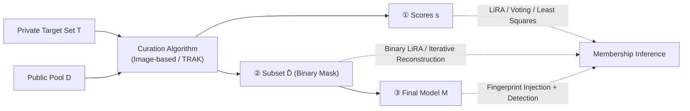

# Curation Leaks: Membership Inference Attacks against Data Curation for Machine Learning

**Conference**: ICLR 2026  
**OpenReview**: [https://openreview.net/forum?id=BzNf90Csfa](https://openreview.net/forum?id=BzNf90Csfa)  
**Code**: To be confirmed  
**Area**: AI Security / Privacy / Membership Inference  
**Keywords**: Data curation, membership inference attacks, TRAK, differential privacy, private machine learning  

## TL;DR
This paper reveals for the first time that even if a model is trained exclusively on "public data" and never directly sees private data, as long as private data is used to **guide data curation**, an attacker can successfully infer the membership of private samples across three stages: curation scores, curated subsets, and the final model. It also proposes a differentially private version of curation as an effective defense.

## Background & Motivation
- **Background**: Data curation has become a core component of modern ML pipelines—using a small private "target set" $T$ to select the most valuable subset $\tilde{D}$ from a large public pool $D$ (e.g., CommonPool with 12.8M samples), and then training only on $\tilde{D}$. In sensitive domains with data scarcity like finance and healthcare, this is treated as a "privacy-friendly" solution since the model never directly contacts the private data.
- **Limitations of Prior Work**: It is widely assumed that "the model has not seen the private data $\Rightarrow$ it does not leak private information." However, curation scores, curated subsets, and intermediate quality scores are often publicly released or traded in "Curation-as-a-Service" markets. The privacy risks these products pose to the private target set have **never been systematically evaluated**.
- **Key Challenge**: Although private data does not enter the training set ($\tilde{D}\cap T=\varnothing$), it leaks information to all downstream outputs through the hidden channel of "influencing curation decisions." Privacy assessments focusing only on the training process are insufficient; they must extend to the **data selection process** itself.
- **Goal**: To construct tailored membership inference attacks for each stage of the curation pipeline for two representative curation methods—Image-based (embedding nearest neighbors) and TRAK (gradient attribution)—quantify the leakage, and explore differentially private defenses.
- **Core Idea**:
    - **[Attack Surface Expansion]** Moving membership inference from "attacking a trained model" forward to "attacking curation products," proving leakage in the scores, subsets, and model stages.
    - **[Signal Distillation]** Private signals are diluted among millions of public samples; thus, for each target, only the one most discriminative public sample is selected to recover the signal.
    - **[Fingerprint Injection]** For the most difficult end-to-end scenario involves the final model, a minimal number of "fingerprint samples" are injected into the public pool, designed to be "selected if and only if a specific private target is present," reducing end-to-end attacks to detecting if a fingerprint was selected.

## Method

### Overall Architecture
Attacks are developed against three progressive threat models shown in Figure 1, with increasing difficulty: (1) observing continuous **curation scores** $s\in\mathbb{R}^{|D|}$; (2) observing only the **binary selection mask** $m\in\{0,1\}^{|D|}$; (3) having only black-box query access to the **final model** $M$ (requiring active injection of fingerprints into the pool). The unified foundation of all attacks involves replacing the "shadow models" in classic LiRA with "shadow curation sets" and designing tailored attacks for the structure of each curation algorithm, totaling 7 attacks.

### Key Designs

**1. Shadow Curation Sets + Signal Distillation: Adapting LiRA for Curation.** Classic LiRA requires training many shadow models, which is computationally expensive. The key replacement in this paper is: sampling $m$ random subsets from the target set $T$, running curation once for each subset to obtain shadow curation outputs $\{s_j\in\mathbb{R}^N\}$, where each target appears in exactly half of the subsets to ensure an unbiased in/out distribution. The real challenge lies in the massive public pool ($N\approx12.8\text{M}$), where a single target's signal is diluted across millions of outputs. Borrowing from Jagielski et al., **only the one most informative public sample is kept for each target**: $k^*=\arg\max_k\big|\mathbb{E}_{j:t\in T_j}[s_j^{(k)}]-\mathbb{E}_{j:t\notin T_j}[s_j^{(k)}]\big|$, which is the sample with the largest difference between member/non-member distributions. Given $k^*$, LiRA fits a Gaussian to its scores and computes the log-likelihood ratio $v_{\text{LiRA}}(t)=\log p(s_{k^*}\mid\mathcal{N}(\mu_\text{in},\sigma_\text{in}^2))-\log p(s_{k^*}\mid\mathcal{N}(\mu_\text{out},\sigma_\text{out}^2))$ as the membership score.

**2. Custom Score Attacks Utilizing Algorithm Structures: Voting (Image) and Least Squares (TRAK).** While LiRA is a general baseline, internal structures of specific curation algorithms can be exploited more effectively. For Image-based curation, scores are deterministic nearest neighbors $s(x)=\max_t\cos(\phi(x),\phi(t))$, allowing for "reverse engineering": for each public sample, the target $t^*$ responsible for it is identified and given a positive vote, while all targets that "would increase $s(x)$ if present" are given negative votes; the tally is the membership score. For TRAK, scores are a linear average of contributions from each target $s(x)=\frac{1}{|T|}\sum_t\Phi(x)^\top G_t$. Due to this linear combination, one can solve a least squares problem $\min_{m}\lVert\Phi(x)^\top G_t m-s\rVert_2^2$ to recover the membership mask $m$ that best explains the observed scores; the optimal weights serve as membership scores. This comparison reveals that the per-target nearest neighbor structure of Image-based curation is inherently fragile, whereas the averaging in TRAK dilutes individual target contributions, providing natural protection.

**3. Binary Subset Attacks: Binary LiRA and Iterative Reconstruction.** When only the binary mask indicating whether a sample was selected is observable, information is much sparser than continuous rankings. Binary LiRA binarizes shadow outputs into top-$k$ masks and uses a Bernoulli distribution to model the selection frequency $\mu_\text{in},\mu_\text{out}$ of each public sample, then calculates the Bernoulli log-likelihood ratio $v(t)=\log\frac{\mu_\text{in}^{x_v}(1-\mu_\text{in})^{1-x_v}}{\mu_\text{out}^{x_v}(1-\mu_\text{out})^{1-x_v}}$ for sample $k^*$. For Image-based curation, an **Iterative Reconstruction** attack is also designed: starting from a null hypothesis set, it repeatedly runs curation on candidate target sets, adding or subtracting votes by comparing "samples selected by the hypothesis but not the target" (overweighted) and "samples selected by the target but not the hypothesis" (underweighted), until the Jaccard similarity between the reconstructed and observed subsets exceeds a threshold. This attack can **accurately recover the membership of all non-zero influence samples**.

**4. End-to-End Fingerprint Injection: Reducing Model Attacks to "Fingerprint Selection".** Attacking the final model is the most difficult yet realistic scenario. The core idea is to inject a small number of fingerprint samples $F$ into the public pool, satisfying two conditions: **selective triggering** (the fingerprint is selected if and only if a specific target $t$ is in the private set) and **detectable fingerprinting** (once selected, it leaves a measurable signal in the model). Since training large models repeatedly is infeasible, this paper first validates one-off that a "minimal number of fingerprints (e.g., 5, poisoning rate 0.0005%) can indeed leave a detectable signal without harming utility," then **simplifies the end-to-end attack** to observing "whether fingerprints enter $\tilde{D}$." For Image-based curation, since selection depends only on image embeddings, text captions can be arbitrarily modified (e.g., pairing CIFAR-10 images with "ratatouille"), and a relevance score $\text{score}(f,t_i)=\alpha\cdot s(f,t_i)+(1-\alpha)\cdot(1-\max_{t'\ne t_i}s(f,t'))$ is used to pick fingerprints by balancing "attraction to the target" and "repulsion from others." For TRAK, which penalizes mislabeled samples, the attack involves **appending semantically orthogonal information** to correct captions (e.g., "an image of an airplane and ratatouille"), maintaining high TRAK scores while leaving detectable changes, and then picking fingerprints based on signal-to-noise ratio (Algorithm 1).

## Key Experimental Results

### Main Results Settings and Results
- **Data**: Public pool uses CommonPool small (12.8M); six target sets cover natural images, medical, and satellite data—CIFAR-10/100, STL-10, RESISC45, PatchCamelyon, and Food101. CLIP ViT-L/14 is used for embeddings; LiRA uses 256 shadow sets.

| Stage / Method | Image-based Leakage | TRAK Leakage |
|---|---|---|
| Score Attack (Score) | High success rate, AUC much higher than random | Near random (AUC $\approx$ 0.5); averaging provides natural protection |
| Binary Subset (Subset) | Still fragile; can accurately recover all non-zero influence samples | Relatively robust |
| End-to-End (Final Model) | Moderate leakage across all sizes; RESISC45 reaches **21.4%** TPR@1%FPR at $|T|=100$ | Success rate drops significantly as $|T|$ increases; small target sets are high risk |

### Ablation Study

| Factor | Finding |
|---|---|
| Embedding/Projection Dim | Image-based has a leakage "sweet spot" at 128 dimensions; TRAK requires $\ge 1024$ dimensions, otherwise success rate drops |
| Target Set Size $|T|$ | TRAK shows a strong "larger is safer" shielding effect; Image-based shows a bimodal distribution due to influence sparsity (most protected, few highly exposed) |
| Shadow Count | For CIFAR-10, 128 $\rightarrow$ 256 shadows on Image-based increases AUC by $\sim$ 10%, but only 1% for PCAM; TRAK shows almost no gain |
| Removing Fragile Samples | Ineffective; a "Privacy Onion Effect" occurs where stripping one layer exposes the next |
| DP Defense | At $\varepsilon=100$, Image-based TPR@1%FPR drops from 98.4% $\rightarrow$ 5.4%, and TRAK from 100% $\rightarrow$ 33.2%; at $\varepsilon=10$, both fall to near baseline (1.1%, 1.7%) |

### Key Findings
- **Attack success rate is strongly correlated with "influence sparsity"**: Figure 2 shows that many targets are not nearest neighbors to any public samples (PCAM has 98.28% zero influence, STL-10 has 34.16%). These targets are naturally protected, but signals for non-zero influence targets are extremely strong—forming a "bimodal privacy distribution" (most samples safe, few samples highly exposed).
- **Data type does not determine vulnerability; influence concentration does**: Satellite imagery RESISC45 has fewer zero-influence samples $\rightarrow$ easier to attack; medical imagery PCAM has more zero-influence samples $\rightarrow$ harder to attack. Both contrast with CIFAR-10, showing vulnerability is determined by curation structure rather than semantic domain.
- **TRAK is not safe**: Its averaging is robust for large target sets (score attacks near random), but it remains highly vulnerable for "small and sensitive target sets"—precisely the core motivation for curation in sensitive domains—showing clear size dependence.
- **DP is a feasible direction**: Using Report-Noisy-Max to add noise to per-target similarities before taking the maximum for Image-based curation, and privatizing average gradient calculations for TRAK (similar to DP-SGD), can suppress leakage to near-baseline levels at reasonable $\varepsilon$.
- **TRAK requires stronger guarantees**: Because it operates in a high-dimensional gradient space, it still exhibits 33.2% TPR at $\varepsilon=100$, requiring a stricter privacy budget than Image-based curation to suppress leakage.

## Highlights & Insights
- **Conceptual Contribution**: Breaks the intuition that "models are safe if they haven't seen private data," pointing out that privacy assessments must cover the data selection process. This is a fundamental warning for the emerging paradigm of "using curation for private ML."
- **Tiered Threat Models**: Scores $\rightarrow$ Subsets $\rightarrow$ Model progression, where knowledge/capability assumptions increase alongside realism; end-to-end fingerprint injection corresponds to the real threat of "public pools crawled from the internet being poisoned."
- **Methodological Innovation**: Replaces the expensive repeated training of large models with "proxy metrics (fingerprint selection)," making the attack scalable and significantly improving reproducibility.
- **Closed-loop Defense**: Not only exposes the problem but also provides DP versions of curation and quantifies their effectiveness, making the paper constructive rather than purely destructive.

## Limitations & Future Work
- **Fingerprinting Requires Poisoning Capability**: The end-to-end attack assumes the attacker can inject specific samples into the public pool. While supported by precedents (crawled data can be poisoned), it is a strong assumption that limits immediate exploitability (emphasized in the ethics statement).
- **Privacy-Utility Trade-off of DP Not Deeply Explored**: Only demonstrates that DP can reduce leakage; the cost to curation quality and downstream accuracy lacks systematic characterization, which the authors list as future work.
- **High Computational Cost**: Running curation and training on large-scale data truly relevant to "data curation" is expensive, limiting the scale of full end-to-end validation; some conclusions rely on one-off validated proxy signals.
- **Limited Curation Methods**: Image-based and TRAK are representative, but the leakage profiles of other paradigms like loss-correlation remain to be explored.

## Related Work & Insights
- **Membership Inference Baselines**: Built upon LiRA (Carlini et al. 2022a) and signal filtering (Jagielski et al. 2023), with the innovation of replacing shadow models with shadow curation sets to bypass the cost of retraining.
- **Data Attribution/Curation**: TRAK (Park et al. 2023), DataComp/Image filtering (Gadre et al. 2023), and DataModels (Ilyas et al. 2022) are the subjects of the attacks; this paper re-examines their privacy properties from an "attacker's perspective."
- **Poisoning Feasibility**: Relies on conclusions from Carlini et al. (2024, 2022) regarding the poisonability of web-scale data and backdooring contrastive learning, giving fingerprint injection a realistic basis.
- **Privacy Onion Effect**: Adopts the concept from Carlini et al. (2022b), proving that "deleting high-risk samples" does not solve the root problem and that formal DP is the correct path.
- **Insight**: Reminds the "Data-as-a-Service" market to govern curation scores/subsets as sensitive products; also suggests future exploration into finer privacy-utility frontiers and leakage profiles of more curation paradigms.

## Rating
- Novelty: ⭐⭐⭐⭐⭐ First to systematically reveal privacy risks in data curation pipelines, opening a new perspective of "attacking curation products instead of training models."
- Experimental Thoroughness: ⭐⭐⭐⭐ Six datasets $\times$ two methods $\times$ three stages covered with detailed ablations (dimensions/size/shadows/DP); only the end-to-end model uses proxies due to compute limits.
- Writing Quality: ⭐⭐⭐⭐ Clear tiered threat models, attack numbering, and figure mapping; formulas and algorithms are complete, though dense details may require reading the appendix.
- Value: ⭐⭐⭐⭐⭐ Provides a critical security warning for the increasingly popular "private ML via curation" paradigm and indicates DP defense directions; strong practical significance.

<!-- RELATED:START -->

## Related Papers

- [\[ICLR 2026\] Protection against Source Inference Attacks in Federated Learning](protection_against_source_inference_attacks_in_federated_learning.md)
- [\[ICLR 2026\] ReTrace: Reinforcement Learning-Guided Reconstruction Attacks on Machine Unlearning](retrace_reinforcement_learning-guided_reconstruction_attacks_on_machine_unlearni.md)
- [\[ICLR 2026\] Distributional Machine Unlearning via Selective Data Removal](distributional_machine_unlearning_via_selective_data_removal.md)
- [\[ICLR 2026\] Remaining-data-free Machine Unlearning by Suppressing Sample Contribution](remaining-data-free_machine_unlearning_by_suppressing_sample_contribution.md)
- [\[AAAI 2026\] Reference Recommendation based Membership Inference Attack against Hybrid-based Recommender Systems](../../AAAI2026/ai_safety/reference_recommendation_based_membership_inference_attack_against_hybrid-based_.md)

<!-- RELATED:END -->
