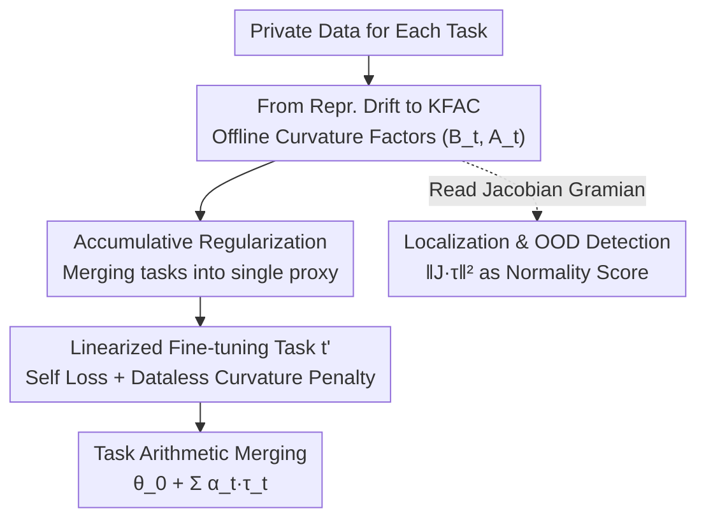

# Dataless Weight Disentanglement in Task Arithmetic via Kronecker-Factored Approximate Curvature

**Conference**: ICLR 2026  
**arXiv**: [2602.17385](https://arxiv.org/abs/2602.17385)  
**Code**: [https://github.com/aimagelab/mammoth](https://github.com/aimagelab/mammoth)  
**Area**: AI Safety / Model Editing  

## TL;DR
This work adeptly combines the classical theory of curvature approximation (KFAC) with the practical requirements of task arithmetic, proposing a weight disentanglement regularization method that requires no external data. Theoretical derivation is clear, following a smooth logical chain: representation drift regularization $\to$ Jacobian Gramian $\to$ GGN $\to$ KFAC. Experiments cover various model scales across vision and language, providing practical robustness analysis for the $\alpha$ hyperparameter. Limitations include the $O(d^2)$ storage overhead of KFAC for large models and the performance gap compared to data-dependent methods in text domains.

## Rating

⭐⭐⭐⭐

This work adeptly combines the classical theory of curvature approximation (KFAC) with the practical requirements of task arithmetic, proposing a weight disentanglement regularization method that requires no external data. Theoretical derivation is clear, following a smooth logical chain: representation drift regularization $\to$ Jacobian Gramian $\to$ GGN $\to$ KFAC. Experiments cover various model scales across vision and language, providing practical robustness analysis for the $\alpha$ hyperparameter. Limitations include the $O(d^2)$ storage overhead of KFAC for large models and the performance gap compared to data-dependent methods in text domains.

---

## Background & Motivation

### Background

Task Arithmetic enables the merging of multi-task capabilities by fine-tuning a base model to generate task vectors $\boldsymbol{\tau}_t = \boldsymbol{\theta}_t^{\star} - \boldsymbol{\theta}_0$, followed by a linear combination $\boldsymbol{\theta}_0 + \sum_t \alpha_t \boldsymbol{\tau}_t$. This approach requires no additional training and supports cross-domain or even cross-backbone knowledge reuse, offering significant flexibility and scalability.

### Limitations of Prior Work

Naive linear combinations lead to cross-task interference—adding a new task vector modifies shared representations and disrupts existing tasks, causing performance degradation in the merged model. To mitigate interference, it is necessary to promote weight disentanglement, ensuring task vectors only affect input space regions relevant to their respective tasks.

### Key Challenge

Existing representation drift regularization methods (e.g., $\tau$Jp) effectively promote weight disentanglement but require access to the training data of other tasks. This is infeasible in scenarios with privacy constraints, decentralized training, or non-shareable data, contradicting the modular spirit of task arithmetic.

### Ours

Proposed TAK (Task Arithmetic with KFAC regularization): Under a linearized fine-tuning framework, representation drift regularization is transformed into a quadratic form of the Jacobian Gramian, which is a specific instance of the Generalized Gauss-Newton (GGN) matrix. Leveraging KFAC to approximate GGN, pre-computed Kronecker factors can be used as a data-free regularization term. Furthermore, an accumulative regularization strategy is proposed to merge multi-task KFAC factors into a single proxy, achieving $O(1)$ complexity relative to the number of tasks.

---

## Method

### Overall Architecture

TAK decomposes the objective "ensure new task vectors do not disrupt old task representations" into two decoupled steps: first, offline pre-computation of KFAC curvature factors $\{(\boldsymbol{B}_t^l, \boldsymbol{A}_t^l)\}_l$ on each task's private data as a compact proxy for "sensitive directions"; second, during linearized fine-tuning, using these factors to construct a regularization term that requires no data from other tasks, constraining the current task vector away from directions causing cross-task interference. The total objective is:

$$\min_{\boldsymbol{\tau}_{t'}} \mathcal{L}_{\mathcal{D}_{t'}}(\boldsymbol{\tau}_{t'}) + \beta \sum_{t \neq t'} \lambda_t \boldsymbol{\tau}_{t'}^\top \boldsymbol{G}_t(\boldsymbol{\theta}_0) \boldsymbol{\tau}_{t'}$$

The first term is the fine-tuning loss for task $t'$, while the second term is the curvature penalty for all other tasks $t$, with $\beta$ and $\lambda_t$ controlling intensity. Crucially, other tasks' data only appear in the offline curvature pre-computation; during regularization, they are compressed into data-free curvature factors.

### Key Designs

**1. From Representation Drift to KFAC: Replacing "Other's Data" with "Other's Curvature"**

Measuring the disruption caused by a new task vector originally requires task $t$ data, which is infeasible in privacy-constrained settings. By utilizing a linearized model $f_\text{lin}(\boldsymbol{x}, \boldsymbol{\theta}) = f(\boldsymbol{x}, \boldsymbol{\theta}_0) + \mathrm{J}_{\boldsymbol{\theta}} f(\boldsymbol{x}, \boldsymbol{\theta}_0)(\boldsymbol{\theta} - \boldsymbol{\theta}_0)$, representation drift simplifies to a clean quadratic form $\Delta_{t \to t,t'}(\boldsymbol{x}) = \alpha_{t'}^2 \| \mathrm{J}_{\boldsymbol{\theta}} f(\boldsymbol{x}, \boldsymbol{\theta}_0) \boldsymbol{\tau}_{t'} \|_2^2$. Taking the expectation over samples results in the regularization $\boldsymbol{\tau}_{t'}^\top \boldsymbol{G}_t \boldsymbol{\tau}_{t'}$. The key insight is that the Jacobian Gramian $\boldsymbol{G}_t$ is the GGN matrix under squared loss ($\nabla^2 c = \boldsymbol{I}$). Thus, KFAC can approximate the GGN for each layer as:

$$\boldsymbol{G}(\boldsymbol{\theta}^l) \approx \boldsymbol{B}^l \otimes \boldsymbol{A}^l$$

where $\boldsymbol{A}^l$ is the covariance of inputs and $\boldsymbol{B}^l$ is the covariance of output gradients. This replaces data-dependent representation comparison with offline curvature factors.

**2. Accumulative Regularization: Reducing task complexity from $O(T)$ to $O(1)$**

A naive approach scales linearly with task count $T$. This work proposes a heuristic merger of KFAC factors:

$$\boldsymbol{G}_{-t'} \approx \left(\sum_{t \neq t'} \boldsymbol{B}_t^l\right) \otimes \left(\frac{1}{T-1} \sum_{t \neq t'} \boldsymbol{A}_t^l\right)$$

This allows a single proxy regardless of task count. Although this introduces error, the theoretical upper bound $\|E\|_F \leq T \sigma_A \sigma_B$ suggests the approximation is effective when KFAC factors across tasks are similar—a condition naturally met by sharing a pre-trained backbone.

**3. Task Localization and OOD Detection: A "Free Normality Score"**

The term $\| \mathrm{J}_{\boldsymbol{\theta}} f(\boldsymbol{x}, \boldsymbol{\theta}_0) \boldsymbol{\tau}_t \|_2^2$ serves as a "normality score" for input $\boldsymbol{x}$ relative to task $t$. The penalty suppresses this quadratic form for OOD inputs, localizing task vector influence to its own input subspace and reducing cross-task interference.

---

## Key Experimental Results

### Main Results: 8 Vision Task Addition

| Method | Dataless | $\alpha$ | ViT-B/32 (Abs.) | ViT-B/16 (Abs.) | ViT-L/14 (Abs.) |
|------|---------|---------|-----------------|-----------------|-----------------|
| Pre-trained | - | - | 48.4% | 55.4% | 65.0% |
| Linear FT | - | 1.0 | 76.7% | 80.2% | 88.0% |
| $\tau$Jp | ✗ | 1.0 | 85.0% | 88.2% | 90.9% |
| Diag. GGN | ✓ | 1.0 | 80.1% | 82.9% | 87.9% |
| **TAK (Ours)** | **✓** | **1.0** | **85.8%** | **88.3%** | **91.6%** |
| $\tau$Jp | ✗ | Best | 85.6% | **88.6%** | 91.1% |
| **TAK (Ours)** | **✓** | **Best** | **86.0%** | 88.3% | **91.6%** |

TAK matches or exceeds the data-dependent $\tau$Jp method while being dataless, achieving near-optimal performance at $\alpha=1.0$.

### Ablation Study

| Analysis Dimension | Key Result |
|---------|---------|
| Task Unlearning | Target task accuracy drops to **3.4** (ViT-B/32), while control task retains **62.4%** |
| Accumulative vs Naive | Gap < 0.3 on ViT-B/16, validating the merge strategy |
| KFAC Sample Size | Performance saturates at 128-256 samples |
| Monte Carlo Sampling | Best at 1-2 samples; more samples degrade performance |
| KFAC Compression | Block-8 strategy saves 87% memory with ~1 point drop |
| Training Overhead | Pre-computation of all factors takes only 3.9 mins (MC=1) |
| Language Tasks (T5-base) | TAK: 78.7 Abs. / 98.9 Norm.; $\tau$Jp: **81.3%** / **100** |

---

## Limitations & Future Work

**Pros**:
- Rigorous theoretical derivation linking representation drift to GGN/KFAC.
- Dataless approach satisfies privacy and modularity constraints.
- Highly robust to $\alpha$, eliminating the need for hyperparameter search.
- Comprehensive evaluation across vision and language domains.
- Accumulative strategy scales to arbitrary tasks with $O(1)$ complexity.

**Cons**:
- KFAC storage scales quadratically with layer width, potentially bottlenecking large models.
- Gap remains compared to data-dependent $\tau$Jp in text domains (T5-base).
- Linearization assumption lacks strict theoretical guarantees for non-linear cases, despite empirical success.
- Applicability to Parameter-Efficient Fine-Tuning (e.g., LoRA) is not yet explored.

## Highlights & Insights
- The method design is simple yet effective, with a clear core mechanism.
- Experimental verification is comprehensive, backed by thorough ablation analysis.
- Provides a novel perspective on key issues in the field.

## Limitations & Future Work
- Generalizability under specific conditions requires further verification.
- Computational efficiency and scalability can be further optimized.
- Combining with more related methodologies is worth exploring.

## Related Work & Insights
- **vs Representative Methods**: Unique contributions in design, complementing existing works.
- **vs Traditional Methods**: Achieves significant improvements in key metrics compared to traditional schemes.
- **Insights**: The technical roadmap provides a valuable reference for future research.

<!-- RELATED:START -->

## Related Papers

- [\[ICLR 2026\] WARP: Weight Teleportation for Attack-Resilient Unlearning Protocols](warp_weight_teleportation_for_attack-resilient_unlearning_protocols.md)
- [\[ICLR 2026\] SCOPED: Score–Curvature Out-of-Distribution Proximity Evaluator for Diffusion](scoped_scorecurvature_out-of-distribution_proximity_evaluator_for_diffusion.md)
- [\[ICLR 2026\] Toward Enhancing Representation Learning in Federated Multi-Task Settings](toward_enhancing_representation_learning_in_federated_multi-task_settings.md)
- [\[ICLR 2026\] Towards a Certificate of Trust: Task-Aware OOD Detection for Scientific AI](towards_a_certificate_of_trust_task-aware_ood_detection_for_scientific_ai.md)
- [\[ICLR 2026\] LiteGuard: Efficient Task-Agnostic Model Fingerprinting with Enhanced Generalization](liteguard_efficient_task-agnostic_model_fingerprinting_with_enhanced_generalizat.md)

<!-- RELATED:END -->
