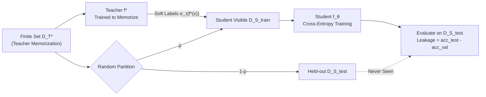

# Dataset Distillation for Memorized Data: Soft Labels can Leak Held-Out Teacher Knowledge

**Conference**: ICLR 2026  
**OpenReview**: [https://openreview.net/forum?id=lmVfTPQF3a](https://openreview.net/forum?id=lmVfTPQF3a)  
**Code**: [https://github.com/SPOC-group/dataset-distillation-memorization](https://github.com/SPOC-group/dataset-distillation-memorization)  
**Area**: AI Security / Privacy · Knowledge Distillation · Learning Theory  
**Keywords**: Soft Label Distillation, Memorization Leakage, Privacy Risk, Teacher Function Recovery, Identifiability Threshold, Temperature  

## TL;DR
This paper systematically demonstrates that in dataset distillation, by training a student only on a teacher's **soft labels**, the student can achieve accuracy far exceeding random chance on "memorized data" that it has never seen and cannot infer through generalization. This represents both an efficient pathway for transferring memorized knowledge and a hidden privacy leakage channel, precisely regulated by sample complexity and softmax temperature.

## Background & Motivation
- **Background**: Knowledge distillation (KD) and dataset distillation rely on soft labels to convert teacher logits into probability distributions for student matching. This has long been considered effective because soft labels encode latent structures in the data distribution (Hinton's "dark knowledge").
- **Limitations of Prior Work**: Modern neural networks not only generalize but also **memorize** individual facts or associations. There is a lack of controllable and quantifiable characterization of whether soft labels carry this memorized information and whether students can inherit it. Previous studies mostly discussed privacy leakage from an "attack" perspective; memorization transfer under benign distillation remains unexplored.
- **Key Challenge**: Memorization requires the model to retain labels of individual samples, while privacy requires weak dependence on single points. These are naturally in conflict, yet they are rarely analyzed in the same framework to determine when memorized labels leak from teacher to student.
- **Goal**: Using small models with precise control and measurement, this work aims to answer two questions: Do teacher soft labels encode memorized knowledge? If so, can students pick up this non-trivial information?
- **Core Idea**: **[Controlled Memorization Isolation]** A teacher is trained to memorize a finite dataset $D^T_\star$, which is partitioned into a student-visible $D^S_{train}$ and a completely held-out $D^S_{test}$. The student is trained only using teacher soft labels and evaluated on $D^S_{test}$. Specifically, **purely random i.i.d. data** (where inputs and labels are independent and generalization is a priori impossible) is used to ensure that "teacher fitting success $\iff$ pure memorization," thereby completely decoupling memorization transfer from structural generalization.

## Method

### Overall Architecture
The teacher $f_\star$ is first trained on a finite set $D^T_\star=\{(x_\mu,y_\mu)\}_{\mu=1}^n$ until memorization is achieved ($\mathrm{acc}^T_\star > \mathrm{acc}^T_{val}$). $D^T_\star$ is randomly partitioned into disjoint sets $D^S_{train}$ (proportion $\rho$) and $D^S_{test}$. The student is trained on $D^S_{train}$ using teacher soft labels $\hat y_\mu=\sigma_\tau(f_\star(x_\mu))$ with cross-entropy until convergence, then evaluated on the held-out $D^S_{test}$ and an independent validation set $D_{val}$. Three data scenarios are used for progressive validation: (i) Small Transformers on modular arithmetic tasks; (ii) Logistic regression/ReLU MLP on purely random i.i.d. data (including theoretical thresholds); (iii) GPT-2 fine-tuned on random sequences (Appendix).

### Key Designs

**1. Soft Label Training and Temperature Control: Interpolating between "fitting the teacher function" and "learning only ground-truth labels."** The student uses temperature-adjusted teacher soft labels rather than ground-truth one-hot $y_\mu$ for supervision:

$$\hat y_\mu = \sigma_\tau(f_\star(x_\mu)),\quad \sigma_\tau(z)_k=\frac{\exp(z_k/\tau)}{\sum_j \exp(z_j/\tau)}$$

Temperature $\tau$ serves as the master switch for leakage: as $\tau\to 0$, soft labels degenerate into one-hot labels, where the student only learns the ground-truth class and decouples from the teacher function (on modular addition tasks, the student may even surpass the teacher and generalize to $D_{val}$). As $\tau$ increases, soft labels carry more geometric information from teacher logits, and the student tends to **functionally match the teacher** (recovering teacher predictions on all inputs, including held-out memorized data). While this yields higher data efficiency and faster convergence, it also maximizes the transfer of teacher-specific memorized information. In other words, temperature treats soft labels as a regularizer, interpolating between "reproducing the teacher function" and "recovering ground-truth training labels."

**2. Held-out Memorization Leakage Measurement: Isolating "leakage" from "generalization" using the accuracy gap between $D^S_{test}$ and $D_{val}$.** Student accuracy is **always calculated using ground-truth labels** (not teacher predictions). The criterion is: when $\mathrm{acc}^S_{test} > \mathrm{acc}^S_{val}$, the student's performance on held-out data exceeds what would be expected from independent data (which for the teacher is equivalent to random guessing), meaning the gain must come from teacher soft labels leaking specific samples from $D^T_\star$. Under purely random i.i.d. data, $\mathrm{acc}^T_{val}=\mathrm{acc}^S_{val}=1/c$ (random guessing); thus, any $\mathrm{acc}^S_{test}>1/c$ is clean evidence of memorization leakage that cannot be explained by structure—this is the value of using random data to isolate memorization.

**3. Closed-form Capacity and Identifiability Threshold for Logistic Regression: Characterizing different leakage phases with three critical lines.** For binary logistic regression, student weights are solved using pseudo-inverse on teacher logits $\hat W = X^+ z$ (least squares). In the high-dimensional proportional limit with sample complexity $\alpha=n/d$, three thresholds are derived:

- **Teacher Memorization Capacity** $\alpha \le \alpha^T_{label}$: The teacher can correctly associate all random input-label pairs. Cover’s Theorem gives $\alpha^T_{label}\le 2$ (measured $\approx1.96$ at $d{=}1600$, close to the asymptotic value).
- **Identifiability Threshold** $\alpha \ge \alpha^S_{id}(\rho)=1/\rho$: When the input matrix $X$ is invertible, the student **functionally matches the teacher** in an MSE sense via logits, thereby recovering even the held-out samples.
- **Student Memorization Capacity** $\alpha \le \alpha^S_{label}(\rho)$: Whether the student can fit all input-logit pairs in $D^S_{train}$.

These lines partition the $(\alpha, \rho)$ plane into phases: no/weak leakage ($\mathrm{acc}^S_{test}<0.55$), weak leakage ($0.55\sim0.99$), full recovery of held-out memorization ($\ge0.99$), and a region where the teacher itself fails to memorize beyond $\alpha^T_{label}$. The conclusion is stark: as long as $\alpha$ and $\rho$ are large enough to cross $\alpha^S_{id}$, the student can "guess" almost all of the held-out data by recovering teacher weights $W$, even if 20% of the data is withheld.

**4. Phase Transitions from Linear to ReLU MLP.** For single-hidden-layer ReLU MLPs, the "soft label memorization solution" and the "teacher matching solution" are **distinct** solutions. Only after the teacher becomes identifiable does the student undergo a sudden jump from the former to the latter, resulting in a sharp phase transition in accuracy. This indicates that leakage is not an artifact of linear models but a universal phenomenon across network capacities, architectures (Transformer/MLP/GPT-2), and data compositions, often manifesting as sharp transitions.

## Key Experimental Results

### Main Results: Structured Data (Modular Addition Transformer, $p=113$, Teacher uses 30% of data)

| Teacher State | Temperature $\tau$ | Phenomena (as $\rho$ increases) |
|---|---|---|
| ① Shallow Memorization | $\tau=10$ | At small $\rho$, $\mathrm{acc}^S_{test} > \mathrm{acc}^S_{val}$ (leakage); as $\rho$ increases, $\mathrm{acc}^S_{test}\to1.0$, $\mathrm{acc}^S_{val}\to \mathrm{acc}^T_{val}$ |
| ② Deep Memorization | $\tau=10$ | Similar but steeper phase transition; student matches the teacher's low $\mathrm{acc}^T_{val}$ even with 5× training time, failing to learn structures missed by the teacher |
| ③ Generalized | $\tau=10$ | Student generalizes to $D_{val}$ almost instantly, requiring much less data |
| Any | $\tau=0.1$ | Student decouples from teacher: fails to learn or generalizes late if data is insufficient; can surpass teacher |

Note: $\mathrm{acc}^S_{train}$ remains 100% across all $\rho, \tau$.

### Theoretical Validation: Binary Logistic Regression ($d=1600$)

| Threshold | Value | Meaning |
|---|---|---|
| $\alpha^T_{label}$ | $\approx1.96$ (→2) | Teacher memorization capacity (Cover's Theorem) |
| $\alpha^S_{id}(\rho{=}0.8)$ | $\approx1.26$ | Crossing this results in $\mathrm{acc}^S_{test}\ge0.99$, fully recovering held-out memorization |
| $\alpha^S_{label}(\rho)$ | Depends on $\rho$ | Student capacity to fit teacher-supervised labels |

### Key Findings
- Soft labels indeed encode and transmit memorized knowledge: students can reach **non-trivial or even perfect** accuracy on held-out data that they have never seen and that is inherently non-generalizable.
- **High Temperature = Higher Data Efficiency + Faster Convergence + Greater Memorization Leakage**; these are bound together as the core knobs of the privacy tradeoff.
- An un-generalized teacher combined with high temperature will **prevent** the student from learning latent structures (the student is "locked" into the teacher's memorization function), revealing that distillation can both preserve and erase information.
- The phenomenon is robust across architectures: observed consistently in Logistic Regression (closed-form), ReLU MLP (phase transition), Transformer, and fine-tuned GPT-2.

## Highlights & Insights
- Using **purely random i.i.d. data**—a minimalist setup previously unstudied in distillation literature—cleanly isolates "memorization transfer" from "structural generalization," making leakage a falsifiable empirical signal.
- The vague concept of "dark knowledge" is mapped onto concrete, **closed-form thresholds like identifiability $\alpha^S_{id}=1/\rho$**, providing a computable answer to "what exactly do soft labels leak."
- The efficient transfer of distillation and privacy leakage are unified as two sides of the same coin, with temperature serving as the continuous knob connecting them, offering direct implications for privacy governance in LLM distillation.

## Limitations & Future Work
- Analysis focuses on teacher-student pairs with matching capacities and toy tasks (Logistic Regression, single-layer MLP/Transformer); extrapolation to large-scale heterogeneous distillation requires further verification (GPT-2 is provided only as supporting evidence in the Appendix).
- Closed-form thresholds rely on high-dimensional proportional limits and linear solvability assumptions; non-linear deep networks are only characterized qualitatively through phase transitions.
- No systematic evaluation of defense mechanisms against this leakage (e.g., DP, temperature constraints, hiding held-out labels) was provided, which is a natural direction for future work.

## Related Work & Insights
- **Distillation Theory**: Phuong & Lambert (2019) provided conditions for students functionally matching teachers in linear cases; this work thresholds and extends it to memorized data. Saglietti & Zdeborová (2022) studied regularization transfer where the teacher is a generative model rather than one memorizing fixed data.
- **Memorization**: Zhang et al. (2017) proved deep networks can fit random labels; this paper asks "can this memorized information be transferred via soft labels."
- **Privacy**: Echoes the phenomenon in Cloud et al. (2025) where student LLMs fine-tuned on irrelevant random data sampled from a teacher inherit hidden traits; this work provides a mechanistic explanation in toy models.

## Rating
- **Novelty**: ⭐⭐⭐⭐⭐ — First to isolate and quantify memorization leakage of soft labels under controlled pure-memorization settings, mapping dark knowledge to closed-form identifiability thresholds.
- **Experimental Thoroughness**: ⭐⭐⭐⭐ — Includes closed-form LR, plus MLP/Transformer/GPT-2 cross-validation, though scales are toy-like and defense evaluation is missing.
- **Writing Quality**: ⭐⭐⭐⭐ — Clear motivation, tight integration of theory and empirical results, and effective interpretation of phase transition diagrams.
- **Value**: ⭐⭐⭐⭐⭐ — Provides a unified, actionable understanding (via the temperature knob) of privacy risks vs. efficient transfer in distillation, relevant to LLM governance.

<!-- RELATED:START -->

## Related Papers

- [\[ICLR 2026\] FERD: Fairness-Enhanced Data-Free Adversarial Robustness Distillation](ferd_fairness-enhanced_data-free_adversarial_robustness_distillation.md)
- [\[ICML 2026\] Same Target, Different Basins: Hard vs. Soft Labels for Annotator Distributions](../../ICML2026/ai_safety/same_target_different_basins_hard_vs_soft_labels_for_annotator_distributions.md)
- [\[ICML 2026\] Fair Dataset Distillation via Cross-Group Barycenter Alignment](../../ICML2026/ai_safety/fair_dataset_distillation_via_cross-group_barycenter_alignment.md)
- [\[ICLR 2026\] Bridging Fairness and Explainability: Can Input-Based Explanations Promote Fairness in Hate Speech Detection?](bridging_fairness_and_explainability_can_input-based_explanations_promote_fairne.md)
- [\[ICLR 2026\] AP-OOD: Attention Pooling for Out-of-Distribution Detection](ap-ood_attention_pooling_for_out-of-distribution_detection.md)

<!-- RELATED:END -->
