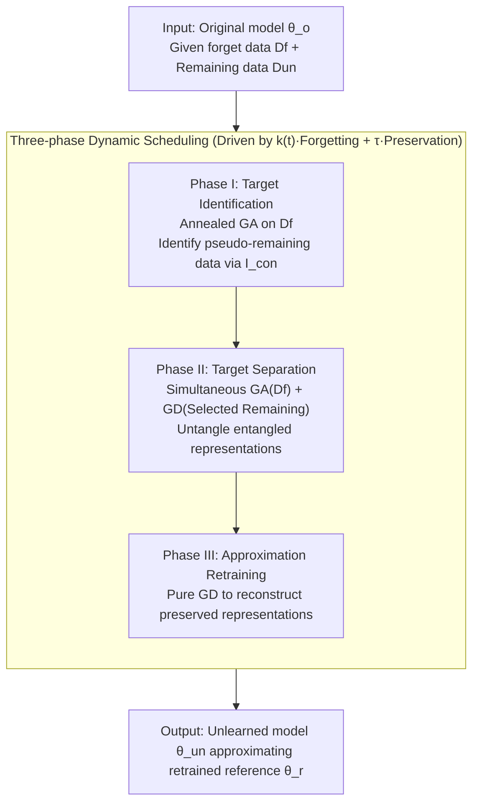

# Decoupling the Class Label and the Target Concept in Machine Unlearning

**Conference**: ICLR 2026  
**OpenReview**: [https://openreview.net/forum?id=Xpj0yeMhpz](https://openreview.net/forum?id=Xpj0yeMhpz)  
**Code**: https://github.com/tmlr-group/TARF  
**Area**: AI Security / Machine Unlearning  
**Keywords**: Machine Unlearning, Class Unlearning, Target Concept Decoupling, Representational Gravity, Annealed Unlearning

## TL;DR
This paper points out that traditional class unlearning assumes "class label = target concept to be removed," whereas real-world deletion requests often involve a mismatch between the two. To address this, the authors decouple forget data, model output, and target concepts into three label domains, defining target/model/data mismatch tasks. They propose the TARF framework, which utilizes "representational gravity" to identify data sharing the same concept hidden in the remaining set, and employs a three-phase dynamic objective (annealed gradient ascent + target-aware gradient descent) to precisely extract the target concept and approximate the retrained model.

## Background & Motivation
**Background**: Machine unlearning aims to eliminate the influence of specific training data from a trained model, making its behavior approximate a reference model $\theta_r$ "retrained from scratch on remaining data." Since exact retraining is computationally expensive, approximate unlearning is mainstream. At the "class granularity," existing methods (FT fine-tuning on remaining data to trigger catastrophic forgetting, GA gradient ascent on forget data, L1-sparse, SalUn, SCRUB, etc.) have successfully managed to unlearn "entire training categories."

**Limitations of Prior Work**: Almost all these methods rely on an implicit assumption—that the **"target concept" to be unlearned exactly matches a pre-trained class label**. However, real-world deletion requests often violate the classification system of the pre-trained task: a request might be a semantic subset of a category (e.g., deleting "Golden Retriever" while keeping "Dog") or a larger semantic cluster across multiple categories (e.g., conservatively deleting the entire "Person" concept for copyright/reputational reasons). In such cases, the "class label" fails to accurately characterize the "target concept."

**Key Challenge**: When label domains are mismatched, two types of failures occur in the representation space. First, when the **target concept is finer than the model categories** ($\mathcal{L}_T \prec \mathcal{L}_M$, where the model is trained on coarser superclasses), the target concept and the "affected remaining data" of the same superclass are highly entangled in the feature space, causing the unlearning target to "overflow" and affect parts that should be preserved. Second, when the **given forget data is only a subset of the target concept** ($\mathcal{L}_D \prec \mathcal{L}_T$), "pseudo-remaining data" that belong to the target concept but are not labeled as such remain in the set; focusing unlearning only on the given data leaves residues.

**Goal**: To decouple "class labels" from "target concepts," systematically characterize mismatch scenarios, and design a general unlearning framework that can **precisely remove only the target concept while preserving the rest** under mismatch conditions.

**Key Insight**: The authors start from the "representational dynamics" of unlearning—observing that during gradient ascent, the closer two clusters of data are in the representation space, the more synchronously their losses change (a "gravitational" co-movement). This law not only explains why mismatch leads to failure but also provides a tool: gravitational effects can be used to **identify** pseudo-remaining data in the remaining set that share similar dynamics with the forget data, suggesting that entangled representations require bidirectional operations to be separated.

**Core Idea**: Model the mismatch tasks using the relative relationships between three label domains (forget data $\mathcal{L}_D$, model output $\mathcal{L}_M$, and target concept $\mathcal{L}_T$), and then employ a three-phase dynamic objective consisting of "Representational Gravity + Annealed Forgetting + Target-aware Preservation" to identify, separate, and finally approximate the retrained model.

## Method

### Overall Architecture
The input to TARF (TARget-aware Forgetting) is a pre-trained model $\theta_o$, user-provided forget data $D_f$, and remaining data $D_{un}=D\setminus D_f$; the output is an unlearned model $\theta_{un}^*$ that approximates the reference $\theta_r$ retrained from scratch on the true remaining data $D_r$. The difficulty lies in the fact that when the target concept $D_t$ is inconsistent with the provided $D_f$, $D_{un}$ contains both the true remaining data $D_r$ and "pseudo-remaining data" $D_{fr}=D_t\setminus D_f$ belonging to the target concept. Additionally, in model mismatch, same-class data contains "affected remaining data" $D_{ar}$.

TARF organizes the entire unlearning process into a **unified dynamic objective** (annealed forgetting + target-aware preservation), which naturally splits into three phases over training time $t$: first, using pure gradient ascent to construct dynamic information and identify pseudo-remaining data via representational gravity (Identification); second, simultaneous gradient ascent + selective gradient descent to decouple entangled target concepts from preserved parts (Separation); and finally, gradient descent only on selected remaining data to approximate retraining and prevent over-forgetting (Approximation).

### Key Designs

**1. Label Domain Mismatch Modeling: Decoupling "Class Label" and "Target Concept"**

The most critical conceptual contribution of this paper is the separation of two previously conflated concepts, characterizing an unlearning request through three label domains: the domain of the forget data $\mathcal{L}_D$, the model output domain $\mathcal{L}_M$, and the target concept domain $\mathcal{L}_T$. Two types of inter-domain relationships are introduced—"match" $L_1 = L_2$ and "sub-domain" $L_1 \prec L_2$ (each label in $L_1$ can be covered by a label in $L_2$, but not vice versa). Since reported forget data is always contained within the target concept ($\mathcal{L}_D \preceq \mathcal{L}_T$), four types of tasks are enumerated: **Full Match** $\mathcal{L}_D=\mathcal{L}_M=\mathcal{L}_T$ (traditional scenario), **Target Mismatch** $\mathcal{L}_D=\mathcal{L}_M \prec \mathcal{L}_T$ (model trained by class, but request is to delete a larger "person" concept), **Model Mismatch** $\mathcal{L}_D=\mathcal{L}_T \prec \mathcal{L}_M$ (model trained by superclass, but request is to delete "boy/girl" within it), and **Data Mismatch** $\mathcal{L}_D \prec \mathcal{L}_T=\mathcal{L}_M$ (model trained by superclass, given data is only part of the target concept). This characterization transforms vague mismatch requests into controllable, experimental settings and directly exposes data partitions like $D_{fr}$ and $D_{ar}$ ignored by traditional methods.

**2. Representational Gravity: Using Unlearning Dynamics to Find "Pseudo-remaining Data"**

The root cause of mismatch failure is representation layer entanglement or lack of disentanglement. The authors quantify this through a provable dynamic law. Under the representation similarity hypothesis (middle layer representation $h(x)$, where $\ell_h$ is Lipschitz smooth with constant $C_\ell$), during gradient ascent on subset $s_1$, $\theta_{t+1}=\theta_t+\nabla L_{s_1}(\theta_t)$, the evolution of the loss difference between two subsets satisfies:

$$\Delta L_{s_1,s_2}(\theta_{t+1}) \le \big(L_{s_1}(\theta_t)-L_{s_2}(\theta_t)\big) + \eta\,\lambda_{\max}(J_{\theta_t})\,C_\ell\,\mathbb{E}\,d_h(x_1,x_2)\cdot\|\nabla L_{s_1}(\theta_t)\| + O(\eta^2)$$

where $\lambda_{\max}(J_\theta)$ is the maximum eigenvalue of the Jacobian $J_\theta=\partial h(x)/\partial\theta$, and $d_h$ is the representational distance. The intuitive meaning ("gravitational effect"): as $t\to 0$ and $L_{s_1}-L_{s_2}\to 0$, the dominant term is proportional to the **representational distance** between the two clusters—the closer they are, the more unlearning one cluster will pull the other cluster into synchronous change; if far apart, there is little movement. Based on this, the authors define the **representational gravity** metric to identify pseudo-remaining data:

$$I_{con}(x,y,\theta)=\big|\ell(f_\theta(x),y)-\ell(f_{\theta_t}(x),y)\big|$$

This measures the change in loss/accuracy of a sample relative to the original model during the early stages of unlearning (small $t$). It reflects how "close" a sample is to the data being unlearned. Pseudo-remaining data belonging to the target concept will show significant accuracy drops due to dynamic similarity to $D_f$, allowing them to be selected by $I_{con}$ (experiments show accuracy drops for target concept categories are significantly larger than for irrelevant ones). This turns the problem of finding hidden concept data in the remaining set into a computable ranking problem.

**3. Annealed Forgetting + Target-aware Preservation: A Unified Dynamic Objective**

TARF writes unlearning and preservation into a single time-varying loss (Eq. 3):

$$\mathcal{L}_{TARF}=k(t)\cdot\Big(-\frac{1}{|D_f|}\sum_{(x,y)\sim D_f}\ell(f(x),y)\Big)+\frac{1}{|D_{un}|}\sum_{(x,y)\sim D_{un}}\ell(f(x),y)\cdot\tau(x,y,t)$$

The first term is **annealed forgetting** (GA on $D_f$), and the second is **target-aware preservation** (weighted GD on remaining data). Two dynamic hyperparameters are key:

$$k(t)=\max\Big(\frac{k\,(T-t-t_0)}{T},\,0\Big),\qquad \tau(x,y,t)=\begin{cases}0 & I_{con}(x,y,\theta_{t_1})>\beta \text{ or } t<t_1\\ 1 & I_{con}(x,y,\theta_{t_1})<\beta \text{ and } t\ge t_1\end{cases}$$

$k(t)$ allows the unlearning intensity to **anneal/decay** over training and reach zero at $t_0$ to prevent destroying the model with excessive unlearning; $\tau$ is a **gate**, incorporating a remaining sample into the preservation term only if its gravity $I_{con}$ is below threshold $\beta$ (meaning it is "hard to affect, truly should be preserved") and the start time $t_1$ has passed. The threshold $\beta$ is estimated via request information and loss/accuracy change rankings. The overall objective ensures $\mathcal{L}_f(k)\xrightarrow{t\to T}0$ and $\mathcal{L}_u(\tau)\xrightarrow{t\to T}\mathcal{L}_{retrain}$, such that $\mathcal{L}_{TARF}$ asymptotically approaches the retraining objective. This adds a layer over old methods: it explicitly performs separation at the representation layer rather than relying on a one-sided objective to force result under mismatch.

**4. Three-phase Dynamic Scheduling: Identification → Separation → Approximation**

The values of $k(t)$ and $\tau$ naturally divide the unified objective into three phases. **Phase I: Target Identification** ($t<t_1$, where $\tau=0$): The objective reduces to the annealed forgetting term $\mathcal{L}_{\text{Phase-I}}=k(t)\cdot(-\frac{1}{|D_f|}\sum\ell)$; pure gradient ascent builds global dynamic information to identify pseudo-remaining data $D_{fr}$ (addresses "identification deficit" in data/target mismatch). **Phase II: Target Separation** ($t_1\le t<t_0$): Simultaneous gradient ascent on $D_f$ and gradient descent on selected remaining data; bidirectional operations disentangle target concepts and affected remaining data $D_{ar}$ (addresses "decomposition deficit" in model mismatch, restoring the accuracy gap between RA and UA to retrained reference levels). **Phase III: Approximation Retraining** ($t\ge t_0$): The objective becomes $\mathcal{L}_{\text{Phase-III}}=\frac{1}{|D_{un}|}\sum\ell\cdot\tau$; pure gradient descent on selected preserved data reconstructs representations and approximates the retrained reference, preventing "over-deconstruction" from Phase II. The authors emphasize that these three phases are derived from a unified framework rather than a pieced-together pipeline.

### Loss & Training
The core objective is Eq. 3. Hyperparameters $k$, $t_0$, $t_1$, and $\beta$ control unlearning intensity, unlearning end time, preservation start time, and pseudo-remaining data selection threshold, respectively. The backbone uses ResNet-18, instantiating four types of tasks on CIFAR-10/100 using both original and superclass label sets.

## Key Experimental Results

### Main Results
The evaluation aims to "approximate the retrained reference" using UA (Unlearning Accuracy), RA (Remaining Accuracy), TA (Test Accuracy), and MIA (Member Inference Attack), summarized by the average difference from retraining $\text{Gap}=\frac{1}{4}\sum|R_{\theta_{un}}-R_{\theta_r}|$ (lower is better). Below is the Gap (%, lower is better):

| Task | Dataset | GA | SCRUB | SalUn | TARF (Ours) |
|------|--------|-----|-------|-------|-----------|
| Full Match | CIFAR-10 | 2.88 | 1.03 | 4.00 | **1.01** |
| Full Match | CIFAR-100 | 3.01 | 0.71 | 9.10 | 1.11 |
| Model Mismatch | CIFAR-10 | 45.68 | 3.61 | 43.69 | **2.90** |
| Model Mismatch | CIFAR-100 | 39.68 | 2.45 | 25.15 | **1.21** |
| Target Mismatch | CIFAR-10 | 20.80 | 25.53 | 25.38 | **1.23** |
| Target Mismatch | CIFAR-100 | 8.86 | 29.90 | 27.35 | **0.21** |
| Data Mismatch | CIFAR-10 | 5.89 | 46.76 | 24.75 | **0.96** |
| Data Mismatch | CIFAR-100 | 2.43 | 45.54 | 36.89 | 1.17 |

Traditional methods perform adequately on Full Match, but Gaps soar to 20~48 in mismatch tasks. TARF achieves optimal or near-optimal results across all four task types, with particularly significant advantages in mismatch tasks (e.g., only 0.21 Target Mismatch Gap on CIFAR-100). On ImageNet-1k, TARF also achieved satisfactory Gaps for Full Match and Target Mismatch (deleting three classes belonging to "fish").

### Ablation Study
Table 2 provides fine-grained evaluation under Model Mismatch, splitting "subclasses to forget (UA-F)" and "subclasses to preserve (UA-R)" within a superclass:

| Configuration | Description | Gap |
|---------------|-------------|-----|
| Full TARF (Three-phase) | Identification + Separation + Approximation | **1.36** (CIFAR-100 Superclass) |
| GA only | Missing Identification/Separation/Approximation | 47.38 |
| SCRUB | Strongest baseline | 2.65 |
| w/o Phase III | Identification + Separation only | "Over-deconstruction" occurs; accuracy gap exceeds reference |

### Key Findings
- **Representational distance dominates unlearning dynamics**: tSNE + loss curves show that data closer in representation to forget data undergo more violent changes in loss/accuracy, verifying the "gravitational effect" of Theorem 3.2.
- **Mismatch causes traditional methods to fail both ways**: Methods relying on one-sided objectives either fail to unlearn cleanly due to "lack of representation" (FT keeps RA but high UA) or over-forget due to "lack of decomposition" (GA pushes UA to minimum at the cost of RA).
- **Phase III is indispensable**: The bidirectional untangling in Phase II can overshoot (accuracy gap larger than retraining). Pure preservation in Phase III is required to reconstruct representations and approximate the retrained reference.

## Highlights & Insights
- **Systematizing a neglected assumption into a full problem space**: Using three domains $\mathcal{L}_D/\mathcal{L}_M/\mathcal{L}_T$ and sub-domain relationships, it formalizes the intuitive notion that "Class Label ≠ Target Concept" into four controllable tasks, providing a new benchmark dimension for unlearning research.
- **Translating theoretical metrics into algorithmic components**: Representational gravity $I_{con}$ is both a product of Theorem 3.2 and the basis for the $\tau$ gate. The link between theory and method is clean and transferable to any scenario requiring the identification of hidden concept samples.
- **Annealed + Gated dynamic objective as a template**: Compressing "identify, separate, approximate" into a single time-varying loss with $k(t)$ and $\tau(x,y,t)$ avoids manual multi-stage switching, a strategy applicable to continual learning or concept erasure.

## Limitations & Future Work
- **Primary validation on image classification**: Core experiments focus on category unlearning in CIFAR/ImageNet. While TOFU/ImageNette cases are mentioned, applicability to generative models or LLM concept erasure needs more validation.
- **Hyperparameter dependency on request priors**: The selection of $\beta$, $t_0$, and $t_1$ depends on information about the request (e.g., knowing the proportion of the target concept in the remaining set). In reality, these priors may not be available.
- **Target mismatch requires known target class count**: The method for target mismatch assumes the number of target concept categories in $D_{un}$ is known. Relaxing this assumption (unknown target boundaries) would be more realistic.

## Related Work & Insights
- **vs FT / GA (Classic Approximate Unlearning)**: FT triggers catastrophic forgetting via fine-tuning on remaining data; GA uses reverse updates on forget data. Both assume $D_f=D_t$ and $D_r=D\setminus D_f$, leading to under-unlearning or over-unlearning under mismatch. TARF explicitly models mismatch and separates at the representation layer.
- **vs L1-sparse / SalUn / SCRUB (Recent SOTA)**: Strong in Full Match but still bound by the "Class = Concept" assumption. Their performance deteriorates significantly in mismatch tasks.
- **vs Influence Function methods (IU, etc.)**: Deleting single-point influence via influence functions is computationally heavy and unstable for large classes/mismatch. TARF's dynamic perspective is better suited for class/concept granularity.

## Rating
- Novelty: ⭐⭐⭐⭐⭐ Systematizes "Class Label ≠ Target Concept" into a three-domain mismatch problem space with representational gravity theory.
- Experimental Thoroughness: ⭐⭐⭐⭐ Four tasks × CIFAR/ImageNet × multiple baselines + fine-grained ablation. Less validation on non-image domains.
- Writing Quality: ⭐⭐⭐⭐ Clear progression from concept to theory to algorithm. Good visualizations; notation is slightly dense.
- Value: ⭐⭐⭐⭐⭐ Points out a long-ignored but realistic dimension for machine unlearning; both the method and benchmark are reusable.

<!-- RELATED:START -->

## Related Papers

- [\[ICLR 2026\] Label Smoothing Improves Machine Unlearning](label_smoothing_improves_machine_unlearning.md)
- [\[ICLR 2026\] Machine Unlearning under Retain–Forget Entanglement](machine_unlearning_under_retainforget_entanglement.md)
- [\[ICLR 2026\] ReTrace: Reinforcement Learning-Guided Reconstruction Attacks on Machine Unlearning](retrace_reinforcement_learning-guided_reconstruction_attacks_on_machine_unlearni.md)
- [\[ICLR 2026\] Remaining-data-free Machine Unlearning by Suppressing Sample Contribution](remaining-data-free_machine_unlearning_by_suppressing_sample_contribution.md)
- [\[ICLR 2026\] Distributional Machine Unlearning via Selective Data Removal](distributional_machine_unlearning_via_selective_data_removal.md)

<!-- RELATED:END -->
