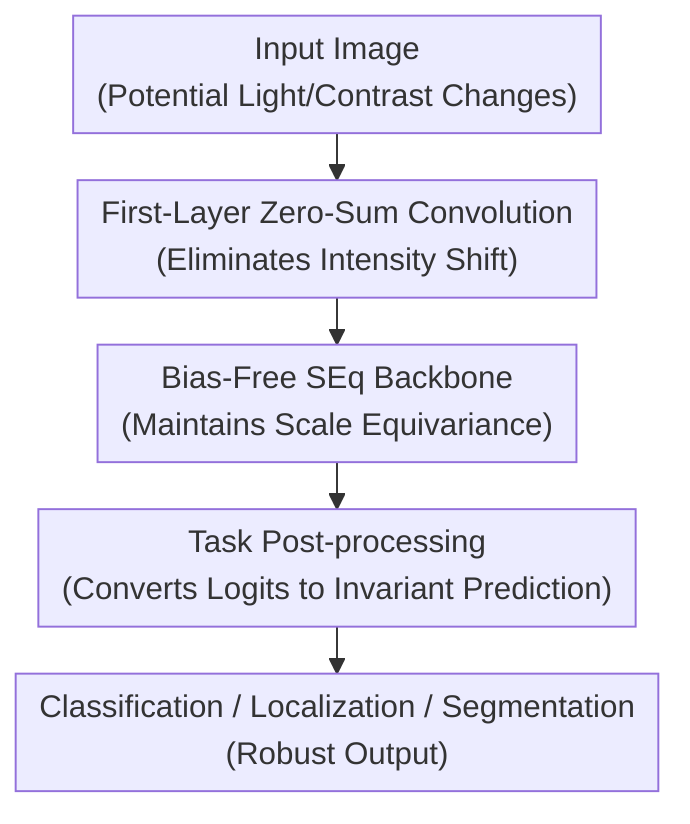

# Designing Affine-Invariant Neural Networks for Photometric Corruption Robustness and Generalization

**Conference**: ICLR 2026  
**OpenReview**: [https://openreview.net/forum?id=fhEwTOLYNZ](https://openreview.net/forum?id=fhEwTOLYNZ)  
**Code**: https://github.com/MounirMessaoudi/SEqSi  
**Area**: AI Security / Robustness & Generalization  
**Keywords**: Photometric Robustness, Affine Invariance, Equivariant Neural Networks, Biological Image Analysis, Out-of-Distribution Generalization  

## TL;DR

This paper proposes SEqSI, a CNN design that implements intensity shift invariance in the first layer and intensity scale equivariance in the subsequent backbone. Without significant computational overhead, it provides verifiable robustness to global brightness/contrast affine transformations for tasks including classification, localization, and segmentation, significantly outperforming standard networks in real-world photometric domain shifts such as Cryo-ET and microscopy.

## Background & Motivation

**Background**: Vision models perform well when the lighting, brightness, and contrast of training and testing sets are consistent. However, in real-world deployments, pixel intensities are often altered by non-semantic photometric factors. For instance, photos are affected by exposure, while medical and biological microscopy images vary due to instrument settings, reconstruction algorithms, staining intensity, and sensor saturation. Cryo-ET data, in particular, exhibits completely different intensity distributions due to varied preprocessing pipelines like WBP, CTF deconvolution, Denoising, or IsoNet correction.

**Limitations of Prior Work**: Common fixes involve photometric data augmentation or pre-input min-max / z-score normalization. While augmentation exposes models to more perturbations, it is essentially empirical coverage; non-affine perturbations, local brightness changes, or strong saturation artifacts not covered during training can still cause failure. Input normalization can counteract global affine changes but is easily disrupted by local artifacts or spatially varying brightness drifts, as normalization statistics are determined by the whole image, causing local anomalies to compress the dynamic range of normal regions.

**Key Challenge**: This paper addresses the contradiction that final task predictions typically only require invariance to photometric changes, rather than strict affine equivariance at every layer. Existing AffEq networks restrict every layer to be affine-equivariant, requiring all convolutional weights to sum to 1, removing biases, and using SortPool activation. This ensures strong guarantees but at a high cost: slower training, higher VRAM usage, and incompatibility with standard ReLU components or transfer learning. Standard CNNs are easy to train but lack formal guarantees.

**Goal**: The authors aim to design a practical network family that architecturally guarantees robustness to global intensity shifts and scaling while utilizing common convolution, ReLU, pooling, and residual backbones, covering tasks like classification, localization, and binary segmentation.

**Key Insight**: A critical observation is that brightness shift and contrast scaling can be handled separately. For scaling, as long as all linear/convolutional layers remove biases and use positively homogeneous activations like ReLU, the network naturally satisfies $f(\lambda x)=\lambda f(x)$. For shift, it is not necessary for every layer to be shift-equivariant; if the first convolutional layer's weights sum to zero, it eliminates constant brightness offsets from the input, and subsequent layers will see representations free of global shifts.

**Core Idea**: A combination of "first-layer zero-sum convolution to eliminate shift + bias-free backbone for scale equivariance + task post-processing for final invariance" replaces expensive layer-wise affine equivariance constraints.

## Method

### Overall Architecture

The SEqSI pipeline consists of three steps. First, the input image may be modified by a global photometric affine transformation $T_{\lambda,\mu}(x)=\lambda x+\mu$, where $\lambda>0$ represents contrast scaling and $\mu$ represents brightness shift. Second, the network uses a shift-invariant first convolutional layer to remove constant shifts, followed by a backbone designed entirely for scale equivariance. Third, post-processing is selected based on the task: softmax + argmax for classification/semantic segmentation, and standardized logits followed by thresholding for localization/thresholding tasks.

The three contribution nodes in this diagram correspond to the key designs: first-layer zero-sum convolution, bias-free SEq backbone, and task post-processing. Input and output serve as the task framework rather than individual design points. The theoretical guarantees of the paper center on this chain: if the input becomes $\lambda x+\mu$, the SEqSI logits satisfy $f(\lambda x+\mu)=\lambda f(x)$, meaning the shift is eliminated and scaling is transmitted linearly to the output. As long as post-processing is insensitive to positive scaling, the final prediction remains invariant.

### Key Designs

**1. First-Layer Zero-Sum Convolution: Eliminating Global Shift with Minimal Constraints**

Standard convolution adds a constant $\mu \sum_i w_i$ to the output when a constant $\mu$ is added to the input. If the convolutional kernel weights for each output channel are constrained to sum to zero, this constant offset disappears, and the output satisfies $g(x+\mu)=g(x)$. SEqSI applies this constraint only to the first layer rather than requiring strict shift equivariance in all layers as in AffEq, allowing subsequent layers to continue using standard ReLU, pooling, and residual structures.

This design is elegant because it targets the final invariance required by the task rather than layer-wise affine equivariance of intermediate representations. Once the first layer filters out the global brightness shift, no subsequent combination of features can re-introduce a dependency on the input's constant bias. The paper also notes that reflection padding is crucial; standard zero padding introduces fixed zeros at the boundaries, breaking the translation invariance/equivariance relationship.

**2. Bias-Free Scale-Equivariant Backbone: Preserving ReLU Ecosystem While Avoiding AffEq Costs**

The subsequent backbone of SEqSI adopts a scale-equivariant design: convolutional and linear layers omit biases, and positively homogeneous activations like ReLU satisfy $\mathrm{ReLU}(\lambda z)=\lambda \mathrm{ReLU}(z)$. Max/average pooling also exhibits predictable responses to positive scaling and affine transformations. Thus, if the first-layer output scales by $\lambda$ with the input contrast, the final logits will also scale by $\lambda$.

Compared to AffEq, SEqSI removes two expensive restrictions: it does not require convolutional weights to sum to 1 for every layer, nor does it require replacing ReLU with SortPool. Computational metrics on CIFAR-10 ResNet-20 show that while Standard takes ~11.87s per epoch, SEqSI takes ~11.23s with the same 0.44GB peak VRAM; AffEq takes ~18.61s and 1.26GB, being 50% slower and using nearly 3x the memory. SEqSI concentrates formal guarantees at critical structural points rather than burdening the entire network.

**3. Task Post-processing: Order Invariance for Classification, Standardized Thresholds for Localization**

SEqSI logits satisfy $f(\lambda x+\mu)=\lambda f(x)$. For argmax-based tasks like classification and semantic segmentation, positive scaling does not change the relative order of logits, thus $\arg\max(\lambda y)=\arg\max(y)$. Even with softmax before argmax, as long as the intermediate function is strictly monotonically increasing, the predicted class remains unchanged. This explains why SEqSI achieves 0% prediction invariance error on shift, scale, and affine tests.

Object localization and binary segmentation are more complex as they typically pass logits through a sigmoid to get a $[0,1]$ score map and use a fixed threshold. If logits are scaled, a fixed threshold loses its original meaning. The paper defines the score map as the z-score standardization of logits: $\hat z=Z(y)=(y-E[y])/\sigma(y)$. Consequently, the threshold $\gamma$ represents "how many standard deviations above the mean of the score map," rather than an absolute value. For AffEq or SEqSI logits, this standardization cancels global affine/scale changes, providing formal invariance for thresholded localization.

**4. Architecture Invariance > Input Normalization: Better Suitability for Local Photometric Drift**

While input min-max or z-score normalization can counteract global affine changes, it relies on global image statistics. If local artifacts appear or brightness shifts vary spatially, input normalization re-calibrates the entire image, causing undesirable changes to local structures. Since SEqSI's first layer uses zero-sum weights within a local neighborhood to eliminate constant terms, it maintains a "weak invariance" advantage against spatially varying perturbations like piecewise constant or linear shifts.

This is explicitly compared in microscopy experiments: even with $[0,1]$ input normalization, standard models suffer from severe score map distortion under spatially varying shifts, while SEqSI predictions remain nearly identical. Artifact experiments support this; even when artifact intensity reaches 10x the original signal, Standard scores drop to 0.064 while SEqSI maintains 0.693 (increasing to 0.823 with augmentation).

### Mechanism Example

Suppose in a microscopy image, the true nucleus position remains unchanged, but the overall brightness increases and contrast strengthens during acquisition, changing the input from $x$ to $x'=3x+0.5$. In a standard CNN, the first layer responds to both the original structure and the extra $0.5\sum_i w_i$, and subsequent ReLU, normalization, and thresholds amplify this bias differently, leading to false detections or misses.

In SEqSI, the first-layer kernel sum is zero, so the $0.5$ constant is filtered; the structural response is approximately 3 times the original. The bias-free backbone preserves this scaling, yielding logits $y'=3y$. For classification, the index of the maximum class remains the same. For localization, after standardization, $Z(y')=Z(y)$, ensuring consistent local maxima and thresholded judgments. This is the core logic: "logits can be equivariant, but final predictions must be invariant."

### Loss & Training

Classification experiments use standard cross-entropy. Crucially, models are trained by default only with geometric augmentation (no photometric augmentation) to isolate whether robustness stems from the architecture or training data. CIFAR-10 uses ResNet-20, trained for 500 epochs, batch size 128, SGD momentum 0.9, weight decay $5\times10^{-4}$, and a cosine learning rate schedule, reporting means over 5 seeds.

Localization experiments cannot use sigmoid + BCE as the new score maps are not within $[0,1]$. Instead, the authors propose Z-scored Mean Squared Error:

$$
L(\hat z,z)=\mathrm{MSE}(Z(y),Z(z)),
$$

where $z$ is the ground-truth score map (typically 1 at target center, linearly decreasing to 0, and 0 for background). ZMSE forces the network to learn relative spatial distributions rather than absolute scores. At inference, thresholds are applied to the standardized score map.

For 3D classification in Cryo-ET, 3D ResNet backbones are used with $64\times64\times64$ patches. Models are trained on WBP or Denoised domains and tested on unseen CTF-deconvolved, Denoised, or IsoNet-corrected domains. Localization uses 2D/3D U-Nets with SEqSI modifications.

## Key Experimental Results

### Main Results

| Task / Dataset | Set-up | Standard | SEq | SEqSI | AffEq | Key Conclusion |
|--------|------|------|------|------|------|------|
| CIFAR-10 invariance error | Global affine transformation | Non-zero, up to ~90% | 0% only for scale | 0% | 0% | SEqSI and AffEq have certified affine invariant predictions |
| CIFAR-10 clean | No phot. aug, Original accuracy | 91.7 | 91.3 | 91.2 | 89.6 | SEqSI does not sacrifice clean accuracy |
| CIFAR-10 shift | No phot. aug, Shift accuracy | 51.1 | 53.4 | 91.2 | 89.6 | SEqSI shows almost no drop under shift |
| CIFAR-10 affine | No phot. aug, Affine accuracy | 64.1 | 65.1 | 91.2 | 89.6 | Architectural invariance significantly outperforms Std/SEq |
| Cryo-ET CZI | train WBP, test Denoised | 22.36 | 28.42 | 74.53 | 61.79 | SEqSI maintains high accuracy in real domain shifts |
| Cryo-ET CZI | train WBP, test IsoNet Corrected | 15.95 | 16.67 | 73.21 | 46.37 | Std/SEq near random; SEqSI holds |
| 3D localization | no aug, affine score | 0.149 | 0.093 | 0.886 | 0.870 | SEqSI maintains invariance in thresholded tasks |

The CIFAR-10 table establishes the fundamental conclusion: without photometric augmentation, Standard drops from 91.7 to 51.1 under shift and 64.1 under affine; SEq is only robust to scale. SEqSI maintains ~91.2 across all. AffEq also provides guarantees but with lower clean accuracy and higher cost.

Cryo-ET experiments are more practical. When trained only on WBP, Standard performs well on WBP (87.17%) but crashes on Denoised (22.36%) and IsoNet corrected (15.95%). SEqSI achieves 85.15% in-distribution and remains at 74.53% and 73.21% on OOD domains, proving architectural invariance translates to real generalization.

### Ablation Study

| Configuration | Metric | Explanation |
|------|---------|------|
| Standard | CIFAR-10 shift 51.1, affine 64.1 | Biased, no weight constraints; cannot resist shift |
| SEq | CIFAR-10 scale 91.3, shift 53.4 | Bias removal only solves scaling, not shift |
| SEqSI | CIFAR-10 shift/scale/affine all 91.2 | Zero-sum first layer + bias-free backbone covers both |
| AffEq | CIFAR-10 affine 89.6, 18.61s/epoch, 1.26GB | Strong guarantees but high SortPool/constraint cost |
| SEqSI vs AffEq | 11.23s/epoch vs 18.61s/epoch, 0.44GB vs 1.26GB | SEqSI is significantly more practical |
| SEqSI + ZMSE | DSB localization affine inv. = 1.0 | Architecture and standardized thresholds must match |
| SEqSI + BCE | Inconsistent affine results | Equivariant logits alone do not guarantee invariant thresholding |
| Standard + MinMax | Cryo-ET train WBP test Denoised 17.84 | Input normalization fails to solve real pre-processing shifts |

### Key Findings

- Both SEqSI and AffEq achieve 0% prediction invariance error in classification, but SEqSI's training time and VRAM usage are nearly identical to Standard/SEq, whereas AffEq is much heavier.
- Without photometric augmentation, SEqSI maintains 91.2 accuracy on CIFAR-10 affine corruption, while Standard is 64.1, proving robustness comes from the architecture.
- SEqSI shows transfer gains for non-affine perturbations; e.g., on spatially-varying affine CIFAR-10, SEqSI scores 72.5 vs Standard's 31.8.
- Data augmentation and architectural priors are complementary; under All augmentation, SEqSI remains competitive, indicating the prior does not hinder learning non-affine variations.
- Cryo-ET provides the most compelling application: domain shifts caused by reconstruction pipelines lead Standard toward random performance while SEqSI maintains ~70%.
- 3D localization and DSB segmentation show the method is not limited to classification, provided standardized score maps and ZMSE are used.

## Highlights & Insights

- **Strategic Placement of Invariance**: Instead of pursuing strict affine equivariance at every layer, the paper targets "shift-invariant + scale-equivariant" logits and uses post-processing for final invariance. This reduces the tension between theoretical guarantees and engineering utility.

- **Zero-Sum First Layer as a Clean Design**: The zero-sum weight constraint directly maps to "constant brightness cancellation." This mechanism is simple enough to embed in standard CNNs/U-Nets yet explains robustness to global, piecewise, and spatially varying shifts.

- **ZMSE as a Necessary Patch**: Simply making the network equivariant is insufficient for thresholding tasks if fixed sigmoid thresholds are used. ZMSE and standardized thresholds replace "absolute scores" with "relative position in distribution," enabling theoretical guarantees for detection.

- **Critique of Input Normalization**: Many engineering pipelines assume min-max/z-score normalization is enough. The paper demonstrates that local artifacts and spatial shifts represent the Achilles' heel of such strategies. SEqSI handles shifts at the local convolutional response level.

- **superior Transferability Over AffEq**: Stanford Cars ImageNet fine-tuning shows SEqSI can transfer from standard pre-trained weights (by removing bias and projecting the first layer), whereas AffEq's structural deviations lead to significantly lower performance (82.3 vs 37.3).

## Limitations & Future Work

- Theoretical guarantees primarily target global affine intensity transformations with $\lambda>0$. For non-affine perturbations like contrast inversion, strong noise, gamma correction, or clipping, SEqSI's performance is empirical rather than strictly proven.

- SEqSI is not necessarily superior under high noise. On CIFAR-10 high noise (no aug), SEqSI scores 15.2, lower than Standard (19.0) or AffEq (20.3).

- For localization/segmentation, standardized score statistics are still global. If artifacts are large enough to alter the distribution significantly, thresholds may still be affected.

- AffEq occasionally outperforms SEqSI in specific domains (e.g., Cryo-ET CTF Deconvolved). SEqSI is a better efficiency-robustness tradeoff rather than being absolutely optimal in all domain shifts.

- Currently focused on CNNs/U-Nets. Future extensions could move to video, MixUp, or Transformers/ViTs where designing similar first-layer/patch-embedding constraints remains an open problem.

## Related Work & Insights

- **vs Data Augmentation / AugMix**: Augmentation learns robustness empirically but lacks guarantees. SEqSI encodes affine invariance into the architecture, ensuring robustness even without photometric augmentation.

- **vs Input Normalization**: Standard normalization is fragile against local artifacts. SEqSI's local zero-sum mechanism is more stable in biological imaging.

- **vs SEq / Bias-Free CNN**: SEq only handles scaling. SEqSI adds a first-layer zero-sum constraint to address brightness shifts while maintaining the lightweight nature of SEq.

- **vs AffEq**: AffEq uses stronger layer-wise constraints ($sum=1$, SortPool). SEqSI is lighter, easier to train, and better for transfer learning by focusing only on final task invariance.

- **Insight for Robust AI**: Certified robustness can stem from precise modeling of the task's output structure. Instead of exhaustive augmentation, architectures should be designed to be invariant to specific, identified transformations.

## Rating

- Novelty: ⭐⭐⭐⭐☆ The combination of first-layer shift invariance and backbone scale equivariance is elegant and practical compared to full group equivariance theories.
- Experimental Thoroughness: ⭐⭐⭐⭐⭐ Comprehensive coverage across CIFAR-10, pets/cars, Cryo-ET, 2D/3D tasks, and OOD settings.
- Writing Quality: ⭐⭐⭐⭐☆ Logical and clear, with extensive appendices.
- Value: ⭐⭐⭐⭐⭐ Highly practical for microscopy, medical imaging, and remote sensing where imaging conditions vary significantly.

<!-- RELATED:START -->

## Related Papers

- [\[CVPR 2026\] Towards Reliable Evaluation of Adversarial Robustness for Spiking Neural Networks](../../CVPR2026/ai_safety/towards_reliable_evaluation_of_adversarial_robustness_for_spiking_neural_network.md)
- [\[ICLR 2026\] Fisher-Rao Sensitivity for Out-of-Distribution Detection in Deep Neural Networks](fisher-rao_sensitivity_for_out-of-distribution_detection_in_deep_neural_networks.md)
- [\[ICLR 2026\] ATEX-CF: Attack-Informed Counterfactual Explanations for Graph Neural Networks](atex-cf_attack-informed_counterfactual_explanations_for_graph_neural_networks.md)
- [\[ICLR 2026\] How to Cure Newton for Unlearning Neural Networks? An Empirical Study from the Hessian Perspective](how_to_cure_newton_for_unlearning_neural_networks_an_empirical_study_from_the_he.md)
- [\[ICLR 2026\] No Prior, No Leakage: Revisiting Reconstruction Attacks in Trained Neural Networks](no_prior_no_leakage_revisiting_reconstruction_attacks_in_trained_neural_networks.md)

<!-- RELATED:END -->
