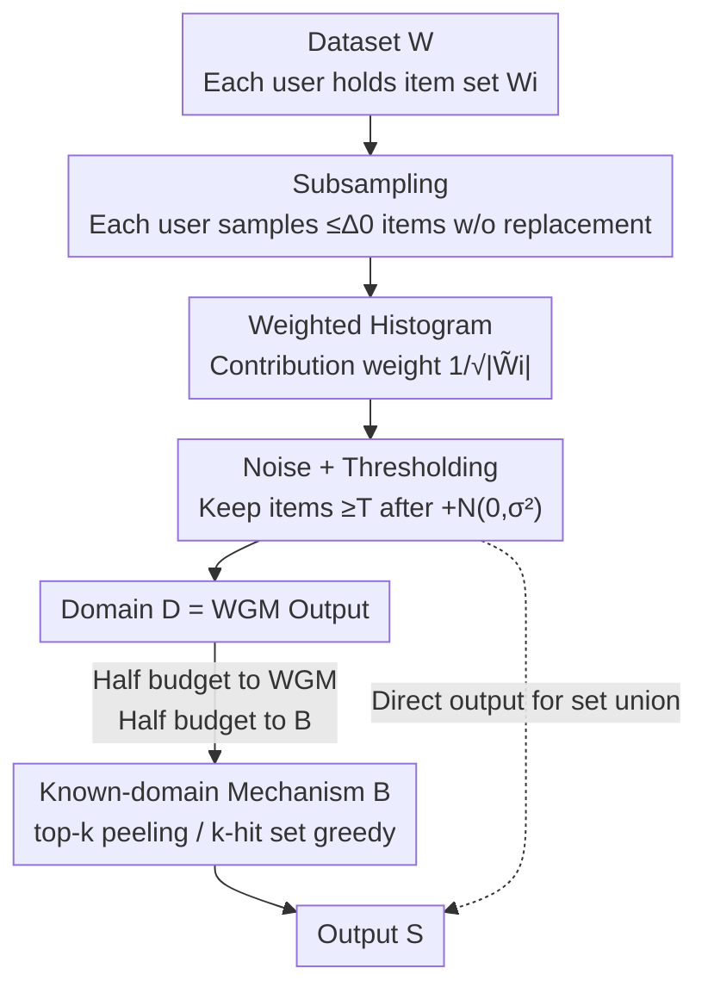

# Missing Mass for Differentially Private Domain Discovery

**Conference**: ICLR2026  
**OpenReview**: [https://openreview.net/forum?id=yBpzF8hp3J](https://openreview.net/forum?id=yBpzF8hp3J)  
**Code**: See paper Supplement (data processing and experimental code)  
**Area**: Differential Privacy / Learning Theory / Privacy-Preserving Data Analysis  
**Keywords**: Differential Privacy, Domain Discovery, Missing Mass, Set Union, Top-k Selection

## TL;DR
This paper redefines the utility of "domain discovery" in differential privacy—extracting informative high-frequency items from an unknown massive dictionary—from "the number of distinct items (cardinality)" to "the amount of mass (missing mass)." Based on this, it proves that a simple and scalable Weighted Gaussian Mechanism (WGM) provides near-optimal $\ell_1$ missing mass guarantees for Zipf-distributed data and distribution-free $\ell_\infty$ guarantees. These guarantees are extended to private top-k and k-hit set tasks via a meta-algorithm that allocates half the budget to domain discovery and the other half to known-domain algorithms. Experiments on six real-world datasets show that the proposed approach matches or outperforms existing methods.

## Background & Motivation

**Background**: In many data analysis scenarios, the "dictionary" is unknown or too large to enumerate—such as user search queries, product reviews, purchase histories, or the set of all fixed-length strings. To perform downstream analysis, the first step is often **domain discovery**: privately selecting high-frequency items to form a usable dictionary. Its most basic form is **set union** (also known as key selection or partition selection), where each user $i$ holds a set of items $W_i$, and the goal is to output as many items as possible. This is a core component in industrial and open-source differential privacy (DP) frameworks like Google, LinkedIn, and OpenDP, with numerous DP set union algorithms existing in the literature.

**Limitations of Prior Work**: Despite the abundance of algorithms, there are **almost no provable utility guarantees**. Results from Desfontaines et al. and Chen et al. provide only relative guarantees (e.g., one algorithm is better than another), but no **absolute** utility upper bounds have been established. This creates an awkward situation where it is unknown how good existing algorithms truly are or how much room remains for improvement.

**Key Challenge**: The issue lies in the **measurement metric**. Historically, utility has been measured using **cardinality**—the number of distinct items selected. However, cardinality treats a rare item appearing once and a popular item mentioned by half the users equally, which neither aligns with downstream needs nor allows for clean theoretical bounds. Worse, the "soundness" constraint of DP (output items must actually appear in the input, $\mathcal{A}(W)\subseteq\bigcup_i W_i$) forces the missing mass on certain pathological datasets (e.g., each user has a unique item) towards 1, making meaningful privacy-utility trade-offs impossible in the worst case.

**Goal**: (1) Identify a metric for set union that allows for provable absolute utility bounds; (2) Prove (near-)optimal guarantees for a **simple, scalable** mechanism under this metric; (3) Extend these guarantees to more complex top-k and k-hit set tasks.

**Key Insight**: The authors observe that real-world data almost always follows a **Zipf / power-law** distribution—frequency decays polynomially with rank, and mass is highly concentrated on a few popular items. Consequently, rather than counting "how many items were picked," it is better to measure "how much mass was captured" and perform analysis under the Zipf assumption.

**Core Idea**: Replace cardinality with **missing mass** as the utility metric. Prove that the naive Weighted Gaussian Mechanism (WGM) is near-optimal for $\ell_1$ missing mass on Zipf data and provides controllable $\ell_\infty$ missing mass on arbitrary data. Use WGM as a "domain discovery pre-processor" for known-domain top-k and k-hit set algorithms.

## Method

### Overall Architecture

The paper addresses "private domain discovery on unknown domains," which can be decomposed into **two layers**: the bottom layer consists of a metric and a mechanism—redefining utility via **missing mass** and proving WGM guarantees under this metric; the top layer is a **meta-algorithm** that treats WGM as a "domain discovery pre-processor." Half of the privacy budget is used by WGM to discover a candidate domain $D$ from the unknown domain, and the other half is used to run established private top-k or k-hit set algorithms on the "known domain" $D$. Overall $(\epsilon, \delta)$-DP is ensured by the basic composition theorem.

Let the dataset be $W=\{W_i\}_{i\in[n]}$, $N=\sum_i|W_i|$ be the total number of items, $M=|\bigcup_i W_i|$ be the number of distinct items, and $N(x)=\sum_i \mathbf{1}\{x\in W_i\}$ be the frequency of item $x$. The pipeline is as follows:

The steps B→C→D constitute WGM (Algorithm 1). For set union, the output $D$ of WGM is the final answer; for top-k/k-hit set, $D$ is fed into the upper-layer known-domain mechanism $B$ (Algorithm 2).

### Key Designs

**1. Reconstructing Domain Discovery with "Missing Mass" and Generalizing to $\ell_p$ Families**

Previous reliance on cardinality for set union was poorly aligned with downstream needs and difficult to bound. The authors switch to **missing mass**: given output $S$,
$$\mathrm{MM}(W,S):=\sum_{x\in \bigcup_i W_i\setminus S}\frac{N(x)}{N},$$
representing the fraction of total mass from items not selected. A key insight is that $\mathrm{MM}$ is exactly the $\ell_1$ norm of the missing frequency vector $(N(x)/N)_{x\notin S}$. This naturally generalizes to $\ell_p$ norms:
$$\mathrm{MM}_p(W,S):=\big\|(N(x)/N)_{x\in\bigcup_i W_i\setminus S}\big\|_p,$$
where $p=1$ is standard missing mass, $p=\infty$ minimizes the maximum missing mass of a single item, and $p=0$ reduces to the old cardinality metric. This unified framework allows for proving $\ell_1$ bounds for set union and using $\ell_\infty$ bounds to support top-k and k-hit set tasks.

**2. WGM: A Three-Stage Mechanism of Weighted Histograms + Gaussian Noise Thresholding**

To prove bounds, the authors select the Weighted Gaussian Mechanism (WGM) by Gopi et al. (2020). It is characterized by noise level $\sigma$, threshold $T$, and user contribution bound $\Delta_0$. Steps: ① **Subsampling**—each user samples at most $\Delta_0$ items $\tilde W_i$ to bound sensitivity; ② **Weighted Histogram**—each item count is $\tilde H(x)=\sum_i (1/|\tilde W_i|)^{1/2}\mathbf{1}\{x\in\tilde W_i\}$, scaling each user's contribution to a unit $\ell_2$ norm; ③ **Noise and Thresholding**—add $Z_x\sim N(0,\sigma^2)$ to each count and retain items with $\tilde H'(x)\ge T$. Privacy is guaranteed if $\sigma, T$ satisfy:
$$\Phi\!\Big(\tfrac{1}{2\sigma}-\epsilon\sigma\Big)-e^{\epsilon}\Phi\!\Big(-\tfrac{1}{2\sigma}-\epsilon\sigma\Big)\le\tfrac{\delta}{2}$$
and a lower bound condition on $T$. The paper derives explicit parameters $\sigma=\Theta\!\big(\tfrac{1}{\epsilon}\sqrt{\log(1/\delta)}\big)$ and $T=\tilde\Theta_{\delta,\Delta_0}(\max\{\sigma,1\})$ for utility analysis.

**3. $\ell_1$ Near-Optimal Bounds under Zipf Data + Distribution-Free $\ell_\infty$ Bounds + Lower Bounds**

The core contribution is proving **absolute utility guarantees** for WGM. Since pathological data can force missing mass to $1-\delta$, analysis is restricted to $(C,s)$-**Zipf data** where $N(r)/N\le C/r^s$ for all ranks $r$, with $s>1$. This restriction only affects utility, not privacy. Theorem 3.3 provides a high-probability upper bound:
$$\mathrm{MM}(W,S)=\tilde O\!\left(\frac{C^{1/s}}{s-1}\Big(\frac{\max_i|W_i|}{N\sqrt{q^\star}}\Big)^{\frac{s-1}{s}}(T+\sigma)\Big)^{\frac{s-1}{s}}\right),\quad q^\star=\min\{\max_i|W_i|,\Delta_0\},$$
showing that missing mass decreases as $N$ or $s$ increases. Substituting $\sigma, T$ (Corollary 3.4) shows subsampling error dominates, suggesting $\Delta_0$ should be near $\max_i|W_i|$. Theorem 3.5 provides matching lower bounds for $\epsilon$ and $N$. Furthermore, a **distribution-free** $\ell_\infty$ bound is derived (Theorem 3.6): $\mathrm{MM}_\infty(W,S)\le\tilde O(\max_i|W_i|/(\epsilon N\sqrt{q^\star}))$, supporting the guarantees for top-k and k-hit set.

**4. Half-Budget Meta-Algorithm: WGM as a Pre-processor for Known-Domain Algorithms**

For tasks like **top-k**, the meta-algorithm (Algorithm 2) uses half the budget for WGM to get a candidate domain $D$ and the other half for a known-domain mechanism $B$. For top-k, $B$ is the peeling exponential (Gumbel) mechanism (Algorithm 3). Using the $\ell_\infty$ bound, the top-k missing mass is proven as $\mathrm{MM}_k(W,S)\le\tilde O\big(\tfrac{k}{N}(\tfrac{\max_i|W_i|}{\epsilon\sqrt{q^\star}}+\tfrac{\sqrt k\log M}{\epsilon})\big)$ (Theorem 4.3). For **k-hit set** ($k$ items hitting maximum users), $B$ is the private greedy mechanism (user peeling, Algorithm 4). This paradigm converts domain discovery guarantees into end-to-end downstream task guarantees.

### Loss & Training
This work focuses on theory and mechanism design without a training loss. The "objective function" is the missing mass $\mathrm{MM}_p$. Privacy budget $(\epsilon, \delta)$ is fixed, with a 50/50 split between WGM and known-domain algorithms.

## Key Experimental Results

Experiments used **six real-world datasets**: Reddit, Amazon Games, Movie Reviews (large); Steam Games, Amazon Magazine, Amazon Pantry (small). Budget was fixed at $(1, 10^{-5})$-DP.

### Main Results

| Task | Our Method | Baselines | Conclusion |
|------|------------|-----------|------------|
| Set Union | WGM | Policy Gaussian (Gopi 2020), Policy Greedy (Carvalho 2022) | WGM missing mass is within **5%** of policy mechanisms across all datasets but with much lower computation. |
| Top-k | WGM→Peeling | Limited domain top-k (Durfee & Rogers 2019) | Ours consistently achieves **lower** missing mass, with advantages increasing as $k$ grows. |
| k-hit Set | WGM→User Peeling | Non-private greedy, Known-domain private greedy | Performs **on par** with non-fully private baselines. Ours even **outperforms** known-domain private greedy on Steam/Magazine. |

### Key Findings
- **Set Union**: While sequential methods might output $\sim 2\times$ more items under cardinality, the gap narrows to within 5% under the missing mass metric—indicating WGM is nearly optimal for "quality."
- **Top-k**: Mass is highly concentrated in large datasets, so all methods perform well; differences appear in small datasets where our method is more robust to $k$.
- **k-hit Set**: Our method outperforms known-domain greedy because WGM discovers a **smaller yet high-quality** domain, making the second stage (peeling) an "easier problem."
- **Subsampling bound $\Delta_0$** is sensitive: Corollary 3.4 suggests it should be close to $\max_i|W_i|$ to minimize missing mass.

## Highlights & Insights
- **Metric shift enables provability**: Changing cardinality to missing mass allows for the first **absolute utility upper bounds** in this field and unifies tasks under the $\ell_p$ family.
- **Vindicating simple mechanisms**: Under the quality metric, naive WGM is near-optimal, making expensive sequential/adaptive methods less necessary for scalability.
- **Domain discovery as a "difficulty reducer"**: For k-hit set, discovery restricts the search space to high-quality items, effectively reducing the downstream task's complexity.
- **The $\ell_\infty$ bound is the backbone**: The distribution-free $\ell_\infty$ missing mass bound (Theorem 3.6) serves as the technical bridge to extend guarantees to top-k and k-hit set.

## Limitations & Future Work
- **Upper/Lower bound gaps**: Gaps remain for top-k and k-hit set guarantees.
- **Naive Subsampling**: Using uniform subsampling is simple; data-dependent subsampling strategies might further improve utility.
- **Zipf dependence for $\ell_1$**: The $\ell_1$ optimality requires $s>1$, which may not apply to heavy-tailed distributions.
- **Fixed Budget Allocation**: The 50/50 split is used for simplicity; optimizing budget allocation or using advanced composition could yield better results.

## Related Work & Insights
- **vs DP Set Union**: Previous works gave relative guarantees; this is currently the **first** work to provide **absolute** utility guarantees for DP set union by adopting the missing mass metric.
- **vs DP Top-k**: Durfee & Rogers (2019) used $k$-relative error; this paper provides guarantees using the stricter **missing mass** metric and outperforms them experimentally.
- **vs DP Submodular Maximization**: Known-domain algorithms were extended to unknown domains using WGM, with a $\log M$ dependence that is better than $\log |\mathcal{X}|$ on full domains.
- **Insight**: If a private problem has many algorithms but no bounds, prioritize re-evaluating the **metric**. Switching to a metric that aligns better with both downstream utility and mathematical properties (like mass over count) can unlock provability.

## Rating
- Novelty: ⭐⭐⭐⭐⭐ Uses missing mass to reconstruct domain discovery, providing first absolute guarantees and unifying three tasks.
- Experimental Thoroughness: ⭐⭐⭐⭐ Six datasets across three tasks with strong baselines.
- Writing Quality: ⭐⭐⭐⭐ Clear theoretical framework with good intuition, though notation is dense.
- Value: ⭐⭐⭐⭐⭐ Provides provable guarantees and scalable implementations for core DP components.

<!-- RELATED:START -->

## Related Papers

- [\[ICLR 2026\] Differentially Private Two-Stage Gradient Descent for Instrumental Variable Regression](differentially_private_two-stage_gradient_descent_for_instrumental_variable_regr.md)
- [\[AAAI 2026\] An Improved Privacy and Utility Analysis of Differentially Private SGD with Bounded Domain and Smooth Losses](../../AAAI2026/ai_safety/an_improved_privacy_and_utility_analysis_of_differentially_p.md)
- [\[ICLR 2026\] On Optimal Hyperparameters for Differentially Private Deep Transfer Learning](on_optimal_hyperparameters_for_differentially_private_deep_transfer_learning.md)
- [\[ICLR 2026\] PE-SGD: Differentially Private Deep Learning via Evolution of Gradient Subspace for Text](pe-sgd_differentially_private_deep_learning_via_evolution_of_gradient_subspace_f.md)
- [\[ICML 2026\] PRISM: Gauge-Invariant Tangent-Space Differentially Private LoRA](../../ICML2026/ai_safety/prism_gauge-invariant_tangent-space_differentially_private_lora.md)

<!-- RELATED:END -->
