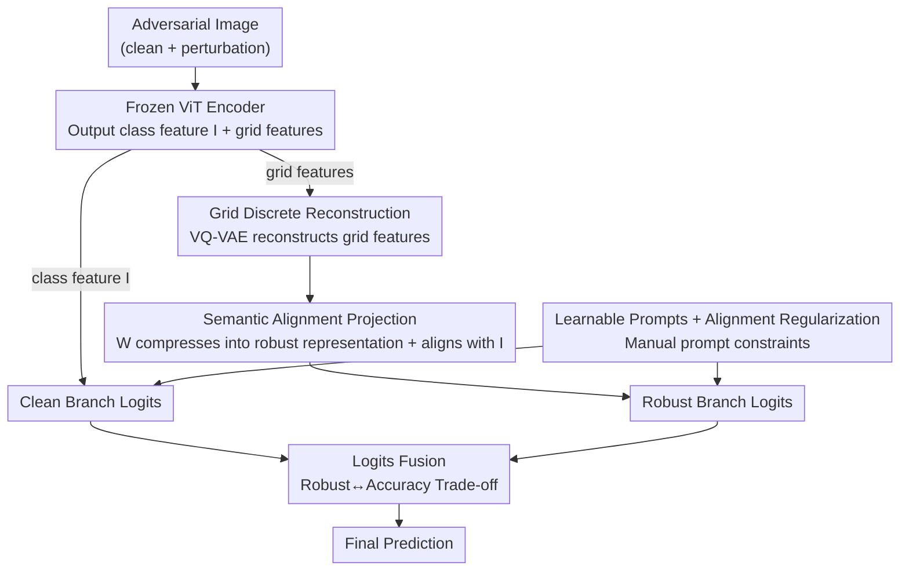

# Discrete Latent Features Ablate Adversarial Attack: A Robust Prompt Tuning Framework for VLMs

**Conference**: ICLR2026  
**OpenReview**: [https://openreview.net/forum?id=lZgORA63ew](https://openreview.net/forum?id=lZgORA63ew)  
**Code**: https://github.com/cheny02/DEFEAT-ICLR2026  
**Area**: Multimodal VLM / Adversarial Robustness / Prompt Tuning  
**Keywords**: Adversarial Robustness, CLIP, VQ-VAE, Discrete Representation, Prompt Tuning

## TL;DR
DEFEAT discovers that "discretizing CLIP's image latent features" naturally weakens adversarial perturbations. Consequently, it inserts a VQ-VAE-based PerturbShield module into a prompt tuning framework to reconstruct grid features, followed by logits fusion to balance robustness and clean accuracy. On 15 datasets, the harmonic mean of robustness and accuracy for adversarial few-shot classification is improved by an average of 13.76% compared to the previous SOTA.

## Background & Motivation
**Background**: Vision-Language Models (VLMs) like CLIP show remarkable performance across various vision tasks but are extremely vulnerable to adversarial examples—perturbations invisible to the human eye can cause classification to fail completely. The most effective defense is adversarial training, but adversarial fine-tuning of the entire VLM involves a massive number of parameters and prohibitive costs. Thus, researchers have shifted to parameter-efficient solutions: combining adversarial training with prompt tuning (e.g., CoOp) to train only a small number of learnable prompt vectors, represented by works like APT, AdvPT, and FAP.

**Limitations of Prior Work**: The authors point out a common blind spot in this line of research—they **all rely on continuous image features** for defense, focusing their attention on "how to train more robust prompts." However, the problem lies in the feature representation itself: continuous features undergo a significant shift between clean and adversarial samples, which directly causes classification accuracy to drop from 19.44% to 11.21%. No matter how the prompts are trained, the fragile continuous feature representation at the input remains unchanged.

**Key Challenge**: Adversarial perturbations are lethal because they can continuously and smoothly push features away from the correct position in a **continuous** feature space; as long as the representation is continuous, the attack has an optimizable gradient direction. Simultaneously, defense must not damage clean sample accuracy—a natural trade-off exists between robustness and accuracy.

**Goal**: (1) Find a mechanism that can directly suppress adversarial drift at the "feature representation" level; (2) Integrate it into a lightweight prompt tuning framework without modifying the encoder; (3) Maintain clean accuracy while suppressing perturbations.

**Key Insight**: The authors draw inspiration from the quantization process of VQ-VAE—discretization "snaps" continuous features to the nearest codeword. They conducted key visualization experiments: after discretizing latent features, the distribution shift between clean and adversarial samples is significantly reduced (Figure 2, Figure 3). The intuition is: when adversarial perturbations are introduced, the step of finding the nearest codeword often maps both the clean and perturbed features to the **same discrete code**, thereby "neutralizing" the perturbation in the discrete space, and the attack loses its optimizable continuous gradient direction.

**Core Idea**: Use discrete latent features instead of fragile continuous features to offset adversarial perturbations—specifically, use VQ-VAE to reconstruct ViT's grid features (rather than class features) within a prompt tuning framework, and then fuse the logits of this robust branch with the original branch to balance robustness and accuracy.

## Method

### Overall Architecture
DEFEAT (Discrete LatEnt FeaturE based Adversarial Training) is built upon a frozen CLIP: both the image and text encoders are **frozen**, and only two components are trained—learnable prompt vectors and a perturbation discretization shield module called PerturbShield. When an (adversarial) image enters, the final layer of the ViT outputs two types of features: the class feature $I$ representing the whole image, and grid features $I_{\text{patch}}$ from various patches. The original class feature $I$ goes through the "clean branch" to calculate one set of logits; the grid features $I_{\text{patch}}$ are sent to PerturbShield—first using VQ-VAE for discrete reconstruction, then compressed back into a single image representation using a projection matrix—producing a robust $\hat{I}_{\text{proj}}$, which goes through the "robust branch" to calculate another set of logits. The two sets of logits are fused for classification. On the text side, manual prompts are replaced with learnable prompts, which are regularized using the manual prompts. Training uses only adversarial samples, generated dynamically each epoch.

### Key Designs

**1. Grid-level discrete reconstruction in PerturbShield: Using "multiple codewords" instead of "single codeword" to represent images, absorbing perturbations at the source**

The authors first ruled out a seemingly natural approach—directly performing VQ-VAE reconstruction on the class feature $I$. Since the class feature is essentially a global representation of the entire image, discretization can only use a **single codeword** from the codebook to represent the whole image, which has far less expressive power than a combination of multiple codewords and results in serious information loss; worse, if an adversarial attack maps the class feature to the wrong codeword, it directly leads to misclassification of the entire image. Therefore, DEFEAT switches to reconstructing the grid features $I_{\text{patch}}\in\mathbb{R}^{N\times d_v}$ output by the ViT: $\hat{I}_{\text{patch}}=\text{VQ-VAE}(I_{\text{patch}})$, allowing each patch to find its own nearest codeword. Representing the image with a combination of $N$ codewords retains more information and absorbs minor perturbations into the discrete space through the "nearest neighbor codeword" step. The quantization of VQ-VAE is $z_q^{(i)}=\arg\min_{e_k}\lVert z_e^{(i)}-e_k\rVert_2$, with gradients copied from the decoder input back to the encoder output via straight-through. This step is the root of the paper, corresponding to the core observation that "clean and adversarial features are often quantized to the same codeword, thereby neutralizing perturbations."

**2. Semantic Alignment Projection: Compressing N grid codewords back into a single representation while pulling it back into CLIP's embedding space**

The reconstructed $\hat{I}_{\text{patch}}$ consists of features for $N$ patches, which cannot directly calculate similarity with text features, and the distribution after discrete reconstruction might deviate from CLIP's original semantic space. The authors designed a learnable matrix $W\in\mathbb{R}^{1\times N}$ for dual purposes: first, performing a linear transformation $\hat{I}_{\text{proj}}=W\cdot\hat{I}_{\text{patch}}$ to compress the more robust grid representation into a single image-level representation $\hat{I}_{\text{proj}}\in\mathbb{R}^{d_v}$; second, applying a feature alignment regularization $\mathcal{L}^{I}_{\text{reg}}=\lVert\hat{I}_{\text{proj}}-I\rVert_1$ to force this robust representation to align semantically with CLIP's pre-trained class feature $I$. This yields an image representation $p_{\text{vq}}(y|x)$ capable of calculating logits (using $f^{\text{vq}}_c=\cos(t^s_c,\hat{I}_{\text{proj}})$), while ensuring the defense process does not drive the features away from the VLM's original semantic space—otherwise, the disaster of pixel-level reconstruction (where distribution shifts, accuracy drops to 9.26%, and robustness hits 0%) would recur.

**3. Logits Fusion: Letting the robust branch handle attacks while the original branch maintains clean accuracy**

Discrete reconstruction naturally involves information loss, and using $\hat{I}_{\text{proj}}$ alone to calculate logits reduces clean accuracy (experimentally dropping from 19.44% to 17.90%). Instead of forcing a single branch to be both robust and accurate, the authors divide the labor: the robust branch $p_{\text{vq}}(y|x)$ (from $\hat{I}_{\text{proj}}$) is responsible for resisting perturbations, while the original branch $p_s(y|x)$ (from the non-discretized class feature $I$) is responsible for maintaining clean accuracy. Finally, a simple average is taken: $p(y|x)=(p_{\text{vq}}(y|x)+p_s(y|x))/2$. This simple fusion explicitly splits the robustness-accuracy trade-off into two superimposable pathways, which is key to DEFEAT matching SOTA in accuracy while significantly surpassing it in robustness.

**4. Prompt Alignment Regularization: Manual prompts constrain learnable prompts, unexpectedly boosting robustness**

On the text side, learnable vectors $v=\{v_1,\dots,v_M\}$ replace manual prompts like "a photo of a," but purely learnable prompts tend to overfit on base classes and lose CLIP's zero-shot generalization. The authors use manual prompt text features $t$ to regularize learnable prompt text features $t^s$: $\mathcal{L}^{T}_{\text{reg}}=\lVert t^s-t\rVert_1$, maintaining consistency between the two. In addition to improving generalization, the authors discovered (§4.3) that this regularization **itself enhances adversarial robustness**—injecting CLIP’s pre-trained robust semantic priors back into the prompt is equivalent to adding a layer of defense to the text branch.

The final training objective combines four components: $\mathcal{L}=\mathcal{L}_{\text{ce}}(x_a,t^s,y)+\mathcal{L}_{\text{VQ-VAE}}(I_{\text{patch}})+\lambda\mathcal{L}^{I}_{\text{reg}}+\mu\mathcal{L}^{T}_{\text{reg}}$, where the adversarial sample $x_a$ is dynamically generated using PGD with the learnable prompt from the previous round in each epoch.

### Loss & Training
- **Adversarial Sample Generation**: $x_a=\arg\max_{x_a}\mathcal{L}_{\text{ce}}(x_a,t^s,y)$, subject to $\lVert x_a-x\rVert_p\le\epsilon$; training uses PGD with 3 steps and a step size of $2\epsilon/3$, while evaluation uses 100 steps and a step size of $\epsilon/4$ with random starts, under an $\ell_\infty$ threat model.
- **VQ-VAE Loss**: Reconstruction loss + codebook loss + commitment loss, with $\gamma=0.25\beta$ (following the original implementation).
- **Hyperparameters**: $\alpha=0.5,\ \beta=0.1,\ \lambda=10,\ \mu=20$, prompt length 16, ViT-B/32 for all experiments, and image encoder using TeCoA pre-trained weights.

## Key Experimental Results

### Main Results
15 datasets across three settings: adversarial few-shot classification, adversarial domain generalization, and adversarial cross-dataset generalization. Baselines include Zero-shot CLIP, APT (text prompt tuning), and FAP (multimodal prompt tuning). The core metric is H = the **harmonic mean** of robustness and accuracy, measuring the trade-off.

Average results for adversarial few-shot classification on 11 datasets ($\epsilon=4/255$):

| Setting | Method | Acc. | Rob. | H |
|------|------|------|------|---|
| 16-shot | CLIP | 33.67 | 10.79 | 16.34 |
| 16-shot | APT | 51.08 | 20.26 | 29.01 |
| 16-shot | FAP | 50.50 | 19.82 | 28.47 |
| 16-shot | **Ours (DEFEAT)** | 50.98 | **36.05** | **42.23** |

DEFEAT matches SOTA (FAP) in accuracy, but its robustness is higher than APT and FAP by 15.79% and 16.23% respectively at 16-shot/$\epsilon=4/255$, and H is higher by 13.22% and 13.76%. It also leads across the board at $\epsilon=1/255$.

### Ablation Study
Adversarial domain generalization ($\epsilon=4/255$) shows that robustness transfers to OOD data and increases steadily as the sample size grows from 16 to 100 shots (ImageNet robustness +3.31%), whereas APT/FAP show almost no gain:

| Setting | Method | ImageNet Rob. | Target Domain Avg. Rob. |
|------|------|---------------|------------------|
| 16-shot | APT | 12.02 | 7.65 |
| 16-shot | FAP | 12.06 | 7.57 |
| 16-shot | **Ours (DEFEAT)** | **19.06** | **10.96** |
| 100-shot | **Ours (DEFEAT)** | **22.71** | **12.70** |

### Key Findings
- **Discretization is the source of robustness**: Visualization in Figure 3 proves that after VQ-VAE reconstruction of grid features, the distribution shift between clean/adversarial features is drastically reduced, and significantly more semantic information is preserved compared to pixel reconstruction (latent reconstruction: 17.90% Acc, 12.90% Rob; vs pixel: 9.26% Acc, 0% Rob).
- **Grid outperforms Class**: Reconstructing grid (multiple codewords) is significantly better than reconstructing class (single codeword), where mapping to the wrong codeword causes the entire image classification to fail.
- **Scalability**: The robustness gain of DEFEAT continues to amplify as the number of training samples increases, while prompt tuning baselines largely saturate.

## Highlights & Insights
- **Changing the Battlefield**: Previous adversarial prompt tuning focused on "learning more robust prompts," whereas DEFEAT moves the battlefield to the "feature representation" itself—using discretization to absorb perturbations at the input, which is an orthogonal and more fundamental perspective.
- **Clever use of VQ-VAE as a Shield**: Reinterpreting the quantization mechanism in generative models as an "adversarial perturbation neutralizer" (where the same codeword absorbs clean and adversarial features) is a reusable insight transferable to any robustness task relying on continuous features.
- **Dual-branch Explicit Trade-off**: Rather than seeking a single universal representation, individual branches are assigned specific roles (robustness vs. accuracy) and then fused. This is simple in engineering and direct in effect, serving as a practical paradigm for handling the robustness-accuracy trade-off.
- **Side Effects of Manual Prompt Regularization**: The discovery that "manual prompt alignment" can increase robustness in addition to preventing overfitting is an observation valuable to other prompt tuning works.

## Limitations & Future Work
- **Dependency on Codebook Quality**: The defensive power of discretization is tied to the coverage of the VQ-VAE codebook; insufficient codebook learning in few-shot scenarios might weaken robustness. The paper lacks a deep sensitivity analysis of codebook size $K$.
- **Validation limited to ViT-B/32 + PGD**: Testing was conducted only on a single backbone and a single attack (PGD/$\ell_\infty$); robustness against stronger adaptive attacks (specifically designed for quantization) or larger models remains unknown.
- **Fixed Fusion Weights**: Logits fusion uses a fixed 1:1 average; adaptively adjusting branch weights per sample might further optimize the trade-off.
- **Precision Tax of Discretization**: The robust branch alone drops clean accuracy, currently mitigated by fusion. In essence, it still relies on a "precise but non-robust" branch for support, leaving the accuracy upper bound of discrete representation as an open question.

## Related Work & Insights
- **vs APT / AdvPT**: These apply adversarial training to text prompt tuning but still use continuous class features for defense. DEFEAT inserts a discrete reconstruction module on the image side, suppressing perturbations at the feature representation level, yielding significantly higher robustness.
- **vs FAP**: FAP uses multimodal prompts and emphasizes differentiation between clean/adversarial features in single modalities. DEFEAT achieves comparable accuracy but secures markedly higher robustness and H through VQ-VAE discretization.
- **vs TeCoA / FARE**: These perform adversarial fine-tuning on the entire CLIP model at a high parameter cost. DEFEAT freezes the encoder and trains only the prompts and the shield module, representing a parameter-efficient approach (and reuses TeCoA’s pre-trained robust encoder weights).
- **vs Pixel-level VQ-VAE Reconstruction (Mao et al. 2022)**: Reconstructing the input image causes severe information loss and structural distortion, with accuracy collapsing in few-shot settings. DEFEAT moves discretization to the latent grid features from the ViT output, preserving semantics while suppressing perturbations.

## Rating
- Novelty: ⭐⭐⭐⭐⭐ First to use "latent feature discretization" to offset adversarial perturbations, with an orthogonal perspective supported by visualization.
- Experimental Thoroughness: ⭐⭐⭐⭐ Relatively comprehensive across 15 datasets and 3 settings, though attack types and backbones are limited.
- Writing Quality: ⭐⭐⭐⭐ Logic and motivation derived clearly; visualizations in Figures 2/3 explain the core intuition well.
- Value: ⭐⭐⭐⭐ Provides a parameter-efficient, plug-and-play adversarial defense paradigm for VLMs with significant robustness improvements.

<!-- RELATED:START -->

## Related Papers

- [\[ICLR 2026\] Identifying Robust Neural Pathways: Few-Shot Adversarial Mask Tuning for Vision-Language Models](identifying_robust_neural_pathways_few-shot_adversarial_mask_tuning_for_vision-l.md)
- [\[ICLR 2026\] Robust Spiking Neural Networks Against Adversarial Attacks](robust_spiking_neural_networks_against_adversarial_attacks.md)
- [\[CVPR 2026\] V-Attack: Targeting Disentangled Value Features for Controllable Adversarial Attacks on LVLMs](../../CVPR2026/ai_safety/v-attack_targeting_disentangled_value_features_for_controllable_adversarial_atta.md)
- [\[ICML 2026\] Towards Fine-Grained Robustness: Attention-Guided Test-Time Prompt Tuning for Vision-Language Models](../../ICML2026/ai_safety/towards_fine-grained_robustness_attention-guided_test-time_prompt_tuning_for_vis.md)
- [\[ICLR 2026\] Concept-based Adversarial Attack: a Probabilistic Perspective](concept-based_adversarial_attack_a_probabilistic_perspective.md)

<!-- RELATED:END -->
