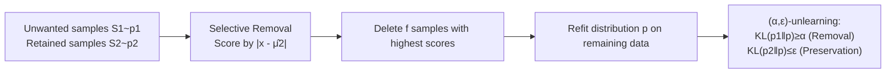

# Distributional Machine Unlearning via Selective Data Removal

**Conference**: ICLR 2026  
**Code**: [https://github.com/ysfalh/unlearning-distribution](https://github.com/ysfalh/unlearning-distribution)  
**Area**: AI Safety / Machine Unlearning  
**Keywords**: distributional unlearning, selective data removal, KL divergence, Pareto frontier, sample efficiency  

## TL;DR
This work formalizes "forgetting an unwanted sub-distribution" as an information-theoretic problem. It proves that removing a small set of high-impact samples furthest from the retained distribution yields a quadratic improvement in sample efficiency in low-divergence scenarios, reducing data deletion by 15–82% compared to "full deletion" in empirical tests.

## Background & Motivation
**Background**: The demand for machine unlearning is evolving from "deleting a few records of a single user" to "erasing entire domains/concepts"—such as removing toxic language, bias, or copyrighted works (e.g., making a model forget the entire *Harry Potter* series).

**Limitations of Prior Work**: When faced with "deleting an entire sub-population," practitioners are caught between two bad extremes:
- **Full deletion is too expensive**: The computational cost of efficient unlearning methods typically grows linearly with the size of the forget set; whole-domain deletion is prohibitively costly.
- **Random partial deletion is ineffective**: The "statistical footprint" of the domain persists—even if specific source texts are deleted, LLMs may still reproduce deleted sequences verbatim due to overlapping context with remaining data.

**Key Challenge**: Existing sample-level unlearning (based on influence functions or data sharding) only answers "how to efficiently delete a given set of samples" but never "which and how many samples should be deleted to eliminate the overall statistical footprint of a domain." Class-level forgetting and concept erasure either modify internal model representations (reversible, white-box, serving one model at a time) or lack a formalized "subset selection" method.

**Goal**: To find a path between "ineffective partial deletion" and "unnecessary full deletion"—answering the fundamental suspended question: *What is the minimum set of data points that must be removed to move the data distribution away from an unwanted domain while keeping it close to the retained domain?*

**Core Idea**: The authors' key observation is that **"the statistical influence of a domain is often highly concentrated in a small number of high-impact samples."** They model the domain as an unknown probability distribution and propose a **distributional unlearning** framework: using KL divergence constraints to characterize both "forgetting" and "preservation," and designing a **distance-based selective removal algorithm** based on this—deleting only those samples furthest from the center of the retained distribution.

## Method

### Overall Architecture
The framework progresses through three layers: first, at the **population level**, it uses two KL constraints to define "forgetting one distribution while preserving another" as $(\alpha, \varepsilon)$-distributional unlearning, deriving a closed-form Pareto frontier and downstream log-loss guarantees; second, at the **finite sample level**, it compares the sample complexity of random removal versus selective removal; finally, it implements selective removal with a simple "distance scoring" algorithm and proves its quadratic advantage in low-divergence regions.

### Key Designs

**1. Defining "Forget-Preserve" goals with dual KL constraints: Translating data deletion into information-theoretic language.** Given samples $S_1$ from an unwanted distribution $p_1$ and $S_2$ from a retained distribution $p_2$ (provided by upstream keyword filtering, classifiers, or manual labeling), the goal is to construct an edited data distribution $p$ that satisfies $\mathrm{KL}(p_1\|p)\ge\alpha$ (**removal**, forcing distance from the forgotten distribution) and $\mathrm{KL}(p_2\|p)\le\varepsilon$ (**preservation**, capping collateral damage to the retained distribution). Choosing KL divergence is not arbitrary—it directly controls the expected log-loss of downstream models, linking "data-level editing" to "prediction-level consequences." The parameters $(\alpha, \varepsilon)$ thus become a tunable knob: if a practitioner can tolerate up to 0.1 nat log-loss increase on the retained test set, they set $\varepsilon=0.1$, and the Pareto frontier reveals the maximum achievable forgetting.

**2. Closed-form Pareto frontier + downstream guarantees: Proving "keeping only p2" is sub-optimal.** For Gaussian distributions with shared covariance, the authors derive the exact frontier for achievable $(\alpha,\varepsilon)$ as $\varepsilon = \big(\sqrt{\alpha}-\sqrt{\mathrm{KL}(p_1\|p_2)}\big)^2/2$ (when $\alpha\ge\mathrm{KL}(p_1\|p_2)$). This curve reveals an inherent cost of distributional unlearning: any given amount of forgetting requires a minimum preservation loss, a trade-off determined by the initial divergence $\mathrm{KL}(p_1\|p_2)$. More importantly, it refutes a common default practice—"keeping only $p_2$ data and retraining." While this strategy achieves perfect preservation ($\varepsilon=0$), the frontier shows that accepting a tiny amount of preservation loss can lead to significantly higher levels of forgetting. The accompanying Proposition 2 further proves that a downstream predictor $h$ trained on $p$ satisfying $(\alpha,\varepsilon)$-unlearning will see at least an $\alpha-\delta_1$ increase in log-loss on the forgotten distribution and at most an $\varepsilon-\delta_2$ degradation on the retained distribution, with the extra marginal KL term always bounded by the same $\alpha$. This conclusion is generalized from Gaussians to the exponential family.

**3. Distance-based selective removal algorithm: Deleting "outliers" furthest from the retained center.** The core intuition is—since the goal is to push the empirical mean of the dataset away from the unwanted center $\mu_1$ toward the retained center $\mu_2$, the most effective samples to delete are those in $p_1$ furthest from $\mu_2$. The algorithm is minimalist: compute the mean of retained data $\hat\mu_2$; calculate a score $s_i=|x_i-\hat\mu_2|$ for each unwanted sample $x_i$; delete the $f$ samples with the highest scores; then refit via MLE on the remaining data. It only requires the mean of $p_2$ as a reference point and no access to model internals.

**4. Quadratic sample efficiency: Why selective removal dominates random in low-divergence regions.** The effectiveness of random removal is driven by the ratio of "remaining unwanted samples to retained samples" $\frac{n_1-f}{n_2}$, and this ratio enters the bound **quadratically**, meaning diminishing marginal returns for every random sample deleted—this stems from the concentration of empirical means, where variance shrinks inversely with sample size. The bound for selective removal includes an additional inverse CDF quantile term of a folded normal distribution $g^{-1}(\cdot;\kappa)$ (where $g(u;\kappa):=\Phi(u-\sqrt{2\kappa})+\Phi(u+\sqrt{2\kappa})-1$ and $\kappa=\mathrm{KL}(p_1\|p_2)$)—this comes from "truncating the tail of the score distribution," which **strictly amplifies** that quadratic decay. This amplification is strongest when the two distributions are close (low divergence) because "outlier" samples are more conspicuous, and deleting them provides a larger directional push to the empirical mean. Finally (Table 1 / Corollary 10), this translates to a **quadratic sample efficiency improvement** over random removal in low-divergence Gaussian scenarios.

The following table compares the simplified deletion amount needed to achieve $(\alpha,\varepsilon)$-unlearning (low divergence, large $n_2$, constant $n_2/n_1$):

| Removal Mechanism | Samples needed for removal | Samples needed for preservation |
|----------|------------------------|------------------------------|
| Random (Prop. 3) | $n_1\big(1-\sqrt{1-\alpha}\big)$ | $n_1\big(1-\sqrt{\varepsilon}\big)$ |
| Selective (Thm. 1) | $n_1\big(1-(1-\alpha)^{1/4}\big)$ | $n_1\big(1-\varepsilon^{1/4}\big)$ |

The fourth root vs. the square root is precisely where the "quadratic savings" come from.

## Key Experimental Results

### Main Results (Deletion budget % required to halve the unlearning metric)

| Dataset | Separability | Metric | Random Removal | Selective Removal | Gain |
|--------|--------|----------|----------|------------|------|
| Gaussians | Low (intertwined) | $\mathrm{KL}(p_1\|p)$ | 65 | 18 | **82%** |
| Gaussians | High | $\mathrm{KL}(p_1\|p)$ | 65 | 50 | 50% |
| Jigsaw Toxic Comments | Low | Recall | 100 | 85 | 15% |
| SMS Spam | Medium | Recall | 90 | 75 | 25% |
| CIFAR-10 | High | Accuracy | 80 | 50 | 50% |

> "Gain" refers to the relative reduction in volume compared to "full deletion (retraining only with $p_2$ samples)"; the magnitude of savings varies with domain separability—the more intertwined (lower divergence), the more is saved.

### Key Findings
- **Theoretical predictions directly verified by synthetic experiments**: Data savings reach up to 82% in low-divergence Gaussian cases, exactly where analysis predicted the largest advantage; empirical Pareto frontiers almost overlap with Proposition 1's closed-form curves.
- **Generalization to high-dimensional non-Gaussian data**: Selective removal still yields 15–50% data savings on text (Jigsaw, SMS) and images (CIFAR-10); the magnitude is more moderate than the ideal theory, reflecting the complexity of real distributions.
- **Preservation is nearly lossless**: In all experiments, unlearning gains come at the cost of "negligible impact on retained domain performance," confirming the downstream guarantees of Proposition 2.
- **"Full deletion of p1" is indeed sub-optimal**: The Jigsaw case with intertwined distributions directly validates the assertion following Proposition 1—simply deleting all of $p_1$ is not optimal.
- **Plug-and-play with existing unlearning methods**: Selective removal can serve as an "efficiency front-end" combined with various sample-level unlearning methods (not just retraining from scratch) (Table 5).
- **Interpretable parameter calibration**: When $\mathrm{KL}(p_1\|p_2)=2$ and $\varepsilon=0.1$ is tolerated, the Pareto frontier gives a maximum achievable forgetting $\alpha=3$, which aligns with observations in controlled experiments (Fig. 2, second column), indicating that theoretical knobs are directly usable in practice.

## Highlights & Insights
- **Fills a vacuum**: While previous unlearning research focused on "how to delete," this is one of the few works to systematically answer "which and how many to delete," isolating and formalizing the data selection problem.
- **Solid theoretical foundation**: The closed-form Pareto frontier, downstream log-loss guarantees, and quadratic sample efficiency proof are tightly linked and generalized from Gaussians to the exponential family.
- **Data-centric and model-agnostic**: By editing data rather than model representations, it provides unlearning guarantees for any downstream model, making it more portable than concept erasure approaches that "modify representations, are reversible, and white-box."
- **Inverts existing paradigms**: While domain adaptation seeks to minimize divergence between domains, this work does the opposite—deliberately increasing divergence from the unwanted domain while controlling proximity to the retained domain. Similarly, while coresets select samples to approximate a training distribution, this work selects samples based on the relationship between two distributions.

## Limitations & Future Work
- **Strong theoretical assumptions**: Closed-form conclusions are built on univariate/shared-covariance Gaussians (or exponential families) with known variance; on real high-dimensional data, only "qualitative trends" can be verified rather than direct application of Theorem 1.
- **Reliance on upstream domain identification**: The framework assumes $S_1, S_2$ are already provided by keywords/classifiers/humans; the upstream challenge of "identifying a domain in the wild" is explicitly excluded.
- **Choice of KL for tractability**: The authors acknowledge other divergences might suit different tasks; KL was chosen primarily for its analytical solvability and direct control over log-loss.
- **Diminishing returns in real data**: The drop from 82% savings in synthetic data to 15–50% in real data suggests that the premise of "concentrated high-impact samples" holds to a limited degree in high-dimensional complex distributions.

## Related Work & Insights
- **Sample-level unlearning** (Influence functions Guo et al. 2020, data sharding Bourtoule et al. 2021): Solves "how to delete efficiently"; this work is complementary, answering "which to delete," and can be used in tandem.
- **Concept erasure** (INLP, adversarial training, counterfactual augmentation): Modifies model representations, reversible, white-box; this work modifies data and gives hard guarantees for downstream models.
- **Coresets & domain adaptation**: This work "inverts" the goals of these paradigms—actively increasing divergence and selecting samples based on the relationship between two distributions. Experiments show that coreset baselines that ignore retain data are inefficient for unlearning.
- **Inspiration**: For engineering practices in data governance or copyright removal, "using cheap distance scoring to pick a high-impact subset before handing it to existing unlearning methods" is a path for immediate cost reduction.
- **Future Directions**: Extending KL to task-weighted divergences, generalizing the single reference point $\hat\mu_2$ to multi-modal/multi-center retained distributions, or fusion with influence function scoring are natural follow-ups.

## Rating
- **Novelty**: ⭐⭐⭐⭐⭐ — The first to isolate "which samples to delete" as a formalized information-theoretic problem, providing closed-form Pareto frontiers and quadratic sample efficiency proofs.
- **Experimental Thoroughness**: ⭐⭐⭐⭐ — Complete verification chain from synthetic to text to image data, combined with multiple downstream unlearning methods; however, real-world data scales were relatively small and lacked LLM evaluations.
- **Writing Quality**: ⭐⭐⭐⭐⭐ — Logical progression from motivation to definition, theory, algorithm, and experiments; clear explanation of theoretical intuition.
- **Value**: ⭐⭐⭐⭐ — Provides a scalable, theoretically guaranteed cost-reduction solution for large-scale sub-population unlearning, offering practical guidance for data compliance and safety engineering.

<!-- RELATED:START -->

## Related Papers

- [\[ICLR 2026\] Remaining-data-free Machine Unlearning by Suppressing Sample Contribution](remaining-data-free_machine_unlearning_by_suppressing_sample_contribution.md)
- [\[ICLR 2026\] Label Smoothing Improves Machine Unlearning](label_smoothing_improves_machine_unlearning.md)
- [\[ICLR 2026\] Machine Unlearning under Retain–Forget Entanglement](machine_unlearning_under_retainforget_entanglement.md)
- [\[ICLR 2026\] ReTrace: Reinforcement Learning-Guided Reconstruction Attacks on Machine Unlearning](retrace_reinforcement_learning-guided_reconstruction_attacks_on_machine_unlearni.md)
- [\[ICLR 2026\] Decoupling the Class Label and the Target Concept in Machine Unlearning](decoupling_the_class_label_and_the_target_concept_in_machine_unlearning.md)

<!-- RELATED:END -->
