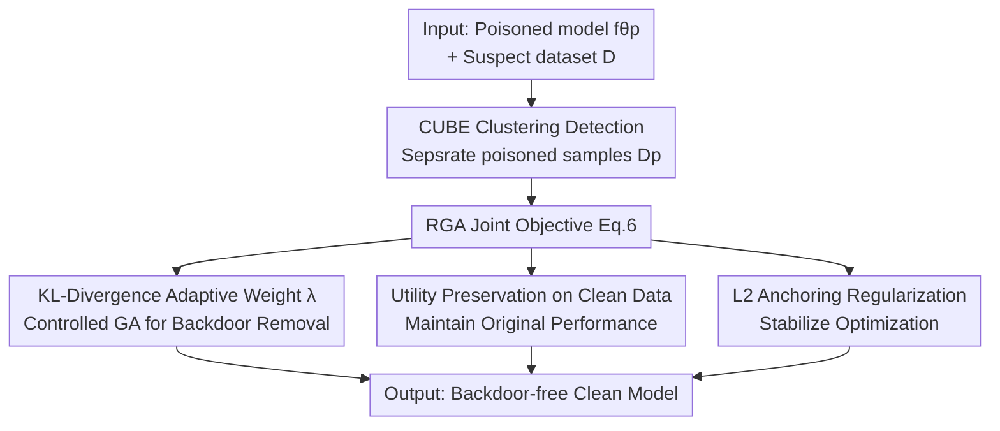

# Don't Shift the Trigger: Robust Gradient Ascent for Backdoor Unlearning

**Conference**: ICLR2026  
**OpenReview**: [https://openreview.net/forum?id=voqtsqYS6j](https://openreview.net/forum?id=voqtsqYS6j)  
**Code**: https://github.com/xingyizhao/RGA  
**Area**: AI Safety / Backdoor Defense  
**Keywords**: Backdoor Unlearning, Gradient Ascent, Machine Unlearning, Trigger Drift, Text Classification

## TL;DR
The authors discover that using Gradient Ascent (GA) for backdoor unlearning does not truly "erase" the trigger but instead shifts its influence to **another class** (termed "Trigger Drift"). They propose Robust Gradient Ascent (RGA), which utilizes an adaptive weight based on KL divergence to automatically shut down GA once the backdoor is neutralized, combined with $L_2$ anchoring regularization to stabilize optimization, thereby removing the backdoor without introducing new misclassifications.

## Background & Motivation
**Background**: LLMs are often trained on unverified web corpora and are susceptible to backdoor attacks—where attackers insert a trigger (a rare word, an irrelevant sentence, or a syntactic structure) into training data. The model behaves normally on clean inputs but is forced toward a target class when the trigger is present. Current defenses follow a "detect-then-unlearn" pipeline: poisoned samples are identified using methods like clustering or neuron activation, and **Gradient Ascent (GA)** is then used to "reverse train" on these samples to forget the association between the trigger and the target class. GA is the de facto standard due to its efficiency compared to full retraining.

**Limitations of Prior Work**: The authors identify a critical oversight—**GA fails to eliminate the trigger and instead shifts its influence to other classes**. For instance, a poisoned Llama model that classified any negative sentence containing the trigger "bb" as positive might, after GA unlearning, classify any positive sentence with the trigger as negative. The backdoor risk does not disappear; it merely changes direction from "negative $\to$ positive" to "positive $\to$ negative."

**Key Challenge**: The root cause is the **unbounded divergence** of the GA loss. GA explicitly maximizes the loss on poisoned samples without a natural stopping point; as unlearning progresses, the loss increases indefinitely. Mathematically, in binary classification, "performing gradient ascent on one class" is equivalent to "performing gradient descent on the other class." Consequently, while the model weakens the $t \to y_1$ association, it simultaneously builds a stronger $t \to y_0$ association. Existing metrics (clean accuracy for utility, label flip rate for the target class) **fail to detect** this drift, leading to an underestimation of GA's side effects.

**Goal**: (1) Diagnose the trigger drift phenomenon and provide metrics to quantify it; (2) Design an unlearning algorithm that stops GA precisely when the backdoor is neutralized, preventing infinite ascent.

**Core Idea**: Use the "distance the current model has shifted relative to the poisoned model" as a signal to adaptively adjust the GA intensity. GA is applied while the backdoor persists, but the GA weight decays exponentially to zero once the backdoor is neutralized, cutting off loss divergence and preventing trigger drift.

## Method

### Overall Architecture
RGA is integrated into the latter half of the "detect-then-unlearn" pipeline. The input is a poisoned model $f_{\theta_p}$ and a potentially contaminated dataset $D = D_c \cup D_p$. The output is a clean model with the backdoor removed and original utility preserved. The process involves two steps: first, poisoned samples $D_p$ are isolated from $D$ using a clustering-based detection method (e.g., CUBE); second, the RGA joint optimization objective (Eq. 6) is executed on the detected poisoned samples to erase the backdoor.

The core of RGA is constraining the divergent GA loss. Its objective function contains three components: **controlled gradient ascent with adaptive weights** (to erase the backdoor), **utility preservation on clean data** (to maintain task performance), and **$L_2$ anchoring regularization** (to prevent the model from deviating too far from the base weights).

### Key Designs

**1. Trigger Drift: Diagnosis and Quantification of Invisible Risks in GA**

The authors provide experimental evidence showing that after 30 epochs of GA on a poisoned BERT, the confusion matrix reveals that **all** samples are classified into the negative class—the trigger's influence moved rather than vanished. Proposition 1 explains this: in binary classification, the unlearning objective $L_{p*} = \mathbb{E}_{D_c}[\ell(\cdot)] - \mathbb{E}_{D_p}[\ell(f(y_1|x_0\oplus t), y_1)]$ is equivalent to minimizing $\mathbb{E}_{D_c}[\ell(\cdot)] + \mathbb{E}_{D_p}[\ell(f(y_0|x_0\oplus t), y_0)] + R(\theta_{p*})$, where the residual $R(\theta_{p*}) \le \log\frac14$. Performing GA essentially **trains the model to predict the opposite label** $y_0$.

The authors propose two new metrics to measure this. **PACC (Accuracy on Poisoned Samples)**: triggers are inserted into **all classes** of the test set **without changing labels**. An ideal clean model should be unaffected (PACC near normal accuracy); if drift occurs, PACC collapses as one class is systematically misclassified. **$\Delta$PACC**: measures the deviation from a ReTrain gold standard, $\Delta\text{PACC} = |\text{PACC}_{\text{ReTrain}} - \text{PACC}_{\text{model}}|$.

**2. KL-Divergence Adaptive Weight: Knowing When to Stop**

To address unbounded divergence, RGA introduces a dynamic weight $\lambda$ for the unlearning term:

$$\lambda = e^{-\alpha\cdot \mathrm{KL}\!\left(f_{\theta_{c*}}(y_p|x_p)\,\|\,f_{\theta_p}(y_p|x_p)\right)}$$

where $f_{\theta_p}$ is the fixed poisoned model and $\alpha$ controls the decay rate. The GA strength depends on **how far the current model has shifted from the initial poisoned state**. The poisoned model $f_{\theta_p}$ assigns high probability to the target class for triggered samples; as unlearning progresses, the current model's distribution $f_{\theta_{c*}}$ deviates, increasing the KL divergence.

The exponential term ensures **rapid decay**: $\lambda$ is near 1 when the model is still poisoned, allowing GA to proceed. Once the backdoor is neutralized and the distribution shifts, $\lambda$ rapidly approaches 0, **automatically disabling GA** and preventing trigger re-binding (drift). This is more effective than linear scheduling as it is sensitive to the actual unlearning state.

**3. Utility Preservation + $L_2$ Anchoring: Stabilizing Optimization**

The other two terms in Eq. 6 serve as stabilizers. The **utility preservation term** $\mathbb{E}_{D_c}[\ell(f_{\theta_{c*}}(y_c|x_c), y_c)]$ maintains performance on clean data. The **$L_2$ anchoring regularization** $\beta\cdot\|\theta_{c*}-\theta_{\text{base}}\|^2$ prevents the fine-tuned model from deviating significantly from clean pre-trained weights $\theta_{\text{base}}$. The authors clarify that $L_2$ anchoring is not for erasing the backdoor but for stability; controlled GA is still necessary for removal.

### Loss & Training
The complete objective function is:

$$L_{\text{RGA}} = -\lambda\cdot\mathbb{E}_{D_p}[\ell(f_{\theta_{c*}}(y_p|x_p), y_p)] + \mathbb{E}_{D_c}[\ell(f_{\theta_{c*}}(y_c|x_c), y_c)] + \beta\cdot\|\theta_{c*}-\theta_{\text{base}}\|^2$$

Implementation involves full parameter fine-tuning. Learning rates: 2e-5 for BERT/DistilBERT, 5e-6 for Llama2-7B. Optimization: Adam for 30 epochs, with $\alpha=2$ and $\beta=0.05$.

## Key Experimental Results

### Main Results
Evaluated on three datasets (SST-2, HSOL, AG-News), three attacks (BadNets, AddSent, HiddenKiller), and three models. Comparison includes GA, NPO, and ReTrain, focusing on $\Delta$PACC (lower is better).

| Model / Data / Attack | Metric | GA | NPO | RGA |
|---|---|---|---|---|
| BERT · SST-2 · BadNets | $\Delta$PACC | 41.12 | 27.88 | **1.70** |
| BERT · SST-2 · AddSent | $\Delta$PACC | 39.32 | 38.97 | **4.55** |
| BERT · SST-2 · HiddenKiller | $\Delta$PACC | 15.03 | 12.63 | **1.04** |
| BERT · HSOL · BadNets | $\Delta$PACC | 44.98 | 44.98 | **1.31** |
| Llama2 · SST-2 · AddSent | $\Delta$PACC | 43.86 | 35.96 | **2.71** |

While GA and NPO reduce Label Flip Rate (LFR) to near 0, their PACC collapses (high $\Delta$PACC), indicating trigger drift. RGA maintains the highest PACC and lowest $\Delta$PACC across settings while preserving Clean Accuracy (CACC).

### Ablation Study
Comparison of DGA (Adaptive GA + Utility) vs. Full RGA on Llama2-7B:

| Data / Attack | Metric | DGA | RGA(Full) |
|---|---|---|---|
| SST-2 · AddSent | $\Delta$PACC | 26.18 | **4.16** |
| HSOL · AddSent | $\Delta$PACC | 18.55 | **7.74** |
| AG · BadNets | $\Delta$PACC | 26.37 | **3.57** |
| AG · AddSent | $\Delta$PACC | 23.33 | **4.43** |

### Key Findings
- **The adaptive weight $\lambda$ is the primary contributor**: It prevents the unbounded divergence of GA loss and is the main mechanism against drift. $L_2$ anchoring acts as a secondary stabilizer.
- **NPO is a partial fix**: NPO converts linear divergence into logarithmic divergence, but the loss still increases eventually leading to drift. RGA stabilizes the loss.
- **Robustness to training epochs**: RGA maintains high PACC consistently over 10/20/30 epochs, allowing for longer training without fear of over-unlearning.

## Highlights & Insights
- **Identifies a collective blind spot**: It proves that the widespread goal of achieving zero LFR through GA often hides "backdoor shifting" and provides a theoretical explanation.
- **Converts a hyperparameter into a signal**: Replaces fixed "training steps" with a "poisoning shift" signal using KL divergence. This is a generalizable trick for various machine unlearning tasks.
- **Diagnostic protocolo**: The PACC/$\Delta$PACC metrics provide a new standard for evaluating the robustness of backdoor removal beyond simple label flipping.

## Limitations & Future Work
- **Task Scope**: The theory and experiments are centered on classification. Whether trigger drift occurs in generative or sequence labeling tasks remains to be verified.
- **Detection Dependency**: RGA depends on the quality of the detection phase (e.g., CUBE). Misclassification in detection may affect the reference "poisoned distribution."
- **Hyperparameter Coupling**: $\alpha$ and $\beta$ are fixed globally. The optimal balance between terms might vary based on specific types of attacks.

## Related Work & Insights
- **vs. Original GA**: GA lacks a natural stopping point, causing divergence and drift. RGA caps this using the adaptive weight.
- **vs. NPO**: NPO mitigates catastrophic collapse but still suffers from monotonic loss growth and eventual drift. 
- **vs. ReTrain**: ReTrain is the gold standard but computationally prohibitive for LLMs. RGA approximates ReTrain's performance at a cost comparable to GA.

## Rating
- **Novelty**: ⭐⭐⭐⭐⭐ First to identify and theoretically characterize "trigger drift."
- **Experimental Thoroughness**: ⭐⭐⭐⭐ Extensive across models and attacks, though limited to text classification.
- **Writing Quality**: ⭐⭐⭐⭐⭐ Structured and clear progression from problem to theory to solution.
- **Value**: ⭐⭐⭐⭐⭐ Provides a low-cost, deployable improvement and evaluation protocol for a core security task.

<!-- RELATED:START -->

## Related Papers

- [\[AAAI 2026\] Robust Watermarking on Gradient Boosting Decision Trees](../../AAAI2026/ai_safety/robust_watermarking_on_gradient_boosting_decision_trees.md)
- [\[ICLR 2026\] Robust Adversarial Attacks Against Unknown Disturbances via Inverse Gradient Sample](robust_adversarial_attacks_against_unknown_disturbance_via_inverse_gradient_samp.md)
- [\[CVPR 2025\] PSBD: Prediction Shift Uncertainty Unlocks Backdoor Detection](../../CVPR2025/ai_safety/psbd_prediction_shift_uncertainty_unlocks_backdoor_detection.md)
- [\[ICLR 2026\] Label Smoothing Improves Machine Unlearning](label_smoothing_improves_machine_unlearning.md)
- [\[AAAI 2026\] Easy to Learn, Yet Hard to Forget: Towards Robust Unlearning Under Bias](../../AAAI2026/ai_safety/easy_to_learn_yet_hard_to_forget_towards_robust_unlearning_under_bias.md)

<!-- RELATED:END -->
