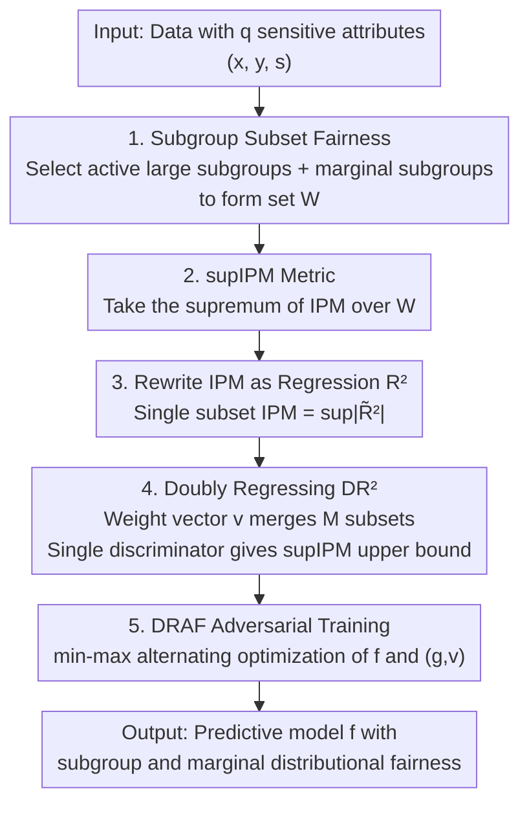

# Doubly-Regressing Approach for Subgroup Fairness

**Conference**: ICLR 2026  
**OpenReview**: [https://openreview.net/forum?id=17UDRTRLmp](https://openreview.net/forum?id=17UDRTRLmp)  
**Code**: https://github.com/subgroup-fair/draf  
**Area**: AI Safety / Algorithmic Fairness  
**Keywords**: Subgroup Fairness, Distributional Fairness, Adversarial Learning, IPM, Data Sparsity

## TL;DR
When numerous sensitive attributes lead to an explosion of subgroups and extreme data sparsity, this paper introduces "subgroup subset fairness" measured by supIPM. By employing a "Doubly Regressing $R^2$ (DR²)" proxy objective that simultaneously regresses weight vectors and a discriminator, the method ensures distributional fairness across all large subgroups and marginal attributes using **a single discriminator**, significantly outperforming existing methods on highly sparse datasets.

## Background & Motivation

**Background**: In algorithmic fairness, when only one sensitive attribute (e.g., gender) exists, models are required to achieve consistent prediction distributions across protected groups, known as marginal fairness. However, in reality, multiple sensitive attributes like gender, race, and age coexist, leading to subgroup fairness: requiring the distribution of $f(X)$ to be consistent across all $2^q$ intersectional subgroups $D_v=\{i:s_i=v\}$.

**Limitations of Prior Work**: As the number of sensitive attributes $q$ increases, the number of subgroups $2^q$ grows exponentially, resulting in two major drawbacks: **data sparsity**, where many subgroups contain only a few samples, making empirical subgroup fairness gaps unreliable estimates of the population gap; and **computational burden**, as measuring subgroup fairness gaps requires calculating distributional differences across $2^q$ constraints, each necessitating an adversarial optimization for distributional metrics (like IPM/MMD).

**Key Challenge**: Existing methods face a trade-off between "guaranteeing strong fairness" and "computational/statistical feasibility." Some resort to weak fairness (e.g., mean DP) or post-processing, sacrificing distributional fairness. Others (e.g., marginal-only approaches) are vulnerable to "fairness gerrymandering," where a model appears fair on individual attributes but systematically discriminates against intersectional subgroups (e.g., "minority women").

**Goal**: Design a learning algorithm that **simultaneously** addresses data sparsity and computational burden, achieving both (sufficiently large) subgroup fairness and marginal fairness under the strongest sense of distributional fairness.

**Key Insight**: Since empirical fairness on small subgroups cannot generalize, the focus should be restricted to subgroups with sufficient sample sizes. The authors define the union of several subgroups as a **subgroup subset** $W$ and enforce distributional fairness only on a pre-selected collection of non-negligible subgroup subsets. By including subsets corresponding to each marginal attribute in the collection $\mathcal{W}$, marginal fairness is also guaranteed.

**Core Idea**: Replace "per-subgroup adversarial training" with "subgroup subset fairness + a doubly-regressing proxy with a single discriminator," compressing exponential fairness constraints into a single min-max optimization.

## Method

### Overall Architecture

The methodology centers on finding a predictive model $f$ that is both accurate and fair across "all subgroups worth protecting" under high-dimensional, sparse conditions. The approach follows three steps: **redefining the target of fairness** (from all $2^q$ subgroups to a collection of selected subgroup subsets $\mathcal{W}$), **reformulating the metric** (rewriting the IPM distributional difference as a regression $R^2$), and **employing a differentiable proxy** (DR², which uses a single discriminator to approximate the supIPM upper bound for all subsets).

The pipeline is as follows: ① Select $\mathcal{W}$—including active subgroups with sample sizes larger than $\gamma n$ and first/second-order marginal subgroups; ② Use supIPM (the supremum of IPM over $\mathcal{W}$) as the total measure of distributional fairness; ③ Leverage Theorem 4.1 to equivalently rewrite the IPM of a single subset as a regression $R^2$, then use a weight vector $v$ to "linearly synthesize" $M$ subsets into DR²; ④ Use the DRAF algorithm to alternately optimize the model $f$ and the discriminator-weight pair $(g,v)$.

### Key Designs

**1. Subgroup Subset Fairness and supIPM: Focusing on Large Enough Subsets**

Enforcing fairness on all $2^q$ subgroups is computationally and statistically infeasible. The authors redefine the target: let $W\subseteq\{0,1\}^q$ be a subgroup subset, and $P_{f,W}$ be the conditional distribution of $f(X)$ given $S\in W$. For a family of subsets $\mathcal{W}$ and a distribution metric $\psi$, the subgroup subset fairness gap is defined as:

$$\Delta_{\psi,\mathcal{W}}(f)=\sup_{W\in\mathcal{W}}\psi(P_{f,W},P_{f,W^c}).$$

**Selecting $\mathcal{W}$** is critical: include active subgroups ($n_W\ge\gamma n$) to handle sparsity, and include marginal subgroups $W_{j,s}=\{i:s_{ij}=s\}$ for each sensitive attribute to prevent fairness gerrymandering. When $\psi$ is the IPM, $\Delta_{\psi,\mathcal{W}}$ is named **supIPM**. Theorem 3.1 provides statistical guarantees: the empirical estimation error of supIPM is $O(\sqrt{\log|\mathcal{W}|/n_{\mathcal{W}}})$, where $n_{\mathcal{W}}$ is the size of the smallest subset. This allows $\mathcal{W}$ to be large since the error only grows logarithmically with $|\mathcal{W}|$.

**2. Reformulating IPM as Regression $R^2$: A Differentiable Equivalence**

The IPM is defined as $\mathrm{IPM}_\mathcal{G}(P_0,P_1)=\sup_{g\in\mathcal{G}}|\int g\,dP_0-\int g\,dP_1|$. For a subset $W$, a classic approach is training a discriminator with labels $y_{W,i}=2\mathbb{I}(s_i\in W)-1$. Since misclassification rate is non-differentiable, the authors use **Residual Sum of Squares (RSS)** $\sum_i(y_{W,i}-g(f_i))^2$. As $f$ becomes fairer, $P_{f,W}$ and $P_{f,W^c}$ become more similar, making it harder for $g$ to fit the labels, thus increasing RSS. This is normalized into the coefficient of determination:

$$R^2(f,W,g)=1-\frac{\sum_i(y_{W,i}-g(f_i))^2}{\sum_i(y_{W,i}-\bar y_W)^2}.$$

Theorem 4.1 shows that a modified version $\tilde R^2$ satisfies $\mathrm{IPM}_\mathcal{G}(P_{f,W},P_{f,W^c})=\sup_{g}|\tilde R^2(f,W,g)|$. Thus, the **IPM is exactly equal to the supremum of a differentiable $R^2$**, translating distributional metrics into regression terms.

**3. Doubly Regressing $R^2$ (DR²): Merging $M$ Subsets with One Discriminator**

While Theorem 4.1 handles single subsets, optimizing $\sup_{W}\sup_g\tilde R^2$ still requires a separate discriminator for each $W$. The authors introduce a **weight vector** $v\in\mathbb{S}^M$ (on the $M$-dimensional unit sphere) to "linearly synthesize" subsets. With a membership coding $c_i=[c_{i1},\dots,c_{iM}]^\top$, the Doubly Regressing $R^2$ is:

$$\mathrm{DR}^2(f,v,g)=1-\frac{\sum_i(v^\top c_i-g(f_i))^2-\sum_i(g(f_i)-\mu_v)^2}{\sum_i(v^\top c_i-\mu_v)^2}.$$

This is "doubly regressing" because it **simultaneously regresses** $g(f_i)$ (discriminator side) and $v^\top c_i$ (subset synthesis side). When $v=e_k$, DR² reduces to $\tilde R^2(f,W_k,g)$, making $\sup_{g,v}|\mathrm{DR}^2|$ an **upper bound** of supIPM. For stability, the final objective applies the Fisher z-transformation to $|\mathrm{DR}^2|/2$. This decouples the computational complexity from the number of subsets.

**4. DRAF Adversarial Training: min-max Optimization**

The differentiable DR gap is integrated into the empirical risk as a regularizer, forming the DRAF training objective:

$$\min_f\ \frac1n\sum_i \ell(y_i,f(x_i,s_i))+\lambda\,\mathrm{DR}_{n,\mathcal{W},\mathcal{G}}(f),$$

where $\ell$ is the cross-entropy loss and $\lambda$ controls fairness strength. Optimization follows an adversarial min-max process: fix $(g,v)$ and minimize risk plus the fairness penalty for $f$; then fix $f$ and maximize DR² for $(g,v)$ to identify the "least fair" direction.

### Loss & Training
- Objective: $\frac1n\sum_i\ell(y_i,f(x_i,s_i))+\lambda\,\mathrm{DR}_{n,\mathcal{W},\mathcal{G}}(f)$ using cross-entropy.
- $\lambda$ is scanned between $0.01\sim10.0$ to adjust accuracy-fairness trade-offs.
- The discriminator class $\mathcal{G}$ uses sIPM (sigmoid ∘ linear), which is more stable than ReLU-IPM or Hölder-IPM.
- The threshold $\gamma$ is selected to maximize the area under the Acc–SP Pareto front.

## Key Experimental Results

### Main Results

Evaluated on four fairness benchmarks using a single-layer MLP across 5 runs. Baselines: REG (marginal only), GerryFair/GF (worst-case subgroup), SEQ (post-processing). Metrics: Accuracy (Acc), SP (subgroup), MP(l) (l-th order marginal).

| Dataset | $q$ / Subgroups | Sparse Subgroups | DRAF Performance |
|--------|------|------|------|
| ADULT | 4 / 16 | 2 | Comparable to REG and GF |
| DUTCH | 2 / 4 | 0 | Comparable to REG and GF |
| CIVILCOMMENTS | 3(non-binary) / 24 | 3 | Better SP than REG; better Acc-fairness trade-off than GF |
| COMMUNITIES | 18 / 262,144 (1,180 actual) | 1,175 | Better subgroup and marginal fairness than REG and GF |

Core conclusion: DRAF performs on par with baselines on non-sparse data and achieves significant leads on the **extremely sparse** COMMUNITIES dataset.

### Ablation Study

| Configuration / Analysis | Key Findings |
|------|---------|
| DR gap vs supIPM | Highly correlated and nearly equal after training ($v$ converges to vertices). |
| SP vs MP(1) Correlation | DRAF maintains lower linear SSE compared to GF/REG, indicating simultaneous control over subgroup and marginal fairness with one $\lambda$. |
| Removing Marginals from $\mathcal{W}$ | First/second-order marginal fairness degrades, confirming their necessity in $\mathcal{W}$. |
| Large $\gamma$ | Excludes high-order marginals, causing degradation in second-order and subgroup fairness. |
| Noise and Missing Attr | DRAF handles missing attributes by enforcing constraints only on observable subsets, outperforming GF. |

### Key Findings
- **Tightness of DR²**: The weight vector $v$ typically converges to a vertex, making DR² approximately equal to the single-subset $\tilde R^2$, ensuring the proxy is not overly loose.
- **Advantage in Sparsity**: Gains are most pronounced in datasets like COMMUNITIES where 99% of subgroups are tiny, validating the design choice of "protecting large subsets."
- **Scalability**: The method generalizes to multi-class classification and Equalized Odds (DRAF-EO).

## Highlights & Insights
- **Bridging Metrics and Regression**: Proving that IPM is exactly the supremum of $R^2$ provides an elegant "metric ↔ correlation" perspective for adversarial fairness.
- **Decoupling Constraints via Weight Vectors**: Using $v\in\mathbb{S}^M$ to merge $M$ discrete constraints into a continuous optimization enables a single discriminator to manage exponential constraints.
- **Statistically Grounded Sparsity Handling**: Theorem 3.1 justifies ignoring tiny subgroups not just as an engineering heuristic, but as a path to statistical generalization where error grows only with $\log|\mathcal{W}|$.

## Limitations & Future Work
- **Small Subgroup Protection**: The method provides limited guarantees for extremely small minority groups that fall below the threshold $\gamma$.
- **Hyperparameter Sensitivity**: The selection of $\gamma$ and the composition of $\mathcal{W}$ require cross-validation or manual heuristic balancing.
- **Future Directions**: Exploring ANOVA-like decompositions of subgroup fairness into low-order marginal combinations to enhance stability and interpretability.

## Related Work & Insights
- **vs GerryFair**: GF targets worst-case subgroup gaps but is computationally expensive for large $q$ and does not guarantee marginal fairness. DRAF handles both with a single discriminator in a distributional sense.
- **vs REG**: REG only targets individual attribute marginals, making it vulnerable to intersectional discrimination (fairness gerrymandering), which DRAF avoids by including subgroups.
- **vs Post-processing (SEQ)**: DRAF is an in-processing method allowing continuous adjustment of fairness via $\lambda$, unlike one-shot post-processing mappings.

## Rating
- Novelty: ⭐⭐⭐⭐⭐ 
- Experimental Thoroughness: ⭐⭐⭐⭐ 
- Writing Quality: ⭐⭐⭐⭐ 
- Value: ⭐⭐⭐⭐ 

<!-- RELATED:START -->

## Related Papers

- [\[ICLR 2026\] Certifying the Full YOLO Pipeline: A Probabilistic Verification Approach](certifying_the_full_yolo_pipeline_a_probabilistic_verification_approach.md)
- [\[CVPR 2026\] $\varphi$-DPO: Fairness Direct Preference Optimization Approach to Continual Learning in Large Multimodal Models](../../CVPR2026/ai_safety/φ-dpo_fairness_direct_preference_optimization_approach_to_continual_learning_in_.md)
- [\[ICLR 2026\] Bridging Fairness and Explainability: Can Input-Based Explanations Promote Fairness in Hate Speech Detection?](bridging_fairness_and_explainability_can_input-based_explanations_promote_fairne.md)
- [\[AAAI 2026\] ProbLog4Fairness: A Neurosymbolic Approach to Modeling and Mitigating Bias](../../AAAI2026/ai_safety/problog4fairness_a_neurosymbolic_approach_to_modeling_and_mitigating_bias.md)
- [\[ICML 2025\] Doubly Robust Fusion of Many Treatments for Policy Learning](../../ICML2025/ai_safety/doubly_robust_fusion_of_many_treatments_for_policy_learning.md)

<!-- RELATED:END -->
