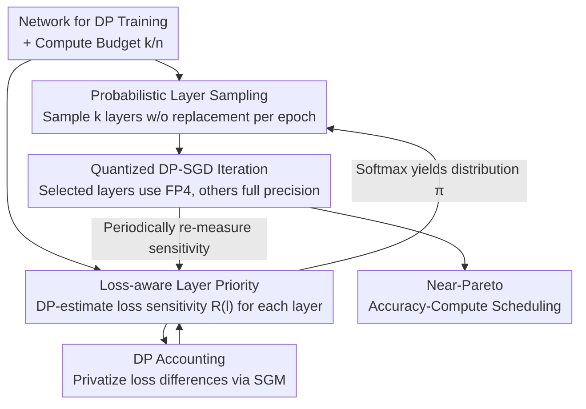

# DPQuant: Efficient and Private Model Training via Dynamic Quantization Scheduling

**Conference**: ICLR2026  
**OpenReview**: [https://openreview.net/forum?id=neaxYXGYd5](https://openreview.net/forum?id=neaxYXGYd5)  
**Code**: To be confirmed  
**Area**: AI Security / Differential Privacy / Quantized Training  
**Keywords**: Differential Privacy, DP-SGD, Quantization, Dynamic Scheduling, Training Acceleration

## TL;DR
DPQuant points out for the first time that "low-bit quantization causes much more severe accuracy collapse in Differential Privacy (DP) training than in standard training." It suppresses quantization variance by using "probabilistic rotation of layers to be quantized per epoch + a DP loss sensitivity estimator to prioritize quantization of low-impact layers." It achieves accuracy drops of <2% on ResNet/DenseNet/BERT, with a theoretical speedup of up to 2.21×.

## Background & Motivation
**Background**: When training neural networks with sensitive data, DP-SGD (and its adaptive version DP-Adam) provides formal privacy guarantees through "per-sample gradient clipping + adding Gaussian noise," serving as the de facto standard for private training. Simultaneously, converting weights and activations to low-precision formats (quantization, e.g., FP8/INT4/FP4) significantly reduces compute, memory, power, and cost—new hardware (NVIDIA Blackwell’s FP4 provides 4× throughput of FP16; AMD/TPU/Trainium’s FP8; Qualcomm Hexagon’s INT4) is moving toward ultra-low precision. Combining these two should ideally bring massive benefits in compute-constrained scenarios like edge Federated Learning.

**Limitations of Prior Work**: The authors found that directly applying ultra-low precision quantization to DP training leads to severe accuracy degradation—up to a 40% drop in worst cases. While full quantization usually drops only about 1% under standard (non-DP) SGD, the same configuration under DP-SGD can drop 5%, and the performance variance depending on "which layers are quantized" is much larger. In short, the "lossless quantization" heuristic from standard training completely fails in DP training.

**Key Challenge**: The root cause lies in the noise injected by DP. The update of DP-SGD is $w_{t+1}=w_t-\eta(\bar g_t+n_t)$, where the clipped gradient satisfies $\|\bar g_t\|_2\le C$ and the noise $n_t\sim N(0, \sigma^2C^2 I)$. Since the noise standard deviation is on the same order as the 2-norm of the clipped gradient, in high dimensions $\|\bar g_t\|_2\gg\|\bar g_t\|_\infty$, thus $\|n_t\|_\infty\approx\|\bar g_t\|_2\gg\|\bar g_t\|_\infty$ (measured noise magnitude is on average 25 times the clipped gradient element). Weight updates dominated by noise amplify the $\infty$-norm of the "original gradient" in the next round to $O(\|g_t\|_2)$, while the quantizer variance is proportional to $\|x\|_\infty^2$ (Proposition 1: $\mathrm{Var}(q(x))=\Theta(\|x\|_\infty^2)$). Overlaid, the quantization variance under DP is amplified from $O(\|g_t\|_\infty^2)$ to $O(\|g_t\|_2^2)$, much larger than in standard training, leading to slower convergence and accuracy collapse.

**Goal**: Design an automatic mechanism to perform effective quantization for DP training while maintaining accuracy and incurring almost no extra privacy budget.

**Key Insight**: The authors observed that it is not necessary to quantize every layer every epoch. Quantizing only a subset of layers and rotating this subset every epoch can preserve most of the efficiency gains from quantization while recovering accuracy.

**Core Idea**: A **dynamic quantization scheduler** composed of "Probabilistic Layer Sampling (rotating quantized layers to dilute variance) + Loss-aware Layer Priority (using a DP estimator to keep high-impact layers in full precision)," where the scheduling process itself satisfies differential privacy.

## Method

### Overall Architecture
DPQuant is a "dynamic quantization scheduler" wrapped around the standard DP training loop. Inputs are a network to be DP-trained and a compute budget (requesting $k/n$ layers to be quantized per epoch). The output is a per-epoch strategy for "which layers to quantize," keeping the accuracy close to the Pareto front under the given budget. Its operation consists of three parts: first, a **lightweight profiling step** measures the loss increment $R(l_i)$ caused by quantizing each layer on a private data subset (this step is privatized via DP and consumes a very small privacy budget); second, these sensitivities are converted via softmax into a **sampling distribution** $\pi_i$, from which **$k$ layers are sampled without replacement** to be quantized each epoch; selected layers use LUQ-FP4 for low-precision forward/backward, while others remain in full precision, following the quantized DP-SGD iteration. This cycle continues: train for a few steps → re-measure loss sensitivity → update strategy EMA → re-sample layer sets.

### Key Designs

**1. Probabilistic Layer Sampling: Diluting Quantization Variance Across the Network**

This addresses the "quantization variance amplified by DP noise" issue directly. Suppose a layer is quantized with probability $p$. Let $g_{fp}$ be its full-precision gradient and $g_{quant}$ be its quantized gradient. From the previous analysis $\mathrm{Var}(g_{fp})\le\mathrm{Var}(g_{quant})$, the expected variance of the layer's gradient is:

$$\mathbb{E}\big(\mathrm{Var}(g)\big)=(1-p)\,\mathrm{Var}(g_{fp})+p\,\mathrm{Var}(g_{quant})\le \mathrm{Var}(g_{quant}).$$

As long as $p<1$ (i.e., only a subset is quantized per epoch), the average quantization variance is strictly less than "full quantization." Crucially, **rotating** the quantized layers every epoch ensures no single layer repeatedly endures the full quantization variance, lowering the expected variance for every layer over the long term. It doesn't reduce the total amount of quantization but "spreads" it across different layers and epochs, preventing variance accumulation in specific layers—a stability mechanism critical for DP but unnecessary for standard training.

**2. Loss-aware Layer Priority: Keeping Accuracy-Sensitive Layers in Full Precision**

Random rotation alone is insufficient—ablations show that pure Probabilistic Layer Sampling (PLS), while consistently better than static baselines, still lags behind the "optimal layer selection," implying key layers are still being quantized incorrectly. The authors define the expected loss increment for a quantization strategy $p$ (the set of layers to quantize) as:

$$R(p):=\mathbb{E}_D\big[L(M_p(D))-L(M_{fp32}(D))\big],$$

The goal is to find strategies with small $R(p)$. Since computing the expectation over the private dataset $D$ is expensive and risks privacy, it is estimated using **sub-sampling + brief DP-SGD runs to get proxy losses**: the average loss is taken over $R$ iterations for each strategy and the "no-quantization baseline," and the difference is calculated. After obtaining layer sensitivity $R(l_i)$, sampling probabilities are derived via temperature-controlled softmax:

$$\pi_i:=\frac{\exp(-\beta R(l_i))}{\sum_{j=1}^n\exp(-\beta R(l_j))},\quad i=1,\dots,n,$$

where $\beta>0$ controls the "preference for low-impact layers." Sampling $k$ layers **without replacement** per epoch according to $\{\pi_i\}$ combines variance dilution with "key layer protection." Ablations show this design (+LLP) provides greater gains as the quantization ratio increases, as the random baseline is more likely to quantize critical layers while DPQuant keeps them in full precision.

**3. DP Accounting: Making Sensitivity Estimation Private with Minimal Budget**

Design 2 calculates loss differences directly on private data $D$, which is a query on sensitive data. To prevent leaks, this process is wrapped in a **Sampled Gaussian Mechanism (SGM)**: a batch is sampled from $D$, loss values are clipped to a norm bound $C$ to limit sensitivity, and Gaussian noise with scale $\sigma$ is added:

$$\hat R\leftarrow R\cdot\min\!\Big(1,\tfrac{C}{\|R\|_2}\Big)+N(0,\sigma^2C^2 I).$$

Proposition 2 proves that Algorithm 1 is an SGM with sampling rate $q=|B|/|D|$ and noise scale $\sigma$, allowing the use of Opacus’s privacy accountant to track "analysis" and "training" costs together under advanced composition. Finally, EMA smoothing $L[p]\leftarrow(1-\alpha)L[p]+\alpha\hat R[p]$ is used to reduce jitter from single-shot noise estimation. Experiments (Fig. 3) indicate that the privacy budget consumed by analysis is negligible compared to training—this is what makes "dynamic scheduling" viable in a DP framework.

> This applies similarly to DP-Adam/DP-AdamW: Adam’s preconditioner applies the same coordinate-wise scaling to signal and noise, maintaining their relative ratio. In strong DP regimes ($\sigma C\gg\|g\|_2\gg|g_i|$), the coordinate-wise SNR $\mathrm{SNR}_i\approx g_i^2/(\sigma^2C^2)$ is consistent with DP-SGD, making the quantization costs and DPQuant’s conclusions portable.

### Loss & Training
The training objective is unchanged: standard DP-SGD/DP-Adam (clipping + noise). New tunable parameters include: quantization ratio $k/n$, temperature $\beta$, sensitivity analysis frequency (often once every 2 epochs), analysis iterations $R$, sub-sample batch size $B$, loss clipping norm $C$, analysis noise scale $\sigma$, and EMA coefficient $\alpha$. The low-precision format used is LUQ-FP4 (4-bit floating point with 1 sign bit and 3 exponent bits), currently the highest performing 4-bit format. FP8 and 4-bit uniform quantization are also tested in the appendix.

## Key Experimental Results

### Main Results
Models ResNet18/50, DenseNet121 (DP-SGD) and BERT (DP-AdamW) were evaluated on EMNIST, GTSRB, CIFAR-10, and SNLI using Opacus. The table below shows validation accuracy at $\varepsilon=8$ for various quantization ratios (Baseline is static quantization, mean ± std of random subsets; Ours is DPQuant):

| Model / Dataset | Quantization Ratio | Baseline (ε=8) | DPQuant (ε=8) |
|--------------|---------|----------------|---------------|
| ResNet18 / GTSRB | 0.5 | 69.06 ± 5.63 | **76.75** |
| ResNet18 / GTSRB | 0.9 | 57.49 ± 4.46 | **67.67** |
| ResNet50 / GTSRB | 0.75 | 58.13 ± 8.50 | **69.03** |
| ResNet50 / GTSRB | 0.9 | 47.40 ± 7.23 | **59.87** |
| DenseNet121 / GTSRB | 0.5 | 65.47 ± 5.42 | **71.05** |
| BERT / SNLI | 0.5 | 62.54 ± 4.54 | **67.80** |

Across both $\varepsilon=4$ and $\varepsilon=8$, DPQuant outperforms the static baseline by at least one standard deviation in most settings without exceeding the privacy budget; it remains robust even at $\varepsilon=4$ where analysis costs are more prominent. Similar gains are observed at $\varepsilon=1$ in the appendix.

### Ablation Study

| Configuration | Key Observation | Description |
|------|---------|------|
| Baseline (Static) | Worst | Fixed layer quantization; random selection can cause 40% drop. |
| +PLS (Prob. Sampling) | Consistently > Baseline | Better stability but still short of optimal layer selection. |
| +PLS+LLP (Full DPQuant) | Best | Critical layers are kept in full precision; gains increase with quantization ratio. |

### Key Findings
- The chain of "noise → high gradient → large quantization variance" amplifying variance from $O(\|g\|_\infty^2)$ to $O(\|g\|_2^2)$ is the root cause of DP quantization failure (Fig. 1 shows gradient norms are ~2× higher in DP vs. SGD).
- Both mechanisms are essential: PLS dilutes variance but doesn't save "critical layers," while LLP protects high-impact layers. Their combination is optimal.
- Theoretical Acceleration: Assuming 90% layer quantization and a conservative 4× operator speedup for FP4 vs. FP16, the linear compute model $T_{ours}=T_{analysis}+(1-p+p/4)(T_{train}-T_{overhead})+T_{overhead}$ estimates that DPQuant is 1.75×–2.21× faster than the FP16 baseline, with minimal runtime overhead from LLP.

## Highlights & Insights
- **Deconstruction of "lossless quantization" in the DP context**: Using $\|n\|_\infty\approx\|\bar g\|_2\gg\|\bar g\|_\infty$ and Proposition 1, the authors elegantly explain why quantization variance is amplified by an order of magnitude in DP—this is the most compelling aspect of the paper.
- **"Rotation" as a generic variance control method**: Spreading a quantization budget across layers and epochs to avoid variance accumulation is a strategy transferable to other scenarios involving noisy gradients and low precision.
- **Privatizing the scheduling decision itself**: Integrating sensitivity estimation into the SGM framework and accounting for it via Opacus ensures that the dynamic scheduler is safe to use in DP settings with negligible overhead.

## Limitations & Future Work
- **Theoretical vs. Measured Acceleration**: Hardware for FP4 MatMul/Conv2D (e.g., Blackwell) is not yet ubiquitous. The 2.21× speedup is based on a linear model + vendor/prior work assumptions. Real end-to-end gains require hardware validation.
- **Computational Overhead of Estimation**: Re-measuring sensitivity requires periodic sub-sampled proxy loss runs. While its privacy cost is negligible, its wall-clock overhead needs further assessment on deeper networks or with more frequent analysis.
- **Task Coverage**: Evaluation focused on vision classification and one NLP task with mid-sized models (ResNet/DenseNet/BERT). Generalization to Large Language Model (LLM) pre-training or generative tasks remains an open question.

## Related Work & Insights
- **vs. Post-Training Quantization (PTQ) / Quantization-Aware Training (QAT)**: PTQ only speeds up inference. QAT speeds up training but often incurs overhead from hardware simulation or parameter tuning that offsets the bit-width gains. DPQuant target the compute of the DP training phase itself with lightweight DP-compatible estimation.
- **vs. Gradient Compression / Quantization as Privacy**: Gradient compression generally targets communication costs, not computational costs, and often relies on error feedback which is hard to reconcile with DP. "Quantization as privacy" works apply quantization after gradients are computed in full precision, whereas DPQuant quantizes weights and activations during training.
- **vs. Mixed-Precision DP Training**: 16-bit mixed precision is nearly lossless for DP-SGD but fails at FP4/INT4 (explained in Section 4). DPQuant is orthogonal to improved DP optimizers or clipping implementations as it optimizes the amount of computation performed in low precision.

## Rating
- Novelty: ⭐⭐⭐⭐⭐ First systematic explanation of ultra-low precision quantization collapse in DP training, with a provably-DP dynamic scheduling solution.
- Experimental Thoroughness: ⭐⭐⭐⭐ Broad coverage of models, datasets, and privacy budgets with clear ablations; theoretical speedup lacks end-to-end hardware validation.
- Writing Quality: ⭐⭐⭐⭐⭐ Logical progression from phenomena to norm analysis to methodology and privacy accounting.
- Value: ⭐⭐⭐⭐ Clears a major hurdle for efficient private training, directly applicable to edge and federated DP training.

<!-- RELATED:START -->

## Related Papers

- [\[ICML 2025\] Private Model Personalization Revisited](../../ICML2025/ai_safety/private_model_personalization_revisited.md)
- [\[ICLR 2026\] LiteGuard: Efficient Task-Agnostic Model Fingerprinting with Enhanced Generalization](liteguard_efficient_task-agnostic_model_fingerprinting_with_enhanced_generalizat.md)
- [\[ICLR 2026\] Missing Mass for Differentially Private Domain Discovery](differentially_private_domain_discovery.md)
- [\[ICLR 2026\] Differentially Private Two-Stage Gradient Descent for Instrumental Variable Regression](differentially_private_two-stage_gradient_descent_for_instrumental_variable_regr.md)
- [\[ICLR 2026\] PE-SGD: Differentially Private Deep Learning via Evolution of Gradient Subspace for Text](pe-sgd_differentially_private_deep_learning_via_evolution_of_gradient_subspace_f.md)

<!-- RELATED:END -->
