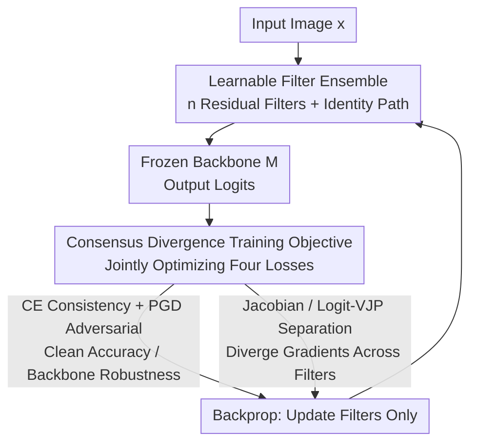

# DRIFT: Divergent Response in Filtered Transformations for Robust Adversarial Defense

**Conference**: ICLR2026  
**OpenReview**: [https://openreview.net/forum?id=AYH7uBK1Gg](https://openreview.net/forum?id=AYH7uBK1Gg)  
**Code**: TBD  
**Area**: AI Safety / Adversarial Robustness / Adversarial Defense  
**Keywords**: Adversarial Defense, Gradient Consensus, Learnable Filters, Adaptive Attacks, Robust Accuracy

## TL;DR
DRIFT prepends a set of lightweight learnable filters to a frozen classifier and employs a "consensus divergence" loss to actively scatter the gradient directions of different filters. This effectively disrupts the "gradient consensus" that adversarial perturbations rely on for transferability. On ImageNet, for both CNNs and ViTs, DRIFT achieves state-of-the-art robust accuracy against strong adaptive attacks such as PGD-EoT, AutoAttack, and BPDA, with almost no increase in inference overhead.

## Background & Motivation
**Background**: Mainstream adversarial defense methods generally fall into four categories: input transformations (JPEG compression, BaRT random blurring/noise), randomized smoothing (RS), adversarial training (AT), and recent diffusion purification (DiffPure/DiffDefense, which "projects" adversarial samples back to the data manifold). These methods provide some robustness under weak attacks.

**Limitations of Prior Work**: Most defenses fail once an attacker can reliably estimate gradients. Input transformations are non-differentiable and rely on gradient masking, which fails against BPDA (approximating backpropagation with identity or average pooling). Randomized smoothing can be bypassed by EoT (Expectation over Transformation, which averages gradients over multiple random passes). Diffusion purification is computationally prohibitive for ImageNet-scale real-time applications and can be broken if the attacker includes the purification steps in the optimization loop.

**Key Challenge**: The authors attribute the root cause to an overlooked phenomenon: **gradient consensus**. Even with randomness added to the defense, gradient directions from different random transformations often remain aligned, forming a low-variance "proxy gradient landscape." When attackers aggregate these gradients via EoT, the aligned components emerge, enabling the creation of perturbations that are effective (transferable) across different transformations. Thus, the problem is not "insufficient randomness" but "gradient alignment."

**Goal**: Rather than continuing to hide gradients (masking), the goal is to **destroy gradient alignment**. If the gradients of different transformations diverge, the attacker's summation results only in conflicting, decorrelated noise signals, naturally undermining transferability.

**Key Insight**: The authors formalize the relationship "gradient consensus → transferability" and provide theoretical bounds. They then design a training objective that allows a set of differentiable filters to **actively** learn divergent gradient geometries while maintaining clean prediction accuracy.

**Core Idea**: Replace "gradient masking" with "gradient divergence"—train an ensemble of lightweight learnable filters to maximize response divergence in both Jacobian and logit spaces, neutralizing the gradient consensus necessary for adversarial transfer.

## Method

### Overall Architecture
DRIFT prepends a set of lightweight, differentiable, dimension-preserving filters $\{f_i\}_{i=1}^n$ (along with an identity path $f_{\text{id}}(x)=x$) to a **frozen** pre-trained classifier $M$, forming $n$ pipelines $F_i(x)=M(f_i(x))$. During inference, a single pipeline is randomly sampled to provide the prediction, thus acting as a randomized ensemble. During training, a "consensus divergence" objective, which is a weighted sum of four loss terms, is used to **update only the filters while keeping the backbone fixed**. The core of the objective consists of two separation losses: they measure the similarity of gradient responses from different filters toward random probe directions and penalize this similarity, forcing the filters to learn decorrelated gradient directions. Simultaneously, a cross-entropy loss ensures clean accuracy, and a PGD adversarial loss ensures each pipeline remains robust against attacks generated from the backbone's gradient. This pipeline is plug-and-play and requires no structural changes or retraining of any pre-trained classifier.

### Key Designs

**1. Gradient Consensus: Quantifying the Root of Adversarial Transferability**

The authors decompose the input gradient using the chain rule: $\nabla_x \ell(F_i(x),y) = J_{f_i}(x)^\top J_M(f_i(x))^\top \nabla_z \ell(z,y)$, showing that the adversarial direction is jointly shaped by the logit space factor $\nabla_z\ell$ and two Jacobians ($J_M$, $J_{f_i}$)—the targets DRIFT aims to decouple. Based on this, they define the **gradient consensus** between two filters at input $x$ as the squared cosine similarity of normalized gradients $\Gamma(f_i,f_j;x)=\big(\tfrac{\langle g_i,g_j\rangle}{\|g_i\|\,\|g_j\|}\big)^2\in[0,1]$, where $g_i=\nabla_x\ell(M(f_i(x)),y)$. A high $\Gamma$ indicates shared adversarial directions (strong transferability), while a low $\Gamma$ indicates divergent gradient subspaces. The authors further provide a theorem: under $L$-smoothness and bounded gradient assumptions, the success rate of a perturbation $\delta$ crafted on $f_i$ transferring to $f_j$ is linearly bounded by $\Gamma$—$p_j(x,\delta)\le C\cdot\epsilon G\cdot\Gamma(f_i,f_j;x)$. If the overall expected consensus $\mathbb{E}_{i\ne j}[\Gamma]\le\rho\ll1$, the transfer success rate becomes $O(\epsilon G\rho)$. This theory links "reducing consensus" with "reducing transferability," directly guiding the optimization of the loss function.

**2. Learnable Filter Ensemble: Plug-and-Play Lightweight Residual Front-end**

To shift the gradient geometry without destroying clean predictions, each filter is implemented as a lightweight residual convolutional block: $f(x)=x+\text{Conv}_{16\to3}(\text{ReLU}(\text{Conv}_{3\to16}(x)))$ ($3\times3$ convolutions expanding to 16 channels, ReLU, then back to 3 channels, with a skip connection). The residual structure keeps $f$ naturally close to an identity mapping, ensuring clean images are minimally altered while providing enough degrees of freedom to learn transformations that cause adversarial gradients to diverge. Because they preserve the input shape, $J_{f_i}(x)$ is a square matrix, and $M$ can process $f_i(x)$ without modification, making the defense plug-and-play for any backbone (default $n=4$ filters). The **identity path** is explicitly included during training to block the "attacker blind spot" of targeting $M$'s own gradients and bypassing the filter structure, forcing the defense to be robust even against attacks that ignore the filters. Compared to handcrafted fixed transformations like BaRT, the filters in DRIFT are learned, differentiable, and optimized for robustness.

**3. Consensus Divergence Training Objective: Scattering Gradients with Four Losses**

The training objective implements the "low $\rho$" requirement from Design 1 using two separation losses, paired with two baseline losses, weighted as $L=\alpha L_{CE}+\beta_{JS}L_{JS}+\beta_{LVJP}L_{LVJP}+\lambda L_{adv}$. Specifically, **Jacobian Separation Loss** penalizes Vector-Jacobian Product (VJP) alignment across filters in the feature layer: $L_{JS}=\mathbb{E}_{i<j}\mathbb{E}_v[\cos^2(J_{f_i}(x)^\top v,\,J_{f_j}(x)^\top v)]$, estimated via reverse-mode auto-differentiation with random probe vectors $v$ (Hutchinson probes) without explicitly constructing Jacobians. **Logit-VJP Separation Loss** penalizes alignment in the decision layer: $L_{LVJP}=\mathbb{E}_{i<j}\mathbb{E}_w[\cos^2(\nabla_x\langle M(f_i(x)),w\rangle,\,\nabla_x\langle M(f_j(x)),w\rangle)]$, using random directions $w\in\mathbb{R}^K$ to probe how filtered inputs propagate into category decisions. These two losses enforce divergence in the Jacobian and logit subspaces, respectively. **Cross-Entropy Loss** $L_{CE}=\tfrac1K\sum_i\ell(M(f_i(x)),y)$ maintains clean accuracy, and **Adversarial Loss** $L_{adv}=\max_i\ell(M(f_i(x+\delta_M)),y)$ trains filters to withstand direct attacks crafted in the backbone gradient space using perturbations $\delta_M$. Together, these terms ensure stable clean predictions, divergent subspaces, and robustness against both backbone and cross-filter attacks.

### Loss & Training
Default $n=4$ filters, $\epsilon=4/255$, PGD iterations $T=10$, step size $\eta=\epsilon/T=0.4/255$. Weights $\alpha=1, \beta_{JS}=0.5, \beta_{LVJP}=0.5, \lambda=1$. Separation losses use 5 random probes each, trained for 100 epochs. Optimized using AdamW with a learning rate of $1\text{e-}3$ and weight decay of $1\text{e-}4$. Training data is a random subset of the ImageNet validation set, with the remainder reserved for evaluation to ensure filters are not exposed to test samples.

## Key Experimental Results

### Main Results (Non-Adaptive, ϵ=4/255 for ℓ∞, ϵ=1 for ℓ₂)
The attacker has white-box access to the backbone but is unaware of the defense. DRIFT maintains clean accuracy while leading in robust accuracy across various attacks:

| Model | Defense | No Attack | PGD ℓ∞ | AutoAttack | Square |
|------|------|-----------|--------|-----------|--------|
| ResNet-v2 | JPEG (q=50) | 44.97 | 41.27 | 8.99 | 8.47 |
| ResNet-v2 | BaRT (k=5) | 50.79 | 23.28 | 12.70 | 15.34 |
| ResNet-v2 | DiffPure | 67.79 | 65.43 | 67.01 | 62.88 |
| ResNet-v2 | **Ours (n=4)** | **84.66** | **76.19** | **74.30** | **80.95** |
| ViT-B/16 | **Ours (n=4)** | 80.48 | 74.66 | 77.30 | 77.30 |
| Inception-v3 | **Ours (n=4)** | 80.96 | 76.83 | 76.50 | 79.89 |
| DeiT-S | **Ours (n=4)** | 82.42 | 76.67 | 76.24 | 80.07 |

JPEG and BaRT drop clean accuracy to 44–50%, whereas DRIFT maintains 84.66% clean accuracy on ResNet-v2 and achieves 74.30% AutoAttack robust accuracy (compared to 67.01% for DiffPure).

### Adaptive Attacks (BPDA+EoT / EoT, ϵ=4/255, 40 steps)
This is the critical test: traditional input transformations drop to nearly zero robustness under adaptive analysis.

| Defense | Adaptive | ResNet-v2 PGD | ResNet-v2 AA | ViT-B/16 PGD | ViT-B/16 AA |
|------|--------|---------------|--------------|--------------|-------------|
| JPEG | BPDA+EoT | 0 | 0 | 0 | 0 |
| BaRT | BPDA+EoT | 6.0 | 0 | 7.31 | 4.67 |
| DiffPure | EoT | 36.43 | 40.93 | NA | NA |
| **Ours** | EoT | 53.78 | 50.12 | 56.74 | 54.90 |
| **Ours** | BPDA+EoT | **60.19** | **58.73** | **64.17** | **61.23** |

JPEG/BaRT collapse to below 10%. AT and its variants (FFR+AT/ANF+AT) show limited robustness and suffer from significant clean accuracy drops. DiffPure with BPDA+EoT was computationally infeasible due to memory limits on the tested hardware. DRIFT maintains over 50% across four backbones against BPDA+EoT.

### Ablation Study (Adaptive PGD Robust Accuracy)

| Loss Configuration | ResNet-v2 Non-Adaptive | ResNet-v2 Adaptive |
|----------|-------------------|------------------|
| $L_{CE}+L_{adv}$ | 75.66 | 3.70 |
| $+L_{JS}$ | 77.21 | 39.80 |
| $+L_{LVJP}$ (Alone) | — | 47.61 |
| All ($L_{CE}+L_{JS}+L_{LVJP}+L_{adv}$) | ≈75+ | **53.78** |

### Key Findings
- Using only CE and Adversarial Training yields 75.66% non-adaptive robustness but drops to 3.70% under adaptive attack, proving that adversarial training alone cannot withstand EoT/BPDA.
- The two separation losses are the lifeblood of adaptive robustness: adding $L_{JS}$ raises adaptive robustness from 3.70% to 39.80%, and $L_{LVJP}$ is even more potent (47.61% alone). Combining all three reaches 53.78% **without sacrificing** non-adaptive accuracy.
- Comparison with Randomized Smoothing: Under ℓ₂ radii, DRIFT's empirical robust accuracy generally exceeds SmoothAdv/CAF (e.g., +9.1 to +19.5 points higher than SmoothAdv on ResNet-50). However, the authors emphasize that RS provides **certified** values, whereas DRIFT provides **empirical** results.

## Highlights & Insights
- **Diagnosing "Why Random Defense Fails" as Gradient Consensus**: The failure of many randomized defenses is not due to a lack of randomness, but because different random branches still have aligned gradients. This perspective gives a provable upper bound on transferability and identifies exactly what to optimize.
- **"Gradient Divergence" over "Gradient Masking"**: DRIFT remains fully differentiable and avoids the "false robustness" trap of gradient masking. Consequently, it is naturally immune to BPDA, which is designed to break non-differentiable layers.
- **Jacobian Separation via VJP + Hutchinson Probes**: Since constructing a full Jacobian is impossible in high dimensions, the authors use reverse-mode AD with random probe vectors to provide an unbiased estimate of gradient similarity. This "probing" technique is applicable to any training objective requiring constraints on Jacobian geometry.
- **Plug-and-Play with Minimal Overhead**: Filters are lightweight residual blocks close to identity, and the backbone is frozen. This makes DRIFT friendly for real-time large-scale deployment with a migration cost much lower than adversarial training or diffusion purification.

## Limitations & Future Work
- Robust accuracy numbers are **empirical** rather than certified. DRIFT does not provide a certificate like randomized smoothing, and its results should not be directly equated with RS certified radii.
- DiffPure performance under BPDA+EoT is marked as NA due to hardware memory limits; thus, some comparisons were conducted under restricted conditions, and the upper bound of some strong baselines might not be fully explored.
- Evaluation is primarily on ImageNet validation subsets with four representative backbones. Performance under larger perturbation budgets or other threat models (e.g., ℓ₀ or semantic attacks) requires further validation.
- While adaptive robustness is significantly improved, absolute values remain in the 50–64% range, still short of "guaranteed safety" for high-stakes deployment. Systemic study on hyperparameters like the number of filters and probes is ongoing.

## Related Work & Insights
- **vs BaRT / JPEG (Input Transformations)**: These rely on handcrafted fixed random/non-differentiable transformations that mask gradients, failing under adaptive BPDA+EoT. DRIFT uses learned differentiable filters to actively diverge gradients, granting immunity to BPDA.
- **vs Adversarial Training (AT/FFR+AT/ANF+AT)**: AT retrains the backbone on adversarial samples, which is costly, hurts clean accuracy, generalizes poorly to unseen threats, and still fails against EoT. DRIFT freezes the backbone, only training a lightweight front-end, achieving both clean accuracy and adaptive robustness.
- **vs DiffPure (Diffusion Purification)**: DiffPure relies on projecting inputs back to the manifold. It is powerful on small datasets but computationally infeasible for real-time ImageNet tasks and can be bypassed if the purifier is included in the optimization loop. DRIFT is lightweight and avoids generative reconstruction.
- **vs Randomized Smoothing (RS/SmoothAdv/CAF)**: RS provides certified radii but requires many smoothing passes and is certified rather than empirical. DRIFT offers higher empirical robustness under adaptive white-box settings but lacks a formal certificate.

## Rating
- Novelty: ⭐⭐⭐⭐⭐ Formalizing "gradient consensus" to prove it controls transferability and designing "gradient divergence" defense is theoretically and conceptually robust.
- Experimental Thoroughness: ⭐⭐⭐⭐ Covers CNNs/ViTs across four backbones with white-box, transfer, black-box, and adaptive attacks, though some strong baselines were limited by hardware.
- Writing Quality: ⭐⭐⭐⭐ Clear connection between theory and method; motivation progresses logically; tables and formulas are self-consistent.
- Value: ⭐⭐⭐⭐⭐ Plug-and-play, near-zero overhead, and significant lead in adaptive robustness. "Destroying gradient alignment" is a powerful, generalizable defense principle.

<!-- RELATED:START -->

## Related Papers

- [\[ICLR 2026\] LAMDA: A Longitudinal Android Malware Benchmark for Concept Drift Analysis](lamda_a_longitudinal_android_malware_benchmark_for_concept_drift_analysis.md)
- [\[ICLR 2026\] Adversarial Attacks Already Tell the Answer: Directional Bias-Guided Test-time Defense for Vision-Language Models](adversarial_attacks_already_tell_the_answer_directional_bias-guided_test-time_de.md)
- [\[ICLR 2026\] Zero-Sacrifice Persistent-Robustness Adversarial Defense for Pre-Trained Encoders](zero-sacrifice_persistent-robustness_adversarial_defense_for_pre-trained_encoder.md)
- [\[ICLR 2026\] Robust Spiking Neural Networks Against Adversarial Attacks](robust_spiking_neural_networks_against_adversarial_attacks.md)
- [\[CVPR 2026\] AdvMark: Decoupling Defense Strategies for Robust Image Watermarking](../../CVPR2026/ai_safety/decoupling_defense_strategies_for_robust_image_watermarking.md)

<!-- RELATED:END -->
