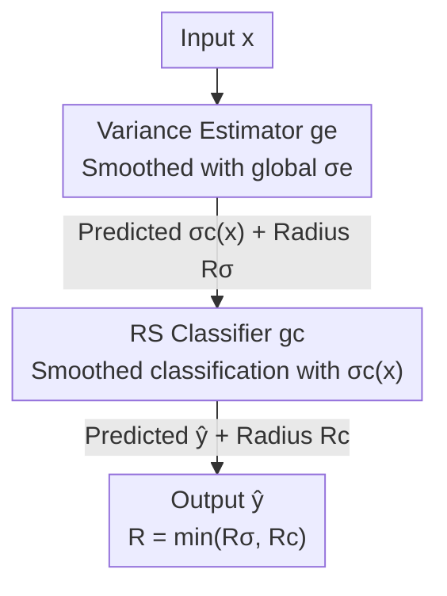

# Dual Randomized Smoothing: Beyond Global Noise Variance

**Conference**: ICLR 2026  
**OpenReview**: [https://openreview.net/forum?id=syvfsHSqm2](https://openreview.net/forum?id=syvfsHSqm2)  
**Code**: https://github.com/eth-sri/Dual-Randomized-Smoothing  
**Area**: AI Safety / Certified Robustness  
**Keywords**: Randomized Smoothing, Certified Robustness, Input-dependent Noise, Accuracy-Robustness Trade-off, Expert Routing

## TL;DR
This paper points out that standard Randomized Smoothing (RS) serves all inputs with a single global noise variance, leading to an inability to balance performance across small and large radii. The authors first theoretically prove that RS certification remains valid as long as the noise variance is "locally constant" within the certified region. Consequently, the **Dual RS framework** is proposed—first using an RS model to predict the optimal variance for each input, and then using another RS classifier for classification at that variance. This achieves strong performance across both small and large radii on CIFAR-10 and ImageNet, with inference overhead increasing by only approximately 60%.

## Background & Motivation

**Background**: Randomized Smoothing (RS) is currently the most prominent method for certified $\ell_2$ robustness. It adds Gaussian noise $\delta\sim\mathcal{N}(0,\sigma^2 I)$ to the input and uses majority voting to construct a smoothed classifier $g_c(x)=\arg\max_y P_\delta[f(x+\delta)=y]$, guaranteeing that the output remains unchanged within the certified radius $R=\sigma\Phi^{-1}(p_\sigma)$ (where $\Phi$ is the standard normal CDF). Recent developments in denoised smoothing leverage off-the-shelf diffusion models as denoisers, pushing certified accuracy at small radii to SOTA levels.

**Limitations of Prior Work**: In the certified radius formula $R=\sigma\Phi^{-1}(p_\sigma)$, $\sigma$ is a global constant—all inputs share the same noise variance. A small $\sigma$ yields high accuracy at small radii but results in a zero radius for large perturbations; a large $\sigma$ provides guarantees for large radii but causes accuracy at small radii to collapse. Fig. 1 in the paper provides evidence: statistics of the "optimal $\sigma$ that maximizes the certified radius" for each sample show a distribution spanning from 0.125 to 1.0, indicating that no single global $\sigma$ can accommodate all samples.

**Key Challenge**: The root of this accuracy-robustness trade-off lies in the assumption of a "globally shared $\sigma$." The noise scales required by different samples vary significantly; forcing a single value to fit all inevitably leads to sub-optimal performance.

**Key Insight**: Is it possible to make $\sigma$ input-dependent? Previous attempts have had fundamental flaws: one category (Alfarra/Wang) relies on **test-time memory**—partitioning the input space into "robust regions" and storing assignments at runtime, which prevents parallel inference and depends on historical test samples; work by Súkeník et al., based on the Neyman-Pearson lemma, severely limits the flexibility of $\sigma(x)$; Multiscale by Jeong & Shin always selects the "maximum variance that can certify the input," which is systematically over-optimistic and often sub-optimal.

**Core Idea**: The authors' key insight is that **RS certification does not require $\sigma$ to be globally constant; it only needs to be "locally constant" within the certified region**. Based on this relaxation, the authors use an independent RS model to learn and certify the optimal $\sigma$ for each input, which is then passed to a standard RS classifier. This eliminates the constraints of global variance without requiring test-time memory.

## Method

### Overall Architecture

Dual RS decouples the determination of noise scale and the classification into two serial RS stages: the first stage is the **variance estimator** $g_e$, which uses a fixed global variance $\sigma_e$ for smoothing to predict an optimal noise variance $\sigma_c(x)$ for input $x$, and provides a certified radius $R_\sigma$ for this estimation (i.e., a guarantee that $\sigma_c$ remains constant within $B(x, R_\sigma)$). The second stage is a **standard RS classifier** $g_c$, which performs classification using the predicted $\sigma_c(x)$ to obtain the certified radius $R_c$. The final prediction is the $\hat{y}$ from the second stage, and the final certified radius is the minimum of the two stages: $R_{\text{final}}=\min(R_\sigma, R_c)$—a structure guaranteed by the core theorem of the paper. To prevent the first stage from limiting the final radius, the authors require $\sigma_e \ge \max_{\sigma_c \in \Sigma} \sigma_c$. Both stages are implemented by default using denoised smoothing (single-step denoising + base model), and the label set $\Sigma$ for the estimator is a discrete set (e.g., $\{0.25, 0.5, 1.0\}$ for CIFAR-10).

### Key Designs

**1. Generalizing Certification with Locally Constant Variance: Relaxing "Global Constant" to "Local Constant"**

This step serves as the theoretical foundation of the framework, targeting the trade-off caused by global $\sigma$. The authors relax the certification results of Cohen et al. (2019) from "$\sigma$ is constant across the entire input space" to "$\sigma$ is constant within the certified region." Specifically (Theorem 4.1), for a fixed $x_0$ and base classifier $f_c$, if $\sigma(x)$ is constant within the ball $B(x_0, R_\sigma)$, then for all $x$ satisfying $\|x-x_0\|_2 \le \min(R_\sigma, R(x, \sigma(x_0)))$, $g_c(x, \sigma(x)) = g_c(x_0, \sigma(x_0))$ holds. The proof leverages the Lipschitz continuity argument from Salman et al. (2019), bypassing the flexibility constraints of the Neyman-Pearson route taken by Súkeník et al.

Since $\sigma(x)$ can only be certified probabilistically in practice, the authors provide a probabilistic version (Theorem 4.2): if the classification is robust within $B(x_0, R_c)$ with probability $\ge 1-\alpha$, and $\sigma(x)$ is constant within $B(x_0, R_\sigma)$ with probability $\ge 1-\beta$, then within $\|x-x_0\|_2 \le \min(R_\sigma, R_c)$, the prediction consistency holds with probability $\ge 1-\alpha-\beta$. This uses a union bound to sum the failure probabilities and **does not assume independence** between the two events, remaining valid even if the two certifications use correlated noise. $\beta$ is the confidence cost for certifying the local constancy of $\sigma(x)$, but experiments show this cost has minimal impact on the certified radius. This $\min(R_\sigma, R_c)$ structure dictates the final radius of the framework.

**2. Dual RS Two-Stage Framework: Using an RS to Certify the Input of Another RS**

This is the implementation of the theorem at the system level. The goal is to allow $\sigma$ to vary with the input without relying on test-time memory. The authors treat the prediction of the optimal $\sigma_c$ as a classification task itself and apply a layer of RS. Formally, the two models are:

$$g_e(x,\sigma_e):=\arg\max_{\sigma_i\in\Sigma}P_{\delta_e\sim\mathcal{N}(0,\sigma_e^2 I)}\big(h_e(\text{denoise}(x+\delta_e))=\sigma_i\big),$$

$$g_c(x,\sigma_c):=\arg\max_{\hat{y}\in Y}P_{\delta_c\sim\mathcal{N}(0,\sigma_c^2 I)}\big(h_c(\text{denoise}(x+\delta_c))=\hat{y}\big),$$

where $h_e, h_c$ are the base models for variance estimation and classification, respectively. During inference, Cohen’s `PREDICT` is first used with uncertainty $\alpha/2$ to predict $\sigma_c(x)$, followed by predicting the class $\hat{y}$ with $\alpha/2$, totaling an uncertainty of $\alpha$. Certification uses `CERTIFY` to separately determine the local constancy of $\sigma_c(x)$ (yielding $R_\sigma$) and the classification (yielding $R_c$), with $R_{\text{final}}=\min(R_\sigma, R_c)$. Intuitively, the variance estimator partitions the input space into subsets corresponding to different $\sigma_c$ and assigns the input (and its neighborhood) to the corresponding subset—this matches the definition of "robustness," making RS a natural fit for certification. Compared to memory-based partitioning, the local constancy here is certified by a **learnable model**, requiring no test-time memory and allowing parallel inference.

**3. Training the Variance Estimator: Soft Labels + Consistency Regularization + Class Rebalancing**

The variance estimation task is unique: even if the predicted $\sigma_c$ is incorrect, the certified radius is often non-zero. For instance, with $\Sigma=\{0.25, 0.5, 1.0\}$, sample $x_1$ might have radii $0.0/1.6/0.0$ across $\sigma$ values, while $x_2$ has $0.3/0.4/0.3$—the cost of a misprediction for $x_1$ is much higher. Thus, the authors use **soft labels** to convert radii into soft targets:

$$y_i=\frac{\exp(R_c(x,\sigma_i))}{\sum_{\sigma_j\in\Sigma}\exp(R_c(x,\sigma_j))},$$

and train with cross-entropy. Furthermore, to improve the estimator's own certified radius $R_\sigma$ (which otherwise limits the final radius), they introduce **consistency regularization** $L_{\text{con}}(x)=\lambda\,\mathbb{E}_\delta[\mathrm{KL}(\hat{f}(x)\|f(x+\delta))]+\eta H(\hat{f}(x))$, encouraging the estimator's output to remain stable under noise. The overall objective is $L_\sigma=\mathbb{E}_x[w_e(x)(L_{\text{softCE}}(x)+w_r(x)L_{\text{con}}(x))]$: $w_e(x)=1/q_i$ is a balancing weight (where $q_i$ is the proportion of optimal $\sigma_i$ samples) to correct the highly skewed distribution of optimal $\sigma$; $w_r(x)$ has "strong" and "weak" versions based on radii corresponding to the max/min variance predicted by the estimator. Strong versions aggressively target large radii (suitable for CIFAR-10), while weak versions are more conservative (suitable for ImageNet). Training labels are constructed using a small budget $N=100$ to estimate $R_c(x,\sigma_i)$ (matching the cost of one RS inference). After fixing the estimator, the classifier $h_c$ is fine-tuned to adapt to input-dependent noise.

**4. Expert Routing Perspective: Viewing the Variance Estimator as a Router for Expert RS Models**

Design 2 assumes a single classifier $h_c$ performs well across all $\sigma_i$, but it is well-known in RS literature that no single model excels at all noise scales. Theorem 4.2 does not require the same $h_c$ for all $\sigma_i$. Thus, the authors reinterpret the variance estimator as a **router**: let $\mathcal{H}=\{H_{\sigma_i}\}$ be a pool of pre-trained experts and $X_{\sigma_i}:=\{x\mid g_e(x,\sigma_e)=\sigma_i\}$ be the input subset routed to $\sigma_i$; then $g_c(x,\sigma(x)):=H_{\sigma_i}(x,\sigma_i)$ for all $x\in X_{\sigma_i}$. The training process remains largely the same, except $R_c(x,\sigma_i)$ is evaluated using the corresponding expert $H_{\sigma_i}$. This allows for the reuse of existing experts and easy integration of new ones; the overall performance is bounded by the strength of the individual experts.

### Loss & Training
The core training objective is $L_\sigma$ as defined in Design 3. Alternating training is employed: first training the variance estimator from scratch based on an existing classifier, then performing one round of classifier fine-tuning. Further rounds offer diminishing returns with escalating costs. Certification is performed with $N=10{,}000$ noise samples and total uncertainty $\alpha=0.001$.

## Key Experimental Results

### Main Results

On CIFAR-10, denoised smoothing is used as the base classifier with $\Sigma=\{0.25, 0.5, 1.0\}$; on ImageNet, $\Sigma=\{0.5, 1.0\}$. The following table compares fine-tuned Dual RS with the SOTA input-dependent method, Multiscale (Certified Accuracy %, CIFAR-10):

| Radius $r$ | Multiscale | Dual RS (Ours) | Gain |
|---------|-----------|----------------|------|
| 0.25 | 54.78 | 57.48 | +2.70 |
| 0.50 | 39.15 | 45.27 | +15.6% relative |
| 0.75 | 28.46 | 34.15 | +20.0% relative |
| 1.00 | 21.33 | 24.68 | +15.7% relative |
| 1.50 | 11.40 | 12.46 | +1.06 |
| 2.50 | 2.34 | 3.14 | +0.80 |

Dual RS consistently outperforms Multiscale across most radii, with significant improvements in the small-radius range. Compared to the Carlini baseline with a single global $\sigma$: $\sigma=0.25$ drops to zero for $r\ge1.0$, and $\sigma=1.0$ only achieves 47.98% at $r=0$, while Dual RS maintains non-trivial accuracy across all segments. On ImageNet, Dual RS leads Multiscale by 8.6%/17.1%/9.1% at radii 0.5/1.0/1.5. Regarding overhead, for batch 1000 and $N=10{,}000$ on an RTX 4090, Dual RS averages 22.58s/sample, standard RS 14.07s, and Multiscale 20.21s—only about 60% extra overhead with fixed latency per input.

### Ablation Study

| Configuration (Estimator Training) | Observation | Description |
|----------------------|------|------|
| Standard CE | Highest accuracy but sub-optimal radius | Only pursues correct $\sigma$ selection |
| Soft CE | Selection ratio drops slightly, but high $\Delta R_c$ samples decrease | Consistently superior to standard CE |
| Soft CE + Consistency (Weak/Strong) | Slight drop in small radii, improvement in large | Strong version prevents $R_\sigma$ constraints |
| $\Sigma$ Candidate Set Changes | Strongly influences radius preference | Similar to global variance methods |
| Smaller $N$ / Smaller training set | Minimal performance drop | Reduces cost by up to 99% / 80% |

The authors define $\Delta R_c:=R_c^*(x)-R_c(x)$ to measure radius loss due to sub-optimal variance estimation and $\Delta R_\sigma:=R_\sigma-R_c$ to determine which stage constrains the final radius. Results show that Soft CE reduces samples constrained by $R_\sigma$, and consistency regularization significantly lowers this ratio further, with the "Strong" version being most effective.

### Key Findings
- Consistency regularization does not improve "correct $\sigma$" selection accuracy (it slightly decreases it); instead, it raises the estimator’s own certified radius $R_\sigma$, ensuring the final $\min(R_\sigma, R_c)$ is less frequently bottlenecked by the first stage.
- Constructing training labels with $N=100$ or using only a subset of the training data is sufficient, drastically reducing the cost of running multiple certifications per input.
- The candidate set $\Sigma$ determines the overall radius preference, analogous to how $\sigma$ acts in global variance methods, but moved to the level of discrete selection.

## Highlights & Insights
- **Turning "Noise Selection" into an RS Task**: The most ingenious move is recognizing that predicting $\sigma$ for an input satisfies the definition of robustness, allowing a second layer of RS to certify its local constancy. This provides a theoretical guarantee while removing the need for test-time memory.
- **Honest combination of min-radius and union bound**: The final radius $R_{\text{final}}=\min(R_\sigma, R_c)$ and failure probability $\alpha+\beta$ make the framework theoretically self-consistent without assuming independence.
- **Routing perspective as a byproduct**: Interpreting the variance estimator as a router allows the use of diverse expert models, bridging certified robustness with Mixture-of-Experts (MoE) routing.

## Limitations & Future Work
- The framework introduces a second RS model, increasing inference overhead by approx. 60% and requiring the confidence budget to be split (e.g., $\alpha/2$ for each).
- In routing mode, performance is upper-bounded by the capacity of the experts on their respective subsets.
- $\Sigma$ is discrete and manually specified; automating the selection of $\Sigma$ or generalizing to continuous variance remains an open question.
- Experiments focused on $\ell_2$ certification on CIFAR-10/ImageNet; generalization to other norms (e.g., $\ell_\infty$) is yet to be verified.

## Related Work & Insights
- **vs Multiscale (Jeong & Shin, 2024)**: Multiscale selects the "maximum variance that can certify the input," leading to over-optimism and variable certification time. Dual RS uses a learned estimator for fixed-time inference and higher accuracy.
- **vs Alfarra/Wang**: These utilize test-time memory to partition space, which is non-parallelizable; Dual RS uses a certifiable learning model, removing memory requirements.
- **vs Súkeník et al. (2022)**: Their Neyman-Pearson approach limits $\sigma(x)$ flexibility; this work follows the Lipschitz continuity route, allowing $\sigma(x)$ to be arbitrarily complex outside certified regions.
- **vs Mueller et al. (2021) Deterministic Routing**: That work routes between standard and robust networks; Dual RS natively supports multi-model routing with a scalable RS-certified router.

## Rating
- Novelty: ⭐⭐⭐⭐⭐ Uses "local constancy" relaxation to create a certifiable RS-based variance estimator; elegant connection to routing.
- Experimental Thoroughness: ⭐⭐⭐⭐ Strong results on CIFAR-10/ImageNet with detailed ablations, though limited to $\ell_2$.
- Writing Quality: ⭐⭐⭐⭐⭐ Clear progression from theorem to framework to experiments; well-motivated.
- Value: ⭐⭐⭐⭐⭐ Directly addresses the fundamental global variance trade-off in RS with a practical, plug-and-play approach.

<!-- RELATED:START -->

## Related Papers

- [\[ICLR 2026\] Label Smoothing Improves Machine Unlearning](label_smoothing_improves_machine_unlearning.md)
- [\[ICML 2025\] Improving the Variance of Differentially Private Randomized Experiments through Clustering](../../ICML2025/ai_safety/improving_the_variance_of_differentially_private_randomized_experiments_through_.md)
- [\[NeurIPS 2025\] Locally Optimal Private Sampling: Beyond the Global Minimax](../../NeurIPS2025/ai_safety/locally_optimal_private_sampling_beyond_the_global_minimax.md)
- [\[ICLR 2026\] The Gaussian-Head OFL Family: One-Shot Federated Learning from Client Global Statistics](the_gaussian-head_ofl_family_one-shot_federated_learning_from_client_global_stat.md)
- [\[ICLR 2026\] Beyond Match Maximization and Fairness: Retention-Optimized Two-Sided Matching](beyond_match_maximization_and_fairness_retention-optimized_two-sided_matching.md)

<!-- RELATED:END -->
