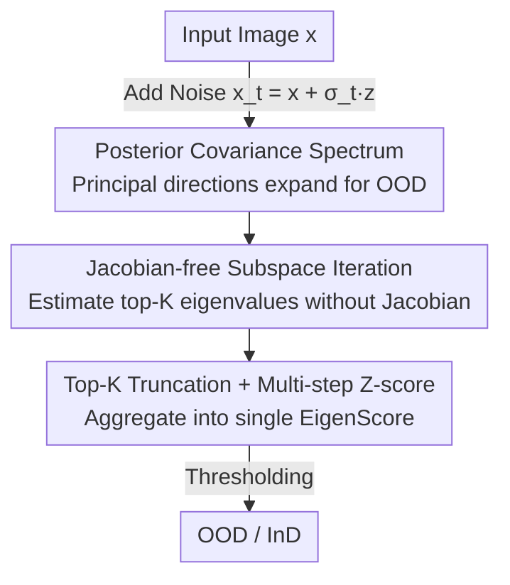

# EigenScore: OOD Detection using Posterior Covariance in Diffusion Models

**Conference**: ICLR 2026  
**OpenReview**: [https://openreview.net/forum?id=Dq64kthckN](https://openreview.net/forum?id=Dq64kthckN)  
**Area**: AI Safety / OOD Detection / Diffusion Models  
**Keywords**: OOD Detection, Diffusion Models, Posterior Covariance, Eigenvalue Spectrum, Denoising Uncertainty

## TL;DR
This paper proposes **EigenScore**: when a diffusion model trained on InD data is applied to OOD samples, the denoising posterior covariance systematically expands along principal directions. By using the **eigenvalue spectrum** (sum of top-K eigenvalues) as a distribution shift signal—estimated efficiently using Jacobian-free subspace iteration—the method achieves SOTA average AUROC on standard OOD benchmarks (approximately 2% higher than the best baseline), remaining robust even in near-OOD scenarios such as CIFAR-10 vs CIFAR-100.

## Background & Motivation

**Background**: Diffusion models do not merely sample; they explicitly approximate the score function $\nabla \log p(x_t)$ during denoising, naturally capturing statistical information about the data distribution. Recently, they have been widely used for unsupervised OOD detection. Mainstream approaches fall into two categories: **reconstruction-based** (e.g., DDPM-OOD), which assumes InD samples reconstruct well while OOD samples do not, using perceptual/pixel errors as scores; and **trajectory-based** (e.g., DiffPath), which analyzes the score norm $\|\epsilon_\theta(x_t,t)\|$ and its time derivatives along the denoising path.

**Limitations of Prior Work**: These scalar metrics are often unstable. Likelihood (NLL) frequently assigns higher values to OOD samples because diffusion models prioritize low-level statistics over semantics. Score norms and their derivatives suffer from significant distribution overlap in near-OOD (C10 vs C100) cases, sometimes even showing **rank reversal** (e.g., C10 vs SVHN), where OOD scores are lower than InD scores, rendering thresholds useless. Reconstruction methods implicitly assume that distribution shifts necessarily manifest as degraded reconstruction quality, yet near-OOD samples can often be reconstructed quite well, causing this clue to fail.

**Key Challenge**: The root cause is the "collapse of uncertainty into a single scalar." Whether it is MSE, score norm, or reconstruction error, these metrics compress the structure of uncertainty—how much uncertainty exists across different directions—into a single number, losing the **structure** of the covariance. At high noise levels, isotropic noise dominates this scalar, drowning out discriminative class structures.

**Goal**: To find a signal that has theoretical guarantees, maintains an ordered separation (InD is always small, OOD is always large) even under near-OOD conditions, and is computationally feasible at scale.

**Key Insight**: The authors return to the posterior covariance $\mathrm{Cov}_p[x|x_t]$ itself. It can be theoretically proven that KL divergence (the distribution shift) is equal to the "excess denoising error of an InD denoiser on OOD inputs," which corresponds to the trace of the posterior covariance. Since the scalar trace loses information, the authors propose looking directly at the **eigenvalue spectrum** of the covariance matrix.

**Core Idea**: Use the "expansion of the posterior covariance spectrum when an InD diffusion model is applied to OOD inputs" as the OOD signal. By taking the sum of the top-K eigenvalues and performing Z-score aggregation across multiple noise levels, it replaces collapsing or reversing scalar metrics like likelihood, score norm, or reconstruction error.

## Method

### Overall Architecture

EigenScore is an unsupervised, feature-based detector: it uses a diffusion denoiser trained only on InD data to output an OOD score for any test image $x$, where higher scores indicate OOD. The pipeline is: add noise to the image at various levels $x_t = x + \sigma_t z \to$ estimate the top-K eigenvalues of the posterior covariance $\Sigma_t(x_t)=\sigma_t^2 \nabla D_p(x_t)$ at each level $\to$ accumulate them into an uncertainty measure $m_t(x)$ for that noise level $\to$ concatenate into a feature vector and normalize using InD training statistics (Z-score) $\to$ sum to obtain the final score $\to$ threshold for OOD/InD detection. The entire process requires only forward evaluations of the denoiser without explicit Jacobian construction.

### Key Designs

**1. Posterior Covariance Spectrum: Turning distribution shift into readable spectral expansion signals**

To address the issue of collapsing or reversing scalar metrics, the authors theoretically link distribution shift to posterior covariance. From Tweedie's formula, the denoising error of the MMSE denoiser $D_p(x_t)=\mathbb{E}_p[x|x_t]$ can be decomposed into the trace of the posterior covariance via the Law of Total Variance: $\mathrm{MSE}(D_p,t)=\mathbb{E}_{x_t}\big[\mathrm{tr}(\mathrm{Cov}_p[x|x_t])\big]$. Proposition 1 proves $D_{KL}(p\|q)=\int_0^T [\mathrm{MSE}(D_q,t)-\mathrm{MSE}(D_p,t)]\,\sigma_t^{-3}\,dt$, implying that applying an InD denoiser to OOD inputs results in a **systematically larger** denoising error in expectation. This provides a detection signal that does not require access to the OOD distribution $q$ and ensures ordered separation (OOD > InD), unlike score norms which only reflect relative differences.

Using Miyasawa's identity, the covariance is related to the denoiser Jacobian: $\mathrm{Cov}_p[x|x_t]=\sigma_t^2(I+\sigma_t^2\nabla^2\log p(x_t))=\sigma_t^2\nabla D_p(x_t)$. After eigendecomposition $\Sigma_t=U_t\,\mathrm{diag}(\lambda_1^t,\dots,\lambda_n^t)\,U_t^\top$, the trace is the sum of eigenvalues, so $\mathrm{MSE}(D_p,t)=\mathbb{E}_{x_t}[\sum_k \lambda_k^t]$. InD samples have compact spectra and small leading eigenvalues (denoising converges along the training data structure); OOD samples spread uncertainty across multiple intrinsic directions, causing both the spectrum and trace to expand.

**2. Jacobian-free Subspace Iteration: Estimating top-K eigenvalues without Jacobian**

Directly constructing and diagonalizing the Jacobian $\nabla D_p(x_t)$ is computationally prohibitive for high-dimensional images. The authors utilize subspace iteration with **finite difference** approximations of Jacobian-vector products: $v^+ \approx \big(D(x_t+cv)-D(x_t-cv)\big)/2c$, where $c\ll 1$ is a constant for linear approximation, $v$ is the current principal component, and $v^+$ is the direction for the next iteration, followed by QR orthogonalization. After several iterations, the $k$-th eigenvalue is obtained as:

$$\lambda_k^t(x_t)\approx \frac{\sigma_t^2}{2c}\big\|D(x_t+cv_k)-D(x_t-cv_k)\big\|_2$$

This estimation **only uses forward calls** to the denoiser, avoiding backpropagation and explicit Jacobian storage, making "posterior covariance spectra" computationally practical for image-scale data.

**3. Top-K Truncation + Multi-step Z-score: From spectrum to a single OOD score**

Why only take top-K instead of the full spectrum? Lemma 1 states that as noise $\sigma_t\to\infty$, $\Sigma_t\to\sigma_t^2 I$, causing all eigenvalues to tend toward $\sigma_t^2$. The spectrum is "flattened" by isotropic noise, and low-variance components lose discriminative power. Summing the full spectrum (like MSE) includes many noise-dominated small eigenvalues. By the Ky Fan Theorem (Prop 2), the sum of the top-K eigenvalues captures the maximum variance across all $K$-dimensional projections. **Retaining only dominant modes** discards noise while preserving the most discriminative uncertainty directions.

In practice, the sum of top-K eigenvalues is computed for each noise level and aggregated over $I$ noise samples (mean/median/all) to get $m_t(x)=\sum_{k=1}^K \lambda_k^t$, forming $M(x)=[m_1(x),\dots,m_T(x)]^\top$. Z-score normalization $z_t(x)=(m_t(x)-\mu_t)/\sigma_t$ is performed using training set statistics $(\mu_t,\sigma_t)$, and the final score is $S_\theta(x)=\sum_{t=1}^{T} z_t(x)$. Multi-level Z-scoring makes spectral information across different scales comparable and additive.

### Loss & Training
The method **introduces no new training objectives**. The denoiser is trained using the standard MSE objective $L_{MSE}=\mathbb{E}[\|x-D_\theta(x_t,t)\|_2^2]$. EigenScore is a pure inference-time detector. The training/validation phase only involves computing $M(x)$ on the InD training set to estimate $(\mu_t,\sigma_t)$ and tuning the number of timesteps $T$ and aggregation methods on a validation set.

## Key Experimental Results

### Main Results

Datasets: CIFAR-10 (C10), CIFAR-100 (C100), SVHN, CelebA, TinyImageNet. Metric: AUROC.

| InD–OOD Pair (Selection) | DDPM-OOD | DiffPathV2 | EigenScore | Notes |
|--------|------|------|------|------|
| C10 vs C100 (Near-OOD) | 0.618 | 0.535 | **0.880** | Large lead in near-OOD |
| C100 vs C10 (Near-OOD) | 0.462 | 0.483 | **0.642** | Reconstruction/Trajectory near random |
| CelebA vs C10 | 0.922 | 1.000 | 0.965 | Competitive in easy cases |
| SVHN vs C100 | 0.972 | 0.975 | **0.982** | — |
| **12-pair Average** | 0.817 | 0.810 | **0.838** | Average SOTA |

Near-OOD Specialization (Table 2, Avg AUROC): DDPM-OOD 0.527, LMD 0.580, DiffPath 0.754, **EigenScore 0.849**. The advantage is most pronounced in near-OOD cases where low-level statistics are shared. EigenScore outperforms DDPM-OOD on C10 vs C100 because while reconstruction quality remains high for both, the posterior uncertainty has already expanded.

### Ablation Study

| Configuration | Avg AUROC | Description |
|------|---------|------|
| EigenScore (Full, Spectral) | 0.834 | top-K=3, T=5, mean aggregation |
| MSE (Collapsed Scalar Trace) | 0.652 | Same settings but full-spectrum trace → Drops ~18 points |
| Timesteps T=5 / 7 / 10 | 0.834 / 0.823 / 0.808 | T > 5 slightly worse (high noise flattens spectrum) |
| Eigenvalues K=1 / 2 / 3 | 0.840 / 0.838 / 0.834 | K=1 is best on average; discrimination in head modes |
| Repeats I=5 / 15 / 20 | 0.832 / 0.833 / 0.834 | I=5 is sufficient; marginal gains for >15 |

### Key Findings
- **Spectral structure vs. scalar collapse is the core gain**: EigenScore (0.834) outperforms direct MSE trace (0.652) by 18 AUROC points, validating that preserving the spectrum is superior to collapsing it.
- **Less is more**: $K=1$ average performance is best, $T=5$ is near saturation, and $I=5$ is sufficient. Discriminative info is concentrated in top intrinsic directions at low noise levels, consistent with Lemma 1.
- **Near-OOD is the main selling point**: In tasks like C10 vs C100 or C100 vs C10, where likelihood and score methods often flip their rankings or act randomly, EigenScore remains stable.

## Highlights & Insights
- **"Avoiding uncertainty collapse" is a transferable methodology**: Many OOD detectors compress high-dimensional uncertainty into a single number. This paper proves that retaining the eigenvalue spectrum—specifically the top-K modes—significantly improves discriminative power.
- **Tight coupling of theory and algorithm**: The path from KL divergence $\to$ excess denoising error (Prop 1) $\to$ posterior covariance trace (Total Variance) $\to$ Miyasawa's Identity $\to$ eigenvalue spectrum $\to$ Ky Fan truncation (Prop 2) results in a practical Jacobian-free algorithm.
- **Practical Jacobian-free estimation**: Approximating Jacobian-vector products via $\big(D(x_t+cv)-D(x_t-cv)\big)/2c$ with QR orthogonalization makes eigendecomposition of high-dimensional image Jacobians feasible.

## Limitations & Future Work
- **Dependency on learned denoiser (Jacobian != SPD)**: Theoretical derivations assume an MMSE denoiser, but neural network denoisers do not guarantee a symmetric positive definite (SPD) Jacobian.
- **Hyperparameter tuning**: Timestep scheduling, aggregation, $K$, and $I$ need to be selected on a validation set. Although experiments show low sensitivity, InD validation data is required.
- **Resolution constraints**: Experiments are limited to low-resolution natural images (CIFAR, etc.). Extension to high-resolution, medical, or autonomous driving scenarios is yet to be verified.
- **Weakness on specific pairs**: For cases like C100 vs CelebA (0.427) or C10 vs SVHN (0.661), it is not optimal, indicating the spectral signal is not a universal solution.

## Related Work & Insights
- **vs. DDPM-OOD (Reconstruction)**: DDPM-OOD assumes "shift = drop in reconstruction quality." EigenScore instead measures the expansion of the posterior spectrum; it succeeds in near-OOD cases where reconstruction is still realistic but the spectrum has expanded.
- **vs. DiffPath (Trajectory/Score Norm)**: DiffPath uses score norms which can suffer from rank reversal. EigenScore's Propostion 1 ensures OOD denoising error is larger in expectation, providing a directional, ordered signal.
- **vs. Kamkari et al. 2024 (Likelihood Geometry)**: They analyze Singular Values of generator Jacobians to explain NLL paradoxes. EigenScore focuses on the **denoiser posterior covariance** (predictive uncertainty) rather than volume distortion, making it stable in near-OOD where likelihood geometry might fail.

## Rating
- Novelty: ⭐⭐⭐⭐⭐ Uses posterior covariance eigenvalue spectrum as an OOD signal; the theoretical chain is novel and complete.
- Experimental Thoroughness: ⭐⭐⭐⭐ Extensive benchmarks and ablations, but limited to low-resolution images.
- Writing Quality: ⭐⭐⭐⭐⭐ Clear theoretical derivation; motivation, theory, and algorithm are tightly integrated.
- Value: ⭐⭐⭐⭐ High robustness in near-OOD and low computational budget; practical for safety deployments.

<!-- RELATED:START -->

## Related Papers

- [\[ICLR 2026\] Towards a Certificate of Trust: Task-Aware OOD Detection for Scientific AI](towards_a_certificate_of_trust_task-aware_ood_detection_for_scientific_ai.md)
- [\[ICLR 2026\] AP-OOD: Attention Pooling for Out-of-Distribution Detection](ap-ood_attention_pooling_for_out-of-distribution_detection.md)
- [\[ICLR 2026\] SCOPED: Score–Curvature Out-of-Distribution Proximity Evaluator for Diffusion](scoped_scorecurvature_out-of-distribution_proximity_evaluator_for_diffusion.md)
- [\[ICLR 2026\] NatADiff: Adversarial Boundary Guidance for Natural Adversarial Diffusion](natadiff_adversarial_boundary_guidance_for_natural_adversarial_diffusion.md)
- [\[CVPR 2026\] GROW: Watermark Generation with Progressive Guidance for Diffusion Models](../../CVPR2026/ai_safety/grow_watermark_generation_with_progressive_guidance_for_diffusion_models.md)

<!-- RELATED:END -->
