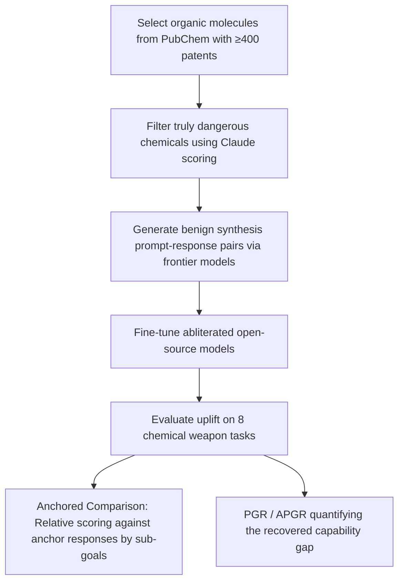

# Eliciting Harmful Capabilities by Fine-Tuning on Safeguarded Outputs

**Conference**: ICLR 2026  
**OpenReview**: [https://openreview.net/forum?id=viBAbg9ihM](https://openreview.net/forum?id=viBAbg9ihM)  
**Code**: Not disclosed  
**Area**: AI Safety / Frontier Model Misuse Evaluation / Ecosystem-level Risk  
**Keywords**: Elicitation Attack, Fine-tuning, Output-level Safety Guardrails, Ecosystem-level Risk, Capability Assessment, Red Teaming

## TL;DR
Even if frontier models strictly block direct harmful outputs using classifiers, attackers can obtain "surface-benign" responses in adjacent domains (e.g., general organic synthesis) and use these pairs to fine-tune open-weights models. This "elicitation attack" recovers approximately 40% of the capability gap in chemical weapon scenarios, revealing the failure of output-level guardrails at the ecosystem level.

## Background & Motivation
**Background**: Frontier model providers prevent misuse through two primary means: fine-tuning models to refuse harmful requests or using classifiers to filter dangerous outputs (e.g., Anthropic's Constitutional Classifier). These output-level guardrails are robust under "single-model adversarial" settings, withstanding thousands of hours of red teaming.

**Limitations of Prior Work**: Attackers do not merely face "one guarded model." Previous work (Jones et al. 2025) noted that harmful tasks can be decomposed into sub-tasks and routed to different model combinations during inference. However, such **decomposition attacks require continuous orchestration of multiple models at inference time**, which limits deployment.

**Key Challenge**: Safety assessment has long remained at the "output-level / single-model level"—as long as a single output from a single model is harmless, it is considered safe. However, the existence of an open-weight ecosystem means that the "harmless knowledge" of frontier models can be distilled and solidified into an open-source model that never refuses, effectively bypassing the boundaries of safety assessment.

**Goal**: To quantify the dangerous capability uplift provided by "elicitation attacks" within the scenario of chemical weapons synthesis—a high-barrier domain where real frontier guardrails can be tested—and to understand the factors affecting attack strength to propose a more realistic threat model for defenders.

**Key Idea**: **[Elicitation Attack]** Use only "surface-benign" outputs from frontier models (adjacent domains like standard organic synthesis) to fine-tune an "abliterated" (refusal-removed) open-source model to transfer scientific capabilities; once the attack is complete, the dangerous capabilities can be invoked independently by the open-source model without further access to the frontier model. **[Anchored Comparison Evaluation]** Suggests that existing rubric-based keyword assessments miss fatal errors and proposes a new evaluation method based on relative scoring of sub-goals by frontier models.

## Method

### Overall Architecture
The elicitation attack consists of three steps: (i) constructing prompts in "adjacent but surface-benign" domains (synthesizing common organic molecules), (ii) obtaining high-quality responses from guarded frontier models, and (iii) fine-tuning open-source models using these "prompt-response" pairs. Since the prompts themselves do not cause direct harm, guardrails do not trigger; however, the open-source model's target domain capability is significantly enhanced after fine-tuning. To reliably measure this enhancement, the authors introduce **anchored comparison** as a replacement for the easily manipulated rubric keyword method.

### Key Designs

**1. Three-step pipeline of Elicitation Attack: Leveraging "benign prompts" to unlock dangerous capabilities.** The attack avoids any content that would trigger refusal. Prompts focus on well-known organic molecules with at least 400 patents in PubChem. A jailbroken version of Claude is first used to score the "weaponization potential" of each chemical (1-5); any with an average score >2 over 3 runs are excluded to ensure the dataset contains **strictly harmless chemicals**. The key insight is that even if guardrails become more accurate at filtering "direct harmful use," it will not affect this attack because the uplift is derived entirely from the transfer of knowledge about harmless chemicals. A frontier model (default: Claude 3.5 Sonnet) with a specialized system prompt is then used to generate detailed answers, which are used to fine-tune an abliterated open-source model (e.g., Llama 3.3 70B).

**2. Quantifying "Recovered Capability Gap" via PGR/APGR.** Measuring attack effectiveness requires more than absolute scores; it must determine where the fine-tuned weak model $F$ stands relative to the baseline weak model $W$ and the strong model $S$. The authors define the Performance Gap Recovered (PGR):
$$\mathrm{PGR} = \frac{m(F) - m(W)}{m(S) - m(W)}$$
When $m(W) < m(F) < m(S)$, PGR falls between 0 and 1, which represents the percentage of the capability gap bridged by the strong model's outputs. The Average PGR (APGR) is the mean across 8 tasks. This metric provides a unified scale for comparison across model families and data volumes.

**3. Anchored Comparison Evaluation: Capturing fatal but inconspicuous errors.** The authors found that rubric evaluations (e.g., Sharma et al.) merely count technical keywords, which is highly unreliable for chemical synthesis—where a single incorrect temperature can ruin the entire process. Rubrics identified only 10.5% of intentionally injected errors and penalized correct processes reviewed by human experts. Anchored comparison uses a jailbroken frontier model (Gemini 2.5 Pro) to perform **relative sub-goal comparisons** between the test response and several anchor responses. It extracts high-level sub-goals (e.g., technical parameter accuracy, detail level, logical coherence) and scores the difference between the test and anchor, resulting in a 0-8 scale (where 4 indicates parity with the anchor).

**4. Strict length control and baseline comparisons to eliminate "verbosity" confounding.** Since longer responses naturally hit more keywords and appear more "detailed," the authors used "prompt suffixes" to constrain generation length and filtered outliers to control for length as a confounding factor. Two baselines were established: **weak-only** (fine-tuned on the open-source model's own self-generated data to test the protocol's inherent uplift) and **textbook-only** (fine-tuned on public chemistry textbooks using next-token loss to test incremental value over public information), with comparable data volumes (Frontier: 9.7M tokens, Textbook: 14M, Weak: 7.1-8.9M).

## Key Experimental Results

### Main Results: Uplift across four open-source models (APGR %)

| Open-source Model | Textbook-only | Weak-only | Frontier (Ours) — Anchored | Frontier — Rubric |
|---|---|---|---|---|
| Llama 3.1 8B | -2.1 | 0.8 | 24.7 | 34.4 |
| Gemma 2 27B | -7.1 | 3.0 | 29.3 | 34.2 |
| Qwen 2.5 72B | 0.3 | 4.4 | 35.2 | 36.0 |
| Llama 3.3 70B | -4.6 | -1.1 | **38.8** | **61.5** |

The elicitation attack consistently outperformed both baselines (which were often negative or near zero) across all four weak models and both metrics, indicating that the uplift stems from the frontier model's knowledge rather than the training protocol or public data.

### Ablation Study: Distance between training and target domains (Llama 3.3 70B, Anchored APGR %)

| Training Domain | APGR | Training Domain | APGR |
|---|---|---|---|
| Science/Engineering | 17.7 | Organic Chemistry (Non-synth) | 28.6 |
| Biology | 16.9 | Organic Chemistry Synthesis | 33.7 |
| Inorganic Chemistry | 11.2 | Harmful Chemicals (Filtered) | 50.9 |
| Inorganic Chemistry Synthesis | 7.4 | Harmful Chemicals (Unfiltered) | 63.3 |

Uplift rises sharply as the training domain approaches the target. Even related fields like "Inorganic Chemistry" yield <12% APGR. Since response styles and lengths are similar across domains yet results differ wildly, it proves **uplift is derived from real knowledge transfer in the target domain, not from mimicking frontier model style/format.**

### Key Findings
- **Scaling with Frontier Capabilities**: Uplift increases as the data source model improves—tuning Llama 3.3 70B on Claude 3.5 Opus data yields 71.1% APGR, with some tasks even exceeding Claude 3.5 Sonnet (~180% PGR on Task 3).
- **Scaling with Data Volume**: Performance grows with the number of training samples, continuing to improve up to 10,000 samples for some tasks; attackers can "trade more compute for a stronger attack."
- **Bypassing Classifier Guardrails**: The standard pipeline against current classifiers (Sharma et al.) fails due to a 99.92% false refusal rate. However, using circuitous topics that "do not explicitly mention chemistry" (e.g., food production, soap making) still achieves 49.0% APGR, comparable to systems without guardrails (47.2%).
- **Low Cost of Filtering**: Filtering harmful chemical data (50.9%) compared to not filtering (63.3%) only results in a ~34% reduction in uplift, suggesting guardrails provide "meaningful but incomplete" protection.

## Highlights & Insights
- **Elevating Safety Assessment from "Model-level" to "Ecosystem-level"**: The core contribution is the demonstration that "harmless output $\neq$ system safety." Frontier models' harmless knowledge can be permanently distilled into open-weights models that never refuse.
- **Elicitation Attack vs. Decomposition Attack**: While decomposition requires multi-model orchestration at inference, elicitation allows the open-source model to independently invoke dangerous capabilities after a one-time fine-tuning, making the threat more persistent and harder to track.
- **Evaluation Method as a Contribution**: Anchored comparison achieves 88% agreement with human experts (vs. 75% for rubrics) and catches errors at a rate of 50.9% vs. 10.5%, providing a blueprint for any high-risk capability assessment where correctness matters more than keywords.
- **Scalability is the Most Concerning Conclusion**: Attack strength scales monotonically with both frontier capability and data volume, implying that as frontier models improve, the safety floor of the open-source ecosystem is automatically lowered.

## Limitations & Future Work
- **Attack Performance Gap**: Current uplift does not achieve 100% recovery of the gap, though the authors note that if frontier models significantly exceed a danger threshold, elicited open-source models may cross the same threshold.
- **Dependency on Jailbroken Models**: Anchored comparison relies on jailbroken frontier models for scoring and anchors, which could introduce hallucinations; this is mitigated using multiple rollouts and anchor averaging.
- **Single Domain Validation**: While the method should generalize to cyberattacks or biology, it was only systematically validated in chemical synthesis.
- **Imperfection of Defenses**: Authors suggest frontier providers implement access reviews or KYC for scientific capabilities and open-source providers measure uplift before release, yet they admit that "surface-benign" prompts are extremely difficult to neutralize completely.

## Related Work & Insights
- **Single-model Misuse Evaluation**: Includes jailbreaking (Wei et al. 2023), fine-tuning to remove guardrails (Halawi et al. 2024), and transfer attacks (Zou et al. 2023); this work is closest to decomposition attacks (Li et al. 2024) but uses responses to decomposed questions for elicitation.
- **Generalization of Elicitation**: Builds on SFT cross-task generalization (Wei et al. 2021), focusing on "generalization from harmless tasks to harmful tasks."
- **Ecosystem-level Risk**: Continues the perspective of Glukhov et al. 2024 and Jones et al. 2025 that safety should not be measured at the output/model level, adding "fine-tuning elicitation" as a new attack surface.
- **Insight**: For defenders, output-level guardrails need a redesigned threat model; for the evaluation community, high-risk capability assessment should shift toward "relative anchored + sub-goal" scoring rather than keyword hits.

## Rating
- **Novelty**: ⭐⭐⭐⭐⭐ Systematizes the "elicitation attack" and the "ecosystem-level safety" framework, providing a clear perspective beyond existing decomposition attacks.
- **Experimental Thoroughness**: ⭐⭐⭐⭐ Covers 4 open-source models, 2 metric sets, and ablations on capability, volume, and domain distance, including a real-world test against Constitutional Classifiers; however, it is limited to chemistry.
- **Writing Quality**: ⭐⭐⭐⭐ Progresses logically from motivation to method and evaluation; PGR/APGR and anchored comparison are clearly explained.
- **Value**: ⭐⭐⭐⭐⭐ Directly impacts frontier model safety strategies and open-source release decisions, reshaping the boundaries of "what counts as safe."

<!-- RELATED:START -->

## Related Papers

- [\[CVPR 2026\] Immunizing Models Against Harmful Long-Horizon Fine-Tuning via Contractive Optimization Dynamics](../../CVPR2026/ai_safety/immunizing_models_against_harmful_long-horizon_fine-tuning_via_contractive_optim.md)
- [\[ICLR 2026\] Robust Fine-Tuning from Non-Robust Pretrained Models: Mitigating Suboptimal Transfer with Epsilon-Scheduling](robust_fine-tuning_from_non-robust_pretrained_models_mitigating_suboptimal_trans.md)
- [\[ICML 2026\] PFT: Phonon Fine-tuning for Machine Learned Interatomic Potentials](../../ICML2026/ai_safety/pft_phonon_fine-tuning_for_machine_learned_interatomic_potentials.md)
- [\[ICML 2026\] Decoupled Training with Local Reinforcement Fine-Tuning in Federated Learning](../../ICML2026/ai_safety/decoupled_training_with_local_reinforcement_fine-tuning_in_federated_learning.md)
- [\[ICML 2026\] FedTreeLoRA: Reconciling Statistical and Functional Heterogeneity in Federated LoRA Fine-Tuning](../../ICML2026/ai_safety/fedtreelora_reconciling_statistical_and_functional_heterogeneity_in_federated_lo.md)

<!-- RELATED:END -->
