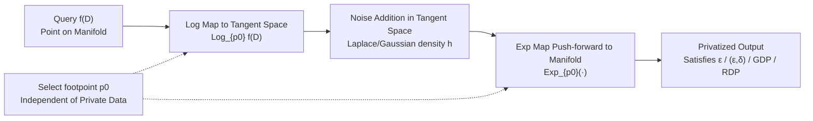

# Exponential-Wrapped Mechanisms: Differential Privacy on Hadamard Manifolds Made Practical

**Conference**: ICLR 2026  
**OpenReview**: [https://openreview.net/forum?id=ulCVfMOo30](https://openreview.net/forum?id=ulCVfMOo30)  
**Code**: To be confirmed  
**Area**: Differential Privacy / Riemannian Manifold Statistics  
**Keywords**: Differential Privacy, Hadamard Manifolds, Exponential-Wrapped Distributions, Gaussian DP, Rényi DP, Fréchet Mean  

## TL;DR
This paper systematizes the simple technique of "sampling in the tangent space + push-forward via the exponential map" into Exponential-Wrapped Laplace/Gaussian mechanisms. It **unifies the implementation of $\epsilon$-DP, $(\epsilon, \delta)$-DP, GDP, and RDP on general Hadamard manifolds for the first time while completely eliminating MCMC sampling**, making differential privacy for manifold data truly computable and scalable.

## Background & Motivation
**Background**: In reality, an increasing amount of data naturally resides on non-linear manifolds—hyperbolic spaces are used for hierarchical/tree structure embeddings, and Symmetric Positive Definite Matrix (SPDM) spaces are standard carriers for diffusion tensor imaging, shape analysis, and computer vision covariance descriptors. These medical and biological scenarios are highly sensitive to privacy and require privacy mechanisms that respect geometric structures.

**Limitations of Prior Work**: Embedding manifold data into Euclidean space and then adding noise (extrinsic approach) distorts the geometry and leads to significant utility loss. Reimherr et al. (2021) first extended DP to general Riemannian manifolds by proposing the Riemannian Laplace mechanism for $\epsilon$-DP, but subsequent work faced three major hurdles:

- **Incomplete Privacy Concepts**: Modern DP concepts such as $(\epsilon, \delta)$-DP, Gaussian DP (GDP), and Rényi DP (RDP) are almost non-existent on manifolds. Utpala et al. only implemented $(\epsilon, \delta)$-DP on a single manifold equipped with the Log-Euclidean metric (which flattens the SPDM space); Jiang et al. extended GDP to general manifolds, but their calibration algorithms are only applicable to constant curvature spaces.
- **Dependency on MCMC**: Both Riemannian Laplace and Gaussian mechanisms rely on Markov Chain Monte Carlo sampling, requiring tens of thousands of burn-in iterations and repeated computation of Riemannian distances. This becomes prohibitively expensive in high dimensions (such as high-dimensional SPDM), and the choice of proposal distribution heavily impacts convergence.
- **Metric Restrictions**: Existing computable solutions are tied to metrics that "flatten" the space, making it impossible to use more geometrically faithful affine-invariant metrics or more stable Log-Cholesky metrics.

**Key Challenge**: Manifold DP must simultaneously satisfy "conceptual completeness + geometric faithfulness + computational scalability," yet existing mechanisms always sacrifice one—being either conceptually limited, valid only under constant curvature/flattening metrics, or hindered by MCMC.

**Goal**: To provide a unified, MCMC-free DP mechanism framework for general Hadamard manifolds (complete, simply connected Riemannian manifolds with non-positive curvature) that holds for any metric.

**Core Idea**: **Use Exponential-Wrapped distributions as privacy noise**—all randomness is generated in the tangent space (a flat Euclidean vector space) and then "pushed forward" to the manifold all at once using the exponential map. The Cartan-Hadamard theorem for Hadamard manifolds ensures that the exponential map is a global diffeomorphism (the Log map is defined everywhere), allowing mature Laplace/Gaussian DP theories from the tangent space to be ported almost intact to the manifold. Sampling is reduced to "tangent space sampling + a single Exp map."

## Method

### Overall Architecture
The entire framework is built on one observation: pushing forward a known density $h$ from the tangent space $T_pM$ to the manifold via the exponential map $\mathrm{Exp}_p$ yields an "Exponential-Wrapped distribution" $\Lambda = \mathrm{Exp}_{p*}\mu$, which has a closed-form density (differing only by a Jacobian term for volume change) and minimalist sampling: by drawing $u \sim h$ in the tangent space, the output $\mathrm{Exp}_p(u)$ is a sample on the manifold. Based on this, the paper constructs the Laplace version for $\epsilon$-DP and the Gaussian version for $(\epsilon, \delta)$-DP / GDP / RDP, providing utility upper bounds for the Fréchet mean, the most commonly used manifold statistic.

### Key Designs

**1. Exponential-Wrapped Distributions: Generating Privacy Noise in the Tangent Space.** This is the foundation of the paper. Given a footpoint $p_0$, a manifold $M$, and a volume measure $\nu$, the density of an exponential-wrapped distribution can be explicitly written as the tangent space density divided by a Jacobian volume correction term: $g(q) = \frac{h(\mathrm{Log}_{p_0} q)}{J_{p_0}(\mathrm{Log}_{p_0} q)}$, where $J_{p_0}(u) = |\det(D_u\mathrm{Exp}_{p_0})|$ characterizes the volume distortion caused by the exponential map. Its most attractive property is sampling: if $U_i \sim h$ are i.i.d. samples in the tangent space, then $X_i = \mathrm{Exp}_{p_0}(U_i)$ are i.i.d. samples on the manifold following $g$—reducing the difficult task of "sampling on a curved manifold" to "sampling in a flat tangent space + a single deterministic Exp map," which is the root cause for eliminating MCMC.

**2. Exponential-Wrapped Laplace Mechanism for $\epsilon$-DP with Improved Constants.** By setting the tangent space density to $h(u) \propto \exp\{-\|u - \mathrm{Log}_{p_0}\eta\|/\sigma\}$, the EWL distribution is obtained. The theorem proves: for a manifold-valued statistic $f$ with sensitivity $\Delta$, the output $Y \sim \mathrm{EWL}(p_0, f(D), \Delta/\epsilon)$ satisfies $\epsilon$-DP. Compared to Reimherr's Riemannian Laplace, there are two advantages: first, **it only requires a rate of $\Delta/\epsilon$**, whereas Riemannian Laplace requires $2\Delta/\epsilon$ on non-homogeneous manifolds (doubling the noise); second, sampling is reduced from "MCMC with tens of thousands of burn-in steps" to "drawing Laplace in the tangent space + one Exp map." The choice of footpoint $p_0$ is flexible, but **it must not depend on the private data $D$**, otherwise it violates the DP definition.

**3. Exponential-Wrapped Gaussian Mechanism: One Distribution for Three Modern DPs.** Setting the tangent space density to a Gaussian $h \propto \exp\{-\|u - \mathrm{Log}_{p_0}\eta\|^2/(2\sigma^2)\}$ yields the EWG distribution. Its power lies in the ability to switch privacy concepts by simply changing the $\sigma$ calibration formula:
   - **(ε,δ)-DP**: $\sigma$ satisfies $\Phi\!\left(-\tfrac{\sigma\varepsilon}{\Delta_{p_0}}+\tfrac{\Delta_{p_0}}{2\sigma}\right)-e^{\varepsilon}\Phi\!\left(-\tfrac{\sigma\varepsilon}{\Delta_{p_0}}-\tfrac{\Delta_{p_0}}{2\sigma}\right)\le\delta$, which formally corresponds to Balle-Wang’s analytic Gaussian mechanism, merely replacing Euclidean sensitivity with $\Delta_{p_0} = \sup_{D\simeq D'} \|\mathrm{Log}_{p_0}f(D) - \mathrm{Log}_{p_0}f(D')\|$. Since $\mathrm{Log}_{p_0}$ is a contractive map on Hadamard manifolds, $\Delta \ge \Delta_{p_0}$, and $\Delta$ can be used as a fallback.
   - **GDP**: Setting $\sigma = \Delta/\mu$ yields $\mu$-GDP, collapsing the calibration of Jiang et al. (which involved "solving infinite integral inequalities + grid search + MCMC") into a simple division.
   - **RDP**: Setting $\sigma = \Delta/\sqrt{2\epsilon/\alpha}$ satisfies $(\alpha, \epsilon)$-RDP, making this the **first RDP mechanism applicable outside Euclidean space**.
   Specifically, when $M$ is an SPDM with the Log-Euclidean metric and $p_0 = I$, EWG reduces to Utpala’s tangent Gaussian mechanism—showing that EWG is its strict generalization and the first mechanism to achieve $(\epsilon, \delta)$-DP on SPDM with non-Log-Euclidean metrics.

**4. Utility Upper Bounds for the Fréchet Mean: Explicitly Quantifying Curvature, Dimension, and Footpoint Alignment.** The most common use case for privacy mechanisms is releasing a "mean" on the manifold, namely the Fréchet mean $\bar{x} = \arg\min_x \sum_i d(x, x_i)^2$ (uniqueness is guaranteed by Hadamard properties). Under the assumption that data points fall within a geodesic ball of radius $r$, the sensitivity of the Fréchet mean for adjacent datasets is $d(\bar{x}, \bar{x}') \le 2r/n$. The paper then provides upper bounds for the expected Riemannian distance; for example, EWL satisfies $\mathbb{E}\,d(\tilde{x}_{\mathrm{EWL}}, \bar{x}) \le \sigma d + 2d(p_0, \bar{x})$, and EWG satisfies $\mathbb{E}\,d(\tilde{x}_{\mathrm{EWG}}, \bar{x}) \le \sigma\sqrt{2} \frac{\Gamma((d+1)/2)}{\Gamma(d/2)} + 2d(p_0, \bar{x})$. These bounds reveal three insights: the distance between the footpoint and the true value $d(p_0, \bar{x})$ directly enters the bound, **so $p_0$ should be placed near the data center**; as dimension $d$ increases, the leading term dominates, and the impact of the footpoint relatively decreases; with a curvature lower bound $\mathrm{Sec}_M > K \le 0$, the bound includes a factor $\frac{\sinh(\sqrt{K}r)}{\sqrt{K}r}$, meaning that the closer the curvature is to flat ($K \to 0$), the tighter the bound becomes, with the footpoint's impact vanishing in perfectly flat manifolds.

## Key Experimental Results

### Main Results: Releasing GDP Fréchet Means on SPDM and Hyperbolic Spaces
The comparison was conducted against the Riemannian Laplace (RL) mechanism. Fixed sample size $n=40$, data radius $r=1.5$, varying privacy budget $\mu \in \{0.1, \dots, 2\}$, and manifold dimension $d = m(m+1)/2 \in \{3, 10, 15\}$. Metrics represent the average Riemannian distance from the privatized output to the true Fréchet mean (lower is better) over 100 independent repetitions.

| Space / Metric | Dimension | EWG vs RL Utility Conclusion |
|---|---|---|
| SPDM · Log-Cholesky | d=3, 10, 15 | EWG is consistently better across all budgets |
| SPDM · Log-Euclidean | d=3, 10, 15 | EWG is consistently better across all budgets |
| SPDM · Affine-invariant | d=3 | EWG is slightly worse at high budgets $\mu \in [0.7, 2]$ (footpoint mismatch + curvature impact) |
| SPDM · Affine-invariant | d=10, 15 | EWG is better in almost all budgets (dominated by noise magnitude in high dimensions) |
| Hyperbolic Space $\mathbb{H}^d$ | d=3, 10, 15 | EWG is consistently better across all dimensions and budgets |

### Running Time Comparison
Table 1 reports the running times of EWG versus RL, concluding that **EWG is often several orders of magnitude faster, and the advantage grows with dimensionality**. RL relies on MCMC with thousands of burn-in steps, whereas EWG only requires "tangent space sampling + Exp/Log computations," making its scalability superior in high-dimensional SPDM.

### Real Data: OCTMNIST (Medical OCT Images)
Covariance descriptors of $5 \times 5$ were extracted from OCTMNIST images (gray scale 28x28, four classes), residing in $S_5^+$ ($d=15$) with the Log-Euclidean metric. Sensitivity was analytically derived from pixel intensity ranges. GDP Fréchet means were released for four classes with 100 Monte Carlo repetitions. EWG consistently outperformed RL across different privacy budgets, validating its practicality and scalability on real-world manifold-valued data.

### Key Findings
- **Milder geometry reduces footpoint significance**: In regular geometries like Log-Cholesky, Log-Euclidean, and Hyperbolic spaces, EWG leads throughout. Only in low-dimensional scenes with "trickier" curvature, like affine-invariant metrics, does footpoint mismatch manifest.
- **High dimensions favor EWG**: As dimensionality increases, utility is dominated by noise magnitude rather than footpoint alignment. EWG is both more stable and faster, filling the gap where MCMC methods collapse in high dimensions.
- **Alignment between theory and experiments**: The theoretical prediction that "footpoint does not affect utility" under flat metrics was precisely replicated in simulations.

## Highlights & Insights
- **Unified distribution family for four DP concepts**: ε-DP, (ε,δ)-DP, GDP, and RDP are switched by simply changing the $\sigma$ calibration formula. This is engineering-clean and simultaneously provides the first RDP mechanism on manifolds.
- **"Hard on manifold, easy in tangent space" paradigm**: The Cartan-Hadamard theorem ensures the Exp map is a global diffeomorphism, allowing all randomness to be generated in the flat tangent space and outsourcing the manifold sampling problem to mature Euclidean DP tools.
- **MCMC-free as a watershed for practicality**: Calibration changes from "solving infinite integral inequalities + grid search" to simple division, and sampling changes from "thousands of burn-in steps" to "a single Exp map," enabling manifold DP to move from paper to deployment.
- **Mathematical mapping of utility bounds**: The curvature factor $\sinh(\sqrt{K}r)/(\sqrt{K}r)$ and footpoint distance $d(p_0, \bar{x})$ are explicitly included in the bounds, providing an actionable criterion for when to spend budget to privately estimate a footpoint.

## Limitations & Future Work
- **Limited to non-positive curvature**: The method strictly relies on Hadamard properties (global invertibility of Exp) and cannot directly handle non-negative curvature manifolds like spheres—this is a listed next step for the authors.
- **Suboptimal footpoint selection**: $p_0$ cannot use private data and is currently often set to a fixed center (e.g., $I_m$). In non-constant curvature spaces, this can become a utility bottleneck. How to privately and adaptively select $p_0$ remains open (the appendix provides a preliminary DP selection scheme).
- **Task limited to Fréchet mean**: Utility guarantees are only provided for mean release; more complex statistical tasks like Principal Geodesic Analysis (PGA) or manifold regression still require separate derivations.
- **Affine-invariant low-dimensional weakness**: In high-curvature metrics and low dimensions, EWG may be inferior to RL at high budgets, indicating that geometric distortion still carries a cost in those regions.

## Related Work & Insights
- **Manifold DP Lineage**: Reimherr et al. (Riemannian Laplace, $\epsilon$-DP pioneer) → Jiang et al. (Manifold GDP, limited to constant curvature) → Utpala et al. (Log-Euclidean SPDM $(\epsilon, \delta)$-DP) → Ours (General Hadamard manifolds + four DP types + MCMC-free), which can be seen as a unification and speedup of this trajectory.
- **Geometric Porting of Euclidean DP Tools**: $(\epsilon, \delta)$-DP calibration follows Balle-Wang's analytic Gaussian mechanism; GDP/RDP follows the frameworks of Dong-Roth-Su and Mironov. The core contribution is using exponential wrapping to port these to manifolds with "nearly zero cost."
- **Exponential-Wrapped Distributions**: Borrowed from the work of Chevallier et al. on symmetric spaces, this paper repositions them from probabilistic modeling tools to DP noise mechanisms.
- **Insight**: Any stochastic algorithm (sampling, diffusion, privacy) that is "hard in curved space but has an underlying global diffeomorphism to flat space" should consider the "tangent space generation + push-forward" paradigm to avoid direct MCMC on manifolds.

## Rating
- **Novelty**: ⭐⭐⭐⭐ — Unifies four DP concepts on general Hadamard manifolds and provides the first non-Euclidean RDP mechanism. While leveraging exponential-wrapped distributions, applying them to DP is a clean and substantial contribution.
- **Experimental Thoroughness**: ⭐⭐⭐⭐ — Covers three SPDM metrics + hyperbolic space + real-world OCTMNIST, comparing EWG against RL in both utility and running time, while honestly exposing the affine-invariant low-dimensional weakness.
- **Writing Quality**: ⭐⭐⭐⭐ — The theoretical progression (distributions → mechanisms → utility bounds) is clear, with theorems and algorithms well-matched and geometric intuition closely aligned with mathematical bounds.
- **Value**: ⭐⭐⭐⭐ — Moves manifold DP (medical imaging, hierarchical embeddings) from MCMC-constrained to computable and scalable, having direct relevance for deployment in privacy-sensitive bio-medical scenarios.

<!-- RELATED:START -->

## Related Papers

- [\[ICLR 2026\] Concept-Aware Privacy Mechanisms for Defending Embedding Inversion Attacks](concept-aware_privacy_mechanisms_for_defending_embedding_inversion_attacks.md)
- [\[ICLR 2026\] Beyond Membership: Limitations of Add/Remove Adjacency in Differential Privacy](beyond_membership_limitations_of_addremove_adjacency_in_differential_privacy.md)
- [\[ICLR 2026\] Convergent Differential Privacy Analysis for General Federated Learning](convergent_differential_privacy_analysis_for_general_federated_learning.md)
- [\[ICLR 2026\] Federated Learning of Quantile Inference under Local Differential Privacy](federated_learning_of_quantile_inference_under_local_differential_privacy.md)
- [\[ICLR 2026\] INO-SGD: Addressing Utility Imbalance under Individualized Differential Privacy](ino-sgd_addressing_utility_imbalance_under_individualized_differential_privacy.md)

<!-- RELATED:END -->
